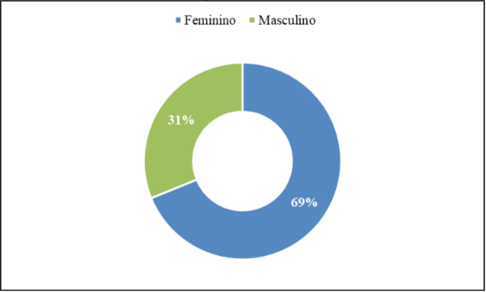
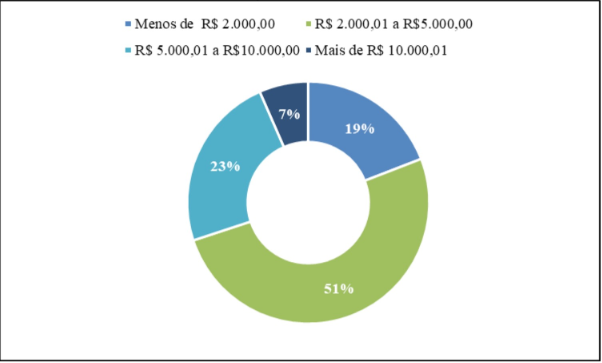
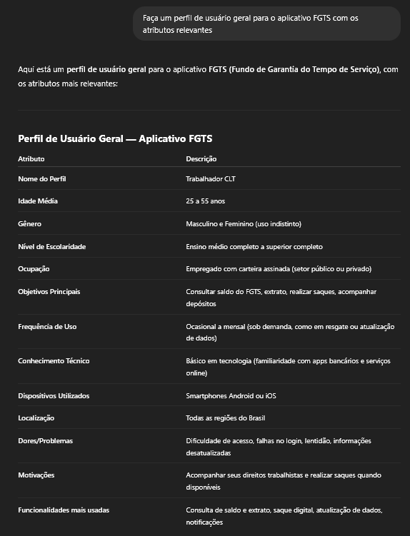

# Perfil de Usuário

## Introdução 

De acordo com Barbosa et al. (2021), o perfil de usuário é uma descrição detalhada das características dos usuários cujos objetivos precisam ser atendidos pelo sistema em desenvolvimento. A construção desse perfil envolve a identificação de atributos relevantes, como faixa etária, função, nível de instrução, experiência e atividades desempenhadas, por meio de métodos como entrevistas e questionários. Após a coleta dos dados, os usuários são agrupados com base em características semelhantes, permitindo traçar perfis representativos e calcular sua proporção na base de usuários. 

## Metodologia 

No TCC “As transformações digitais das instituições financeiras e sua influência na redefinição do papel das agências como canal de serviços: perfil dos usuários”, de Nycolli Bussolo Mendes, foi realizado um questionário que tem como objetivo analisar o perfil dos usuários que utilizam instituições financeiras de forma digital e física. Assim, pode-se assimilar o público-alvo do aplicativo FGTS com os respondentes do questionário e, logo, é possível determinar o perfil de usuário com pessoas reais. 

## Resultados do Questionário

O questionário contou com 183 participantes e os resultados foram: 

Faixa etária predominante: entre 41 e 54 anos e entre 24 e 30 anos. 
 

Figura 1: <i>Faixa etária</i>

 

Fonte: <i>Mendes (2020), TCC em Ciências Econômicas – UFSC</i>

 
 
Escolaridade predominante: ensino superior completo ou incompleto. 
 

Figura 2: <i>Escolaridade</i>

 

Fonte: <i>Mendes (2020), TCC em Ciências Econômicas – UFSC</i>

 
 
Gênero: 69% feminino e 31% masculino. 
 

Figura 3: <i>Gênero</i>

 

Fonte: <i>Mendes (2020), TCC em Ciências Econômicas – UFSC</i>

 
 
Renda predominante: entre R$2.000 e R$5.000.
 

Figura 4: <i>Renda</i>

 

Fonte: <i>Mendes (2020), TCC em Ciências Econômicas – UFSC</i>

 

## Experimento com IA

Para fins experimentais, foi utilizado o ChatGPT para gerar um perfil de usuário geral do aplicativo FGTS. Vale ressaltar que esse experimento não é mais relevante que o questionário conduzido anteriormente.
 

Figura 5: <i>Perfil de usuário gerado pelo ChatGPT</i>

 

Fonte: <i>OPENAI. ChatGPT. Perfil de usuário geral para o aplicativo FGTS. Disponível em: https://chat.openai.com. Acesso em: 2 maio 2025.</i>

 

## Bibliografia

> <a id="PERFIL1" href="#PERFIL1">1.</a> Barbosa, S. D. J.; Silva, B. S. da; Silveira, M. S.; Gasparini, I.; Darin, T.; Barbosa, G. D. J. (2021). Interação Humano-Computador e Experiência do Usuário. Autopublicação. ISBN: 978-65-00-19677-1.

> <a id="PERFIL2" href="#PERFIL2">2.</a> MENDES, Nycolli Bussolo. As transformações digitais das instituições financeiras e sua influência na redefinição do papel das agências como canal de serviços: perfil dos usuários. 2020. 66 f. Trabalho de Conclusão de Curso (Bacharelado em Ciências Econômicas) – Universidade Federal de Santa Catarina, Florianópolis, 2020. Disponível em: https://repositorio.ufsc.br/bitstream/handle/123456789/218557/TCC_-_Nycolli_Bussolo_Mendes_.pdf?sequence=2&isAllowed=y. Acesso em: 2 maio 2025.

> <a id="PERFIL3" href="#PERFIL3">3.</a> OPENAI. ChatGPT (versão GPT-4). São Francisco, 2025. Disponível em: https://chat.openai.com. Acesso em: 2 maio 2025.

## Histórico de Versões 📅

| Versão | Data | Descrição | Autor(es) | Revisor(es) |
| :-: | :-: | :-: | :-: | :-: |
| `1.0` | 02/05/2025 | Criação da página de Perfil de Usuário | [Eduardo de Pina](https://github.com/eduardodpms), [Marcelo Makoto](https://github.com/MM4k) | - |
| `1.1` | 02/05/2025 | Adição do Experimento com IA | [Marcelo Makoto](https://github.com/MM4k) | - |
