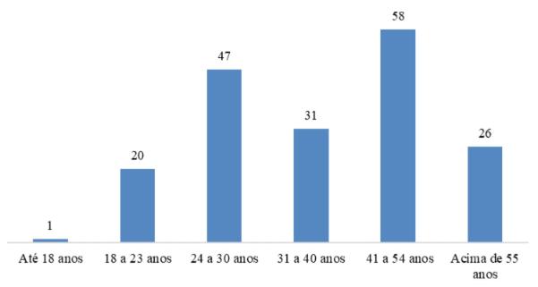
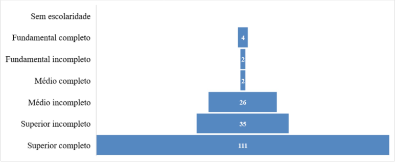
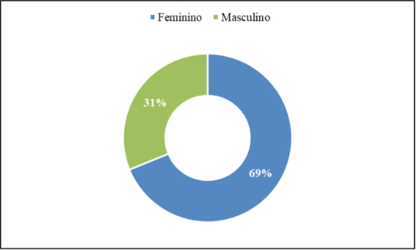
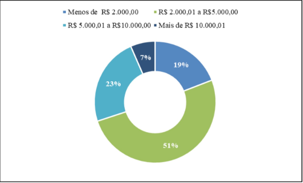
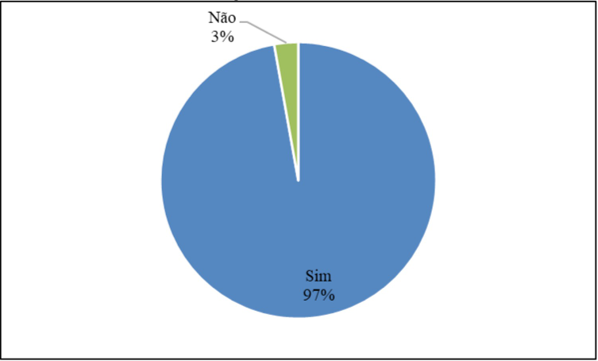
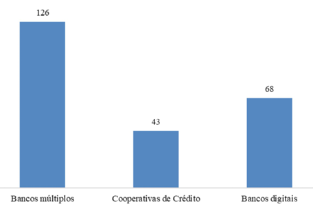
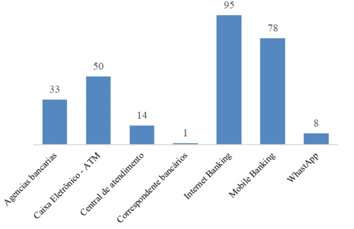
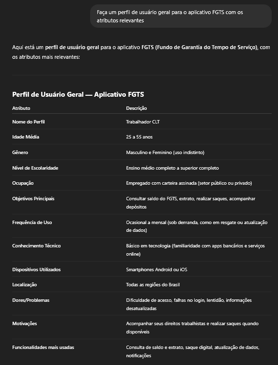

# Perfil de Usuário

## Introdução 

De acordo com Barbosa et al. (2021)<a id="anchor_1" href="#REF1">^1^</a>, o perfil de usuário é uma descrição detalhada das características dos usuários cujos objetivos precisam ser atendidos pelo sistema em desenvolvimento. A construção desse perfil envolve a identificação de atributos relevantes, como faixa etária, função, nível de instrução, experiência e atividades desempenhadas, por meio de métodos como entrevistas e questionários. Após a coleta dos dados, os usuários são agrupados com base em características semelhantes, permitindo traçar perfis representativos e calcular sua proporção na base de usuários, além da criação de personas. 

## Metodologia 

A definição do perfil de usuário pelo time se deu por meio de três etapas principais, descritas nos tópicos a seguir. A [Investigação Online](#investigação-online) consistiu na pesquisa por descrições de padrões de usuário em sites do Governo. Alternativamente, na etapa de [Estudo de Semelhança](#estudo-baseado-em-semelhança), o time optou por coletar dados de perfil dos usuários em plataformas com público-alvo semelhante ao público do aplicativo *FGTS*, expostos em uma pesquisa de TCC. Por fim, em [Análise com IA](#experimento-com-ia), obteve-se uma visão sobre os perfis de usuário gerada por uma ferramenta de Inteligência Artificial. Com a utilização dos 3 métodos para definição do perfil de usuário, foi montado o perfil geral para o aplicativo *FGTS*, descrito em [Conclusão](#conclusão).

## Participantes

Tabela 1: Participantes

<table>
  <thead>
    <tr>
      <th>Nome</th>
      <th>Data</th>
      <th>Hora</th>
    </tr>
  </thead>
  <tbody>
    <tr>
      <td> Eduardo de Pina </td>
      <td> 02/05/2025 </td>
      <td> 17:10 </td>
    </tr>
    <tr>
      <td> Marcelo Makoto </td>
      <td> 02/05/2025 </td>
      <td> 19:00 </td>
    </tr>
  </tbody>
</table>

Fonte: [Enzo Emir](https://github.com/EnzoEmir), [Maria Eduarda](https://github.com/dudaa28) 

 

## Investigação Online 💻

O primeiro método para definir o perfil de usuário consiste em uma pesquisa extensa com as ferramentas de busca online em plataformas oficiais do Governo, como o próprio site do *FGTS*<a id="anchor_4" href="#REF4">^4^</a>. Dessa forma, separa-se um conjunto seleto de informações encontradas sobre os usuários que auxiliarão na montagem dos perfis de usuário, em conjunto com as outras técnicas.

Na plataforma online do *FGTS*<a id="anchor_4" href="#REF4">^4^</a> há uma descrição do programa, bem como de seus benefícios e de quais pessoas têm acesso a ele. Os seguintes grupos se destacam para a análise: **trabalhadores com contrato formal regido pela *CLT***, **trabalhadores domésticos, temporários, intermitentes e avulsos**, e **diretores não empregados**. Com isso, é válido assumir que uma parte significativa desses indivíduos será, também, usuária do aplicativo.

Outra característica relativa aos usuários, também descrita no site do *FGTS*<a id="anchor_4" href="#REF4">^4^</a>, tange aos objetivos que os grupos de usuários descritos possuem e que o aplicativo busca cumprir. Os mais pertinentes para este desenvolvimento estão listados a seguir:

- Acesso ao app por meio de uma conta bancária;
- Consultar informações legais referentes ao *FGTS*;
- Consultar os valores disponíveis para saque;
- Solicitar o saque do *FGTS*;
- Acompanhar o *status* da solicitação.

Além disso, após investigação em portais de notícia relevantes, foi possível também definir uma média salarial dos beneficiários do *FGTS*. Uma reportagem do G1<a id="anchor_5" href="#REF5">^5^</a> de 2017, por Marta Cavallini, trouxe que cerca de 215 milhões (84,4%) das contas registradas no *FGTS* pertenciam a pessoas que recebiam aproximadamente um salário mínimo (R$937,00), enquanto cerca de 93,9% recebiam até 6 salários mínimos. Assim, estabelece-se uma média de renda para os beneficiáios do programa e, possivelmente, do aplicativo *FGTS*.

 

Tabela 1: Participantes

<table>
  <thead>
    <tr>
      <th>Nome</th>
      <th>Data</th>
    </tr>
  </thead>
  <tbody>
    <tr>
      <td> Marcelo Makoto </td>
      <td> 02/05/2025 </td>
    </tr>
    <tr>
      <td> Eduardo de Pina </td>
      <td> 02/05/2025 </td>
    </tr>
  </tbody>
</table>

Fonte: [Enzo Emir](https://github.com/EnzoEmir)

## Estudo de Semelhança 📊

Esse método de definição consiste na seleção de uma categoria de plataformas que trouxessem um público-alvo semelhante, a princípio, ao *FGTS*. Nesse sentido, verifica-se que o app em questão foi desenvolvido, de forma resumida, para trabalhadores brasileiros. Assim, aplicativos bancários são uma opção de alternativa para uma análise dos usuários, uma vez que trazem uma proposta similar e que possuem uma gama de dados públicos sobre seus usuários.

No TCC “As transformações digitais das instituições financeiras e sua influência na redefinição do papel das agências como canal de serviços: perfil dos usuários”<a id="anchor_2" href="#REF2">^2^</a>, de Nycolli Bussolo Mendes, foi realizado um questionário sistemático que tem como objetivo analisar o perfil dos usuários que utilizam instituições financeiras de forma digital e física. 

Os resultados do estudo de Nycolli Bussolo corroboram e aprofundam a premissa de que há uma assimilaridade do público-alvo do aplicativo FGTS com os respondentes do questionário realizado sobre os usuários de instituições bancárias. A pesquisa confirmou uma forte preferência por plataformas digitais para tarefas rotineiras, como consultar saldo e extratos – funcionalidades que compõem o app FGTS. O estudo destaca, por exemplo, que "consultar saldo e extratos", possuem maior utilização nos canais digitais impulsionado pela "necessidade de imediatismo das pessoas" e pela capacidade de "realizar essas transações onde estiverem", sem precisar ir a uma agência física <a id="anchor_2" href="#REF2">^2^</a>. Além disso, o estudo revelou que os canais digitais atendem um vasto espectro da população brasileira que possui certa afinidade com o meio digital.

O questionário contou com 183 participantes e os resultados pertinentes à esse desenvolvimento estão apresentados nas tabelas a seguir: 

 

<figure style="text-align: center;">
    
Figura 1: <i>Faixa etária</i>

    
    <figcaption>
        
Fonte: Mendes (2020), TCC em Ciências Econômicas – UFSC

    </figcaption>
</figure>

 

<figure style="text-align: center;">
    
Figura 2: <i>Escolaridade</i>

    
    <figcaption>
        
Fonte: Mendes (2020), TCC em Ciências Econômicas – UFSC

    </figcaption>
</figure>

 

<figure style="text-align: center;">
    
Figura 3: <i>Gênero</i>

    
    <figcaption>
        
Fonte: Mendes (2020), TCC em Ciências Econômicas – UFSC

    </figcaption>
</figure>

 

<figure style="text-align: center;">
    
Figura 4: <i>Renda</i>

    
    <figcaption>
        
Fonte: Mendes (2020), TCC em Ciências Econômicas – UFSC

    </figcaption>
</figure>

<figure style="text-align: center;">
    
Figura 5: <i>Conta em Instituição Financeira</i>

    
    <figcaption>
        
Fonte: Mendes (2020), TCC em Ciências Econômicas – UFSC

    </figcaption>
</figure>

<figure style="text-align: center;">
    
Figura 6: <i>Especificação das Contas Bancárias</i>

    
    <figcaption>
        
Fonte: Mendes (2020), TCC em Ciências Econômicas – UFSC

    </figcaption>
</figure>

<figure style="text-align: center;">
    
Figura 7: <i>Canais mais utilizados</i>

    
    <figcaption>
        
Fonte: Mendes (2020), TCC em Ciências Econômicas – UFSC

    </figcaption>
</figure>

 

## Análise com IA 💾

Para fins experimentais e complementares, foi utilizada a ferramenta de Inteligência Artificial [*ChatGPT*](https://chatgpt.com) para gerar um perfil de usuário geral do aplicativo *FGTS*, apresentado na *Figura 5*. Nesse contexto, é importante compreender que os resultados fornecidos por modelos de linguagem, apesar de relevantes, estão sujeitos a imprecisões e a alucinações. Portanto, nessa análise, os resultados fornecidos pela IA serão utilizados apenas para sustentar os resultados dos outros métodos abordados na construção dos perfis de usuário.

<figure style="text-align: center;">
    
Figura 8: <i>Perfil de usuário gerado pelo ChatGPT</i>

    
    <figcaption>
        
Fonte: <i>OPENAI. ChatGPT. Perfil de usuário geral para o aplicativo FGTS. Disponível em: https://chat.openai.com. Acesso em: 2 maio 2025.</i><a id="anchor_3" href="#REF3">^3^</a>

    </figcaption>
</figure>

## Definição do Perfil

Após análise dos resultados obtidos nos métodos desenvolvidos para definição de perfil de usuário, foi montada a lista a seguir, a qual generaliza as características de um usuário "padrão":

Tabela 1: Perfil de Usuário

|Atributo|Descrição|
|:---|:---|
|**Idade**|Adultos dos 24 a 55 anos|
|**Sexo**|Indistinto|
|**Região**|Todo o Brasil|
|**Escolaridade**|Ensino médio ou superior|
|**Educação Digital**|Básica ou mediana|
|**Renda**|1-6 salários mínimos|
|**Ocupação**|Trabalhador CLT, doméstico, temporário, intermitente ou avulso|
|**Experiência**| Intermediário (usa tecnologia com autonomia básica, entende o necessário para o cotidiano)|
|**Atitude frente à tecnologia**|Neutro ou tecnófilo moderado (uso funcional, com valorização de segurança)|
|**Tarefas Primárias**|Consultar informações relativas ao FGTS (como saldo/extratos) e realizar/consultar saques|

Fonte: 
    <a href="https://github.com/danielle-soaress">Danielle Soares</a>, <a href="https://github.com/eduardodpms">Eduardo de Pina</a>, <a href="https://github.com/MM4k">Marcelo Makoto</a>

 

## Bibliografia

> <a id="REF1" href="#anchor_1">1.</a> Barbosa, S. D. J.; Silva, B. S. da; Silveira, M. S.; Gasparini, I.; Darin, T.; Barbosa, G. D. J. (2021). Interação Humano-Computador e Experiência do Usuário. Autopublicação. ISBN: 978-65-00-19677-1.

> <a id="REF2" href="#anchor_2">2.</a> MENDES, Nycolli Bussolo. As transformações digitais das instituições financeiras e sua influência na redefinição do papel das agências como canal de serviços: perfil dos usuários. 2020. 66 f. Trabalho de Conclusão de Curso (Bacharelado em Ciências Econômicas) – Universidade Federal de Santa Catarina, Florianópolis, 2020. Disponível em: https://repositorio.ufsc.br/bitstream/handle/123456789/218557/TCC_-_Nycolli_Bussolo_Mendes_.pdf?sequence=2&isAllowed=y. Acesso em: 2 maio 2025.

> <a id="REF3" href="#anchor_3">3.</a> OPENAI. ChatGPT (versão GPT-4). São Francisco, 2025. Disponível em: https://chat.openai.com. Acesso em: 2 maio 2025.

> <a id="REF4" href="#anchor_4">4.</a> CAIXA ECONOMICA FEDERAL. FGTS. Brasília, 2025. Disponível em: https://www.caixa.gov.br/beneficios-trabalhador/fgts. Acesso em: 3 maio 2025.

> <a id="REF5" href="#anchor_5">5.</a> CAVALLINI, Marta. 84,4% das contas do FGTS tinham saldo médio de R$ 101,35 em 2017. G1 Economia. Rio de Janeiro, 2025. Disponível em: https://g1.globo.com/economia/noticia/2019/07/24/844percent-das-contas-do-fgts-tinham-saldo-medio-de-r-10135-em-2017.ghtml. Acesso em: 3 maio 2025.

 

## Histórico de Versões 📅

| Versão | Data | Descrição | Autor(es) | Revisor(es) |
| :-: | :-: | :-: | :-: | :-: |
| `1.0` | 02/05/2025 | Criação da página de Perfil de Usuário | [Eduardo de Pina](https://github.com/eduardodpms), [Marcelo Makoto](https://github.com/MM4k) | [Maria Eduarda](https://github.com/dudaa28) |
| `1.1` | 02/05/2025 | Adição do Experimento com IA | [Marcelo Makoto](https://github.com/MM4k) | [Eduardo de Pina](https://github.com/eduardodpms) |
| `1.2` | 03/05/2025 | Organização dos elementos e adição de etapa | [Eduardo de Pina](https://github.com/eduardodpms) | [Maria Eduarda](https://github.com/dudaa28) |
| `1.3` | 20/06/2025 | Atualização da tabela de perfil de usuário e aprimoramento do texto | [Danielle Soares](https://github.com/danielle-soaress) | [Enzo Emir](https://github.com/EnzoEmir) |
| `1.4` | 21/06/2025 | Corrigindo numeração e fonte das imagens e tabelas | [Danielle Soares](https://github.com/danielle-soaress) | [Enzo Emir](https://github.com/EnzoEmir) |
| `1.5` | 21/06/2025 | Adicionando tabela de participantes | [Enzo Emir](https://github.com/EnzoEmir) | [Maria Eduarda](https://github.com/dudaa28) |
| `1.6`  | 21/06/2025 | Refinamento na Página | [Maria Eduarda](https://github.com/dudaa28) | - |
