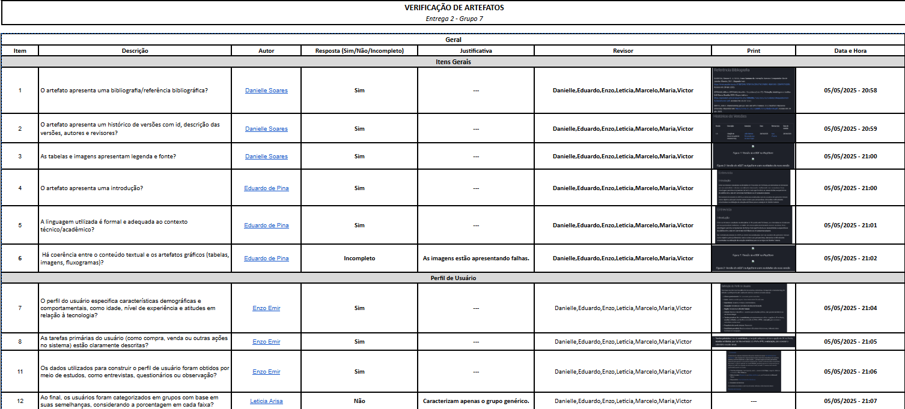
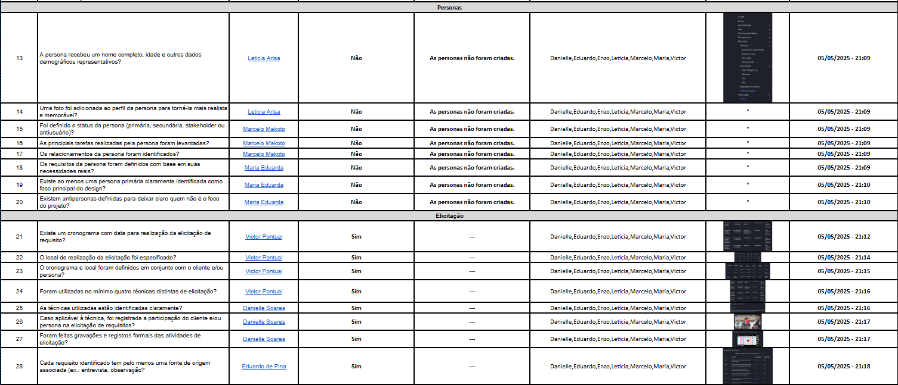
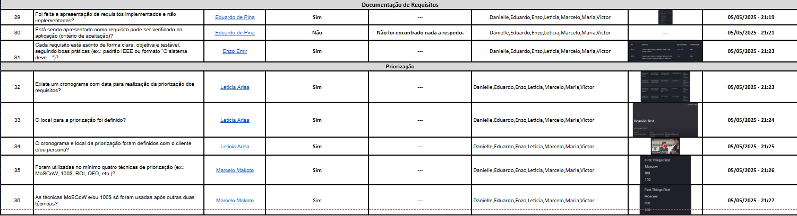

# Inspeção do Grupo 08 (Entrega 2)

## Introdução

Esta análise refere-se à **Entrega 2** do Grupo 08, cujo projeto agora se concentra no desenvolvimento do aplicativo *e-GDF*. A avaliação abrange as técnicas de elicitação de requisitos e de priorização aplicadas, bem como a revisão das escolhas feitas para o projeto.

O modelo de tabela utilizado está definido em [Entrega 2](../../Entregas/Entrega-2), e foi construído com a participação de todos os membros do grupo 07. Os registros da avaliação foram feitos de forma criteriosa, incluindo prints, datas e horários das avaliações.

## Links

- **GitHub** do grupo: [e-GDF GitHub](https://github.com/Requisitos-de-Software/2025.1-e-GDF)
- **GitHub Pages** do grupo: [e-GDF GitHub Pages](https://requisitos-de-software.github.io/2025.1-e-GDF/)

## Lista de Inspeção do Grupo 08

## Histórico de Versões 📅

| Versão | Data | Descrição | Autor(es) | Revisor(es) |
| :-: | :-: | :-: | :-: | :-: |
| `1.0`  | 13/04/2025 | Adição da Entrega 02 +1 | [Enzo Emir](https://github.com/EnzoEmir) | [-]() |

    