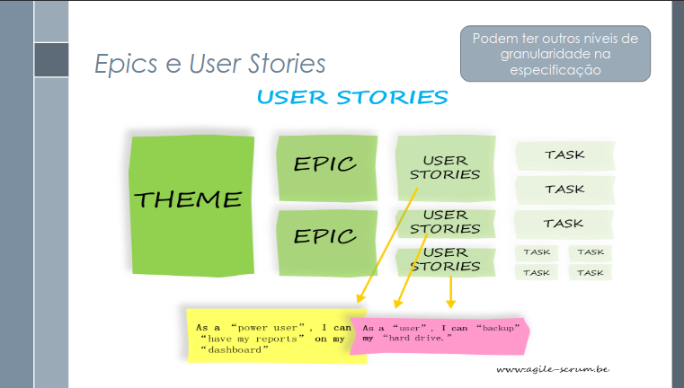

#  Histórias de Usuário 

##  Introdução

O presente documento tem como objetivo apresentar as histórias de usuário elaboradas para o desenvolvimento de um aplicativo voltado à gestão e ao acompanhamento de serviços relacionados ao Fundo de Garantia do Tempo de Serviço (FGTS).

As histórias de usuário são uma técnica fundamental na Engenharia de Requisitos Ágil, utilizadas para representar funcionalidades, resultados ou características desejadas no software. Elas são criadas a partir da escuta ativa das necessidades dos usuários e servem como guia para o desenvolvimento. Cada história recebe uma prioridade com base no seu valor de negócio, facilitando o planejamento incremental do sistema <a id="REF1">1</a>.

Cada história de usuário é construída de forma a responder três perguntas essenciais:  

- **Quem?** — Quem é o usuário ou persona envolvida na interação.  

- **O que?** — Qual é a ação, necessidade ou funcionalidade desejada.  

- **Por que?** — Qual é o valor, objetivo ou benefício buscado por meio daquela ação.

##  Metodologia

A elaboração das histórias de usuário deste projeto seguiu uma abordagem centrada no usuário, fundamentada em princípios da Engenharia de Requisitos Ágil e do Design Centrado no Usuário (DCU) <a href="#REF2">2</a>. Esta metodologia garantiu que as histórias de usuário fossem elaboradas de forma realista, testável e completamente alinhada às necessidades das personas, criando uma base sólida para o desenvolvimento do aplicativo FGTS.

### Construção das Histórias de Usuário

As histórias de usuário foram escritas seguindo o modelo clássico:

> **Como [usuário], quero [ação], para [atingir um objetivo].**

Essa estrutura ajuda a garantir que cada história represente uma necessidade real do usuário, deixando claro o objetivo e o valor gerado pela funcionalidade.

### Aplicação dos Modelos Ágeis

Todas as histórias de usuário foram estruturadas e avaliadas com base em dois modelos amplamente reconhecidos no contexto do desenvolvimento ágil:  **INVEST** e **3C’s**.

**INVEST <a href="#anchor_3">3</a>:** Esse modelo estabelece seis critérios fundamentais que garantem a qualidade e a eficácia de uma história de usuário:

- **I — Independente:** A história não deve depender de outras para ser desenvolvida, implementada ou testada.

- **N — Negociável:** As histórias são flexíveis e abertas a discussões, podendo ser refinadas durante as interações entre a equipe e os stakeholders.

- **V — Valiosa:** A história deve gerar valor perceptível e concreto para o usuário final ou para o negócio.

- **E — Estimável:** A história deve ser suficientemente clara e bem definida para permitir a estimativa do esforço necessário para sua implementação.

- **S — Sucinta (Small):** A história deve ter um tamanho adequado, podendo ser desenvolvida dentro de um ciclo ágil (sprint), evitando ser muito grande ou complexa.

- **T — Testável:** Deve possuir critérios de aceitação claros e objetivos, que permitam verificar se a funcionalidade atende às necessidades da persona e aos requisitos definidos.  

**3C’s <a href="#anchor_4">4</a>:** Complementando o modelo INVEST, os 3C’s enfatizam três elementos centrais para a formulação e validação de uma história de usuário eficaz:

- **Card (Cartão):** Representa a história em si, seja em um post-it físico ou em um quadro digital, funcionando como um lembrete do que precisa ser desenvolvido.

- **Conversation (Conversa):** Refere-se às discussões colaborativas entre equipe de desenvolvimento, Product Owner e stakeholders, nas quais são esclarecidos os detalhes, as dúvidas e as regras de negócio associadas à história.

- **Confirmation (Confirmação):** Corresponde aos critérios de aceitação formalmente definidos, que validam que a história foi corretamente implementada, atendendo às expectativas e às necessidades do usuário.

### Definição dos Critérios de Aceitação

Para cada história de usuário, foram estabelecidos critérios de aceitação claros, objetivos e verificáveis. Esses critérios funcionam como referência para confirmar se a funcionalidade entregue atende aos requisitos previamente acordados e, sobretudo, às expectativas do usuário.

### Participantes

Tabela 1: Participantes

<table>
  <thead>
    <tr>
      <th align="center">Nome</th>
      <th align="center">Histórias</th>
      <th align="center">Data</th>
      <th align="center">Hora</th>
    </tr>
  </thead>
  <tbody>
    <tr><td align="center">Danielle Soares</td><td align="center">13 até 18</td><td align="center">30/05/2025</td><td align="center">00:05</td></tr>
    <tr><td align="center">Eduardo de Pina</td><td align="center">37 até 42</td><td align="center">30/05/2025</td><td align="center">13:35</td></tr>
    <tr><td align="center">Enzo Emir</td><td align="center">01 até 06</td><td align="center">27/05/2025</td><td align="center">23:17</td></tr>
    <tr><td align="center">Leticia Arisa</td><td align="center">25 até 30</td><td align="center">30/05/2025</td><td align="center">07:22</td></tr>
    <tr><td align="center">Marcelo Makoto</td><td align="center">07 até 12</td><td align="center">28/05/2025</td><td align="center">21:50</td></tr>
    <tr><td align="center">Maria Eduarda</td><td align="center">19 até 24</td><td align="center">30/05/2025</td><td align="center">00:30</td></tr>
    <tr><td align="center">Victor Pontual</td><td align="center">31 até 36</td><td align="center">30/05/2025</td><td align="center">13:50</td></tr>
  </tbody>
</table>

Fonte: <i>Enzo Emir</i>

## Sumário

- [H01 – Acompanhar Situação do Saque (RF08)](#h01)
- [H02 – Notificações Sobre Andamento (RF08)](#h02)
- [H03 – Informar Datas de Liberação (RF01)](#h03)
- [H04 – Acesso à Seção de Ajuda (RF17)](#h04)
- [H05 – Solicitação de Ressarcimento do PIS/PASEP (RF19)](#h05)
- [H06 – Login Seguro (RF20)](#h06)
- [H07 – Assistente Via Chat (RF15)](#h07)
- [H08 – Campo de Busca (RF16)](#h08)
- [H09 – Aba de Solicitação e Acompanhamento de Saques (RF24)](#h09)
- [H10 – Aba de Informações Adicionais (RF25)](#h10)
- [H11 – Resumo dos Tipos de Saque (RF26)](#h11)
- [H12 – Disponibilidade de Saque-Rescisão (RF04)](#h12)
- [H13 – Ver Informações Sobre Saques Bloqueados (RF11)](#h13)
- [H14 – Cadastro de Múltiplas Contas Bancárias (RF35)](#h14)
- [H15 – Consulta ao Saldo do FGTS (RF03)](#h15)
- [H16 – Atualização de Dados Pessoais (RF05)](#h16)
- [H17 – Disponibilizar Saque-Aniversário (RF04)](#h17)
- [H18 – Comentários sobre Status do Saque (RF39)](#h18)
- [H19 – Canal de Suporte/Chatbot (RF02)](#h19)
- [H20 – Ajuste de Tamanho de Fonte (RF30)](#h20)
- [H21 – Notificações de Status e Saques (RF27)](#h21)
- [H22 – Solicitação de Saques (RF28)](#h22)
- [H23 – Visualização de Dados Bancários (RF31)](#h23)
- [H24 – Agendamento de Saque Futuro (RF42)](#h24)
- [H25 – Visualização do Histórico de Movimentações Financeiras (RF12)](#h25)
- [H26 – Filtrar Extrato por Data (RF13)](#h26)
- [H27 – Visualizar Empregadores Anteriores com Botão para Consultar Contas Vinculadas (RF21)](#h27)
- [H28 – Visualizar Nome Completo dos Empregadores Anteriores (RF22)](#h28)
- [H29 – Visualizar Histórico de Saques Realizados (RF23)](#h29)
- [H30 – Enviar Documentos Digitalizados para Comprovação de Saque (RF41)](#h30)
- [H31 – Cancelamento de Saque (RF09)](#h31)
- [H32 – Filtro por Tipo de Saque (RF10)](#h32)
- [H33 – Interface de Login Simples (RF32)](#h33)
- [H34 — Escolha da Sistemática de Saque (RF33)](#h34)
- [H35 – Disponibilização de Termo de Adesão (RF34)](#h35)
- [H36 – Notificação de Recebimento do Saque (RF40)](#h36)
- [H37 – Consulta de Dados Pessoais (RF06)](#h37)
- [H38 – Consultar Saldo (RF07)](#h38)
- [H39 – Exibir Extrato para o Empregador (RF07)](#h39)
- [H40 – Permitir o Cadastro de Conta Bancária (RF14)](#h40)
- [H41 – Seção de Ajuda com Orientações (RF18)](#h41)
- [H42 – Guia Interativo para Orientação (RF29)](#h42)

---

##  Histórias de Usuário

A tabela [2](#tabela-modelo) será utilizada como modelo para a elaboração das histórias de usuário do projeto. Ela padroniza os principais elementos necessários, como a descrição da necessidade, critérios de aceitação, prioridade, status de validação, entre outros. O objetivo é garantir consistência, rastreabilidade e clareza em todas as histórias documentadas.

Tabela 2: <i>Modelo para História de Usuário.</i>

<table>
  <thead>
    <tr>
      <th><strong>Item</strong></th>
      <th><strong>Descrição</strong></th>
    </tr>
  </thead>
  <tbody>
    <tr>
      <td>ID</td>
      <td>USx</td>
    </tr>
    <tr>
      <td>Rastreabilidade</td>
      <td>Código do requisito</td>
    </tr>
    <tr>
      <td>Tema</td>
      <td>Título</td>
    </tr>
    <tr>
      <td>Descrição</td>
      <td>Eu, como <em>[tipo de usuário]</em>, desejo <em>[ação desejada]</em> para <em>[objetivo]</em></td>
    </tr>
    <tr>
      <td>Critérios de Aceitação</td>
      <td>- [Critério 1]   - [Critério 2]</td>
    </tr>
    <tr>
      <td>Prioridade Usuário</td>
      <td>Alta, Média, Baixa</td>
    </tr>
    <tr>
      <td>Status</td>
      <td>Se a história foi validada ou não pelo usuário</td>
    </tr>
  </tbody>
</table>

Fonte: <i>Danielle Soares</i>

###  História 01 — Acompanhar Situação do Saque

Tabela 3: História de acompanhamento de situação do saque

| **Item**                 | **Descrição**                                                                 |
|--------------------------|------------------------------------------------------------------------------|
| **ID**                   | US01                                                                         |
| **Rastreabilidade**      | RF08 (IS05, EN02)                                                             |
| **Tema**                 | Acompanhar Situação do Saque                                                 |
| **Descrição**            | Eu, como técnica de enfermagem, desejo acompanhar a situação do meu saque do FGTS para saber se está aprovado, em análise ou concluído, sem ir à agência. |
| **Critérios de Aceitação** | - Status exibido claramente (Ex.: “Aguardando análise”, “Aprovado”)    - Mostra possíveis pendências ou exigências    - Atualização automática do status |
| **Prioridade Usuário**   | Alta                                                                          |
| **Status**               | A ser validado pelo usuário                                                                  |

Fonte: [Enzo Emir](https://github.com/EnzoEmir)

###  História 02 — Notificações Sobre Andamento

Tabela 4: História de notificações sobre andamento

| **Item**                 | **Descrição**                                                                 |
|--------------------------|------------------------------------------------------------------------------|
| **ID**                   | US03                                                                         |
| **Rastreabilidade**      | RF08 (IS05, EN02)                                                             |
| **Tema**                 | Notificações Sobre Andamento                                                 |
| **Descrição**            | Eu, como comerciante, desejo receber notificações sobre o andamento do meu saque do FGTS para ser informada de atualizações sem precisar abrir o app constantemente. |
| **Critérios de Aceitação** | - Notificações push quando houver mudança no status    - Mensagens objetivas (Ex.: “Seu saque foi liberado”)    - Opção de ativar/desativar notificações |
| **Prioridade Usuário**   | Alta                                                                          |
| **Status**               | A ser validado pelo usuário                                                                  |

Fonte: [Enzo Emir](https://github.com/EnzoEmir)

###  História 03 — Informar Datas de Liberação

Tabela 5: História de informar de datas de liberação

| **Item**                 | **Descrição**                                                                 |
|--------------------------|------------------------------------------------------------------------------|
| **ID**                   | US04                                                                         |
| **Rastreabilidade**      | RF01 (EN03)                                                                   |
| **Tema**                 | Informar Datas de Liberação                                                  |
| **Descrição**            | Eu, como aposentado, desejo ver as datas previstas para liberação dos valores do FGTS para me organizar financeiramente e pedir ajuda aos filhos, se necessário. |
| **Critérios de Aceitação** | - Exibição da data estimada de liberação    - Alerta caso a data seja alterada    - Informação clara caso a data não esteja definida |
| **Prioridade Usuário**   | Alta                                                                          |
| **Status**               | A ser validado pelo usuário                                                                  |

Fonte: [Enzo Emir](https://github.com/EnzoEmir)

###  História 04 — Acesso à Seção de Ajuda

Tabela 6: História de acesso à seção de ajuda

| **Item**                 | **Descrição**                                                                 |
|--------------------------|------------------------------------------------------------------------------|
| **ID**                   | US05                                                                         |
| **Rastreabilidade**      | RF17 (IS15)                                                                   |
| **Tema**                 | Acesso à Seção de Ajuda                                                       |
| **Descrição**            | Eu, como técnica de enfermagem, desejo acessar uma seção de ajuda com orientações sobre FGTS e PIS/PASEP para esclarecer dúvidas rapidamente, sem precisar de atendimento presencial. |
| **Critérios de Aceitação** | - FAQ com respostas claras    - Explicações sobre regras de saque, prazos e documentação    - Opção de contato com suporte |
| **Prioridade Usuário**   | Média                                                                         |
| **Status**               | A ser validado pelo usuário                                                                  |

Fonte: [Enzo Emir](https://github.com/EnzoEmir)

###  História 05 — Solicitação de Ressarcimento do PIS/PASEP

Tabela 7: História de solicitação de ressarcimento do PIS/PASEP

| **Item**                 | **Descrição**                                                                 |
|--------------------------|------------------------------------------------------------------------------|
| **ID**                   | US06                                                                         |
| **Rastreabilidade**      | RF19 (IS17)                                                                   |
| **Tema**                 | Solicitação de Ressarcimento do PIS/PASEP                                    |
| **Descrição**            | Eu, como jovem tecnólogo, desejo solicitar o ressarcimento de valores do PIS/PASEP pelo app para evitar filas, economizar tempo e resolver tudo digitalmente. |
| **Critérios de Aceitação** | - Formulário simples, com upload de documentos    - Confirmação do envio    - Acompanhamento do andamento no app |
| **Prioridade Usuário**   | Alta                                                                          |
| **Status**               | A ser validado pelo usuário                                                                  |

Fonte: [Enzo Emir](https://github.com/EnzoEmir)

###  História 06 — Login Seguro

Tabela 8: História de login seguro

| **Item**                 | **Descrição**                                                                 |
|--------------------------|------------------------------------------------------------------------------|
| **ID**                   | US07                                                                         |
| **Rastreabilidade**      | RF20 (OB01)                                                                   |
| **Tema**                 | Login Seguro                                                                 |
| **Descrição**            | Eu, como usuária com pouca autonomia digital (ou comerciante ocupada), desejo fazer login de forma segura no app para proteger meus dados, sem complicações ou esquecimento de senha. |
| **Critérios de Aceitação** | - Login com biometria, senha ou autenticação de dois fatores (2FA)    - Mensagens claras em caso de erro    - Opção de lembrar acesso ou recuperar senha |
| **Prioridade Usuário**   | Alta                                                                          |
| **Status**               | A ser validado pelo usuário                                                                  |

Fonte: [Enzo Emir](https://github.com/EnzoEmir)

###  História 07 — Assistente via chat

Tabela 9: História de assistente via chat

<table>
  <thead>
    <tr>
      <th><strong>Item</strong></th>
      <th><strong>Descrição</strong></th>
    </tr>
  </thead>
  <tbody>
    <tr>
      <td>ID</td>
      <td><a href="https://requisitos-de-software.github.io/2025.1-FGTS/Elicitacao/Requisitos-elicitados/#requisitos-funcionais">RF15</a></td>
    </tr>
    <tr>
      <td>Rastreabilidade</td>
      <td><a href="https://requisitos-de-software.github.io/2025.1-FGTS/Elicitacao/Tecnicas-de-Elicitacao/Introspeccao/#requisitos-funcionais">IS13</a></td>
    </tr>
    <tr>
      <td>Tema</td>
      <td>Atendimento via chat</td>
    </tr>
    <tr>
      <td>Descrição</td>
      <td>Eu, como aposentado com baixa autonomia digital, desejo que minha filha possa usar um chat no app para tirar dúvidas e resolver problemas, para que não precisemos ir até a agência.</td>
    </tr>
    <tr>
      <td>Critérios de Aceitação</td>
      <td>- O botão de acesso ao chat deve estar visível e acessível na tela principal.   - O chat deve aceitar linguagem natural e ter respostas claras, com possibilidade de atendimento humano.   - O histórico das conversas deve ficar salvo para consultas futuras.</td>
    </tr>
    <tr>
      <td>Prioridade Usuário</td>
      <td>Alta</td>
    </tr>
    <tr>
      <td>Status</td>
      <td>A ser validado pelo usuário</td>
    </tr>
  </tbody>
</table>

Fonte: [Marcelo Makoto](https://github.com/MM4k)

###  História 08 — Campo de busca

Tabela 10: História de campo de busca

<table>
  <thead>
    <tr>
      <th><strong>Item</strong></th>
      <th><strong>Descrição</strong></th>
    </tr>
  </thead>
  <tbody>
    <tr>
      <td>ID</td>
      <td><a href="https://requisitos-de-software.github.io/2025.1-FGTS/Elicitacao/Requisitos-elicitados/#requisitos-funcionais">RF16</a></td>
    </tr>
    <tr>
      <td>Rastreabilidade</td>
      <td><a href="https://requisitos-de-software.github.io/2025.1-FGTS/Elicitacao/Tecnicas-de-Elicitacao/Introspeccao/#requisitos-funcionais">IS14</a></td>
    </tr>
    <tr>
      <td>Tema</td>
      <td>Campo de busca</td>
    </tr>
    <tr>
      <td>Descrição</td>
      <td>Eu, como usuário avançado que domina tecnologia, desejo buscar rapidamente funcionalidades como extrato ou saque, para navegar de forma mais eficiente no aplicativo.</td>
    </tr>
    <tr>
      <td>Critérios de Aceitação</td>
      <td>- Campo de busca disponível no topo da tela ou menu.   - Resultados sugeridos enquanto o usuário digita.   - Funcionalidade acessível com poucas interações.</td>
    </tr>
    <tr>
      <td>Prioridade Usuário</td>
      <td>Alta</td>
    </tr>
    <tr>
      <td>Status</td>
      <td>A ser validado pelo usuário</td>
    </tr>
  </tbody>
</table>

Fonte: [Marcelo Makoto](https://github.com/MM4k)

###  História 09 — Aba de solicitação e acompanhamento de saques

Tabela 11: História de aba de solicitação e acompanhamento de saques

<table>
  <thead>
    <tr>
      <th><strong>Item</strong></th>
      <th><strong>Descrição</strong></th>
    </tr>
  </thead>
  <tbody>
    <tr>
      <td>ID</td>
      <td><a href="https://requisitos-de-software.github.io/2025.1-FGTS/Elicitacao/Requisitos-elicitados/#requisitos-funcionais">RF24</a></td>
    </tr>
    <tr>
      <td>Rastreabilidade</td>
      <td><a href="https://requisitos-de-software.github.io/2025.1-FGTS/Elicitacao/Tecnicas-de-Elicitacao/Observacao/#requisitos-funcionais">OB07</a></td>
    </tr>
    <tr>
      <td>Tema</td>
      <td>Aba de solicitação e acompanhamento de saques</td>
    </tr>
    <tr>
      <td>Descrição</td>
      <td>Eu, como técnica de enfermagem que busca praticidade, desejo acessar uma aba exclusiva para solicitação e acompanhamento de saques, para saber se o dinheiro foi liberado sem complicação.</td>
    </tr>
    <tr>
      <td>Critérios de Aceitação</td>
      <td>- Aba visível com ícone descritivo (ex.: “Saques”).   - Exibe etapas do processo: solicitado, em análise, aprovado, concluído.   - Possibilidade de iniciar um novo pedido de saque.</td>
    </tr>
    <tr>
      <td>Prioridade Usuário</td>
      <td>Alta</td>
    </tr>
    <tr>
      <td>Status</td>
      <td>A ser validado pelo usuário</td>
    </tr>
  </tbody>
</table>

Fonte: [Marcelo Makoto](https://github.com/MM4k)

###  História 10 — Aba de informações adicionais

Tabela 12: História de aba de informações adicionais

<table>
  <thead>
    <tr>
      <th><strong>Item</strong></th>
      <th><strong>Descrição</strong></th>
    </tr>
  </thead>
  <tbody>
    <tr>
      <td>ID</td>
      <td><a href="https://requisitos-de-software.github.io/2025.1-FGTS/Elicitacao/Requisitos-elicitados/#requisitos-funcionais">RF25</a></td>
    </tr>
    <tr>
      <td>Rastreabilidade</td>
      <td><a href="https://requisitos-de-software.github.io/2025.1-FGTS/Elicitacao/Tecnicas-de-Elicitacao/Observacao/#requisitos-funcionais">OB09</a></td>
    </tr>
    <tr>
      <td>Tema</td>
      <td>Aba de informações adicionais</td>
    </tr>
    <tr>
      <td>Descrição</td>
      <td>Eu, como comerciante que evita processos longos, desejo acessar uma aba com informações como PIS/PASEP, sistemática de saque e ajuda, para entender melhor meus direitos sem perder tempo.</td>
    </tr>
    <tr>
      <td>Critérios de Aceitação</td>
      <td>- Aba identificada com título e ícone compreensíveis (ex.: “Mais opções”).   - Itens organizados por categorias.   - Explicações em formato visual e direto.</td>
    </tr>
    <tr>
      <td>Prioridade Usuário</td>
      <td>Média</td>
    </tr>
    <tr>
      <td>Status</td>
      <td>A ser validado pelo usuário</td>
    </tr>
  </tbody>
</table>

Fonte: [Marcelo Makoto](https://github.com/MM4k)

###  História 11 — Resumo dos tipos de saque

Tabela 13: História de resumo dos tipos de saque

<table>
  <thead>
    <tr>
      <th><strong>Item</strong></th>
      <th><strong>Descrição</strong></th>
    </tr>
  </thead>
  <tbody>
    <tr>
      <td>ID</td>
      <td><a href="https://requisitos-de-software.github.io/2025.1-FGTS/Elicitacao/Requisitos-elicitados/#requisitos-funcionais">RF26</a></td>
    </tr>
    <tr>
      <td>Rastreabilidade</td>
      <td><a href="https://requisitos-de-software.github.io/2025.1-FGTS/Elicitacao/Tecnicas-de-Elicitacao/Storytelling/#requisitos-funcionais">ST02</a></td>
    </tr>
    <tr>
      <td>Tema</td>
      <td>Resumo dos tipos de saque</td>
    </tr>
    <tr>
      <td>Descrição</td>
      <td>Eu, como usuário que controla ativamente suas finanças, desejo visualizar um resumo dos tipos de saque disponíveis, para escolher a melhor opção para meu perfil.</td>
    </tr>
    <tr>
      <td>Critérios de Aceitação</td>
      <td>- Cards ou tabelas explicando os tipos (aniversário, rescisão, calamidade etc.).   - Destaque para prazos, regras e vantagens de cada tipo.   - Link direto para alterar a sistemática de saque.</td>
    </tr>
    <tr>
      <td>Prioridade Usuário</td>
      <td>Alta</td>
    </tr>
    <tr>
      <td>Status</td>
      <td>A ser validado pelo usuário</td>
    </tr>
  </tbody>
</table>

Fonte: [Marcelo Makoto](https://github.com/MM4k)

###  História 12 — Disponibilidade de Saque-Rescisão

Tabela 14: História de disponibilidade de saque-rescisão

<table>
  <thead>
    <tr>
      <th><strong>Item</strong></th>
      <th><strong>Descrição</strong></th>
    </tr>
  </thead>
  <tbody>
    <tr>
      <td>ID</td>
      <td><a href="https://requisitos-de-software.github.io/2025.1-FGTS/Elicitacao/Requisitos-elicitados/#requisitos-funcionais">RF04</a></td>
    </tr>
    <tr>
      <td>Rastreabilidade</td>
      <td><a href="https://requisitos-de-software.github.io/2025.1-FGTS/Elicitacao/Tecnicas-de-Elicitacao/Storytelling/#requisitos-funcionais">ST014</a></td>
    </tr>
    <tr>
      <td>Tema</td>
      <td>Disponibilidade de Saque-rescisão</td>
    </tr>
    <tr>
      <td>Descrição</td>
      <td>Eu, como usuária que busca agilidade em momentos de desligamento, desejo poder solicitar o saque do FGTS na modalidade Saque-rescisão, para ter acesso rápido ao valor após a demissão.</td>
    </tr>
    <tr>
      <td>Critérios de Aceitação</td>
      <td>- A opção de Saque-rescisão deve estar disponível na aba de saques.   - O sistema deve verificar automaticamente se o usuário tem direito ao saque.   - O app deve exibir prazos, valores e instruções de forma clara.</td>
    </tr>
    <tr>
      <td>Prioridade Usuário</td>
      <td>Alta</td>
    </tr>
    <tr>
      <td>Status</td>
      <td>A validar pelo usuário</td>
    </tr>
  </tbody>
</table>

Fonte: [Marcelo Makoto](https://github.com/MM4k)

###  História 13 — Ver Informações Sobre Saques Bloqueados

Tabela 15: História de bloqueio de saque

<table>
  <thead>
    <tr>
      <th><strong>Item</strong></th>
      <th><strong>Descrição</strong></th>
    </tr>
  </thead>
  <tbody>
    <tr>
      <td>ID</td>
      <td>RF11</td>
    </tr>
    <tr>
      <td>Rastreabilidade</td>
      <td> <a href="https://requisitos-de-software.github.io/2025.1-FGTS/Elicitacao/Tecnicas-de-Elicitacao/Introspeccao/#IS_RF">IS08</a></td>
    <tr>
      <td>Tema</td>
      <td>Ver Informações Sobre Saques Bloqueados</td>
    </tr>
    <tr>
      <td>Descrição</td>
      <td>Eu, como <em>beneficiário do FGTS</em>, desejo <em>visualizar informações sobre meus saques bloqueados e os respectivos motivos do bloqueio</em> para <em> entender minha situação e buscar a regularização, se possível.</em></td>
    </tr>
    <tr>
      <td>Critérios de Aceitação</td>
      <td>- O sistema deve exibir uma lista clara dos saques que estão bloqueados.   - Para cada saque bloqueado, o sistema deve apresentar o motivo específico do bloqueio.  - O usuário deve conseguir acessar essa informação de forma intuitiva dentro do aplicativo. </td>
    </tr>
    <tr>
      <td>Prioridade Usuário</td>
      <td>Alta</td>
    </tr>
    <tr>
      <td>Status</td>
      <td>A ser validado pelo usuário</td>
    </tr>
    </tr>
  </tbody>
</table>

Fonte: [Danielle Soares](https://github.com/danielle-soaress)

###  História 14 — Cadastro de Múltiplas Contas Bancárias

Tabela 16: História de cadastro de contas bancárias

<table>
  <thead>
    <tr>
      <th><strong>Item</strong></th>
      <th><strong>Descrição</strong></th>
    </tr>
  </thead>
  <tbody>
    <tr>
      <td>ID</td>
      <td>RF35</td>
    </tr>
    <tr>
      <td>Rastreabilidade</td>
      <td> <a href="https://requisitos-de-software.github.io/2025.1-FGTS/Elicitacao/Tecnicas-de-Elicitacao/Introspeccao/#IS_RF">IS12</a></td>
    <tr>
      <td>Tema</td>
      <td>Cadastro de Múltiplas Contas Bancárias</td>
    </tr>
    <tr>
      <td>Descrição</td>
      <td>Eu, como <em>beneficiário do FGTS</em>, desejo <em>cadastrar mais de uma conta bancária de diferentes instituições financeiras</em> para <em>ter flexibilidade na hora de receber meus saques e benefícios.</em></td>
    </tr>
    <tr>
      <td>Critérios de Aceitação</td>
      <td>- O sistema deve permitir a adição de novas contas bancárias.   - O usuário deve conseguir cadastrar contas de diferentes instituições financeiras.   - O sistema deve validar os dados da conta bancária no momento do cadastro.   - O usuário deve poder visualizar e gerenciar todas as contas cadastradas.</td>
    </tr>
    <tr>
      <td>Prioridade Usuário</td>
      <td>Média</td>
    </tr>
    <tr>
      <td>Status</td>
      <td>A ser validado pelo usuário</td>
    </tr>
    </tr>
  </tbody>
</table>

Fonte: [Danielle Soares](https://github.com/danielle-soaress)

###  História 15 —  Consulta ao Saldo do FGTS

Tabela 17: História de consulta ao saldo do FGTS

<table>
  <thead>
    <tr>
      <th><strong>Item</strong></th>
      <th><strong>Descrição</strong></th>
    </tr>
  </thead>
  <tbody>
    <tr>
      <td>ID</td>
      <td>RF03</td>
    </tr>
    <tr>
      <td>Rastreabilidade</td>
      <td> <a href="https://requisitos-de-software.github.io/2025.1-FGTS/Elicitacao/Tecnicas-de-Elicitacao/Entrevista/#EN_RF">EN05</a></td>
    <tr>
      <td>Tema</td>
      <td>Consulta ao Saldo do FGTS</td>
    </tr>
    <tr>
      <td>Descrição</td>
      <td>Eu, como <em>beneficiário do FGTS</em>, desejo <em>consultar o saldo da minha conta vinculada do FGTS</em> para <em>acompanhar minhas economias e planejar meus próximos passos.</em></td>
    </tr>
    <tr>
      <td>Critérios de Aceitação</td>
      <td>- O sistema deve exibir o saldo atualizado da conta vinculada do FGTS.   - O saldo deve ser apresentado de forma clara e visível na tela principal ou em seção dedicada.   - O usuário deve conseguir acessar essa informação de forma rápida e segura.</td>
    </tr>
    <tr>
      <td>Prioridade Usuário</td>
      <td>Alta</td>
    </tr>
    <tr>
      <td>Status</td>
      <td>A ser validado pelo usuário</td>
    </tr>
    </tr>
  </tbody>
</table>

Fonte: [Danielle Soares](https://github.com/danielle-soaress)

###  História 16 — Atualização de Dados Pessoais

Tabela 18: História de atualização de dados pessoais

<table>
  <thead>
    <tr>
      <th><strong>Item</strong></th>
      <th><strong>Descrição</strong></th>
    </tr>
  </thead>
  <tbody>
    <tr>
      <td>ID</td>
      <td>RF05</td>
    </tr>
    <tr>
      <td>Rastreabilidade</td>
      <td> <a href="https://requisitos-de-software.github.io/2025.1-FGTS/Elicitacao/Tecnicas-de-Elicitacao/Introspeccao/#IS_RF">IS01</a></td>
    <tr>
      <td>Tema</td>
      <td>Atualização de Dados Pessoais</td>
    </tr>
    <tr>
      <td>Descrição</td>
      <td>Eu, como <em>usuário do aplicativo FGTS</em>, desejo <em>atualizar meus dados pessoais</em> para <em>manter minhas informações corretas e atualizadas no sistema.</em></td>
    </tr>
    <tr>
      <td>Critérios de Aceitação</td>
      <td>- O sistema deve permitir a edição de dados como endereço, telefone e e-mail.   - As alterações devem ser salvas e refletidas imediatamente após a confirmação do usuário.   - O sistema deve garantir a segurança dos dados pessoais durante o processo de atualização.   - O usuário deve ser notificado sobre a conclusão da atualização.</td>
    </tr>
    <tr>
      <td>Prioridade Usuário</td>
      <td>Média</td>
    </tr>
    <tr>
      <td>Status</td>
      <td>A ser validado pelo usuário</td>
    </tr>
    </tr>
  </tbody>
</table>

Fonte: [Danielle Soares](https://github.com/danielle-soaress)

###  História 17 — Disponibilizar Saque-Aniversário

Tabela 19: História de disponibilização de saque-aniversário

<table>
  <thead>
    <tr>
      <th><strong>Item</strong></th>
      <th><strong>Descrição</strong></th>
    </tr>
  </thead>
  <tbody>
    <tr>
      <td>ID</td>
      <td>RF04</td>
    </tr>
    <tr>
      <td>Rastreabilidade</td>
      <td> <a href="https://requisitos-de-software.github.io/2025.1-FGTS/Elicitacao/Tecnicas-de-Elicitacao/Entrevista/#EN_RF">EN06</a>, <a href="https://requisitos-de-software.github.io/2025.1-FGTS/Elicitacao/Tecnicas-de-Elicitacao/Storytelling/#ST_RF">ST013</a>, <a href="https://requisitos-de-software.github.io/2025.1-FGTS/Elicitacao/Tecnicas-de-Elicitacao/Storytelling/#ST_RF">ST014</a></td>
    <tr>
      <td>Tema</td>
      <td>Disponibilizar Saque-Aniversário</td>
    </tr>
    <tr>
      <td>Descrição</td>
      <td>Eu, como <em>beneficiário do FGTS</em>, desejo <em>utilizar a funcionalidade de saque-aniversário de forma acessível</em>, para <em>poder sacar o valor disponível sem barreiras de uso.</em></td>
    </tr>
    <tr>
      <td>Critérios de Aceitação</td>
      <td>- O sistema deve apresentar a opção de saque-aniversário de forma clara e visível.   - A funcionalidade deve ser navegável e operável por meio de teclado e leitores de tela.   - O aplicativo deve fornecer feedback visual e auditivo adequado durante o processo de saque.   - As informações sobre o valor disponível para saque e as datas devem ser de fácil compreensão.</td>
    </tr>
    <tr>
      <td>Prioridade Usuário</td>
      <td>Alta</td>
    </tr>
    <tr>
      <td>Status</td>
      <td>A ser validado pelo usuário</td>
    </tr>
    </tr>
  </tbody>
</table>

Fonte: [Danielle Soares](https://github.com/danielle-soaress)

###  História 18 — Comentários sobre Status do Saque

Tabela 20: História de Usuário Comentários sobre Status Saque

<table border="1">
  <thead>
    <tr>
      <th><strong>Item</strong></th>
      <th><strong>Descrição</strong></th>
    </tr>
  </thead>
  <tbody>
    <tr>
      <td>ID</td>
      <td>RF39</td>
    </tr>
    <tr>
      <td>Rastreabilidade</td>
      <td><a href="https://requisitos-de-software.github.io/2025.1-FGTS/Elicitacao/Tecnicas-de-Elicitacao/Entrevista/#EN_RF">EN02</a></td>
    </tr>
    <tr>
      <td>Tema</td>
      <td>Comentários sobre Status</td>
    </tr>
    <tr>
      <td>Descrição</td>
      <td>Eu, como <em>usuário do sistema</em>, desejo <em>visualizar comentários explicativos sobre o status de cada  saque</em> para <em>entender melhor sua situação ou andamento</em>.</td>
    </tr>
    <tr>
      <td>Critérios de Aceitação</td>
      <td>
        - O sistema deve exibir um campo de comentário associado ao status de cada saque. 
        - O comentário deve ser visível para o usuário sempre que o status for exibido. 
        - O conteúdo do comentário deve ser claro e explicativo, indicando o motivo do status atual.
      </td>
    </tr>
    <tr>
      <td>Prioridade Usuário</td>
      <td>Média</td>
    </tr>
    <tr>
      <td>Status</td>
      <td>A ser validado pelo usuário</td>
    </tr>
  </tbody>
</table>

Fonte: [Danielle Soares](https://github.com/danielle-soaress)

###  História 19 — Canal de Suporte/Chatbot 

Tabela 21: História de Canal de Suporte/Chatbot

<table>
  <thead>
    <tr>
      <th><strong>Item</strong></th>
      <th><strong>Descrição</strong></th>
    </tr>
  </thead>
  <tbody>
    <tr>
      <td>ID</td>
      <td><a href="https://requisitos-de-software.github.io/2025.1-FGTS/Elicitacao/Requisitos-elicitados/#requisitos-funcionais">RF02</a></td>
    </tr>
    <tr>
      <td>Rastreabilidade</td>
      <td> <a href="https://requisitos-de-software.github.io/2025.1-FGTS/Elicitacao/Tecnicas-de-Elicitacao/Entrevista/#requisitos-funcionais">EN04</a></td>
    <tr>
      <td>Tema</td>
      <td>Suporte ao Usuário</td>
    </tr>
    <tr>
      <td>Descrição</td>
      <td>Eu, como usuário do aplicativo, desejo ter acesso a um canal de suporte ou chatbot para esclarecer minhas dúvidas de forma rápida e eficiente.</td>
    </tr>
    <tr>
      <td>Critérios de Aceitação</td>
      <td>- O usuário deve conseguir iniciar uma conversa com o chatbot a qualquer momento.   - O chatbot deve ser capaz de responder a perguntas frequentes sobre o uso do aplicativo.   - O usuário deve ter a opção de ser direcionado a um atendente humano caso o chatbot não consiga resolver sua dúvida.   - O canal de suporte deve estar disponível em horários comerciais para atendimento humano.</td>
    </tr>
    <tr>
      <td>Prioridade Usuário</td>
      <td>Alta</td>
    </tr>
    <tr>
      <td>Status</td>
      <td>A ser validado pelo usuário</td>
    </tr>
    </tr>
  </tbody>
</table>

Fonte: [Maria Eduarda](https://github.com/dudaa28)

###  História 20 — Ajuste de Tamanho de Fonte 

Tabela 22: História de ajuste de tamanho de fonte

<table>
  <thead>
    <tr>
      <th><strong>Item</strong></th>
      <th><strong>Descrição</strong></th>
    </tr>
  </thead>
  <tbody>
    <tr>
      <td>ID</td>
      <td><a href="https://requisitos-de-software.github.io/2025.1-FGTS/Elicitacao/Requisitos-elicitados/#requisitos-funcionais">RF30</a></td>
    </tr>
    <tr>
      <td>Rastreabilidade</td>
      <td> <a href="https://requisitos-de-software.github.io/2025.1-FGTS/Elicitacao/Tecnicas-de-Elicitacao/Storytelling/#requisitos-funcionais">ST08</a></td>
    <tr>
      <td>Tema</td>
      <td>Acessibilidade</td>
    </tr>
    <tr>
      <td>Descrição</td>
      <td>Eu, como usuário, desejo poder ajustar o tamanho das fontes na interface para melhorar a legibilidade e personalizar minha experiência de uso.</td>
    </tr>
    <tr>
      <td>Critérios de Aceitação</td>
      <td>- O usuário deve conseguir encontrar a opção de ajuste de tamanho de fonte nas configurações.    - O aplicativo deve oferecer pelo menos três opções de tamanho de fonte (Pequena, Média, Grande).    - O tamanho da fonte deve ser aplicado de forma consistente em toda a interface do aplicativo.   - O ajuste deve ser salvo e persistir entre as sessões de uso. </td>
    </tr>
    <tr>
      <td>Prioridade Usuário</td>
      <td>Média</td>
    </tr>
    <tr>
      <td>Status</td>
      <td>A ser validado pelo usuário</td>
    </tr>
    </tr>
  </tbody>
</table>

Fonte: [Maria Eduarda](https://github.com/dudaa28)

###  História 21 — Notificações de Status e Saques

Tabela 23: História de notificações de status e saque

<table>
  <thead>
    <tr>
      <th><strong>Item</strong></th>
      <th><strong>Descrição</strong></th>
    </tr>
  </thead>
  <tbody>
    <tr>
      <td>ID</td>
      <td><a href="https://requisitos-de-software.github.io/2025.1-FGTS/Elicitacao/Requisitos-elicitados/#requisitos-funcionais">RF27</a></td>
    </tr>
    <tr>
      <td>Rastreabilidade</td>
      <td> <a href="https://requisitos-de-software.github.io/2025.1-FGTS/Elicitacao/Tecnicas-de-Elicitacao/Storytelling/#ST_RF">ST03</a>
      <a href="https://requisitos-de-software.github.io/2025.1-FGTS/Elicitacao/Tecnicas-de-Elicitacao/Storytelling/#ST_RF">ST09</a>
      <a href="https://requisitos-de-software.github.io/2025.1-FGTS/Elicitacao/Tecnicas-de-Elicitacao/Storytelling/#ST_RF">ST015</a></td>
    <tr>
      <td>Tema</td>
      <td>Notificações do sistema</td>
    </tr>
    <tr>
      <td>Descrição</td>
      <td>Eu, como usuário do sistema FGTS, desejo receber notificações sobre o status da solicitação e confirmação de saque para acompanhar o andamento e ter confirmação das ações realizadas.</td>
    </tr>
    <tr>
      <td>Critérios de Aceitação</td>
      <td>- O sistema deve notificar automaticamente o usuário quando o status da solicitação mudar.    - O sistema deve notificar o usuário quando o saque for efetivado.   - As notificações devem ser enviadas via aplicativo e/ou e-mail cadastrado. </td>
    </tr>
    <tr>
      <td>Prioridade Usuário</td>
      <td>Alta</td>
    </tr>
    <tr>
      <td>Status</td>
      <td>A ser validado pelo usuário</td>
    </tr>
    </tr>
  </tbody>
</table>

Fonte: [Maria Eduarda](https://github.com/dudaa28)

###  História 22 — Solicitação de Saques

Tabela 24: História de solicitação de saques

<table>
  <thead>
    <tr>
      <th><strong>Item</strong></th>
      <th><strong>Descrição</strong></th>
    </tr>
  </thead>
  <tbody>
    <tr>
      <td> ID</td>
      <td><a href="https://requisitos-de-software.github.io/2025.1-FGTS/Elicitacao/Requisitos-elicitados/#requisitos-funcionais">RF28</a></td>
    </tr>
    <tr>
      <td>Rastreabilidade</td>
      <td> <a href="https://requisitos-de-software.github.io/2025.1-FGTS/Elicitacao/Tecnicas-de-Elicitacao/Entrevista/#tabela-3-requisitos-funcionais">EN01</a>
      <a href="https://requisitos-de-software.github.io/2025.1-FGTS/Elicitacao/Tecnicas-de-Elicitacao/Introspeccao/#IS_RF">IS03</a>
      <a href="https://requisitos-de-software.github.io/2025.1-FGTS/Elicitacao/Tecnicas-de-Elicitacao/Storytelling/#ST_RF">ST06</a>
      <a href="https://requisitos-de-software.github.io/2025.1-FGTS/Elicitacao/Tecnicas-de-Elicitacao/Observacao/#OB_RF">OB03</a></td>
    <tr>
      <td>Tema</td>
      <td>Solicitação de Saque</td>
    </tr>
    <tr>
      <td>Descrição</td>
      <td>Eu, como trabalhador com direito ao FGTS, desejo solicitar saques através do sistema para acessar meus recursos de forma prática e segura.</td>
    </tr>
    <tr>
      <td>Critérios de Aceitação</td>
      <td>- O sistema deve permitir que o usuário visualize as opções disponíveis de saque.    - O sistema deve permitir a solicitação diretamente pela plataforma.</td>
    </tr>
    <tr>
      <td>Prioridade Usuário</td>
      <td>Alta</td>
    </tr>
    <tr>
      <td>Status</td>
      <td>A ser validado pelo usuário</td>
    </tr>
    </tr>
  </tbody>
</table>

Fonte: [Maria Eduarda](https://github.com/dudaa28)

###  História 23 — Visualização de Dados Bancários 

Tabela 25: História de visualização de dados bancários

<table>
  <thead>
    <tr>
      <th><strong>Item</strong></th>
      <th><strong>Descrição</strong></th>
    </tr>
  </thead>
  <tbody>
    <tr>
      <td>ID</td>
      <td><a href="https://requisitos-de-software.github.io/2025.1-FGTS/Elicitacao/Requisitos-elicitados/#requisitos-funcionais">RF31</a></td>
    </tr>
    <tr>
      <td>Rastreabilidade</td>
      <td> <a href="https://requisitos-de-software.github.io/2025.1-FGTS/Elicitacao/Tecnicas-de-Elicitacao/Storytelling/#ST_RF">ST010</a></td>
    <tr>
      <td>Tema</td>
      <td>Visualização de dados bancários</td>
    </tr>
    <tr>
      <td>Descrição</td>
      <td>Eu, como usuário do sistema FGTS, desejo visualizar os dados da conta bancária cadastrada para verificar se as informações estão corretas.</td>
    </tr>
    <tr>
      <td>Critérios de Aceitação</td>
      <td>- O sistema deve exibir os dados da conta bancária cadastrada no perfil do usuário.   - Os dados devem estar atualizados e legíveis ao usuário.</td>
    </tr>
    <tr>
      <td>Prioridade Usuário</td>
      <td>Média</td>
    </tr>
    <tr>
      <td>Status</td>
      <td>A ser validado pelo usuário</td>
    </tr>
    </tr>
  </tbody>
</table>

Fonte: [Maria Eduarda](https://github.com/dudaa28)

###  História 24 — Agendamento de Saque Futuro

Tabela 26: História de agendamento de saque futuro

<table>
  <thead>
    <tr>
      <th><strong>Item</strong></th>
      <th><strong>Descrição</strong></th>
    </tr>
  </thead>
  <tbody>
    <tr>
      <td>ID</td>
      <td><a href="https://requisitos-de-software.github.io/2025.1-FGTS/Elicitacao/Requisitos-elicitados/#requisitos-funcionais">RF42</a></td>
    </tr>
    <tr>
      <td>Rastreabilidade</td>
      <td> 
        <a href="https://requisitos-de-software.github.io/2025.1-FGTS/Elicitacao/Tecnicas-de-Elicitacao/Brainstorming/#requisitos-elicitados">BS10</a>
      </td>
    </tr>
    <tr>
      <td>Tema</td>
      <td>Agendamento de Saque</td>
    </tr>
    <tr>
      <td>Descrição</td>
      <td>Eu, como trabalhador com direito ao FGTS, desejo agendar um saque para uma data futura para poder me planejar financeiramente com antecedência.</td>
    </tr>
    <tr>
      <td>Critérios de Aceitação</td>
      <td>
        - O sistema deve permitir a seleção de uma data futura para o saque.  
        - O sistema deve exibir um resumo do agendamento antes da confirmação.  
        - O usuário deve receber uma notificação de confirmação do agendamento.
      </td>
    </tr>
    <tr>
      <td>Prioridade Usuário</td>
      <td>Alta</td>
    </tr>
    <tr>
      <td>Status</td>
      <td>A validar pelo usuário</td>
    </tr>
  </tbody>
</table>

Fonte: [Maria Eduarda](https://github.com/dudaa28)

###  História 25 — Visualização do histórico de movimentações financeiras

Tabela 27: História de visualização do histórico de movimentação financeira

<table>
  <thead>
    <tr>
      <th><strong>Item</strong></th>
      <th><strong>Descrição</strong></th>
    </tr>
  </thead>
  <tbody>
    <tr>
      <td>ID</td>
      <td><a href="https://requisitos-de-software.github.io/2025.1-FGTS/Elicitacao/Requisitos-elicitados/#requisitos-funcionais">RF12</a></td>
    </tr>
    <tr>
      <td>Rastreabilidade</td>
      <td> <a href="https://requisitos-de-software.github.io/2025.1-FGTS/Elicitacao/Tecnicas-de-Elicitacao/Introspeccao/#IS_RF">IS09</a></td>
    <tr>
      <td>Tema</td>
      <td>Visualização do histórico de movimentação financeira</td>
    </tr>
    <tr>
      <td>Descrição</td>
      <td>Eu, como usuário do sistema FGTS, desejo visualizar o histórico das movimentações financeiras para que eu possa acompanhar e controlar melhor minhas transações.</td>
    </tr>
    <tr>
      <td>Critérios de Aceitação</td>
      <td>- O sistema deve apresentar uma lista cronológica das movimentações financeiras.   - O histórico deve estar acessível na página "Movimentações".</td>
    </tr>
    <tr>
      <td>Prioridade Usuário</td>
      <td>Média</td>
    </tr>
    <tr>
      <td>Status</td>
      <td>A ser validado pelo usuário</td>
    </tr>
    </tr>
  </tbody>
</table>

Fonte: [Leticia Arisa](https://github.com/Leticia-Arisa-K-Higa)

###  História 26 — Filtrar extrato por data

Tabela 28: História de filtrar o extrato por data

<table>
  <thead>
    <tr>
      <th><strong>Item</strong></th>
      <th><strong>Descrição</strong></th>
    </tr>
  </thead>
  <tbody>
    <tr>
      <td>ID</td>
      <td><a href="https://requisitos-de-software.github.io/2025.1-FGTS/Elicitacao/Requisitos-elicitados/#requisitos-funcionais">RF13</a></td>
    </tr>
    <tr>
      <td>Rastreabilidade</td>
      <td> <a href="https://requisitos-de-software.github.io/2025.1-FGTS/Elicitacao/Tecnicas-de-Elicitacao/Introspeccao/#IS_RF">IS10</a></td>
    <tr>
      <td>Tema</td>
      <td>Filtrar extrato por data</td>
    </tr>
    <tr>
      <td>Descrição</td>
      <td>Eu, como usuário do sistema FGTS, desejo filtrar o extrato por data para encontrar movimentações em períodos específicos.</td>
    </tr>
    <tr>
      <td>Critérios de Aceitação</td>
      <td>- O sistema deve permitir ao usuário selecionar um intervalo de datas para filtragem.   - Apenas movimentações dentro do período selecionado devem ser exibidas   - A filtragem deve estar disponível na página "Movimentações".</td>
    </tr>
    <tr>
      <td>Prioridade Usuário</td>
      <td>Baixa</td>
    </tr>
    <tr>
      <td>Status</td>
      <td>A ser validado pelo usuário</td>
    </tr>
    </tr>
  </tbody>
</table>

Fonte: [Leticia Arisa](https://github.com/Leticia-Arisa-K-Higa)

###  História 27 — Visualizar empregadores anteriores com botão para consultar contas vinculadas

Tabela 29: História de visualizar  empregadores anteriores com botão para consultar contas vinculadas

<table>
  <thead>
    <tr>
      <th><strong>Item</strong></th>
      <th><strong>Descrição</strong></th>
    </tr>
  </thead>
  <tbody>
    <tr>
      <td>ID</td>
      <td><a href="https://requisitos-de-software.github.io/2025.1-FGTS/Elicitacao/Requisitos-elicitados/#requisitos-funcionais">RF21</a></td>
    </tr>
    <tr>
      <td>Rastreabilidade</td>
      <td> <a href="https://requisitos-de-software.github.io/2025.1-FGTS/Elicitacao/Tecnicas-de-Elicitacao/Observacao">OB02</a></td>
    <tr>
      <td>Tema</td>
      <td>Visualizar empregadores anteriores com botão para consultar contas vinculadas</td>
    </tr>
    <tr>
      <td>Descrição</td>
      <td>Eu, como usuário do sistema FGTS, desejo visualizar um resumo dos meus empregadores anteriores com o botão de consultar contas vinculadas.</td>
    </tr>
    <tr>
      <td>Critérios de Aceitação</td>
      <td>- O sistema deve exibir uma lista com os empregadores anteriores do usuário.   - A interface deve ser clara e acessível tanto em dispositivos móveis quanto em desktops.</td>
    </tr>
    <tr>
      <td>Prioridade Usuário</td>
      <td>Média</td>
    </tr>
    <tr>
      <td>Status</td>
      <td>A ser validado pelo usuário</td>
    </tr>
    </tr>
  </tbody>
</table>

Fonte: [Leticia Arisa](https://github.com/Leticia-Arisa-K-Higa)

###  História 28 — Visualizar nome completo dos empregadores anteriores

Tabela 30: História de visualizar  nome completo dos empregadores anteriores

<table>
  <thead>
    <tr>
      <th><strong>Item</strong></th>
      <th><strong>Descrição</strong></th>
    </tr>
  </thead>
  <tbody>
    <tr>
      <td>ID</td>
      <td><a href="https://requisitos-de-software.github.io/2025.1-FGTS/Elicitacao/Requisitos-elicitados/#requisitos-funcionais">RF22</a></td>
    </tr>
    <tr>
      <td>Rastreabilidade</td>
      <td> <a href="https://requisitos-de-software.github.io/2025.1-FGTS/Elicitacao/Tecnicas-de-Elicitacao/Observacao">OB05</a></td>
    <tr>
      <td>Tema</td>
      <td>Visualizar nome completo dos empregadores anteriores</td>
    </tr>
    <tr>
      <td>Descrição</td>
      <td>Eu, como usuário do sistema FGTS, desejo visualizar o nome completo dos meus empregadores anteriores para facilitar a identificação correta de cada vínculo empregatício.</td>
    </tr>
    <tr>
      <td>Critérios de Aceitação</td>
      <td>- O sistema deve exibir o nome completo (razão social) de cada empregador anterior.   - Os nomes devem estar completos, sem abreviações.  - A informação deve ser exibida de forma legível e organizada na interface.</td>
    </tr>
    <tr>
      <td>Prioridade Usuário</td>
      <td>Média</td>
    </tr>
    <tr>
      <td>Status</td>
      <td>A ser validado pelo usuário</td>
    </tr>
    </tr>
  </tbody>
</table>

Fonte: [Leticia Arisa](https://github.com/Leticia-Arisa-K-Higa)

###  História 29 — Visualizar histórico de saques realizados

Tabela 31: História de visualizar histórico de saques realizados

<table>
  <thead>
    <tr>
      <th><strong>Item</strong></th>
      <th><strong>Descrição</strong></th>
    </tr>
  </thead>
  <tbody>
    <tr>
      <td>ID</td>
      <td><a href="https://requisitos-de-software.github.io/2025.1-FGTS/Elicitacao/Requisitos-elicitados/#requisitos-funcionais">RF23</a></td>
    </tr>
    <tr>
      <td>Rastreabilidade</td>
      <td> <a href="https://requisitos-de-software.github.io/2025.1-FGTS/Elicitacao/Tecnicas-de-Elicitacao/Observacao">OB06</a></td>
    <tr>
      <td>Tema</td>
      <td>Visualizar histórico de saques realizados</td>
    </tr>
    <tr>
      <td>Descrição</td>
      <td>Eu, como usuário do sistema FGTS, desejo visualizar o histórico de saques realizados para acompanhar e controlar os valores retirados da minha conta.</td>
    </tr>
    <tr>
      <td>Critérios de Aceitação</td>
      <td>- O sistema deve exibir uma lista com todos os saques realizados pelo usuário.   - Cada saque deve apresentar data, valor e motivo (quando disponível).  - As informações devem estar organizadas de forma cronológica.</td>
    </tr>
    <tr>
      <td>Prioridade Usuário</td>
      <td>Média</td>
    </tr>
    <tr>
      <td>Status</td>
      <td>A ser validado pelo usuário</td>
    </tr>
    </tr>
  </tbody>
</table>

Fonte: [Leticia Arisa](https://github.com/Leticia-Arisa-K-Higa)

###  História 30 — Enviar Documentos Digitalizados para Comprovação de Saque

Tabela 32: História de envio de documentos para comprovação de saque

  <table>
    <thead>
      <tr>
        <th><strong>Item</strong></th>
        <th><strong>Descrição</strong></th>
      </tr>
    </thead>
    <tbody>
      <tr>
        <td><strong>ID</strong></td>
        <td>
          <a href="https://requisitos-de-software.github.io/2025.1-FGTS/Elicitacao/Requisitos-elicitados/#requisitos-funcionais">RF41</a>
        </td>
      </tr>
      <tr>
        <td><strong>Rastreabilidade</strong></td>
        <td>
          <a href="https://requisitos-de-software.github.io/2025.1-FGTS/Elicitacao/Tecnicas-de-Elicitacao/Introspeccao/#IS_RF">ENX</a>
        </td>
      </tr>
      <tr>
        <td><strong>Tema</strong></td>
        <td>Envio de documentos para comprovação de saque</td>
      </tr>
      <tr>
        <td><strong>Descrição</strong></td>
        <td>Eu, como usuário do sistema FGTS, desejo enviar documentos digitalizados (PDF ou imagem) para comprovar minha elegibilidade em situações específicas de saque, como doença grave ou aposentadoria.</td>
      </tr>
      <tr>
        <td><strong>Critérios de Aceitação</strong></td>
        <td>
          - O sistema deve permitir o upload de arquivos em PDF, JPG ou PNG.  
          - O upload deve estar disponível apenas quando o motivo do saque exigir comprovação documental.  
          - O sistema deve confirmar o recebimento do documento enviado.  
          - O tamanho do arquivo não deve ultrapassar o limite estabelecido (ex: 10MB).
        </td>
      </tr>
      <tr>
        <td><strong>Prioridade do Usuário</strong></td>
        <td>Média</td>
      </tr>
      <tr>
        <td><strong>Status</strong></td>
        <td>A validar pelo usuário</td>
      </tr>
    </tbody>
  </table>

Fonte: [Leticia Arisa](https://github.com/Leticia-Arisa-K-Higa)

###  História 31 — Cancelamento de Saque 

Tabela 33: História de Cancelamento de Saque

<table>
  <thead>
    <tr>
      <th><strong>Item</strong></th>
      <th><strong>Descrição</strong></th>
    </tr>
  </thead>
  <tbody>
    <tr>
      <td>USx (número de identificação)</td>
      <td>RF09</td>
    </tr>
    <tr>
      <td>Rastreabilidade</td>
      <td> <a href="https://requisitos-de-software.github.io/2025.1-FGTS/Elicitacao/Tecnicas-de-Elicitacao/Introspeccao/#IS_RF">IS06</a></td>
    </tr>
    <tr>
      <td>Tema</td>
      <td>Cancelamento</td>
    </tr>
    <tr>
      <td>Descrição</td>
      <td>Eu, como <em>usuário do aplicativo</em>, desejo <em>cancelar um saque solicitado</em> para <em>evitar transferências indesejadas ou feitas por engano</em></td>
    </tr>
    <tr>
      <td>Critérios de Aceitação</td>
      <td>- O sistema deve exibir a opção de cancelamento apenas para saques com status "pendente"   - O sistema deve exibir uma mensagem de confirmação antes de efetuar o cancelamento</td>
    </tr>
    <tr>
      <td>Prioridade Usuário</td>
      <td>Média</td>
    </tr>
    <tr>
      <td>Status</td>
      <td>A ser validado pelo usuário</td>
    </tr>
  </tbody>
</table>

Fonte: [Victor Pontual](https://github.com/VictorPontual)

###  História 32 — Filtro por Tipo de Saque

Tabela 34: História de Filtro por Tipo de Saque

<table>
  <thead>
    <tr>
      <th><strong>Item</strong></th>
      <th><strong>Descrição</strong></th>
    </tr>
  </thead>
  <tbody>
    <tr>
      <td>USx (número de identificação)</td>
      <td>RF10</td>
    </tr>
    <tr>
      <td>Rastreabilidade</td>
      <td> <a href="https://requisitos-de-software.github.io/2025.1-FGTS/Elicitacao/Tecnicas-de-Elicitacao/Introspeccao/#IS_RF">IS07</a></td>
    </tr>
    <tr>
      <td>Tema</td>
      <td>Consulta e Filtro</td>
    </tr>
    <tr>
      <td>Descrição</td>
      <td>Eu, como <em>usuário do aplicativo</em>, desejo <em>filtrar os saques por tipo</em> para <em>localizar facilmente saques específicos como aniversário, doença ou falecimento</em></td>
    </tr>
    <tr>
      <td>Critérios de Aceitação</td>
      <td>- O sistema deve exibir uma lista de tipos de saque para seleção   - Ao selecionar um tipo, apenas os saques correspondentes devem ser exibidos</td>
    </tr>
    <tr>
      <td>Prioridade Usuário</td>
      <td>Alta</td>
    </tr>
    <tr>
      <td>Status</td>
      <td>A ser validado pelo usuário</td>
    </tr>
  </tbody>
</table>

Fonte: [Victor Pontual](https://github.com/VictorPontual)

###  História 33 —  Interface de Login Simples

Tabela 35: História de Interface de Login Simples

<table>
  <thead>
    <tr>
      <th><strong>Item</strong></th>
      <th><strong>Descrição</strong></th>
    </tr>
  </thead>
  <tbody>
    <tr>
      <td>USx (número de identificação)</td>
      <td>RF32</td>
    </tr>
    <tr>
      <td>Rastreabilidade</td>
      <td> <a href="https://requisitos-de-software.github.io/2025.1-FGTS/Elicitacao/Tecnicas-de-Elicitacao/Storytelling/#ST_RF">ST011</a></td>
    </tr>
    <tr>
      <td>Tema</td>
      <td>Autenticação</td>
    </tr>
    <tr>
      <td>Descrição</td>
      <td>Eu, como <em>usuário iniciante</em>, desejo <em>uma interface de login simples</em> para <em>acessar o aplicativo sem dificuldades</em></td>
    </tr>
    <tr>
      <td>Critérios de Aceitação</td>
      <td>- A tela de login deve conter apenas os campos essenciais (CPF e senha)   - A interface deve ser limpa e responsiva</td>
    </tr>
    <tr>
      <td>Prioridade Usuário</td>
      <td>Alta</td>
    </tr>
    <tr>
      <td>Status</td>
      <td>A ser validado pelo usuário</td>
    </tr>
  </tbody>
</table>

Fonte: [Victor Pontual](https://github.com/VictorPontual)

###  História 34 —  Escolha da Sistemática de Saque

Tabela 36: História de Escolha da Sistemática de Saque

<table>
  <thead>
    <tr>
      <th><strong>Item</strong></th>
      <th><strong>Descrição</strong></th>
    </tr>
  </thead>
  <tbody>
    <tr>
      <td>USx (número de identificação)</td>
      <td>RF33</td>
    </tr>
    <tr>
      <td>Rastreabilidade</td>
      <td> <a href="https://requisitos-de-software.github.io/2025.1-FGTS/Elicitacao/Tecnicas-de-Elicitacao/Storytelling/#ST_RF">ST012</a></td>
    </tr>
    <tr>
      <td>Tema</td>
      <td>Saque</td>
    </tr>
    <tr>
      <td>Descrição</td>
      <td>Eu, como <em>trabalhador com conta FGTS</em>, desejo <em>acessar uma página para escolher a sistemática de saque</em> para <em>optar entre saque-rescisão e saque-aniversário conforme minha necessidade</em></td>
    </tr>
    <tr>
      <td>Critérios de Aceitação</td>
      <td>- A página deve apresentar ambas as opções com explicações resumidas   - O sistema deve permitir a confirmação da escolha</td>
    </tr>
    <tr>
      <td>Prioridade Usuário</td>
      <td>Alta</td>
    </tr>
    <tr>
      <td>Status</td>
      <td>A ser validado pelo usuário</td>
    </tr>
  </tbody>
</table>

Fonte: [Victor Pontual](https://github.com/VictorPontual)

###  História 35 —  Disponibilização de Termo de Adesão

Tabela 37: História de Disponibilização de Termo de Adesão

<table>
  <thead>
    <tr>
      <th><strong>Item</strong></th>
      <th><strong>Descrição</strong></th>
    </tr>
  </thead>
  <tbody>
    <tr>
      <td>USx (número de identificação)</td>
      <td>RF34</td>
    </tr>
    <tr>
      <td>Rastreabilidade</td>
      <td> <a href="https://requisitos-de-software.github.io/2025.1-FGTS/Elicitacao/Tecnicas-de-Elicitacao/Storytelling/#ST_RF">ST016</a></td>
    </tr>
    <tr>
      <td>Tema</td>
      <td>Adesão</td>
    </tr>
    <tr>
      <td>Descrição</td>
      <td>Eu, como <em>usuário interessado em aderir a uma sistemática de saque</em>, desejo <em>acessar o termo de adesão</em> para <em>conhecer as condições e formalizar minha escolha</em></td>
    </tr>
    <tr>
      <td>Critérios de Aceitação</td>
      <td>- O termo deve estar disponível em formato acessível (PDF ou visualização direta)   - O sistema deve solicitar confirmação de leitura antes de prosseguir</td>
    </tr>
    <tr>
      <td>Prioridade Usuário</td>
      <td>Média</td>
    </tr>
    <tr>
      <td>Status</td>
      <td>A ser validado pelo usuário</td>
    </tr>
  </tbody>
</table>

Fonte: [Victor Pontual](https://github.com/VictorPontual)

###  História 36 — Notificação de Recebimento do Saque

Tabela 38: História de Notificação de Recebimento do Saque

<table>
  <thead>
    <tr>
      <th><strong>Item</strong></th>
      <th><strong>Descrição</strong></th>
    </tr>
  </thead>
  <tbody>
    <tr>
      <td>USx (número de identificação)</td>
      <td>RF40</td>
    </tr>
    <tr>
      <td>Rastreabilidade</td>
      <td> <a href="https://requisitos-de-software.github.io/2025.1-FGTS/Elicitacao/Tecnicas-de-Elicitacao/Storytelling/#ST_RF">ST015</a></td>
    </tr>
    <tr>
      <td>Tema</td>
      <td>Notificação</td>
    </tr>
    <tr>
      <td>Descrição</td>
      <td>Eu, como <em>usuário que aguarda o recebimento do saque</em>, desejo <em>ser notificado assim que o valor for depositado</em> para <em>acompanhar e confirmar a liberação do meu dinheiro</em></td>
    </tr>
    <tr>
      <td>Critérios de Aceitação</td>
      <td>- O sistema deve enviar uma notificação push no momento da confirmação do saque   - A mensagem deve conter data e valor do saque recebido</td>
    </tr>
    <tr>
      <td>Prioridade Usuário</td>
      <td>Alta</td>
    </tr>
    <tr>
      <td>Status</td>
      <td>A ser validado pelo usuário</td>
    </tr>
  </tbody>
</table>

Fonte: [Victor Pontual](https://github.com/VictorPontual)

###  História 37 — Consulta de dados pessoais

Tabela 39: História de consulta de dados pessoais

<table>
  <thead>
    <tr>
      <th><strong>Item</strong></th>
      <th><strong>Descrição</strong></th>
    </tr>
  </thead>
  <tbody>
    <tr>
      <td>ID</td>
      <td><a href="https://requisitos-de-software.github.io/2025.1-FGTS/Elicitacao/Requisitos-elicitados/#requisitos-funcionais">RF06</a></td>
    </tr>
    <tr>
      <td>Rastreabilidade</td>
      <td> <a href="https://requisitos-de-software.github.io/2025.1-FGTS/Elicitacao/Tecnicas-de-Elicitacao/Introspeccao/#IS_RF">IS02</a></td>
    <tr>
      <td>Tema</td>
      <td>Consulta de dados pessoais</td>
    </tr>
    <tr>
      <td>Descrição</td>
      <td>Eu, como <em>beneficiário do FGTS</em>, desejo <em>consultar os meus dados pessoais</em> para <em>garantir que meus dados se encontram em conformidade no sistema.</em></td>
    </tr>
    <tr>
      <td>Critérios de Aceitação</td>
      <td>- O sistema deve exibir os dados pessoais do usuário.   - O sistema deve garantir segurança na exibição dos dados pessoais.</td>
    </tr>
    <tr>
      <td>Prioridade Usuário</td>
      <td>Alta</td>
    </tr>
    <tr>
      <td>Status</td>
      <td>A ser validado pelo usuário</td>
    </tr>
    </tr>
  </tbody>
</table>

Fonte: [Eduardo de Pina](https://github.com/eduardodpms)

###  História 38 — Consultar saldo

Tabela 40: História de consulta de Saldo

<table>
  <thead>
    <tr>
      <th><strong>Item</strong></th>
      <th><strong>Descrição</strong></th>
    </tr>
  </thead>
  <tbody>
    <tr>
      <td>ID</td>
      <td><a href="https://requisitos-de-software.github.io/2025.1-FGTS/Elicitacao/Requisitos-elicitados/#requisitos-funcionais">RF07</a></td>
    </tr>
    <tr>
      <td>Rastreabilidade</td>
      <td><a href="https://requisitos-de-software.github.io/2025.1-FGTS/Elicitacao/Tecnicas-de-Elicitacao/Introspeccao/#IS_RF">IS04</a>, <a href="https://requisitos-de-software.github.io/2025.1-FGTS/Elicitacao/Tecnicas-de-Elicitacao/Observacao/#OB_RF">OB04</a></td>
    <tr>
      <td>Tema</td>
      <td>Consultar Saldo</td>
    </tr>
    <tr>
      <td>Descrição</td>
      <td>Eu, como <em>beneficiário do FGTS</em>, desejo <em>poder consultar o saldo da minha conta</em> para <em>verificar a situação do meu FGTS</em></td>
    </tr>
    <tr>
      <td>Critérios de Aceitação</td>
      <td>- O sistema deve exibir o saldo vinculado à conta do usuário.</td>
    </tr>
    <tr>
      <td>Prioridade Usuário</td>
      <td>Alta</td>
    </tr>
    <tr>
      <td>Status</td>
      <td>A ser validado pelo usuário</td>
    </tr>
    </tr>
  </tbody>
</table>

Fonte: [Eduardo de Pina](https://github.com/eduardodpms)

###  História 39 — Exibir extrato para o empregador

Tabela 41: História de exibição de extrato pro empregador

<table>
  <thead>
    <tr>
      <th><strong>Item</strong></th>
      <th><strong>Descrição</strong></th>
    </tr>
  </thead>
  <tbody>
    <tr>
      <td>ID</td>
      <td><a href="https://requisitos-de-software.github.io/2025.1-FGTS/Elicitacao/Requisitos-elicitados/#requisitos-funcionais">RF07</a></td>
    </tr>
    <tr>
      <td>Rastreabilidade</td>
      <td><a href="https://requisitos-de-software.github.io/2025.1-FGTS/Elicitacao/Tecnicas-de-Elicitacao/Introspeccao/#IS_RF">IS04</a>, <a href="https://requisitos-de-software.github.io/2025.1-FGTS/Elicitacao/Tecnicas-de-Elicitacao/Observacao/#OB_RF">OB04</a></td>
    <tr>
      <td>Tema</td>
      <td>Exibir extrato pro empregador</td>
    </tr>
    <tr>
      <td>Descrição</td>
      <td>Eu, como <em>empregador vinculado ao FGTS</em>, desejo <em>poder consultar o extrato dos meus depósitos</em> para <em>gerenciar o tráfego do FGTS na minha conta.</em></td>
    </tr>
    <tr>
      <td>Critérios de Aceitação</td>
      <td>- O sistema deve exibir as movimentações referentes à conta do empregador.   - O sistema deve diferenciar as movimentações de entrada e de saída.  - O sistema deve garantir que haja uma visualização rápida e direta do extrato.</td>
    </tr>
    <tr>
      <td>Prioridade Usuário</td>
      <td>Alta</td>
    </tr>
    <tr>
      <td>Status</td>
      <td>A ser validado pelo usuário</td>
    </tr>
    </tr>
  </tbody>
</table>

Fonte: [Eduardo de Pina](https://github.com/eduardodpms)

###  História 40 — Permitir o cadastro de conta bancária

Tabela 42: História de cadastro de conta bancária

<table>
  <thead>
    <tr>
      <th><strong>Item</strong></th>
      <th><strong>Descrição</strong></th>
    </tr>
  </thead>
  <tbody>
    <tr>
      <td>ID</td>
      <td><a href="https://requisitos-de-software.github.io/2025.1-FGTS/Elicitacao/Requisitos-elicitados/#requisitos-funcionais">RF14</a></td>
    </tr>
    <tr>
      <td>Rastreabilidade</td>
      <td><a href="https://requisitos-de-software.github.io/2025.1-FGTS/Elicitacao/Tecnicas-de-Elicitacao/Introspeccao/#IS_RF">IS11</a>, <a href="https://requisitos-de-software.github.io/2025.1-FGTS/Elicitacao/Tecnicas-de-Elicitacao/Storytelling/#ST_RF">ST05</a>, <a href="https://requisitos-de-software.github.io/2025.1-FGTS/Elicitacao/Tecnicas-de-Elicitacao/Observacao/#OB_RF">OB08</a></td>
    <tr>
      <td>Tema</td>
      <td>Permitir o cadastro de conta bancária</td>
    </tr>
    <tr>
      <td>Descrição</td>
      <td>Eu, como <em>beneficiário do FGTS</em>, desejo <em>cadastrar uma conta bancária no aplicativo</em> para <em>garantir os meus benefícios do FGTS.</em></td>
    </tr>
    <tr>
      <td>Critérios de Aceitação</td>
      <td>- O sistema deve permitir que o beneficiário cadastre uma conta bancária.   - O cadastro de conta bancária deve passar por verificações de segurança junto ao banco.</td>
    </tr>
    <tr>
      <td>Prioridade Usuário</td>
      <td>Alta</td>
    </tr>
    <tr>
      <td>Status</td>
      <td>A ser validado pelo usuário</td>
    </tr>
    </tr>
  </tbody>
</table>

Fonte: [Eduardo de Pina](https://github.com/eduardodpms)

###  História 41 — Seção de ajuda com orientações

Tabela 43: História de seção de ajuda com orientações

<table>
  <thead>
    <tr>
      <th><strong>Item</strong></th>
      <th><strong>Descrição</strong></th>
    </tr>
  </thead>
  <tbody>
    <tr>
      <td>ID</td>
      <td><a href="https://requisitos-de-software.github.io/2025.1-FGTS/Elicitacao/Requisitos-elicitados/#requisitos-funcionais">RF18</a></td>
    </tr>
    <tr>
      <td>Rastreabilidade</td>
      <td> <a href="https://requisitos-de-software.github.io/2025.1-FGTS/Elicitacao/Tecnicas-de-Elicitacao/Introspeccao/#IS_RF">IS16</a></td>
    <tr>
      <td>Tema</td>
      <td>Seção de ajuda com orientações</td>
    </tr>
    <tr>
      <td>Descrição</td>
      <td>Eu, como <em>beneficiário do FGTS</em>, desejo <em>tirar uma dúvida relacionada ao uso do aplicativo</em> para <em>melhorar a minha usabilidade.</em></td>
    </tr>
    <tr>
      <td>Critérios de Aceitação</td>
      <td>- O sistema deve possuir uma página de ajuda.   - O acesso à página de ajuda deve ser facilitado e visível ao público</td>
    </tr>
    <tr>
      <td>Prioridade Usuário</td>
      <td>Média</td>
    </tr>
    <tr>
      <td>Status</td>
      <td>A ser validado pelo usuário</td>
    </tr>
    </tr>
  </tbody>
</table>

Fonte: [Eduardo de Pina](https://github.com/eduardodpms)

###  História 42 — Guia interativo para orientação

Tabela 44: História de guia interativo

<table>
  <thead>
    <tr>
      <th><strong>Item</strong></th>
      <th><strong>Descrição</strong></th>
    </tr>
  </thead>
  <tbody>
    <tr>
      <td>ID</td>
      <td><a href="https://requisitos-de-software.github.io/2025.1-FGTS/Elicitacao/Requisitos-elicitados/#requisitos-funcionais">RF29</a></td>
    </tr>
    <tr>
      <td>Rastreabilidade</td>
      <td> <a href="https://requisitos-de-software.github.io/2025.1-FGTS/Elicitacao/Tecnicas-de-Elicitacao/Storytelling/#ST_RF">ST07</a></td>
    <tr>
      <td>Tema</td>
      <td>Guia interativo</td>
    </tr>
    <tr>
      <td>Descrição</td>
      <td>Eu, como <em>beneficiário do FGTS</em>, desejo <em>ser guiado pelo aplicativo</em> para <em>realizar ações básicas.</em></td>
    </tr>
    <tr>
      <td>Critérios de Aceitação</td>
      <td>- O sistema deve guiar o usuário pelas funções básicas do aplicativo.   - O guia deve ser explicativo, claro e fácil de encontrar.</td>
    </tr>
    <tr>
      <td>Prioridade Usuário</td>
      <td>Baixa</td>
    </tr>
    <tr>
      <td>Status</td>
      <td>A ser validado pelo usuário</td>
    </tr>
    </tr>
  </tbody>
</table>

Fonte: [Eduardo de Pina](https://github.com/eduardodpms)

## Validação

Validação das histórias de usuário 13-30 presentes no vídeo a seguir:

  <iframe width="560" height="315" src="https://www.youtube.com/embed/_XVw-l1hJv0" title="YouTube video player" frameborder="0" allow="accelerometer; autoplay; clipboard-write; encrypted-media; gyroscope; picture-in-picture; web-share" referrerpolicy="strict-origin-when-cross-origin" allowfullscreen></iframe>

Observação: no vídeo, houve algumas inconsistências nas numerações dos casos de uso, decorrentes de alterações posteriores. A história 12 citada no vídeo corresponde à 13, a 13 à 14, e assim sucessivamente.

##  Referências

> <a id="REF1" href="#anchor_1">1.</a>  PRESSMAN, Roger S.; MAXIM, Bruce R.. Engenharia de software: uma abordagem profissional. 8 Porto Alegre: AMGH, 2016, 940 p.

> <a id="REF2" href="#anchor_2">2.</a>  SERRANO, Milene; SERRANO, Maurício. Requisitos – Aula 15. UnB, 2025. Disponível em: https://aprender3.unb.br/pluginfile.php/3096144/mod_resource/content/1/Requisitos%20-%20Aula%2015a.pdf. Acesso em: 30 de maio 2025.

> <a id="REF3" href="#anchor_3">3.</a> WAKE, Bill. INVEST in Good Stories, and SMART Tasks. Disponível em: https://xp123.com/articles/invest-in-good-stories-and-smart-tasks/. Acesso em: 30 maio 2025.

> <a id="REF4" href="#anchor_4">4.</a> JEFFRIES, Ron. The Three ‘C’s Revisited. Disponível em: https://ronjeffries.com/articles/019-01ff/3cs-revisited/. Acesso em: 30 maio 2025.

Figura 1: Foto referência

  

Fonte: [SERRANO, 2025](https://aprender3.unb.br/pluginfile.php/3096144/mod_resource/content/1/Requisitos%20-%20Aula%2015a.pdf) 

##  Histórico de Versão

| Versão | Data       | Descrição                                 | Autor(es)                                     | Revisor(es) |
|--------|------------|--------------------------------------------|-----------------------------------------------|-------------|
| `1.0`  | 27/05/2025 | Criação da página | [Enzo Emir](https://github.com/EnzoEmir)     | [Danielle Soares](https://github.com/danielle-soaress)  |
| `1.1`   | 27/05/2025 | Adicionando Introdução, Metodologia e Participantes | [Enzo Emir](https://github.com/EnzoEmir)     | [Marcelo Makoto](https://github.com/MM4k) |
| `1.2`    | 28/05/2025 | Adicionando Histórias 1 a 6               | [Enzo Emir](https://github.com/EnzoEmir)     | [Marcelo Makoto](https://github.com/MM4k) |
| `1.3`    | 28/05/2025 | Adição das Histórias de Usuário 7 a 11               | [Marcelo Makoto](https://github.com/MM4k) | [Danielle Soares](https://github.com/danielle-soaress)  |
| `1.4`    | 29/05/2025 | Adição do modelo de tabela | [Danielle Soares](https://github.com/danielle-soaress) | [Maria Eduarda](https://github.com/dudaa28) |
| `1.5`    | 30/05/2025 | Adicionando Histórias 12 a 16 | [Danielle Soares](https://github.com/danielle-soaress) | [Maria Eduarda](https://github.com/dudaa28)  |
| `1.6`    | 30/05/2025 | Adicionando Histórias 18 a 22 | [Maria Eduarda](https://github.com/dudaa28) | [Leticia Arisa](https://github.com/Leticia-Arisa-K-Higa)  |
| `1.7`    | 30/05/2025 | Adicionando fonte tabelas | [Maria Eduarda](https://github.com/dudaa28) | [Leticia Arisa](https://github.com/Leticia-Arisa-K-Higa)  |
| `1.8`    | 30/05/2025 | Atualizando sumário | [Maria Eduarda](https://github.com/dudaa28) | [Leticia Arisa](https://github.com/Leticia-Arisa-K-Higa)  |
| `1.9`    | 30/05/2025 | Adicionando Histórias 23, 24, 25, 26 e 27 | [Leticia Arisa](https://github.com/Leticia-Arisa-K-Higa) | [Eduardo de Pina](https://github.com/eduardodpms) |
| `2.0`    | 30/05/2025 | Atualizando sumário | [Leticia Arisa](https://github.com/Leticia-Arisa-K-Higa)  | [Victor Pontual](https://github.com/VictorPontual) |
| `2.1`    | 30/05/2025 | Adicionando Histórias 29 à 33 | [Victor Pontual](https://github.com/VictorPontual)  | [Danielle Soares](https://github.com/danielle-soaress) |
| `2.2`    | 30/05/2025 | Adicionando histórias 34 à 39 | [Eduardo de Pina](https://github.com/eduardodpms) | [Danielle Soares](https://github.com/danielle-soaress) |
| `2.3`    | 30/05/2025 | Adicionando história 17 | [Danielle Soares](https://github.com/danielle-soaress) | [Eduardo de Pina](https://github.com/eduardodpms) |
| `2.4`    | 30/05/2025 | Adicionando história 35 | [Victor Pontual](https://github.com/VictorPontual) | [Eduardo de Pina](https://github.com/eduardodpms) |
| `2.5`    | 30/05/2025 | Adicionando história 41 | [Leticia Arisa](https://github.com/Leticia-Arisa-K-Higa) | [Maria Eduarda](https://github.com/dudaa28) |
| `2.6`    | 30/05/2025 | Adicionando história 42 | [Maria Eduarda](https://github.com/dudaa28) | [Eduardo de Pina](https://github.com/eduardodpms) |
| `2.7`    | 31/05/2025 | Corrigindo numerações | [Eduardo de Pina](https://github.com/eduardodpms) | [Danielle Soares](https://github.com/danielle-soaress) |
| `2.8`    | 30/05/2025 | Referências Bibliográficas | [Danielle Soares](https://github.com/danielle-soaress) | [Enzo Emir](https://github.com/EnzoEmir) |
| `2.9`    | 31/05/2025 | Adicionando video validação 13-30 e Foto referência | [Maria Eduarda](https://github.com/dudaa28) | [Danielle Soares](https://github.com/danielle-soaress) |
| `2.0`    | 31/05/2025 | Correção do link do vídeo | [Danielle Soares](https://github.com/danielle-soaress) | - |
