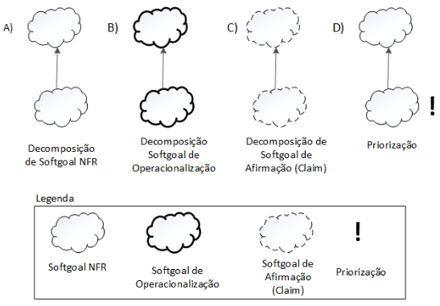
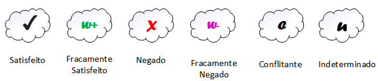
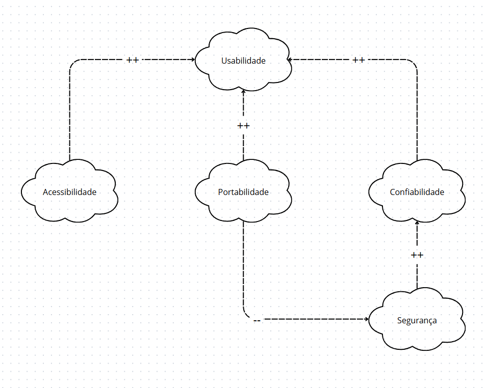
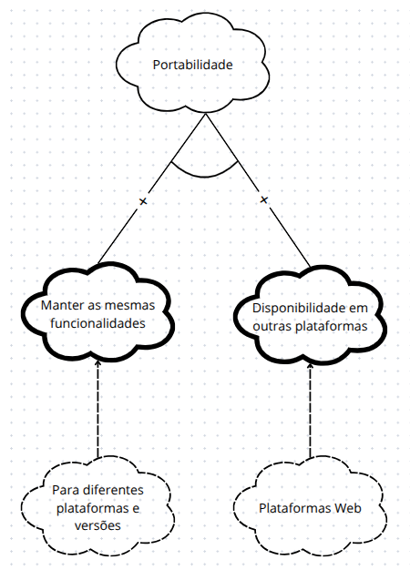
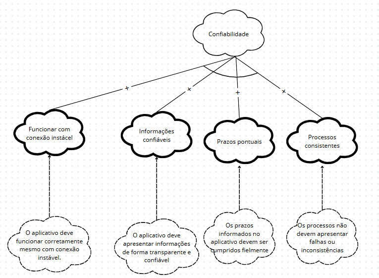
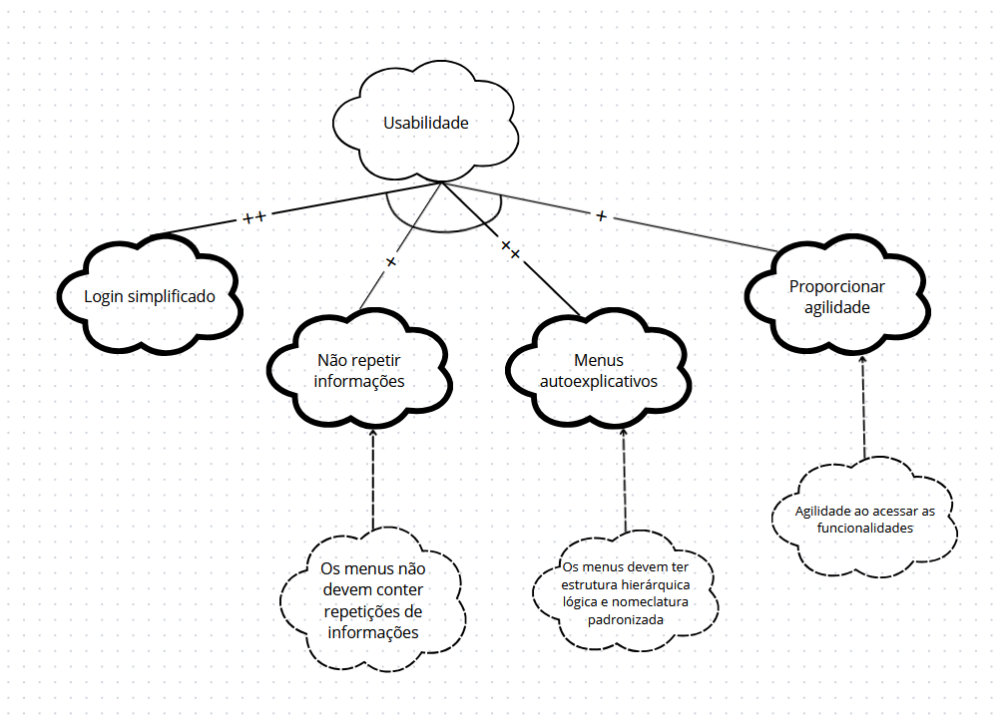
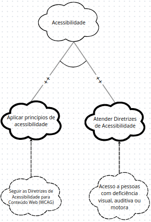
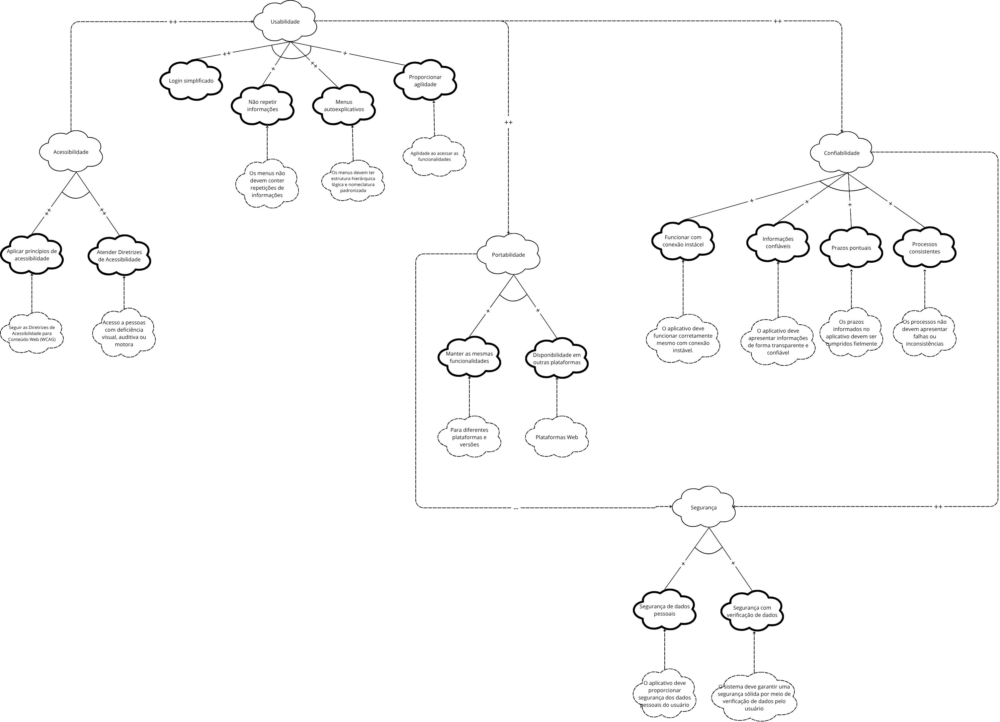
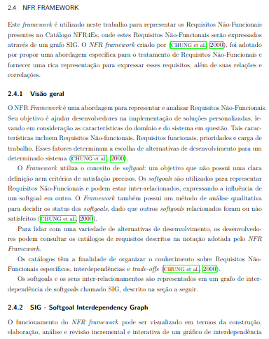

# NFR Framework

## Introdução

No contexto do desenvolvimento de sistemas de software, os [Requisitos Não-Funcionais (RNFs)](https://requisitos-de-software.github.io/2025.1-FGTS/Elicitacao/Requisitos-elicitados/#requisitos-nao-funcionais) desempenham um papel essencial ao definir qualidades e restrições que afetam diretamente a experiência do usuário, a segurança, o desempenho e a conformidade legal dos sistemas. Dentre esses requisitos, destaca-se a necessidade de que os dados sejam tratados em conformidade com legislações específicas de proteção de dados, como etapa indispensável antes da operação de qualquer sistema.

Com o objetivo de representar e analisar de maneira estruturada esses requisitos, este trabalho adota o **NFR Framework**, uma abordagem proposta por [Chung et al. (2000)](https://aprender3.unb.br/pluginfile.php/3096155/mod_resource/content/2/DISSERTA%C3%87%C3%83O%20Reinaldo%20Ant%C3%B4nio%20da%20Silva.pdf). Esse framework permite a modelagem dos RNFs por meio de *softgoals*, objetivos que não possuem critérios de satisfação precisos, mas que são fundamentais para a qualidade do produto. A representação gráfica dos softgoals é feita através de um **grafo SIG (Softgoal Interdependency Graph)**, que explicita suas interdependências, influências e possíveis conflitos.

O presente estudo concentra-se no tratamento de Requisitos Não-Funcionais de Produto do aplicativo **FGTS**, utilizando a notação do NFR Framework para expressar os RNFs contidos no catálogo **NFR4ES**. A aplicação desse framework visa apoiar a tomada de decisões no processo de desenvolvimento e evolução do app FGTS, tornando-o mais robusto, seguro e alinhado tanto às necessidades dos usuários quanto ao contexto legal vigente, especialmente no que se refere à proteção de dados e à confiabilidade do sistema.

## SIG - Softgoal Interdependency Graph

O NFR Framework funciona por meio da construção e análise de um grafo chamado Softgoal Interdependency Graph (SIG), que representa graficamente os Requisitos Não-Funcionais (softgoals), suas interdependências, alternativas e justificativas. Esse grafo registra as decisões de desenvolvimento e permite avaliar se os requisitos de alto nível foram atendidos.

### Tipos de SIG

O SIG é dividido em três tipos principais:

- **Softgoals NFR**: representam alternativas técnicas e soluções práticas (como processos, restrições ou estruturas) para atender aos softgoals NFR.

- **Softgoals de Operacionalização**: representa os softgoals e suas interdependências, permitindo identificar conflitos, sinergias e decisões de projeto justificáveis.

- **Softgoals de Afirmação**: trazem justificativas baseadas em características do domínio (como prioridades e carga de trabalho), apoiando decisões, revisões e a rastreabilidade do sistema.

Figura 1: Tipos de Softgoal

  

Fonte: [SILVA, 2019](https://aprender3.unb.br/pluginfile.php/3096155/mod_resource/content/2/DISSERTA%C3%87%C3%83O%20Reinaldo%20Ant%C3%B4nio%20da%20Silva.pdf) 

### Tipos e Interdependências de Softgoals no NFR Framework

- O NFR Framework utiliza três tipos de *softgoals*, representados por diferentes estilos de nuvens:
  - **Softgoals NFR**: nuvens claras
  - **Softgoals de Operacionalização**: nuvens com linhas grossas
  - **Softgoals de Afirmação**: nuvens com linhas tracejadas

- Cada *softgoal NFR* possui um **tipo** (ex: Confiabilidade) e um **tópico** (ex: Infusor), que indicam a parte específica do sistema a que se refere.

- As **interdependências** entre os *softgoals* são classificadas em:
  - **Refinamentos (top-down)**, onde um *softgoal* pai gera filhos mais específicos, podendo ser:
    - **Decomposição de Softgoal NFR**: divide um requisito não-funcional em outros mais específicos
    - **Decomposição de Operacionalização**: refina soluções implementáveis
    - **Decomposição de Afirmação**: detalha justificativas de projeto
    - **Priorização**: refina um *softgoal* destacando sua prioridade

- Essa estrutura ajuda a representar, refinar e justificar requisitos não-funcionais no desenvolvimento de sistemas.

Figura 2: Tipos e Interdependências de Softgoals no NFR Framework

  

Fonte: [SILVA, 2019](https://aprender3.unb.br/pluginfile.php/3096155/mod_resource/content/2/DISSERTA%C3%87%C3%83O%20Reinaldo%20Ant%C3%B4nio%20da%20Silva.pdf) 

### Contribuições e Tipos no NFR Framework

- Durante o refinamento dos *softgoals*, um softgoal descendente pode contribuir positiva ou negativamente, de forma total ou parcial, para a satisfação do *softgoal* ascendente.
- "Satisfação de softgoal" indica que o requisito não-funcional deve ser atendido dentro de limites aceitáveis, não necessariamente de forma absoluta.

- **AND**: todos os descendentes precisam ser satisfeitos para o ascendente ser satisfeito.
- **OR**: algum descendente satisfeito basta para o ascendente ser satisfeito.
- **MAKE (++)**: contribuição altamente positiva; se o descendente for satisfeito, o ascendente será satisfeito.
- **BREAK (--)**: contribuição altamente negativa; se o descendente for satisfeito, o ascendente será negado.
- **HELP (+)**: contribuição parcialmente positiva; satisfação parcial do descendente leva à satisfação parcial do ascendente.
- **HURT (-)**: contribuição parcialmente negativa; satisfação do descendente prejudica parcialmente o ascendente.
- **UNKNOWN (?)**: contribuição desconhecida, pode ser positiva ou negativa.
- **EQUALS**: o descendente só é satisfeito se o ascendente for satisfeito; se o ascendente for negado, o descendente também é negado.
- **SOME**: sinal conhecido (positivo ou negativo), mas grau de contribuição incerto; usado em casos de incerteza entre HELP/MAKE ou HURT/BREAK.

### Procedimento de Avaliação no NFR Framework

- O procedimento de avaliação determina o grau em que os requisitos não funcionais (*softgoals*) são satisfeitos por um conjunto de decisões.
- Cada *softgoal* ou interdependência do *Softgoal Interdependency Graph* (SIG) recebe um rótulo para indicar seu status.
- Tipos de rótulos usados:

    - ✓ **(satisfeito)**: O requisito não funcional é plenamente satisfeito.
    - 𝒲+ **(fracamente satisfeito)**: Satisfação parcial; impacto positivo, mas menos forte que ✓.
    - X **(negado)**: O requisito não é satisfeito e pode até contradizer os objetivos do sistema.
    - 𝒲- **(fracamente negado)**: Negação parcial; impacto negativo, mas mais brando que X.
    - 🗲 **(conflitante)**: Há conflitos entre requisitos; coexistem aspectos positivos e negativos.
    - u **(indeterminado)**: Não há dados suficientes para determinar o impacto entre os requisitos.

- A avaliação começa pelos *softgoals* de nível mais baixo na hierarquia, relacionados a decisões específicas do projeto.
- O procedimento propaga os rótulos hierarquicamente, avaliando o impacto das decisões nos *softgoals* de níveis superiores, até alcançar o topo do SIG.

Figura 3: Procedimento de Avaliação no NFR Framework

  

Fonte: [SILVA, 2019](https://aprender3.unb.br/pluginfile.php/3096155/mod_resource/content/2/DISSERTA%C3%87%C3%83O%20Reinaldo%20Ant%C3%B4nio%20da%20Silva.pdf) 

## Metodologia

Para aplicar o **NFR Framework** ao desenvolvimento do aplicativo, adotamos uma abordagem em etapas estruturadas, com o objetivo de identificar, modelar, analisar e tomar decisões relacionadas aos requisitos não funcionais (softgoals) do sistema. A metodologia compreende as seguintes fases:

### 1. Identificação dos Requisitos Não Funcionais (Softgoals)

Nesta etapa, foram identificados os principais requisitos não funcionais relevantes ao contexto do aplicativo, como:

- Usabilidade  
- Desempenho  
- Segurança  
- Acessibilidade  
- Confiabilidade  
- Portabilidade

Essa identificação foi baseada em entrevistas com stakeholders, análise de mercado e levantamento de requisitos funcionais relacionados. Os requisitos não funcionais são representados como **softgoals**, que expressam intenções qualitativas sem critérios rígidos de satisfação.

### 2. Modelagem com o NFR Framework

A modelagem foi realizada utilizando a notação proposta por [*Chung et al. (2000)*](https://aprender3.unb.br/pluginfile.php/3096155/mod_resource/content/2/DISSERTA%C3%87%C3%83O%20Reinaldo%20Ant%C3%B4nio%20da%20Silva.pdf), representando os softgoals em uma estrutura hierárquica com relacionamentos de contribuição entre eles. Foram utilizados os seguintes tipos de contribuição:

- **MAKE (++)**
- **HELP (+)**
- **HURT (-)**
- **BREAK (--)**
- **OR**
- **AND**
- **EQUALS**
- **UNKNOWN (?)**
- **SOME**

Também foram especificadas as **operacionalizações**, ou seja, decisões de projeto que implementam cada softgoal.

#### Uso do Cartão de Especificação

Durante essa fase de modelagem, utilizou-se o **Cartão de Especificação** como instrumento de apoio à documentação e análise. Cada cartão foi preenchido com os seguintes elementos:

- Nome do softgoal  
- Descrição do requisito não funcional  
- Alternativas de operacionalização  
- Contribuições com outros softgoals  
- Justificativa das decisões  
- Responsável e data da análise  

A Tabela 1 ilustra o modelo adotado para a elaboração dos cartões de especificação.

Tabela 1: Template de cartão de especificação 

<table border="1" cellpadding="6" cellspacing="0">
  <tr><th colspan="2">Requisito Não Funcional – RNFXX</th></tr>
  <tr><td><strong>Classificação</strong></td><td>	Classificação do RNF conforme a hierarquia do catálogo.</td></tr>
  <tr><td><strong>Descrição</strong></td><td>Declaração única do significado do requisito.</td></tr>
  <tr><td><strong>Justificativa</strong></td><td>Justificativa sobre a criação do requisito</td></tr>
  <tr><td><strong>Origem do Requisito</strong></td><td>Origem do requisito (stakeholder, norma técnica e etc...)</td></tr>
  <tr><td><strong>Critério de Aceitação</strong></td><td>Métrica do requisito que possa ser testada e que deve ser satisfeita.</td></tr>
  <tr><td><strong>Dependências</strong></td><td>Requisitos relacionados a este.</td></tr>
  <tr><td><strong>Prioridade</strong></td><td>Um número usado para decidir a importância relativa deste requisito entre os outros RNFs (varia de 1 a 10). A prioridade mínima é 1 e a máxima é 10.</td></tr>
  <tr><td><strong>Conflitos</strong></td><td>Requisitos conflitantes com este.</td></tr>
  <tr><td><strong>História</strong></td><td>Data de criação e de modificações.</td></tr>
</table>

Fonte: [Leticia Arisa](https://github.com/Leticia-Arisa-K-Higa) 

O cartão facilitou a **rastreabilidade, clareza e consistência** das informações, além de permitir uma análise comparativa entre alternativas e apoiar a comunicação com os stakeholders durante a modelagem dos requisitos.

### 3. Avaliação dos Softgoals

Após modelar os softgoals e suas contribuições, foi realizado o **procedimento de avaliação**, no qual cada softgoal recebeu um rótulo indicando o grau de satisfação:

- `✓` **Satisfeito**: Requisito não funcional plenamente atendido.  
- `𝒲+` **Fracamente satisfeito**: Satisfação parcial.  
- `X` **Negado**: Requisito contradiz outro.  
- `𝒲-` **Fracamente negado**: Impacto negativo moderado.  
- `🗲` **Conflitante**: Conflito entre requisitos.  
- `u` **Indeterminado**: Impacto incerto ou desconhecido.

A avaliação começou pelos softgoals de nível mais baixo (operacionalizações), subindo até os níveis superiores da hierarquia para analisar o impacto global das decisões.

### 4. Tomada de Decisão

Com base nas análises e rótulos atribuídos, foram tomadas decisões de projeto priorizando alternativas que maximizassem a satisfação dos softgoals mais relevantes. Em casos de conflito entre requisitos (ex: desempenho vs. segurança), foram feitas ponderações com stakeholders para encontrar o melhor compromisso possível.

### 5. Validação

Por fim, a validação da modelagem seguiu duas frentes:

- Rastreabilidade com as histórias de usuário: verificou-se se os softgoals contemplam os desejos e expectativas expressas por cada persona.

- Análise de cobertura: analisou-se se os principais atributos de qualidade exigidos para um app público financeiro (como disponibilidade, desempenho e segurança) foram devidamente modelados.

Essa validação permite garantir que os RNFs não sejam apenas documentados, mas também rastreáveis, justificáveis e compatíveis com os requisitos funcionais do aplicativo.

### Cronograma de Participantes

Tabela 2: Cronograma de Participantes

| Nome             | Data | Hora |
|------------------|------|------|
| Danielle Soares  | 01/06/2025    | 13:30    |
| Eduardo de Pina  | 01/06/2025    | 11:32    |
| Enzo Emir        | 31/05/2025    | 11:45    |
| Leticia Arisa    | 31/05/2025    | 20:17  |
| Marcelo Makoto   | 31/05/2025    | 08:52    |
| Maria Eduarda    | 31/05/2025 | 00:45 |
| Victor Pontual   | -    | -    |

Fonte: [Marcelo Makoto](https://github.com/MM4k)

### Requisitos não-funcionais

A Tabela 3 a seguir lista os Requisitos Não-Funcionais utilizados para a criação do NFR Framework.

Tabela 3: Requisitos não-funcionais

| Código | Descrição                                                                                             | Origem                                                                                                                                                                                                                                                                                                                                                                                                                                                                                                                                                                                              |
|--------|-------------------------------------------------------------------------------------------------------|------------------------------------------------------------------------------------------------------------------------------------------------------------------------------------------------------------------------------------------------------------------------------------------------------------------------------------------------------------------------------------------------------------------------------------------------------------------------------------------------------------------------------------------------------------------------------------------------------|
| RNF02  | O processo de login deve ser simplificado                                                             | [EN08](https://requisitos-de-software.github.io/2025.1-FGTS/Elicitacao/Tecnicas-de-Elicitacao/Entrevista/#EN_RNF)                                                                                                                                                                                                                                                                                                                                                                                                                                                                                   |
| RNF03  | O sistema deve apresentar informações de forma transparente e confiável                               | [EN09](https://requisitos-de-software.github.io/2025.1-FGTS/Elicitacao/Tecnicas-de-Elicitacao/Entrevista/#EN_RNF)                                                                                                                                                                                                                                                                                                                                                                                                                                                                                   |
| RNF04  | Os prazos informados no app devem ser cumpridos fielmente                                             | [EN10](https://requisitos-de-software.github.io/2025.1-FGTS/Elicitacao/Tecnicas-de-Elicitacao/Entrevista/#EN_RNF)                                                                                                                                                                                                                                                                                                                                                                                                                                                                                   |
| RNF05  | O aplicativo deve ser confiável e evitar falhas ou inconsistências nos processos                      | [EN11](https://requisitos-de-software.github.io/2025.1-FGTS/Elicitacao/Tecnicas-de-Elicitacao/Entrevista/#EN_RNF)                                                                                                                                                                                                                                                                                                                                                                                                                                                                                   |
| RNF06  | O aplicativo deve funcionar corretamente mesmo com conexão instável                                   | [EN12](https://requisitos-de-software.github.io/2025.1-FGTS/Elicitacao/Tecnicas-de-Elicitacao/Entrevista/#EN_RNF)                                                                                                                                                                                                                                                                                                                                                                                                                                                                                   |
| RNF07  | O aplicativo deve fornecer as mesmas funcionalidades para diferentes plataformas e versões            | [IS18](https://requisitos-de-software.github.io/2025.1-FGTS/Elicitacao/Tecnicas-de-Elicitacao/Introspeccao/#IS_RNF)                                                                                                                                                                                                                                                                                                                                                                                                                                                                                 |
| RNF08  | Os menus devem fornecer informações não repetidas                                                     | [IS19](https://requisitos-de-software.github.io/2025.1-FGTS/Elicitacao/Tecnicas-de-Elicitacao/Introspeccao/#IS_RNF)                                                                                                                                                                                                                                                                                                                                                                                                                                                                                 |
| RNF09  | O aplicativo deve aplicar princípios de acessibilidade                                                | [IS21](https://requisitos-de-software.github.io/2025.1-FGTS/Elicitacao/Tecnicas-de-Elicitacao/Introspeccao/#IS_RNF)                                                                                                                                                                                                                                                                                                                                                                                                                                                                                 |
| RNF10  | O aplicativo deve estar disponível para outras plataformas, como web                                  | [IS22](https://requisitos-de-software.github.io/2025.1-FGTS/Elicitacao/Tecnicas-de-Elicitacao/Introspeccao/#IS_RNF)                                                                                                                                                                                                                                                                                                                                                                                                                                                                                 |
| RNF11  | O aplicativo deve proporcionar segurança de dados pessoais                                            | [IS23](https://requisitos-de-software.github.io/2025.1-FGTS/Elicitacao/Tecnicas-de-Elicitacao/Introspeccao/#IS_RNF)                                                                                                                                                                                                                                                                                                                                                                                                                                                                                 |
| RNF12  | O aplicativo deve proporcionar agilidade ao acessar as funcionalidades                                | [IS24](https://requisitos-de-software.github.io/2025.1-FGTS/Elicitacao/Tecnicas-de-Elicitacao/Introspeccao/#IS_RNF)                                                                                                                                                                                                                                                                                                                                                                                                                                                                                 |
| RNF13  | O sistema deve garantir segurança firme com verificação de dados pelo usuário                         | [OB10](https://requisitos-de-software.github.io/2025.1-FGTS/Elicitacao/Tecnicas-de-Elicitacao/Observacao/#OB_RNF)                                                                                                                                                                                                                                                                                                                                                                                                                                                                                   |
| RNF21  | Os menus devem ser autoexplicativos, com estrutura hierárquica lógica e nomenclatura padronizada      | [IS19](https://requisitos-de-software.github.io/2025.1-FGTS/Elicitacao/Tecnicas-de-Elicitacao/Introspeccao/#IS_RNF), [OB11](https://requisitos-de-software.github.io/2025.1-FGTS/Elicitacao/Tecnicas-de-Elicitacao/Observacao/#OB_RNF)                                                                                                                                                                                                                                                                                                                                                              |
| RNF22  | A aplicação deve estar em conformidade com diretrizes de acessibilidade, garantindo acesso a pessoas com deficiência visual, auditiva ou motora | [IS20](https://requisitos-de-software.github.io/2025.1-FGTS/Elicitacao/Tecnicas-de-Elicitacao/Introspeccao/#IS_RNF)                                                                                                                                                                                                                                                                                                                                                                                                                                                                                 |

Fonte: [Leticia Arisa](https://github.com/Leticia-Arisa-K-Higa) 

 

---

## Levantamento Inicial

---

## Cartões de Especificação

Tabela 4: Processo Login

<table border="1" cellpadding="6" cellspacing="0">
  <tr><th colspan="2">Requisito Não Funcional – RNF02</th></tr>
  <tr><td><strong>Classificação</strong></td><td>Usabilidade</td></tr>
  <tr><td><strong>Descrição</strong></td><td>O processo de login deve ser simplificado.</td></tr>
  <tr><td><strong>Justificativa</strong></td><td>Um login simples melhora a experiência do usuário, reduz a frustração e torna o acesso ao aplicativo mais eficiente.</td></tr>
  <tr><td><strong>Origem do Requisito</strong></td><td><a href="https://requisitos-de-software.github.io/2025.1-FGTS/Elicitacao/Tecnicas-de-Elicitacao/Entrevista/#EN_RNF">EN08</a></td></tr>
  <tr><td><strong>Critério de Aceitação</strong></td><td>O usuário deve conseguir realizar o login com no máximo duas etapas, sem a necessidade de preencher dados excessivos.</td></tr>
  <tr><td><strong>Dependências</strong></td><td>Sistema de autenticação</td></tr>
  <tr><td><strong>Prioridade</strong></td><td>9</td></tr>
  <tr><td><strong>Conflitos</strong></td><td>Nenhum</td></tr>
  <tr><td><strong>História</strong></td><td>31/05/2025</td></tr>
</table>

Fonte: [Danielle Soares](https://github.com/danielle-soaress) 

Tabela 5: Diferentes Funcionalidades

<table border="1" cellpadding="6" cellspacing="0">
  <tr><th colspan="2">Requisito Não Funcional – RNF07</th></tr>
  <tr><td><strong>Classificação</strong></td><td>Portabilidade</td></tr>
  <tr><td><strong>Descrição</strong></td><td>O aplicativo deve fornecer as mesmas funcionalidades para diferentes plataformas e versões.</td></tr>
  <tr><td><strong>Justificativa</strong></td><td>Garantir a consistência da experiência do usuário, independentemente do dispositivo ou sistema operacional utilizado.</td></tr>
  <tr><td><strong>Origem do Requisito</strong></td><td><a href="https://requisitos-de-software.github.io/2025.1-FGTS/Elicitacao/Tecnicas-de-Elicitacao/Introspeccao/#IS_RNF"> IS18</a></td></tr>
  <tr><td><strong>Critério de Aceitação</strong></td><td>As funcionalidades disponíveis devem ser idênticas em todas as versões do aplicativo para Android, iOS e Web.</td></tr>
  <tr><td><strong>Dependências</strong></td><td>Frameworks multiplataforma, compatibilidade entre sistemas</td></tr>
  <tr><td><strong>Prioridade</strong></td><td>9</td></tr>
  <tr><td><strong>Conflitos</strong></td><td>Pode haver limitações específicas em versões mais antigas de sistemas operacionais.</td></tr>
  <tr><td><strong>História</strong></td><td>31/05/2025</td></tr>
</table>

Fonte: [Danielle Soares](https://github.com/danielle-soaress) 

Tabela 6: Agilidade de Funcionalidades

<table border="1" cellpadding="6" cellspacing="0">
  <tr><th colspan="2">Requisito Não Funcional – RNF12</th></tr>
  <tr><td><strong>Classificação</strong></td><td>Usabilidade</td></tr>
  <tr><td><strong>Descrição</strong></td><td>O aplicativo deve proporcionar agilidade ao acessar as funcionalidades.</td></tr>
  <tr><td><strong>Justificativa</strong></td><td>Um acesso rápido melhora a experiência do usuário, reduz o tempo de espera e aumenta a eficiência no uso do aplicativo.</td></tr>
  <tr><td><strong>Origem do Requisito</strong></td><td><a href="https://requisitos-de-software.github.io/2025.1-FGTS/Elicitacao/Tecnicas-de-Elicitacao/Introspeccao/#requisitos-nao-funcionais">IS24</a></td></tr>
  <tr><td><strong>Critério de Aceitação</strong></td><td>O usuário deve conseguir acessar qualquer funcionalidade em menos de 3 segundos.</td></tr>
  <tr><td><strong>Dependências</strong></td><td>Infraestrutura do sistema, otimização do código</td></tr>
  <tr><td><strong>Prioridade</strong></td><td>10</td></tr>
  <tr><td><strong>Conflitos</strong></td><td>Nenhum</td></tr>
  <tr><td><strong>História</strong></td><td>31/05/2025</td></tr>
</table>

Fonte: [Maria Eduarda](https://github.com/dudaa28) 

Tabela 7: Menus Autoexplicativos

<table border="1" cellpadding="6" cellspacing="0">
  <tr><th colspan="2">Requisito Não Funcional – RNF21</th></tr>
  <tr><td><strong>Classificação</strong></td><td>Usabilidade</td></tr>
  <tr><td><strong>Descrição</strong></td><td>Os menus devem ser autoexplicativos, com estrutura hierárquica lógica e nomenclatura padronizada.</td></tr>
  <tr><td><strong>Justificativa</strong></td><td>Menus intuitivos facilitam a navegação do usuário, reduzem o tempo de aprendizado e aumentam a eficiência no uso do aplicativo.</td></tr>
  <tr><td><strong>Origem do Requisito</strong></td><td><a href="https://requisitos-de-software.github.io/2025.1-FGTS/Elicitacao/Tecnicas-de-Elicitacao/Introspeccao/#IS_RNF">IS19</a>
  <a href="https://requisitos-de-software.github.io/2025.1-FGTS/Elicitacao/Tecnicas-de-Elicitacao/Observacao/#OB_RNF">OB11</a></td></tr>
  <tr><td><strong>Critério de Aceitação</strong></td><td>O usuário deve ser capaz de encontrar funcionalidades com facilidade, sem precisar acessar mais de três níveis de menu e com nomes consistentes e compreensíveis.</td></tr>
  <tr><td><strong>Dependências</strong></td><td>Design de Interface, Padrões de Navegação</td></tr>
  <tr><td><strong>Prioridade</strong></td><td>10</td></tr>
  <tr><td><strong>Conflitos</strong></td><td>Nenhum</td></tr>
  <tr><td><strong>História</strong></td><td>31/05/2025</td></tr>
</table>

Fonte: [Maria Eduarda](https://github.com/dudaa28) 

Tabela 8: Aplicativo com Segurança

<table border="1" cellpadding="6" cellspacing="0">
  <tr><th colspan="2">Requisito Não Funcional – RNF05</th></tr>
  <tr><td><strong>Classificação</strong></td><td>Confiabilidade</td></tr>
  <tr><td><strong>Descrição</strong></td><td>O aplicativo deve ser confiável e evitar falhas ou inconsistências nos processos.</td></tr>
  <tr><td><strong>Justificativa</strong></td><td>A confiabilidade é essencial para garantir que os usuários tenham uma experiência estável e segura, principalmente ao realizar tarefas importantes.</td></tr>
  <tr><td><strong>Origem do Requisito</strong></td><td><a href="https://requisitos-de-software.github.io/2025.1-FGTS/Elicitacao/Tecnicas-de-Elicitacao/Entrevista/#EN_RNF">EN11</a></td></tr>
  <tr><td><strong>Critério de Aceitação</strong></td><td>O sistema deve passar em testes de estresse e testes de integridade sem apresentar falhas ou perda de dados.</td></tr>
  <tr><td><strong>Dependências</strong></td><td>Testes automatizados, tratamento de erros</td></tr>
  <tr><td><strong>Prioridade</strong></td><td>9</td></tr>
  <tr><td><strong>Conflitos</strong></td><td>Nenhum</td></tr>
  <tr><td><strong>História</strong></td><td>31/05/2025</td></tr>
</table>

Fonte: [Leticia Arisa](https://github.com/Leticia-Arisa-K-Higa) 

Tabela 9: Conformidade de Diretrizes

<table border="1" cellpadding="6" cellspacing="0">
  <tr><th colspan="2">Requisito Não Funcional – RNF22</th></tr>
  <tr><td><strong>Classificação</strong></td><td>Acessibilidade</td></tr>
  <tr><td><strong>Descrição</strong></td><td>A aplicação deve estar em conformidade com diretrizes de acessibilidade, garantindo acesso a pessoas com deficiência visual, auditiva ou motora.</td></tr>
  <tr><td><strong>Justificativa</strong></td><td>Garantir acessibilidade promove inclusão digital e atende a requisitos legais e éticos, ampliando o público-alvo do sistema.</td></tr>
  <tr><td><strong>Origem do Requisito</strong></td><td><a href="https://requisitos-de-software.github.io/2025.1-FGTS/Elicitacao/Tecnicas-de-Elicitacao/Introspeccao/#IS_RNF">IS20</a></td></tr>
  <tr><td><strong>Critério de Aceitação</strong></td><td>A interface deve permitir navegação por teclado, ser compátivel com leitores de tela e conter alternativas textuais para elementos visuais.</td></tr>
  <tr><td><strong>Dependências</strong></td><td>Equipe de design e desenvolvimento front-end</td></tr>
  <tr><td><strong>Prioridade</strong></td><td>10</td></tr>
  <tr><td><strong>Conflitos</strong></td><td>Nenhum</td></tr>
  <tr><td><strong>História</strong></td><td>31/05/2025</td></tr>
</table>

Fonte: [Leticia Arisa](https://github.com/Leticia-Arisa-K-Higa) 

Tabela 10: Funcionamento em Conexão Instável

<table border="1" cellpadding="6" cellspacing="0">
  <tr><th colspan="2">Requisito Não Funcional – RNF06</th></tr>
  <tr><td><strong>Classificação</strong></td><td>Confiabilidade</td></tr>
  <tr><td><strong>Descrição</strong></td><td>O aplicativo deve funcionar corretamente mesmo com conexão instável.</td></tr>
  <tr><td><strong>Justificativa</strong></td><td>Usuários em áreas com cobertura irregular de internet precisam acessar informações críticas do FGTS sem erros ou travamentos.</td></tr>
  <tr><td><strong>Origem do Requisito</strong></td><td><a href="https://requisitos-de-software.github.io/2025.1-FGTS/Elicitacao/Tecnicas-de-Elicitacao/Entrevista/#requisitos-nao-funcionais">EN12</a></td></tr>
  <tr><td><strong>Critério de Aceitação</strong></td><td>O app deve manter funcionalidades mínimas (ex.: consulta de saldo e extrato) mesmo com perdas intermitentes de conexão.</td></tr>
  <tr><td><strong>Dependências</strong></td><td>Equipe de backend e gerenciamento de cache local</td></tr>
  <tr><td><strong>Prioridade</strong></td><td>8</td></tr>
  <tr><td><strong>Conflitos</strong></td><td>Maior uso de memória local pode impactar desempenho em dispositivos antigos</td></tr>
  <tr><td><strong>História</strong></td><td>31/05/2025</td></tr>
</table>

Fonte: [Marcelo Makoto](https://github.com/MM4k) 

Tabela 11: Segurança de Dados Pessoais

<table border="1" cellpadding="6" cellspacing="0">
  <tr><th colspan="2">Requisito Não Funcional – RNF11</th></tr>
  <tr><td><strong>Classificação</strong></td><td>Segurança</td></tr>
  <tr><td><strong>Descrição</strong></td><td>O aplicativo deve proporcionar segurança de dados pessoais.</td></tr>
  <tr><td><strong>Justificativa</strong></td><td>Proteção de informações sensíveis como CPF, conta bancária e saldo do FGTS é essencial para evitar fraudes e vazamentos.</td></tr>
  <tr><td><strong>Origem do Requisito</strong></td><td><a href="https://requisitos-de-software.github.io/2025.1-FGTS/Elicitacao/Tecnicas-de-Elicitacao/Introspeccao/#requisitos-nao-funcionais">IS23</a></td></tr>
  <tr><td><strong>Critério de Aceitação</strong></td><td>Os dados devem ser armazenados e transmitidos com criptografia; autenticação deve usar biometria ou múltiplos fatores.</td></tr>
  <tr><td><strong>Dependências</strong></td><td>Equipe de segurança da informação e infraestrutura</td></tr>
  <tr><td><strong>Prioridade</strong></td><td>10</td></tr>
  <tr><td><strong>Conflitos</strong></td><td>Maior nível de segurança pode exigir autenticação adicional, impactando usabilidade para alguns usuários</td></tr>
  <tr><td><strong>História</strong></td><td>31/05/2025</td></tr>
</table>

Fonte: [Marcelo Makoto](https://github.com/MM4k) 

Tabela 12: Cumprimento dos Prazos

<table border="1" cellpadding="6" cellspacing="0">
  <tr><th colspan="2">Requisito Não Funcional – RNF04</th></tr>
  <tr><td><strong>Classificação</strong></td><td>Confiabilidade</td></tr>
  <tr><td><strong>Descrição</strong></td><td>Os prazos informados no app devem ser cumpridos fielmente.</td></tr>
  <tr><td><strong>Justificativa</strong></td><td>O cumprimento de prazos aumenta a credibilidade do sistema e evita frustrações por parte dos usuários.</td></tr>
  <tr><td><strong>Origem do Requisito</strong></td><td><a href="https://requisitos-de-software.github.io/2025.1-FGTS/Elicitacao/Tecnicas-de-Elicitacao/Entrevista/#EN_RNF">EN10</a></td></tr>
  <tr><td><strong>Critério de Aceitação</strong></td><td>O sistema deve garantir que as datas e prazos exibidos sejam atendidos, exceto em casos devidamente justificados por instâncias externas.</td></tr>
  <tr><td><strong>Dependências</strong></td><td>Integração com sistemas oficiais de processamento e saque</td></tr>
  <tr><td><strong>Prioridade</strong></td><td>10</td></tr>
  <tr><td><strong>Conflitos</strong></td><td>Prazos externos sujeitos a mudanças fora do controle do aplicativo</td></tr>
  <tr><td><strong>História</strong></td><td>31/05/2025</td></tr>
</table>

Fonte: [Enzo Emir](https://github.com/EnzoEmir) 

Tabela 13: Princípios de Acessibilidade.

<table border="1" cellpadding="6" cellspacing="0">
  <tr><th colspan="2">Requisito Não Funcional – RNF09</th></tr>
  <tr><td><strong>Classificação</strong></td><td>Acessibilidade</td></tr>
  <tr><td><strong>Descrição</strong></td><td>O aplicativo deve aplicar princípios de acessibilidade.</td></tr>
  <tr><td><strong>Justificativa</strong></td><td>A aplicação de princípios de acessibilidade garante que pessoas com deficiência também possam utilizar o sistema com autonomia e facilidade.</td></tr>
  <tr><td><strong>Origem do Requisito</strong></td><td><a href="https://requisitos-de-software.github.io/2025.1-FGTS/Elicitacao/Tecnicas-de-Elicitacao/Introspeccao/#IS_RNF">IS21</a></td></tr>
  <tr><td><strong>Critério de Aceitação</strong></td><td>O app deve seguir as Diretrizes de Acessibilidade para Conteúdo Web (WCAG), implementando recursos como contraste adequado, navegação por teclado e leitores de tela.</td></tr>
  <tr><td><strong>Dependências</strong></td><td>Equipe de design com conhecimento em acessibilidade; frameworks compatíveis</td></tr>
  <tr><td><strong>Prioridade</strong></td><td>9</td></tr>
  <tr><td><strong>Conflitos</strong></td><td>Pode haver necessidade de maior tempo de desenvolvimento para adaptações específicas</td></tr>
  <tr><td><strong>História</strong></td><td>31/05/2025</td></tr>
</table>

Fonte: [Enzo Emir](https://github.com/EnzoEmir) 

Tabela 14: Confiabilidade de informações.

<table border="1" cellpadding="6" cellspacing="0">
  <tr><th colspan="2">Requisito Não Funcional – RNF03</th></tr>
  <tr><td><strong>Classificação</strong></td><td>Segurança</td></tr>
  <tr><td><strong>Descrição</strong></td><td>O sistema deve apresentar informações de forma transparente e confiável.</td></tr>
  <tr><td><strong>Justificativa</strong></td><td>A confiabilidade e a transparência são requisitos básicos em uma aplicação que trabalha com dados bancários.</td></tr>
  <tr><td><strong>Origem do Requisito</strong></td><td><a href="https://requisitos-de-software.github.io/2025.1-FGTS/Elicitacao/Tecnicas-de-Elicitacao/Entrevista/#EN_RNF">EN09</a></td></tr>
  <tr><td><strong>Critério de Aceitação</strong></td><td>O usuário deve conseguir acessar os seus dados de forma segura e transparente, sem que haja desconforto ou desconfiança.</td></tr>
  <tr><td><strong>Dependências</strong></td><td>Verificação de informações junto ao banco e sistema de autenticação.</td></tr>
  <tr><td><strong>Prioridade</strong></td><td>10</td></tr>
  <tr><td><strong>Conflitos</strong></td><td>A acessibilidade pode modificar a maneira como as informações são exibidas.</td></tr>
  <tr><td><strong>História</strong></td><td>01/06/2025</td></tr>
</table>

Fonte: [Eduardo de Pina](https://github.com/eduardodpms)

Tabela 15: Unicidade na exibição de informações.

<table border="1" cellpadding="6" cellspacing="0">
  <tr><th colspan="2">Requisito Não Funcional – RNF08</th></tr>
  <tr><td><strong>Classificação</strong></td><td>Confiabilidade</td></tr>
  <tr><td><strong>Descrição</strong></td><td>Os menus devem fornecer informações não repetidas.</td></tr>
  <tr><td><strong>Justificativa</strong></td><td>A existência de informações repetidas nos menus pode impactar na confiabilidade que o usuário tem no sistema, bem como confundí-lo.</td></tr>
  <tr><td><strong>Origem do Requisito</strong></td><td><a href="https://requisitos-de-software.github.io/2025.1-FGTS/Elicitacao/Tecnicas-de-Elicitacao/Introspeccao/#IS_RNF">IS19</a></td></tr>
  <tr><td><strong>Critério de Aceitação</strong></td><td>O usuário não pode encontrar menus que contenham botões, textos, caixas ou dados repetidos.</td></tr>
  <tr><td><strong>Dependências</strong></td><td>Planejamento de design e de front-end do aplicativo.</td></tr>
  <tr><td><strong>Prioridade</strong></td><td>7</td></tr>
  <tr><td><strong>Conflitos</strong></td><td>Nenhum.</td></tr>
  <tr><td><strong>História</strong></td><td>01/06/2025</td></tr>
</table>

Fonte: [Eduardo de Pina](https://github.com/eduardodpms)

Tabela 16: O aplicativo deve estar disponível para outras plataformas, como web.

<table border="1" cellpadding="6" cellspacing="0">
  <tr><th colspan="2">Requisito Não Funcional – RNF10</th></tr>
  <tr><td><strong>Classificação</strong></td><td>Portabilidade</td></tr>
  <tr><td><strong>Descrição</strong></td><td>O aplicativo deve estar disponível para outras plataformas além do celular, como navegadores web.</td></tr>
  <tr><td><strong>Justificativa</strong></td><td>Expandir a acessibilidade do sistema para diferentes perfis de usuário, incluindo aqueles que preferem utilizar computadores ou que não têm acesso fácil a dispositivos móveis.</td></tr>
  <tr><td><strong>Origem do Requisito</strong></td><td><a href="https://requisitos-de-software.github.io/2025.1-FGTS/Elicitacao/Tecnicas-de-Elicitacao/Introspeccao/#IS_RNF">IS22</a></td></tr>
  <tr><td><strong>Critério de Aceitação</strong></td><td>O sistema deve estar acessível por navegadores modernos em computadores pessoais (Windows, Linux, MacOS).</td></tr>
  <tr><td><strong>Dependências</strong></td><td>Planejamento e desenvolvimento de uma versão responsiva ou adaptada para web.</td></tr>
  <tr><td><strong>Prioridade</strong></td><td>10</td></tr>
  <tr><td><strong>Conflitos</strong></td><td>Nenhum.</td></tr>
  <tr><td><strong>História</strong></td><td>01/06/2025</td></tr>
</table>

Fonte: [Victor Pontual](https://github.com/VictorPontual)

Tabela 17: O sistema deve garantir segurança firme com verificação de dados pelo usuário

<table border="1" cellpadding="6" cellspacing="0">
  <tr><th colspan="2">Requisito Não Funcional – RNF13</th></tr>
  <tr><td><strong>Classificação</strong></td><td>Segurança</td></tr>
  <tr><td><strong>Descrição</strong></td><td>O sistema deve permitir e incentivar a verificação ativa de dados pelo usuário para prevenir fraudes ou acessos indevidos.</td></tr>
  <tr><td><strong>Justificativa</strong></td><td>Garantir que o usuário esteja ciente dos dados utilizados e possa confirmar suas informações aumenta a segurança e a confiabilidade do sistema.</td></tr>
  <tr><td><strong>Origem do Requisito</strong></td><td><a href="https://requisitos-de-software.github.io/2025.1-FGTS/Elicitacao/Tecnicas-de-Elicitacao/Observacao/#OB_RF">OB10</a></td></tr>
  <tr><td><strong>Critério de Aceitação</strong></td><td>O sistema deve exibir resumos dos dados antes de cada ação crítica (como saque ou alteração de conta), solicitando confirmação do usuário.</td></tr>
  <tr><td><strong>Dependências</strong></td><td>Integração com módulos de segurança e lógica de interface voltada à confirmação de dados.</td></tr>
  <tr><td><strong>Prioridade</strong></td><td>10</td></tr>
  <tr><td><strong>Conflitos</strong></td><td>Nenhum.</td></tr>
  <tr><td><strong>História</strong></td><td>01/06/2025</td></tr>
</table>

Fonte: [Victor Pontual](https://github.com/VictorPontual)

---

## NFR00: Geral

A Figura 4 a seguir demonstra o Softgoal Interdependency Graph de uma maneira geral.

Figura 4: Geral

  

Fonte: [Danielle Soares](https://github.com/danielle-soaress) 

## NFR01: Portabilidade

### Descrição

Este SIG (Softgoal Interdependency Graph) foi elaborado a partir de requisitos não funcionais relacionados à portabilidade do sistema. Esses requisitos garantem que o sistema seja acessível em diferentes ambientes.

### Requisitos

Requisitos utilizados para desenvolver o SIG da Figura 5:

- RFN07: O aplicativo deve fornecer as mesmas funcionalidades para diferentes plataformas e versões.

- RFN10: O aplicativo deve estar disponível para outras plataformas, como web.

Figura 5: SIG Portabilidade

  

Fonte: [Leticia Arisa](https://github.com/Leticia-Arisa-K-Higa) 

### Propagação dos impactos

A Tabela 18, apresentada a seguir, mostra a avaliação da propagação dos impactos representados na Figura 5.

Tabela 18: Tabela de impactos.

| NFR | Impacto | Avaliador |
|-----|---------|-------|
|Portabilidade| ✓ | [Leticia Arisa](https://github.com/Leticia-Arisa-K-Higa)|
|Manter as mesmas funcionalidades | 𝒲+|  [Leticia Arisa](https://github.com/Leticia-Arisa-K-Higa)|
|Disponibilidade em outras plataformas| 𝒲+|[Leticia Arisa](https://github.com/Leticia-Arisa-K-Higa)|

Fonte: [Leticia Arisa](https://github.com/Leticia-Arisa-K-Higa) 

## NFR02: Confiabilidade

### Descrição

Este SIG (Softgoal Interdependency Graph) foi elaborado com base nos requisitos não funcionais relacionados à confiabilidade do sistema. A confiabilidade garante que o sistema execute suas funções de maneira consistente, sem falhas, mesmo em situações adversas, como conexões instáveis ou dependências externas.

### Requisitos

Requisitos utilizados para desenvolver o SIG da Figura 6:

- RNF03: O sistema deve apresentar informações de forma transparente e confiável.
- RNF04: Os prazos informados no app devem ser cumpridos fielmente.
- RNF05: O aplicativo deve ser confiável e evitar falhas ou inconsistências nos processos.
- RNF06: O aplicativo deve funcionar corretamente mesmo com conexão instável.

Figura 6: SIG Confiabilidade

  

Fonte: [Enzo Emir](https://github.com/EnzoEmir)

### Propagação dos impactos

A Tabela 19, apresentada a seguir, mostra a avaliação da propagação dos impactos representados na Figura 6.

Tabela 19: Tabela de impactos.

| NFR                                                        | Impacto | Avaliador |
|------------------------------------------------------------|---------|-----------|
| Confiabilidade (RNF05 - evitar falhas ou inconsistências)  | ✓       | [Enzo Emir](https://github.com/EnzoEmir) |
| Funcionamento em conexão instável (RNF06)                  | 𝒲+      | [Enzo Emir](https://github.com/EnzoEmir) |
| Cumprimento de prazos (RNF04)                              | 𝒲+      | [Enzo Emir](https://github.com/EnzoEmir) |
| Transparência e precisão das informações (RNF03)           | ✓       | [Enzo Emir](https://github.com/EnzoEmir) |

Fonte: [Enzo Emir](https://github.com/EnzoEmir)

## NFR03: Segurança

### Descrição

Este SIG (Softgoal Interdependency Graph) foi elaborado com base nos requisitos não funcionais relacionados à segurança do sistema no que tange ao dados. A segurança é responsável por garantir que os dados do usuário e de todas as partes envolvidas no uso do sistema tenham uma camada de proteção contra a exposição indesejada das suas informações.

### Requisitos

Requisitos utilizados para desenvolver o SIG da Figura 7:

- RNF11: O aplicativo deve proporcionar segurança de dados pessoais
- RNF13: O sistema deve garantir segurança firme com verificação de dados pelo usuário.

Figura 7: SIG Segurança

  

Fonte: [Eduardo de Pina](https://github.com/eduardodpms)

### Propagação dos impactos

A Tabela 20, apresentada a seguir, mostra a avaliação da propagação dos impactos representados na Figura 7.

Tabela 20: Tabela de impactos.

| NFR | Impacto | Avaliador |
|-|-|-|
| Segurança de dados pessoais (RNF11) | ✓ | [Eduardo de Pina](https://github.com/eduardodpms) |
| Verificação dos dados pelo usuário (RNF13) | 𝒲+ | [Eduardo de Pina](https://github.com/eduardodpms) |

Fonte: [Eduardo de Pina](https://github.com/eduardodpms) 

## NFR04: Usabilidade

### Descrição

Este Softgoal Interdependency Graph (SIG) foi elaborado para representar visualmente os aspectos relacionados à usabilidade no sistema FGTS. Ele demonstra como certos requisitos não funcionais influenciam positivamente ou negativamente esse atributo de qualidade, estruturando os relacionamentos entre metas e submetas de forma hierárquica.

### Requisitos

Requisitos utilizados para compor o SIG da Figura 8:

- **RNF02**: O processo de login deve ser simplificado  
  Origem: [EN08](https://requisitos-de-software.github.io/2025.1-FGTS/Elicitacao/Tecnicas-de-Elicitacao/Entrevista)
  
- **RNF08**: Os menus devem fornecer informações não repetidas  
  Origem: [IS19](https://requisitos-de-software.github.io/2025.1-FGTS/Elicitacao/Tecnicas-de-Elicitacao/Introspeccao/#IS_RNF)

- **RNF21**: Os menus devem ser autoexplicativos, com estrutura hierárquica lógica e nomenclatura padronizada  
  Origem: [IS19](https://requisitos-de-software.github.io/2025.1-FGTS/Elicitacao/Tecnicas-de-Elicitacao/Introspeccao/#IS_RNF), [OB11](https://requisitos-de-software.github.io/2025.1-FGTS/Elicitacao/Tecnicas-de-Elicitacao/Observacao/#OB_RF)

- **RNF12**: O aplicativo deve proporcionar agilidade ao acessar as funcionalidades  
  Origem: [IS24](https://requisitos-de-software.github.io/2025.1-FGTS/Elicitacao/Tecnicas-de-Elicitacao/Introspeccao/#IS_RNF)

Figura 8: SIG Usabilidade

  

Fonte: [Victor Pontual](https://github.com/VictorPontual)

### Propagação dos Impactos

A Tabela 21 apresenta a avaliação da propagação dos impactos identificados na Figura 8.

Tabela 21: Avaliação dos Impactos dos Requisitos sobre Usabilidade

| NFR                                                  | Impacto | Avaliador                                  |
|------------------------------------------------------|---------|---------------------------------------------|
 RNF02 – Login simplificado                           | ✓                | [Victor Pontual](https://github.com/VictorPontual) |
| RNF08 – Não repetir informações                      | ❌                   | [Victor Pontual](https://github.com/VictorPontual) |
| RNF21 – Menus autoexplicativos                       | 𝒲⁺    | [Victor Pontual](https://github.com/VictorPontual) |
| RNF12 – Proporcionar agilidade                       | ✓               | [Victor Pontual](https://github.com/VictorPontual) |

Fonte: [Victor Pontual](https://github.com/VictorPontual)

## NFR05: Acessibilidade

### Descrição

Este SIG (Softgoal Interdependency Graph) foi elaborado a partir de requisitos não funcionais relacionados à acessibilidade do sistema. Esses requisitos garantem que o aplicativo seja inclusivo e acessível a todos os usuários, incluindo aqueles com deficiências visuais, auditivas ou motoras, promovendo uma experiência mais equitativa e usável.

### Requisitos

Requisitos utilizados para desenvolver o SIG da Figura 9:

- RFN09: O aplicativo deve aplicar princípios de acessibilidade.

- RFN22: A aplicação deve estar em conformidade com diretrizes de acessibilidade, garantindo acesso a pessoas com deficiência visual, auditiva ou motora.

Figura 9: SIG Acessibilidade

  

Fonte: [Maria Eduarda](https://github.com/dudaa28) 

### Propagação dos impactos

A Tabela 22, apresentada a seguir, mostra a avaliação da propagação dos impactos representados na Figura 9.

Tabela 22: Tabela de impactos.

| NFR | Impacto | Avaliador |
|-----|---------|-------|
| Acessibilidade | ✓ | [Maria Eduarda](https://github.com/dudaa28)|
| Aplicar princípios de acessibilidade | 𝒲+|  [Maria Eduarda](https://github.com/dudaa28)|
| Atender diretrizes de acessibilidade | 𝒲+|  [Maria Eduarda](https://github.com/dudaa28)|
|Seguir as Diretrizes WCAG| 𝒲+|[Maria Eduarda](https://github.com/dudaa28)|
|Garantir acesso a pessoas com deficiência visual, auditiva ou motora| 𝒲+|[Maria Eduarda](https://github.com/dudaa28)|

Fonte: [Maria Eduarda](https://github.com/dudaa28) 

## NFR06: SIG Completo

### Descrição

Este SIG (Softgoal Interdependency Graph) foi elaborado a partir de todos os requisitos não funcionais elicitados do sistema. Ele mostra todas as relações entre os SIGs anteriores em um único grafo, possibilitando a visualização geral das dinâmicas entre eles.

### Requisitos

Requisitos utilizados para desenvolver o SIG da Figura 10:

- RFN07: O aplicativo deve fornecer as mesmas funcionalidades para diferentes plataformas e versões.

- RFN10: O aplicativo deve estar disponível para outras plataformas, como web.

- RNF03: O sistema deve apresentar informações de forma transparente e confiável.

- RNF04: Os prazos informados no app devem ser cumpridos fielmente.

- RNF05: O aplicativo deve ser confiável e evitar falhas ou inconsistências nos processos.

- RNF06: O aplicativo deve funcionar corretamente mesmo com conexão instável.

- RNF11: O aplicativo deve proporcionar segurança de dados pessoais

- RNF13: O sistema deve garantir segurança firme com verificação de dados pelo usuário.

- RNF02: O processo de login deve ser simplificado  
  
- RNF08: Os menus devem fornecer informações não repetidas

- RNF21: Os menus devem ser autoexplicativos, com estrutura hierárquica lógica e nomenclatura padronizada

- RNF12: O aplicativo deve proporcionar agilidade ao acessar as funcionalidades

- RFN09: O aplicativo deve aplicar princípios de acessibilidade.

- RFN22: A aplicação deve estar em conformidade com diretrizes de acessibilidade, garantindo acesso a pessoas com deficiência visual, auditiva ou motora.

Figura 10: SIG Completo

  

Fonte: [Marcelo Makoto](https://github.com/MM4k) 

### Propagação dos impactos

A Tabela 23, apresentada a seguir, mostra a avaliação da propagação dos impactos representados na Figura 10.

Tabela 23: Tabela de impactos.

| NFR | Impacto | Avaliador |
|-----|---------|-------|
|Portabilidade| ✓ | [Leticia Arisa](https://github.com/Leticia-Arisa-K-Higa)|
|Manter as mesmas funcionalidades | 𝒲+|  [Leticia Arisa](https://github.com/Leticia-Arisa-K-Higa)|
|Disponibilidade em outras plataformas| 𝒲+|[Leticia Arisa](https://github.com/Leticia-Arisa-K-Higa)|
| Confiabilidade (RNF05 - evitar falhas ou inconsistências)  | ✓       | [Enzo Emir](https://github.com/EnzoEmir) |
| Funcionamento em conexão instável (RNF06)                  | 𝒲+      | [Enzo Emir](https://github.com/EnzoEmir) |
| Cumprimento de prazos (RNF04)                              | 𝒲+      | [Enzo Emir](https://github.com/EnzoEmir) |
| Transparência e precisão das informações (RNF03)           | ✓       | [Enzo Emir](https://github.com/EnzoEmir) |
| Segurança de dados pessoais (RNF11) | ✓ | [Eduardo de Pina](https://github.com/eduardodpms) |
| Verificação dos dados pelo usuário (RNF13) | 𝒲+ | [Eduardo de Pina](https://github.com/eduardodpms) |
 RNF02 – Login simplificado                           | ✓                | [Victor Pontual](https://github.com/VictorPontual) |
| RNF08 – Não repetir informações                      | X                   | [Victor Pontual](https://github.com/VictorPontual) |
| RNF21 – Menus autoexplicativos                       | 𝒲⁺    | [Victor Pontual](https://github.com/VictorPontual) |
| RNF12 – Proporcionar agilidade                       | ✓               | [Victor Pontual](https://github.com/VictorPontual) |
| Acessibilidade | ✓ | [Maria Eduarda](https://github.com/dudaa28)|
| Aplicar princípios de acessibilidade | 𝒲+|  [Maria Eduarda](https://github.com/dudaa28)|
| Atender diretrizes de acessibilidade | 𝒲+|  [Maria Eduarda](https://github.com/dudaa28)|
|Seguir as Diretrizes WCAG| 𝒲+|[Maria Eduarda](https://github.com/dudaa28)|
|Garantir acesso a pessoas com deficiência visual, auditiva ou motora| 𝒲+|[Maria Eduarda](https://github.com/dudaa28)|

Fonte: [Marcelo Makoto](https://github.com/MM4k) 

## Validação

  <iframe width="560" height="315" src="https://www.youtube.com/embed/unU4njRbzHA?si=qKsumdvPXtuQobt8" title="YouTube video player" frameborder="0" allow="accelerometer; autoplay; clipboard-write; encrypted-media; gyroscope; picture-in-picture; web-share" referrerpolicy="strict-origin-when-cross-origin" allowfullscreen></iframe>

---

##  Referências Bibliográficas

> 1.</a> SILVA, Reinaldo Antônio da. NFR4ES: um catálogo de requisitos não-funcionais para sistemas embarcados. 2019. 154 f. Dissertação (Mestrado em Ciência da Computação) – Universidade Federal de Pernambuco, Recife, 2019.

> 2.</a> CHUNG, Lawrence; NIXON, Brian A.; YU, Eric; MYLLOPULOS, John. Non-functional requirements in software engineering. Springer Science & Business Media, 2000.

Figura 4: Foto referência

  

Fonte: [SILVA, 2019](https://aprender3.unb.br/pluginfile.php/3096155/mod_resource/content/2/DISSERTA%C3%87%C3%83O%20Reinaldo%20Ant%C3%B4nio%20da%20Silva.pdf) 

---

##  Histórico de Versão

| Versão | Data       | Descrição                                 | Autor(es)                                     | Revisor(es) |
|--------|------------|--------------------------------------------|-----------------------------------------------|-------------|
| `1.0`    | 28/05/2025 | Criação da página | [Marcelo Makoto](https://github.com/MM4k) | [Leticia Arisa](https://github.com/Leticia-Arisa-K-Higa) |
| `1.1`    | 31/05/2025 | Cartões de Especificação RNF02 e RNF07 | [Danielle Soares](https://github.com/danielle-soaress) | [Maria Eduarda](https://github.com/dudaa28) |
| `1.2`    | 31/05/2025 | Atualização da Página | [Maria Eduarda](https://github.com/dudaa28) | [Leticia Arisa](https://github.com/Leticia-Arisa-K-Higa) |
| `1.3`    | 31/05/2025 | Cartões de Especificação RNF12 e RNF21 | [Maria Eduarda](https://github.com/dudaa28) | [Leticia Arisa](https://github.com/Leticia-Arisa-K-Higa) |
| `1.4`    | 31/05/2025 | Cartões de Especificação RNF05 e RNF22 | [Leticia Arisa](https://github.com/Leticia-Arisa-K-Higa) | [Marcelo Makoto](https://github.com/MM4k) |
| `1.5`    | 31/05/2025 | Cartões de Especificação RNF06 e RNF11 | [Marcelo Makoto](https://github.com/MM4k) | [Danielle Soares](https://github.com/danielle-soaress) |
| `1.6`    | 31/05/2025 | Cartões de Especificação RNF04 e RNF09 | [Enzo Emir](https://github.com/EnzoEmir) | [Leticia Arisa](https://github.com/Leticia-Arisa-K-Higa) |
| `1.7`    | 01/06/2025 | Tabela de Requisitos Não-Funcionais utilizadas | [Leticia Arisa](https://github.com/Leticia-Arisa-K-Higa) | [Enzo Emir](https://github.com/EnzoEmir) |
| `1.8`    | 01/06/2025 | Adição do NRF01 | [Leticia Arisa](https://github.com/Leticia-Arisa-K-Higa) | [Enzo Emir](https://github.com/EnzoEmir) |
| `1.9`    | 31/05/2025 | Cartões de Especificação RNF03 e RNF08 | [Eduardo de Pina](https://github.com/eduardodpms)  | [Enzo Emir](https://github.com/EnzoEmir) |
| `2.0`    | 01/06/2025 | NFR 00 - Geral | [Danielle Soares](https://github.com/danielle-soaress)  | [Victor Pontual](https://github.com/VictorPontual)|
| `2.1`    | 01/06/2025 | Cartões de Especificação RNF10 e RNF13 | [Victor Pontual](https://github.com/VictorPontual)  | [Enzo Emir](https://github.com/EnzoEmir) |
| `2.2`    | 01/06/2025 | Adição do NFR02 | [Enzo Emir](https://github.com/EnzoEmir)  | [Eduardo de Pina](https://github.com/eduardodpms) |
| `2.3`    | 01/06/2025 | Adição do NFR03 | [Eduardo de Pina](https://github.com/eduardodpms)  | [Victor Pontual](https://github.com/VictorPontual) |
| `2.4`    | 01/06/2025 | Adição do NFR04 | [Victor Pontual](https://github.com/VictorPontual)  | [Maria Eduarda](https://github.com/dudaa28) |
| `2.5`    | 01/06/2025 | Adição do NFR05 | [Maria Eduarda](https://github.com/dudaa28)  | [Marcelo Makoto](https://github.com/MM4k) |
| `2.6`    | 01/06/2025 | Adição do NFR06 | [Marcelo Makoto](https://github.com/MM4k)  | - |
| `2.7`    | 01/06/2025 | Adição das prioridades dos cartões de especificação definidas pelo usuário | [Marcelo Makoto](https://github.com/MM4k)  | - |
