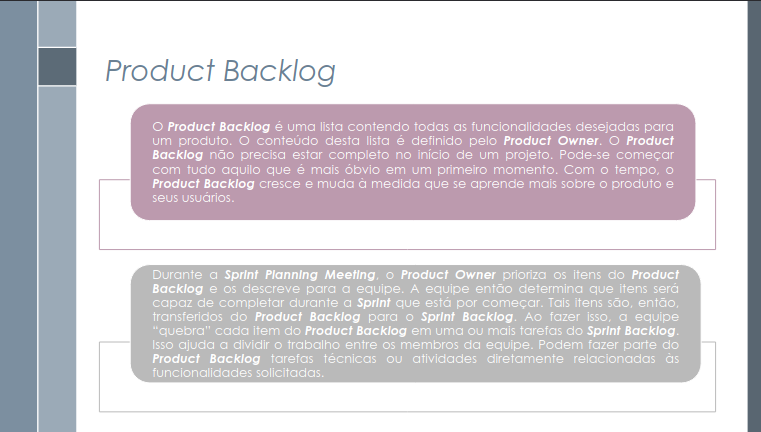

# Backlog

## Introdução

O ***Product Backlog*** representa o registro contínuo e priorizado de todos os requisitos e funcionalidades do projeto que prometem agregar valor comercial para o cliente <a href="#REF1">1</a>. Assim, este artefato é dinâmico, permitindo que novos itens sejam incluídos a qualquer momento, o que facilita a incorporação de mudanças e novas ideias. Além disso, a gestão e a redefinição das prioridades no backlog são responsabilidade do gerente de produto _(Product Owner)_, que o avalia regularmente para otimizar o fluxo de trabalho. <a href="#REF2">2</a>

## Metodologia

A construção do nosso *Product Backlog* teve início com as reuniões realizadas juntamente à <a href="https://requisitos-de-software.github.io/2025.1-FGTS/Elicitacao/Perfil-de-Usuario/">Usuários do aplicativo FGTS</a> com o objetivo registrar as funcionalidades esperadas para o sistema e validar os artefatos já produzidos. A partir dessas interações, as funcionalidades foram modeladas em Histórias de Usuário, utilizando a estrutura "Como um [tipo de usuário], eu desejo [ação] para [benefício]". Para cada história elaborada, foram definidos critérios de aceitação bem delineados, os quais orientaram o desenvolvimento e a validação das entregas.

Com as histórias devidamente documentadas, o PO procedeu à sua priorização segundo a abordagem ***Three Level Scale***, categorizando-as conforme o impacto no produto: Alta, Média ou Baixa prioridade. Em seguida, as histórias foram organizadas de forma hierárquica em temas e épicos, adotando uma estrutura amplamente utilizada em abordagens ágeis como o Scrum e o SAFe (Scaled Agile Framework). Neste documento, foi utilizado o padrão Tema → Épico → Histórias de Usuário, conforme descrito pelos autores Milene Serrano e Maurício Serrano <a id="anchor_2" href="#REF2">2</a>. Por fim, o detalhamento individual de cada história de usuário pode ser consultado diretamente no respectivo artefato vinculado.

<table>
  <thead>
    <tr>
      <th>Participante</th>
      <th>Função</th>
      <th>Histórias</th>
      <th>Data</th>
    </tr>
  </thead>
  <tbody>
    <tr>
      <td><a href="https://github.com/danielle-soaress">Danielle Soares</a></td>
      <td>Produtor do Backlog</td>
      <td>H13-H18</td>
      <td>30/05/2025</td>
    </tr>
    <tr>
      <td><a href="https://github.com/eduardodpms">Eduardo de Pina</a></td>
      <td>Produtor do Backlog</td>
      <td>H37-H42</td>
      <td>01/06/2025</td>
    </tr>
    <tr>
      <td><a href="https://github.com/EnzoEmir">Enzo Emir</a></td>
      <td>Produtor do Backlog</td>
      <td>H01-H06</td>
      <td>01/06/2025</td>
    </tr>
    <tr>
      <td><a href="https://github.com/Leticia-Arisa-K-Higa">Leticia Arisa</a></td>
      <td>Produtor do Backlog</td>
      <td>H25-H30</td>
      <td>30/05/2025</td>
    </tr>
    <tr>
      <td><a href="https://github.com/MM4k">Marcelo Makoto</a></td>
      <td>Produtor do Backlog</td>
      <td>H07-H12</td>
      <td>01/06/2025</td>
    </tr>
    <tr>
      <td><a href="https://github.com/dudaa28">Maria Eduarda</a></td>
      <td>Produtor do Backlog</td>
      <td>H19-H24</td>
      <td>30/05/2025</td>
    </tr>
    <tr>
      <td><a href="https://github.com/VictorPontual">Victor Pontual</a></td>
      <td>Produtor do Backlog</td>
      <td>H31-H36</td>
      <td>01/06/2025</td>
    </tr>
  </tbody>
</table>

Fonte: <a href="https://github.com/danielle-soaress">Danielle Soares</a>

---

## Temas e Épicos

Após a análise e organização dos requisitos coletados para o aplicativo FGTS, foi possível agrupá-los em cinco grandes temas. Esses temas representam o nível mais alto de abstração e refletem as áreas principais de funcionalidade do sistema, facilitando a visualização geral das demandas. Para detalhar os temas, os requisitos foram desmembrados em épicos — agrupamentos de funcionalidades que representam grandes blocos de trabalho, com um nível intermediário de especificação. Abaixo, estão todos os temas e épicos.

### Tema 1: Consulta e Informações da Conta

- **E01 - Consulta de saldo e extrato**  
  *Eu, como usuário, desejo consultar o saldo da conta vinculada e visualizar extratos detalhados para acompanhar meus recursos.*

- **E02 - Consulta de dados pessoais**  
  *Eu, como usuário, desejo visualizar e atualizar meus dados pessoais para manter as informações atualizadas.*

- **E03 - Histórico de movimentações financeiras**  
  *Eu, como usuário, desejo acessar o histórico completo de movimentações financeiras para controle e transparência.*

### Tema 2: Saques e Solicitações

- **E04 - Solicitação e acompanhamento de saques**  
  *Eu, como usuário, desejo solicitar saques e acompanhar o status para gerenciar meus recursos.*

- **E05 - Cancelamento e filtro de saques**  
  *Eu, como usuário, desejo cancelar solicitações de saque e filtrar os saques por tipo e data para facilitar o controle.*

- **E06 - Informação sobre bloqueios e motivos**  
  *Eu, como usuário, desejo ser informado sobre saques bloqueados e seus motivos para entender impedimentos.*

- **E07 - Guias e ajuda para o processo de saque**  
  *Eu, como usuário, desejo contar com guias interativos e seções de ajuda para facilitar a solicitação dos saques.*

### Tema 3: Contas Bancárias

- **E08 - Cadastro e gerenciamento de contas bancárias**  
  *Eu, como usuário, desejo cadastrar e gerenciar múltiplas contas bancárias para facilitar o recebimento dos valores.*

### Tema 4: Comunicação e Suporte

- **E09 - Suporte via chat e canal de atendimento**  
  *Eu, como usuário, desejo ter acesso a suporte via chatbot ou assistente para esclarecer dúvidas rapidamente.*

- **E10 - Notificações e avisos**  
  *Eu, como usuário, desejo receber notificações sobre o status dos saques e outras atualizações importantes.*

### Tema 5: Usabilidade e Acessibilidade

- **E11 - Personalização da interface**  
  *Eu, como usuário, desejo ajustar o tamanho das fontes e utilizar uma interface simples para melhorar a experiência.*

- **E12 - Busca e navegação**  
  *Eu, como usuário, desejo dispor de um campo de busca e navegação clara para encontrar funcionalidades facilmente.*

### Tema 6: Segurança

- **E13 - Acesso Seguro e Autenticação**  
  *Eu, como usuário, desejo acessar o aplicativo de forma segura para garantir a proteção dos meus dados e permitir o uso das funcionalidades.*

---

## Backlog

Tabela 2: Backlog

<table border="1" cellspacing="0" cellpadding="4">
  <thead>
    <tr>
      <th>Tema</th>
      <th>Épico</th>
      <th>História de Usuário</th>
      <th>ID</th>
      <th>Prioridade</th>
      <th>Origem</th>
      <th>Rastreabilidade</th>
    </tr>
  </thead>
  <tbody>
    <tr>
      <td rowspan="6">Consulta e Informações da Conta</td>
      <td rowspan="2"><a href="#tema1">E01</a> - Consulta de saldo e extrato</td>
      <td>Eu, como beneficiário do FGTS, desejo consultar o saldo da minha conta vinculada do FGTS para acompanhar minhas economias e planejar meus próximos passos.</td>
      <td><a href="https://requisitos-de-software.github.io/2025.1-FGTS/Modelagem-II/Historias-De-Usuario/#h15">H15</a></td>
      <td>Alta</td>
      <td><a href="https://requisitos-de-software.github.io/2025.1-FGTS/Elicitacao/Requisitos-elicitados/#requisitos-funcionais">RF03</a></td>
      <td><a href="https://requisitos-de-software.github.io/2025.1-FGTS/Elicitacao/Tecnicas-de-Elicitacao/Entrevista/#tabela-3-requisitos-funcionais">EN05</a></td>
    </tr>
    <tr>
      <td>Eu, como <em>beneficiário do FGTS</em>, desejo <em>poder consultar o saldo da minha conta</em> para <em>verificar a situação do meu FGTS</em></td>
      <td><a href="https://requisitos-de-software.github.io/2025.1-FGTS/Modelagem-II/Historias-De-Usuario/#h38">H38</a></td>
      <td>Alta</td>
      <td><a href="https://requisitos-de-software.github.io/2025.1-FGTS/Elicitacao/Requisitos-elicitados/#requisitos-funcionais">RF07</a></td>
      <td>
        <a href="https://requisitos-de-software.github.io/2025.1-FGTS/Elicitacao/Tecnicas-de-Elicitacao/Introspeccao/#requisitos-funcionais">IS04</a>, 
        <a href="https://requisitos-de-software.github.io/2025.1-FGTS/Elicitacao/Tecnicas-de-Elicitacao/Observacao/">OB04</a>
      </td>
    </tr>
    <tr>
      <td rowspan="2"><a href="#tema1">E02</a> - Consulta de dados pessoais</td>
      <td>Eu, como usuário do aplicativo FGTS, desejo atualizar meus dados pessoais para manter minhas informações corretas e atualizadas no sistema.</td>
      <td><a href="https://requisitos-de-software.github.io/2025.1-FGTS/Modelagem-II/Historias-De-Usuario/#h16">H16</a></td>
      <td>Média</td>
      <td><a href="https://requisitos-de-software.github.io/2025.1-FGTS/Elicitacao/Requisitos-elicitados/#requisitos-funcionais">RF05</a></td>
      <td><a href="https://requisitos-de-software.github.io/2025.1-FGTS/Elicitacao/Tecnicas-de-Elicitacao/Introspeccao/#requisitos-funcionais">IS01</a></td>
    </tr>
    <tr>
      <td>Eu, como <em>beneficiário do FGTS</em>, desejo <em>consultar os meus dados pessoais</em> para <em>garantir que meus dados se encontram em conformidade no sistema.</em></td>
      <td><a href="https://requisitos-de-software.github.io/2025.1-FGTS/Modelagem-II/Historias-De-Usuario/#h37">H37</a></td>
      <td>Alta</td>
      <td><a href="https://requisitos-de-software.github.io/2025.1-FGTS/Elicitacao/Requisitos-elicitados/#requisitos-funcionais">RF06</a></td>
      <td><a href="https://requisitos-de-software.github.io/2025.1-FGTS/Elicitacao/Tecnicas-de-Elicitacao/Introspeccao/#requisitos-funcionais">IS02</a></td>
    </tr>
    <tr>
      <td rowspan="2"><a href="#tema1">E03</a> - Histórico de movimentações financeiras</td>
      <td>Eu, como usuário do sistema FGTS, desejo visualizar o histórico das movimentações financeiras para que eu possa acompanhar e controlar melhor minhas transações.</td>
      <td><a href="https://requisitos-de-software.github.io/2025.1-FGTS/Modelagem-II/Historias-De-Usuario/#h25">H25</a></td>
      <td>Média</td>
      <td><a href="https://requisitos-de-software.github.io/2025.1-FGTS/Elicitacao/Requisitos-elicitados/#requisitos-funcionais">RF12</a></td>
      <td><a href="https://requisitos-de-software.github.io/2025.1-FGTS/Elicitacao/Tecnicas-de-Elicitacao/Introspeccao/#requisitos-funcionais">IS09</a></td>
    </tr>
    <tr>
      <td>Eu, como usuário do sistema FGTS, desejo filtrar o extrato por data para encontrar movimentações em períodos específicos.</td>
      <td><a href="https://requisitos-de-software.github.io/2025.1-FGTS/Modelagem-II/Historias-De-Usuario/#h26">H26</a></td>
      <td>Baixa</td>
      <td><a href="https://requisitos-de-software.github.io/2025.1-FGTS/Elicitacao/Requisitos-elicitados/#requisitos-funcionais">RF13</a></td>
      <td><a href="https://requisitos-de-software.github.io/2025.1-FGTS/Elicitacao/Tecnicas-de-Elicitacao/Introspeccao/#requisitos-funcionais">IS10</a></td>
    </tr>
    <tr>
      <td rowspan="25">Saques e Solicitações</td>
      <td rowspan="4"><a href="#tema2">E06</a> - Informação sobre bloqueios e motivos</td>
      <td>Eu, como beneficiário do FGTS, desejo visualizar informações sobre meus saques bloqueados e os respectivos motivos do bloqueio para entender minha situação e buscar a regularização, se possível.</td>
      <td><a href="https://requisitos-de-software.github.io/2025.1-FGTS/Modelagem-II/Historias-De-Usuario/#h13">H13</a></td>
      <td>Alta</td>
      <td><a href="https://requisitos-de-software.github.io/2025.1-FGTS/Elicitacao/Requisitos-elicitados/#requisitos-funcionais">RF11</a></td>
      <td><a href="https://requisitos-de-software.github.io/2025.1-FGTS/Elicitacao/Tecnicas-de-Elicitacao/Introspeccao/#requisitos-funcionais">IS08</a></td>
    </tr>
    <tr>
      <td>Eu, como aposentado, desejo ver as datas previstas para liberação dos valores do FGTS para me organizar financeiramente e pedir ajuda aos filhos, se necessário.</td>
      <td><a href="https://requisitos-de-software.github.io/2025.1-FGTS/Modelagem-II/Historias-De-Usuario/#historia-03-informar-datas-de-liberacao">H03</a></td>
      <td>Alta</td>
      <td><a href="https://requisitos-de-software.github.io/2025.1-FGTS/Elicitacao/Requisitos-elicitados/#requisitos-funcionais">RF01</a></td>
      <td><a href="https://requisitos-de-software.github.io/2025.1-FGTS/Elicitacao/Tecnicas-de-Elicitacao/Entrevista/#tabela-3-requisitos-funcionais">EN03</a></td>
    </tr>
    <tr>
      <td>Eu, como usuário do sistema FGTS, desejo visualizar um resumo dos meus empregadores anteriores com o botão de consultar contas vinculadas.</td>
      <td><a href="https://requisitos-de-software.github.io/2025.1-FGTS/Modelagem-II/Historias-De-Usuario/#h27">H27</a></td>
      <td>Média</td>
      <td><a href="https://requisitos-de-software.github.io/2025.1-FGTS/Elicitacao/Requisitos-elicitados/#requisitos-funcionais">RF21</a></td>
      <td><a href="https://requisitos-de-software.github.io/2025.1-FGTS/Elicitacao/Tecnicas-de-Elicitacao/Observacao/">OB02</a></td>
    </tr>
    <tr>
      <td>Eu, como usuário do sistema FGTS, desejo visualizar o nome completo dos meus empregadores anteriores para facilitar a identificação correta de cada vínculo empregatício.</td>
      <td><a href="https://requisitos-de-software.github.io/2025.1-FGTS/Modelagem-II/Historias-De-Usuario/#h28">H28</a></td>
      <td>Média</td>
      <td><a href="https://requisitos-de-software.github.io/2025.1-FGTS/Elicitacao/Requisitos-elicitados/#requisitos-funcionais">RF22</a></td>
      <td><a href="https://requisitos-de-software.github.io/2025.1-FGTS/Elicitacao/Tecnicas-de-Elicitacao/Observacao/">OB05</a></td>
    </tr>
    <tr>
      <td rowspan="12"><a href="#tema2">E04</a> - Solicitação e acompanhamento de saques</td>
      <td>Eu, como beneficiário do FGTS, desejo utilizar a funcionalidade de saque-aniversário de forma acessível, para poder sacar o valor disponível sem barreiras de uso.</td>
      <td><a href="https://requisitos-de-software.github.io/2025.1-FGTS/Elicitacao/Tecnicas-de-Elicitacao/Entrevista/#h17">H17</a></td>
      <td>Alta</td>
      <td><a href="https://requisitos-de-software.github.io/2025.1-FGTS/Elicitacao/Requisitos-elicitados/#requisitos-funcionais">RF04</a></td>
      <td>
        <a href="https://requisitos-de-software.github.io/2025.1-FGTS/Elicitacao/Tecnicas-de-Elicitacao/Entrevista/#tabela-3-requisitos-funcionais">EN06</a>, 
        <a href="https://requisitos-de-software.github.io/2025.1-FGTS/Elicitacao/Tecnicas-de-Elicitacao/Storytelling/">ST013</a>, 
        <a href="https://requisitos-de-software.github.io/2025.1-FGTS/Elicitacao/Tecnicas-de-Elicitacao/Storytelling/">ST014</a>
      </td>
    </tr>
    <tr>
      <td>Eu, como usuária que busca agilidade em momentos de desligamento, desejo poder solicitar o saque do FGTS na modalidade Saque-rescisão, para ter acesso rápido ao valor após a demissão.</td>
      <td><a href="https://requisitos-de-software.github.io/2025.1-FGTS/Modelagem-II/Historias-De-Usuario/#historia-12-disponibilidade-de-saque-rescisao">H12</a></td>
      <td>Alta</td>
      <td><a href="https://requisitos-de-software.github.io/2025.1-FGTS/Elicitacao/Requisitos-elicitados/#requisitos-funcionais">RF36</a></td>
      <td>
        <a href="https://requisitos-de-software.github.io/2025.1-FGTS/Elicitacao/Tecnicas-de-Elicitacao/Storytelling/">ST013</a>, 
        <a href="https://requisitos-de-software.github.io/2025.1-FGTS/Elicitacao/Tecnicas-de-Elicitacao/Storytelling/">ST014</a>
      </td>
    <tr>
      <td>Eu, como usuário do sistema, desejo visualizar comentários explicativos sobre o status de cada saque para entender melhor sua situação ou andamento.</td>
      <td><a href="https://requisitos-de-software.github.io/2025.1-FGTS/Elicitacao/Tecnicas-de-Elicitacao/Introspeccao/#h18">H18</a></td>
      <td>Média</td>
      <td><a href="https://requisitos-de-software.github.io/2025.1-FGTS/Elicitacao/Requisitos-elicitados/#requisitos-funcionais">RF39</a></td>
      <td>
        <a href="https://requisitos-de-software.github.io/2025.1-FGTS/Elicitacao/Tecnicas-de-Elicitacao/Introspeccao/#requisitos-funcionais">IS05</a>, 
        <a href="https://requisitos-de-software.github.io/2025.1-FGTS/Elicitacao/Tecnicas-de-Elicitacao/Entrevista/#tabela-3-requisitos-funcionais">EN02</a>
      </td>
    </tr>
    <tr>
      <td>Eu, como técnica de enfermagem, desejo acompanhar a situação do meu saque do FGTS para saber se está aprovado, em análise ou concluído, sem ir à agência.</td>
      <td><a href="https://requisitos-de-software.github.io/2025.1-FGTS/Modelagem-II/Historias-De-Usuario/#historias-de-usuario_1">H01</a></td>
      <td>Alta</td>
      <td><a href="https://requisitos-de-software.github.io/2025.1-FGTS/Elicitacao/Requisitos-elicitados/#requisitos-funcionais">RF08</a></td>
      <td>
        <a href="https://requisitos-de-software.github.io/2025.1-FGTS/Elicitacao/Tecnicas-de-Elicitacao/Introspeccao/#requisitos-funcionais">IS05</a>, 
        <a href="https://requisitos-de-software.github.io/2025.1-FGTS/Elicitacao/Tecnicas-de-Elicitacao/Entrevista/#tabela-3-requisitos-funcionais">EN02</a>
      </td>
    </tr>
    <tr>
      <td>Eu, como trabalhador com direito ao FGTS, desejo solicitar saques através do sistema para acessar meus recursos de forma prática e segura.</td>
      <td><a href="https://requisitos-de-software.github.io/2025.1-FGTS/Modelagem-II/Historias-De-Usuario/#historia-22-solicitacao-de-saques">H22</a></td>
      <td>Alta</td>
      <td><a href="https://requisitos-de-software.github.io/2025.1-FGTS/Elicitacao/Requisitos-elicitados/#requisitos-funcionais">RF28</a></td>
      <td>
        <a href="https://requisitos-de-software.github.io/2025.1-FGTS/Elicitacao/Tecnicas-de-Elicitacao/Entrevista/#tabela-3-requisitos-funcionais">EN01</a>, 
        <a href="https://requisitos-de-software.github.io/2025.1-FGTS/Elicitacao/Tecnicas-de-Elicitacao/Introspeccao/#requisitos-funcionais">IS03</a>, 
        <a href="https://requisitos-de-software.github.io/2025.1-FGTS/Elicitacao/Tecnicas-de-Elicitacao/Storytelling/">ST06</a>, 
        <a href="https://requisitos-de-software.github.io/2025.1-FGTS/Elicitacao/Tecnicas-de-Elicitacao/Observacao/">OB03</a>
      </td>
    </tr>
    <tr>
      <td>Eu, como <em>empregador vinculado ao FGTS</em>, desejo <em>poder consultar o extrato dos meus depósitos</em> para <em>gerenciar o tráfego do FGTS na minha conta.</td>
      <td><a href="https://requisitos-de-software.github.io/2025.1-FGTS/Modelagem-II/Historias-De-Usuario/#h39">H39</a></td>
      <td>Alta</td>
      <td><a href="https://requisitos-de-software.github.io/2025.1-FGTS/Elicitacao/Requisitos-elicitados/#requisitos-funcionais">RF07</a></td>
      <td>
        <a href="https://requisitos-de-software.github.io/2025.1-FGTS/Elicitacao/Tecnicas-de-Elicitacao/Introspeccao/#requisitos-funcionais">IS04</a>, 
        <a href="https://requisitos-de-software.github.io/2025.1-FGTS/Elicitacao/Tecnicas-de-Elicitacao/Observacao/">OB04</a>
      </td>
    </tr>
    <tr>
      <td>Eu, como jovem tecnólogo, desejo solicitar o ressarcimento de valores do PIS/PASEP pelo app para evitar filas, economizar tempo e resolver tudo digitalmente.</td>
      <td><a href="https://requisitos-de-software.github.io/2025.1-FGTS/Modelagem-II/Historias-De-Usuario/#historia-05-solicitacao-de-ressarcimento-do-pispasep">H05</a></td>
      <td>Alta</td>
      <td><a href="https://requisitos-de-software.github.io/2025.1-FGTS/Elicitacao/Requisitos-elicitados/#requisitos-funcionais">RF19</a></td>
      <td> 
        <a href="https://requisitos-de-software.github.io/2025.1-FGTS/Elicitacao/Tecnicas-de-Elicitacao/Introspeccao/#IS_RF">IS17</a>
      </td>
    </tr>
    <tr>
      <td>Eu, como usuário do sistema FGTS, desejo visualizar o histórico de saques realizados para acompanhar e controlar os valores retirados da minha conta.</td>
      <td><a href="https://requisitos-de-software.github.io/2025.1-FGTS/Modelagem-II/Historias-De-Usuario/#h29">H29</a></td>
      <td>Média</td>
      <td><a href="https://requisitos-de-software.github.io/2025.1-FGTS/Elicitacao/Requisitos-elicitados/#requisitos-funcionais">RF23</a></td>
      <td> 
        <a href="https://requisitos-de-software.github.io/2025.1-FGTS/Elicitacao/Tecnicas-de-Elicitacao/Observacao/#OB_RF">OB06</a>
      </td>
    </tr>
    <tr>
      <td>Eu, como técnica de enfermagem que busca praticidade, desejo acessar uma aba exclusiva para solicitação e acompanhamento de saques, para saber se o dinheiro foi liberado sem complicação.</td>
      <td><a href="https://requisitos-de-software.github.io/2025.1-FGTS/Modelagem-II/Historias-De-Usuario/#historia-09-aba-de-solicitacao-e-acompanhamento-de-saques">H09</a></td>
      <td>Alta</td>
      <td><a href="https://requisitos-de-software.github.io/2025.1-FGTS/Elicitacao/Requisitos-elicitados/#requisitos-funcionais">RF24</a></td>
      <td> 
        <a href="https://requisitos-de-software.github.io/2025.1-FGTS/Elicitacao/Tecnicas-de-Elicitacao/Observacao/#OB_RF">OB07</a>
      </td>
    </tr>
    <tr>
      <td>Eu, como usuário do sistema FGTS, desejo enviar documentos digitalizados (PDF ou imagem) para comprovar minha elegibilidade em situações específicas de saque, como doença grave ou aposentadoria.</td>
      <td><a href="https://requisitos-de-software.github.io/2025.1-FGTS/Modelagem-II/Historias-De-Usuario/#h30">H30</a></td>
      <td>Baixa</td>
      <td><a href="https://requisitos-de-software.github.io/2025.1-FGTS/Elicitacao/Requisitos-elicitados/#requisitos-funcionais">RF41</a></td>
      <td> 
        <a href="https://requisitos-de-software.github.io/2025.1-FGTS/Elicitacao/Tecnicas-de-Elicitacao/Brainstorming/#BS_RF">BS03</a>
      </td>
    </tr>
    <tr>
      <td>Eu, como comerciante, desejo receber notificações sobre o andamento do meu saque do FGTS para ser informada de atualizações sem precisar abrir o app constantemente.</td>
      <td><a href="https://requisitos-de-software.github.io/2025.1-FGTS/Modelagem-II/Historias-De-Usuario/#historia-02-notificacoes-sobre-andamento">H02</a></td>
      <td>Alta</td>
      <td><a href="https://requisitos-de-software.github.io/2025.1-FGTS/Elicitacao/Requisitos-elicitados/#requisitos-funcionais">RF38</a></td>
      <td> 
        <a href="https://requisitos-de-software.github.io/2025.1-FGTS/Elicitacao/Tecnicas-de-Elicitacao/Observacao/#OB_RF">IS05</a>
      </td>
    </tr>
    <tr>
      <td>Eu, como trabalhador com direito ao FGTS, desejo agendar um saque para uma data futura para poder me planejar financeiramente com antecedência.</td>
      <td><a href="https://requisitos-de-software.github.io/2025.1-FGTS/Modelagem-II/Historias-De-Usuario/#historia-24-agendamento-de-saque-futuro">H24</a></td>
      <td>Alta</td>
      <td><a href="https://requisitos-de-software.github.io/2025.1-FGTS/Elicitacao/Requisitos-elicitados/#requisitos-funcionais">RF42</a></td>
      <td> 
        <a href="https://requisitos-de-software.github.io/2025.1-FGTS/Elicitacao/Tecnicas-de-Elicitacao/Brainstorming/#BS_RF">BS10</a>
      </td>
    </tr>
    <tr>
      <td rowspan="3"><a href="#tema2">E05</a> - Cancelamento e filtro de saques</td>
      <td>Eu, como usuário do sistema FGTS, desejo filtrar os saques realizados por tipo (ex: aniversário, falecimento, doença) para facilitar a visualização e organização das informações.</td>
      <td><a href="https://requisitos-de-software.github.io/2025.1-FGTS/Modelagem-II/Historias-De-Usuario/#h31">H31</a></td>
      <td>Alta</td>
      <td><a href="https://requisitos-de-software.github.io/2025.1-FGTS/Elicitacao/Requisitos-elicitados/#requisitos-funcionais">RF09</a></td>
      <td><a href="https://requisitos-de-software.github.io/2025.1-FGTS/Elicitacao/Tecnicas-de-Elicitacao/Introspeccao/#requisitos-funcionais">IS06</a></td>
    </tr>
    <tr>
      <td>Eu, como usuário do sistema FGTS, desejo filtrar os saques realizados por tipo (ex: aniversário, falecimento, doença) para facilitar a visualização e organização das informações.</td>
      <td><a href="https://requisitos-de-software.github.io/2025.1-FGTS/Modelagem-II/Historias-De-Usuario/#h32">H32</a></td>
      <td>Média</td>
      <td><a href="https://requisitos-de-software.github.io/2025.1-FGTS/Elicitacao/Requisitos-elicitados/#requisitos-funcionais">RF10</a></td>
      <td><a href="https://requisitos-de-software.github.io/2025.1-FGTS/Elicitacao/Tecnicas-de-Elicitacao/Introspeccao/#requisitos-funcionais">IS07</a></td>
    </tr>
    <tr>
      <td>Eu, como usuário do sistema FGTS, desejo receber uma notificação quando o valor do saque for efetivamente creditado, para que eu saiba quando o recurso estiver disponível.</td>
      <td><a href="https://requisitos-de-software.github.io/2025.1-FGTS/Modelagem-II/Historias-De-Usuario/#h36">H36</a></td>
      <td>Alta</td>
      <td><a href="https://requisitos-de-software.github.io/2025.1-FGTS/Elicitacao/Requisitos-elicitados/#requisitos-funcionais">RF40</a></td>
      <td> 
        <a href="https://requisitos-de-software.github.io/2025.1-FGTS/Elicitacao/Tecnicas-de-Elicitacao/Storytelling/#ST_RF">ST015</a>
      </td>
    </tr>
    <tr>
      <td rowspan="6"><a href="#tema2">E07</a> - Guias e ajuda para o processo de saque</td>
      <td>Eu, como técnica de enfermagem, desejo acessar uma seção de ajuda com orientações sobre FGTS e PIS/PASEP para esclarecer dúvidas rapidamente, sem precisar de atendimento presencial.</td>
      <td><a href="https://requisitos-de-software.github.io/2025.1-FGTS/Modelagem-II/Historias-De-Usuario/#historia-04-acesso-a-secao-de-ajuda">H04</a></td>
      <td>Média</td>
      <td><a href="https://requisitos-de-software.github.io/2025.1-FGTS/Elicitacao/Requisitos-elicitados/#requisitos-funcionais">RF17</a></td>
      <td><a href="https://requisitos-de-software.github.io/2025.1-FGTS/Elicitacao/Tecnicas-de-Elicitacao/Introspeccao/#requisitos-funcionais">IS15</a></td>
    </tr>
    <tr>
      <td>Eu, como <em>beneficiário do FGTS</em>, desejo <em>tirar uma dúvida relacionada ao uso do aplicativo</em> para <em>melhorar a minha usabilidade.</td>
      <td><a href="https://requisitos-de-software.github.io/2025.1-FGTS/Modelagem-II/Historias-De-Usuario/#h41">H41</a></td>
      <td>Média</td>
      <td><a href="https://requisitos-de-software.github.io/2025.1-FGTS/Elicitacao/Requisitos-elicitados/#requisitos-funcionais">RF18</a></td>
      <td><a href="https://requisitos-de-software.github.io/2025.1-FGTS/Elicitacao/Tecnicas-de-Elicitacao/Introspeccao/#requisitos-funcionais">IS16</a></td>
    </tr>
    <tr>
      <td>Eu, como <em>beneficiário do FGTS</em>, desejo <em>ser guiado pelo aplicativo</em> para <em>realizar ações básicas.</em></td>
      <td><a href="https://requisitos-de-software.github.io/2025.1-FGTS/Modelagem-II/Historias-De-Usuario/#h42">H42</a></td>
      <td>Baixa</td>
      <td><a href="https://requisitos-de-software.github.io/2025.1-FGTS/Elicitacao/Requisitos-elicitados/#requisitos-funcionais">RF29</a></td>
      <td><a href="https://requisitos-de-software.github.io/2025.1-FGTS/Elicitacao/Tecnicas-de-Elicitacao/Storytelling/">ST07</a></td>
    </tr>
    <tr>
      <td>Eu, como comerciante que evita processos longos, desejo acessar uma aba com informações como PIS/PASEP, sistemática de saque e ajuda, para entender melhor meus direitos sem perder tempo.</td>
      <td><a href="https://requisitos-de-software.github.io/2025.1-FGTS/Modelagem-II/Historias-De-Usuario/#historia-10-aba-de-informacoes-adicionais">H10</a></td>
      <td>Média</td>
      <td><a href="https://requisitos-de-software.github.io/2025.1-FGTS/Elicitacao/Requisitos-elicitados/#requisitos-funcionais">RF25</a></td>
      <td><a href="https://requisitos-de-software.github.io/2025.1-FGTS/Elicitacao/Tecnicas-de-Elicitacao/Observacao/#OB_RF">OB09</a></td>
    </tr>
    <tr>
      <td>Eu, como usuário que controla ativamente suas finanças, desejo visualizar um resumo dos tipos de saque disponíveis, para escolher a melhor opção para meu perfil.</td>
      <td><a href="https://requisitos-de-software.github.io/2025.1-FGTS/Modelagem-II/Historias-De-Usuario/#historia-11-resumo-dos-tipos-de-saque">H11</a></td>
      <td>Alta</td>
      <td><a href="https://requisitos-de-software.github.io/2025.1-FGTS/Elicitacao/Requisitos-elicitados/#requisitos-funcionais">RF26</a></td>
      <td><a href="https://requisitos-de-software.github.io/2025.1-FGTS/Elicitacao/Tecnicas-de-Elicitacao/Storytelling/#ST_RF">ST02</a></td>
    </tr>
    <tr>
      <td>Eu, como usuário do sistema FGTS, desejo escolher a sistemática de saque que melhor se adequa ao meu perfil para garantir maior controle e previsibilidade sobre os valores a serem recebidos.</td>
      <td><a href="https://requisitos-de-software.github.io/2025.1-FGTS/Modelagem-II/Historias-De-Usuario/#h34">H34</a></td>
      <td>Média</td>
      <td><a href="https://requisitos-de-software.github.io/2025.1-FGTS/Elicitacao/Requisitos-elicitados/#requisitos-funcionais">RF33</a></td>
      <td><a href="https://requisitos-de-software.github.io/2025.1-FGTS/Elicitacao/Tecnicas-de-Elicitacao/Storytelling/#ST_RF">ST012</a></td>
    </tr>
    <tr>
      <td rowspan="3">Contas Bancárias</td>
      <td rowspan="3"><a href="#tema3">E08</a> - Cadastro e gerenciamento de contas bancárias</td>
      <td>Eu, como <em>beneficiário do FGTS</em>, desejo <em>cadastrar uma conta bancária no aplicativo</em> para <em>garantir os meus benefícios do FGTS.</em></td>
      <td><a href="https://requisitos-de-software.github.io/2025.1-FGTS/Modelagem-II/Historias-De-Usuario/#h40">H40</a></td>
      <td>Alta</td>
      <td><a href="https://requisitos-de-software.github.io/2025.1-FGTS/Elicitacao/Requisitos-elicitados/#requisitos-funcionais">RF14</a></td>
      <td>
        <a href="https://requisitos-de-software.github.io/2025.1-FGTS/Elicitacao/Tecnicas-de-Elicitacao/Introspeccao/#requisitos-funcionais">IS11</a>, 
        <a href="https://requisitos-de-software.github.io/2025.1-FGTS/Elicitacao/Tecnicas-de-Elicitacao/Storytelling/">ST05</a>, 
        <a href="https://requisitos-de-software.github.io/2025.1-FGTS/Elicitacao/Tecnicas-de-Elicitacao/Observacao/">OB08</a>
      </td>
    </tr>
    <tr>
      <td>Eu, como usuário do sistema FGTS, desejo visualizar os dados da conta bancária cadastrada para verificar se as informações estão corretas.</td>
      <td><a href="https://requisitos-de-software.github.io/2025.1-FGTS/Modelagem-II/Historias-De-Usuario/#historia-23-visualizacao-de-dados-bancarios">H23</a></td>
      <td>Média</td>
      <td><a href="https://requisitos-de-software.github.io/2025.1-FGTS/Elicitacao/Requisitos-elicitados/#requisitos-funcionais">RF31</a></td>
      <td>
        <a href="https://requisitos-de-software.github.io/2025.1-FGTS/Elicitacao/Tecnicas-de-Elicitacao/Storytelling/">ST010</a>
      </td>
    </tr>
    <tr>
      <td>Eu, como beneficiário do FGTS, desejo cadastrar mais de uma conta bancária de diferentes instituições financeiras para ter flexibilidade na hora de receber meus saques e benefícios.</td>
      <td><a href="https://requisitos-de-software.github.io/2025.1-FGTS/Modelagem-II/Historias-De-Usuario/#h14">H14</a></td>
      <td>Média</td>
      <td><a href="https://requisitos-de-software.github.io/2025.1-FGTS/Elicitacao/Requisitos-elicitados/#requisitos-funcionais">RF35</a></td>
      <td>
        <a href="https://requisitos-de-software.github.io/2025.1-FGTS/Elicitacao/Tecnicas-de-Elicitacao/Introspeccao/#requisitos-funcionais">IS12</a>
      </td>
    </tr>
    <tr>
      <td rowspan="3">Comunicação e Suporte</td>
      <td rowspan="2"><a href="#tema4">E09</a> - Suporte via chat e canal de atendimento</td>
      <td>Eu, como usuário do aplicativo, desejo ter acesso a um canal de suporte ou chatbot para esclarecer minhas dúvidas de forma rápida e eficiente.</td>
      <td><a href="https://requisitos-de-software.github.io/2025.1-FGTS/Modelagem-II/Historias-De-Usuario/#h19">H19</a></td>
      <td>Alta</td>
      <td><a href="https://requisitos-de-software.github.io/2025.1-FGTS/Elicitacao/Requisitos-elicitados/#requisitos-funcionais">RF02</a></td>
      <td>
        <a href="https://requisitos-de-software.github.io/2025.1-FGTS/Elicitacao/Tecnicas-de-Elicitacao/Entrevista/#tabela-3-requisitos-funcionais">EN04</a>
      </td>
    </tr>
    <tr>
      <td>Eu, como aposentado com baixa autonomia digital, desejo que minha filha possa usar um chat no app para tirar dúvidas e resolver problemas, para que não precisemos ir até a agência.</td>
      <td><a href="https://requisitos-de-software.github.io/2025.1-FGTS/Modelagem-II/Historias-De-Usuario/#historia-07-assistente-via-chat">H07</a></td>
      <td>Alta</td>
      <td><a href="https://requisitos-de-software.github.io/2025.1-FGTS/Elicitacao/Requisitos-elicitados/#requisitos-funcionais">RF15</a></td>
      <td>
        <a href="https://requisitos-de-software.github.io/2025.1-FGTS/Elicitacao/Tecnicas-de-Elicitacao/Introspeccao/#requisitos-funcionais">IS13</a>
      </td>
    </tr>
    <tr>
      <td><a href="#tema4">E10</a> - Notificações e avisos</td>
      <td>	Eu, como usuário do sistema FGTS, desejo receber notificações sobre o status da solicitação e confirmação de saque para acompanhar o andamento e ter confirmação das ações realizadas.</td>
      <td><a href="https://requisitos-de-software.github.io/2025.1-FGTS/Modelagem-II/Historias-De-Usuario/#historia-21-notificacoes-de-status-e-saques">H21</a></td>
      <td>Alta</td>
      <td><a href="https://requisitos-de-software.github.io/2025.1-FGTS/Elicitacao/Requisitos-elicitados/#requisitos-funcionais">RF27</a></td>
      <td>
        <a href="https://requisitos-de-software.github.io/2025.1-FGTS/Elicitacao/Tecnicas-de-Elicitacao/Storytelling/">ST03</a>, 
        <a href="https://requisitos-de-software.github.io/2025.1-FGTS/Elicitacao/Tecnicas-de-Elicitacao/Storytelling/">ST09</a>, 
        <a href="https://requisitos-de-software.github.io/2025.1-FGTS/Elicitacao/Tecnicas-de-Elicitacao/Storytelling/">ST015</a>
      </td>
    </tr>
    <tr>
      <td rowspan="3">Usabilidade e Acessibilidade</td>
      <td rowspan="2"><a href="#tema5">E11</a> - Personalização da interface</td>
      <td>	Eu, como usuário, desejo poder ajustar o tamanho das fontes na interface para melhorar a legibilidade e personalizar minha experiência de uso.</td>
      <td><a href="hhttps://requisitos-de-software.github.io/2025.1-FGTS/Modelagem-II/Historias-De-Usuario/#historia-20-ajuste-de-tamanho-de-fonte">H20</a></td>
      <td>Média</td>
      <td><a href="https://requisitos-de-software.github.io/2025.1-FGTS/Elicitacao/Requisitos-elicitados/#requisitos-funcionais">RF30</a></td>
      <td>
        <a href="https://requisitos-de-software.github.io/2025.1-FGTS/Elicitacao/Tecnicas-de-Elicitacao/Storytelling/">ST08</a>
      </td>
    </tr>
    <tr>
      <td>Eu, como usuário do sistema FGTS, desejo contar com uma interface de login simples e objetiva, para facilitar o acesso ao aplicativo mesmo com pouca familiaridade com tecnologia.</td>
      <td><a href="https://requisitos-de-software.github.io/2025.1-FGTS/Modelagem-II/Historias-De-Usuario/#h33">H33</a></td>
      <td>Média</td>
      <td><a href="https://requisitos-de-software.github.io/2025.1-FGTS/Elicitacao/Requisitos-elicitados/#requisitos-funcionais">RF32</a></td>
      <td>
        <a href="https://requisitos-de-software.github.io/2025.1-FGTS/Elicitacao/Tecnicas-de-Elicitacao/Storytelling/#ST_RF">ST011</a>
      </td>
    </tr>
    <tr>
      <td><a href="#tema5">E12</a> - Busca e navegação</td>
      <td>Eu, como usuário avançado que domina tecnologia, desejo buscar rapidamente funcionalidades como extrato ou saque, para navegar de forma mais eficiente no aplicativo.</td>
      <td><a href="https://requisitos-de-software.github.io/2025.1-FGTS/Modelagem-II/Historias-De-Usuario/#historia-08-campo-de-busca">H08</a></td>
      <td>Alta</td>
      <td><a href="https://requisitos-de-software.github.io/2025.1-FGTS/Elicitacao/Requisitos-elicitados/#requisitos-funcionais">RF16</a></td>
      <td>
        <a href="https://requisitos-de-software.github.io/2025.1-FGTS/Elicitacao/Tecnicas-de-Elicitacao/Introspeccao/#requisitos-funcionais">IS14</a>
      </td>
    </tr>
    <tr>
      <td rowspan="2">Segurança</td>
      <td rowspan="2"><a href="#tema6">E13</a> - Acesso Seguro e Autenticação</td>
      <td>Eu, como usuária com pouca autonomia digital (ou comerciante ocupada), desejo fazer login de forma segura no app para proteger meus dados, sem complicações ou esquecimento de senha.</td>
      <td><a href="https://requisitos-de-software.github.io/2025.1-FGTS/Modelagem-II/Historias-De-Usuario/#historia-06-login-seguro">H06</a></td>
      <td>Alta</td>
      <td><a href="https://requisitos-de-software.github.io/2025.1-FGTS/Elicitacao/Requisitos-elicitados/#requisitos-funcionais">RF20</a></td>
      <td>
        <a href="https://requisitos-de-software.github.io/2025.1-FGTS/Elicitacao/Tecnicas-de-Elicitacao/Observacao/#OB_RF">OB01</a>
      </td>
    </tr>
    <tr>
      <td>Eu, como usuário do sistema FGTS, desejo visualizar e aceitar o termo de adesão ao saque-aniversário ou outra sistemática, para formalizar minha escolha e garantir conformidade com as exigências legais.</td>
      <td><a href="https://requisitos-de-software.github.io/2025.1-FGTS/Modelagem-II/Historias-De-Usuario/#h35">H35</a></td>
      <td>Média</td>
      <td><a href="https://requisitos-de-software.github.io/2025.1-FGTS/Elicitacao/Requisitos-elicitados/#requisitos-funcionais">RF34</a></td>
      <td><a href="https://requisitos-de-software.github.io/2025.1-FGTS/Elicitacao/Tecnicas-de-Elicitacao/Storytelling/#ST_RF">ST016</a></td>
    </tr>
  </tbody>
</table>

Fonte: [Danielle Soares](https://github.com/danielle-soaress)

---

## Validação

Validação do Backlog de usuário 13-30 presentes no vídeo a seguir:

Tabela 2: Participantes Validação

    <table>
    <thead>
        <tr>
        <th>Participante</th>
        <th>Backlog</th>
        </tr>
    </thead>
    <tbody>
        <tr>
        <td>Danielle Soares</td>
        <td>H13 à H18</td>
        </tr>
        <tr>
        <td>Leticia Arisa</td>
        <td>H25 à H30</td>
        </tr>
        <tr>
        <td>Maria Eduarda</td>
        <td>H19 à H24</td>
        </tr>
    </tbody>
    </table>

Fonte: [Maria Eduarda](https://github.com/dudaa28)

  <iframe width="560" height="315" src="https://www.youtube.com/embed/eEOLVMj95DE" title="YouTube video player" frameborder="0" allow="accelerometer; autoplay; clipboard-write; encrypted-media; gyroscope; picture-in-picture; web-share" referrerpolicy="strict-origin-when-cross-origin" allowfullscreen></iframe>

Tabela 3: Participantes Validação

Validação dos Backlogs 01-12 e 31-42 presentes no vídeo a seguir:

    <table>
    <thead>
        <tr>
        <th>Participante</th>
        <th>Backlog</th>
        </tr>
    </thead>
    <tbody>
        <tr>
        <td>Enzo Emir</td>
        <td>H01 à H06</td>
        </tr>
        <tr>
        <td>Marcelo Makoto</td>
        <td>H07 à H12</td>
        </tr>
        <tr>
        <td>Victor Pontual</td>
        <td>H30 à H36</td>
        </tr>
        <tr>
        <td>Eduardo de Pina</td>
        <td>H37 à H42</td>
        </tr>
    </tbody>
    </table>

Fonte: [Enzo Emir](https://github.com/EnzoEmir)

  <iframe width="560" height="315" src="https://www.youtube.com/embed/6RrwddCuJdU?si=LqQ4cmGbbc1WM4Nd" title="YouTube video player" frameborder="0" allow="accelerometer; autoplay; clipboard-write; encrypted-media; gyroscope; picture-in-picture; web-share" referrerpolicy="strict-origin-when-cross-origin" allowfullscreen></iframe>

---

##  Referências Bibliográficas

> <a id="REF1" href="#anchor_1">1.</a>  PRESSMAN, Roger S.; MAXIM, Bruce R. Engenharia de software: uma abordagem profissional. 8. ed. Porto Alegre: AMGH, 2016., 95 p.

> <a id="REF2" href="#anchor_2">2.</a>  SERRANO, Milene; SERRANO, Maurício. Requisitos – Aula 15. UnB, 2025. Disponível em: https://aprender3.unb.br/pluginfile.php/3096144/mod_resource/content/1/Requisitos%20-%20Aula%2015a.pdf. Acesso em: 30 de maio 2025.

Figura 1: Foto referência

  

Fonte: [SERRANO, 2025](https://aprender3.unb.br/pluginfile.php/3096144/mod_resource/content/1/Requisitos%20-%20Aula%2015a.pdf) 

---

##  Histórico de Versão

| Versão | Data       | Descrição                                 | Autor(es)                                     | Revisor(es) |
|--------|------------|--------------------------------------------|-----------------------------------------------|-------------|
| `1.0`    | 30/05/2025 | Introdução, Metodologia e Backlog | [Danielle Soares](https://github.com/danielle-soaress) | [Maria Eduarda](https://github.com/dudaa28) |
| `1.1`    | 30/05/2025 | Atualizações no texto da página | [Danielle Soares](https://github.com/danielle-soaress) | [Maria Eduarda](https://github.com/dudaa28) |
| `1.2`    | 30/05/2025 | Adicionando Requisitos Backlog | [Maria Eduarda](https://github.com/dudaa28) | [Danielle Soares](https://github.com/danielle-soaress) |
| `1.3`    | 30/05/2025 | Adicionando H12-H18 ao backlog | [Danielle Soares](https://github.com/danielle-soaress) | [Leticia Arisa](https://github.com/Leticia-Arisa-K-Higa) |
| `1.4`    | 30/05/2025 | Adicionando H25-H30 ao backlog | [Leticia Arisa](https://github.com/Leticia-Arisa-K-Higa) | [Marcelo Makoto](https://github.com/MM4k) |
| `1.5`    | 01/06/2025 | Adicionando H07-H12 ao backlog | [Marcelo Makoto](https://github.com/MM4k) | [Victor Pontual](https://github.com/VictorPontual) |
| `1.6`    | 01/06/2025 | Adicionando H31-H36 ao backlog | [Victor Pontual](https://github.com/VictorPontual) | [Enzo Emir](https://github.com/EnzoEmir) |
| `1.7`    | 01/06/2025 | Adicionando H01-H06 ao backlog | [Enzo Emir](https://github.com/EnzoEmir) | [Danielle Soares](https://github.com/danielle-soaress) |
| `1.8`   | 01/06/2025 | Correções no backlog | [Danielle Soares](https://github.com/danielle-soaress) | [Eduardo de Pina](https://github.com/eduardodpms) |
| `1.9`   | 01/06/2025 | Adicionando histórias 37-42 | [Eduardo de Pina](https://github.com/eduardodpms) | [Maria Eduarda](https://github.com/dudaa28) |
| `2.0`   | 01/06/2025 | Adicionando video Validação | [Maria Eduarda](https://github.com/dudaa28) | [Enzo Emir](https://github.com/EnzoEmir) |
| `2.1`   | 01/06/2025 | Foto referência | [Maria Eduarda](https://github.com/dudaa28) | [Victor Pontual](https://github.com/VictorPontual) |
| `2.2`    | 04/06/2025 | Correção de links | [Eduardo de Pina](https://github.com/eduardodpms) | [Enzo Emir](https://github.com/EnzoEmir) |
| `2.3`    | 21/06/2025 | Adicionando as historias feitas por cada participante | [Enzo Emir](https://github.com/EnzoEmir) | [Marcelo Makoto](https://github.com/MM4k) |
| `2.4`    | 22/06/2025 | Adicionando as datas  | [Enzo Emir](https://github.com/EnzoEmir) | [Leticia Arisa](https://github.com/Leticia-Arisa-K-Higa) |
| `2.5`  | 22/06/2025 | Arrumando referências | [Enzo Emir](https://github.com/EnzoEmir) | [Eduardo de Pina](https://github.com/eduardodpms) |
| `2.6` | 22/06/2025 | Adição de revisores | [Victor Pontual](https://github.com/VictorPontual) | [Marcelo Makoto](https://github.com/MM4k) |