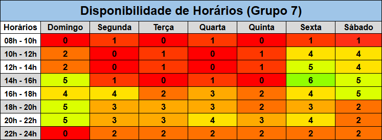

# Plano de Reuniões

## *Heatmap* de Disponibilidade

Foi montado, num momento inicial, um *heatmap* para análise da disponibilidade dos componentes do time de desenvolvimento, a fim de tomar decisões que tangem ao planejamento das reuniões futuras.

## Discussão e Definição

Após análise do *Heatmap* e discussão entre os membros da equipe na reunião do dia [07/04](../atas/ata_07_04.md), foram definidas as datas e horários para que os componentes se reunissem, sem que ninguém fosse prejudicado em razão de indisponibilidade.

Ficou decidido que o número de reuniões semanais seria um número variável de 1 a 2, conforme explicado a seguir:

- Uma reunião fixa na sexta-feira em um horário dentro do intervalo de 12h-18h, na qual seria feito o review das atividades da semana anterior, bem como o planejamento das atividades da semana seguinte;
- Uma reunião que seria feita apenas em caso de necessidade, em sprints de maior demanda, no Sábado, Domingo ou Segunda.

 

## Histórico de Versões 📅

| Versão | Data | Descrição | Autor(es) |  Revisor(es)  |
| :------: | :-------------: | :----------------------------------: | :-------------: | :-------------: |
| `1.0` | 11/04/2025 | Criação do plano de reuniões | [Eduardo de Pina](https://github.com/eduardodpms) | - |