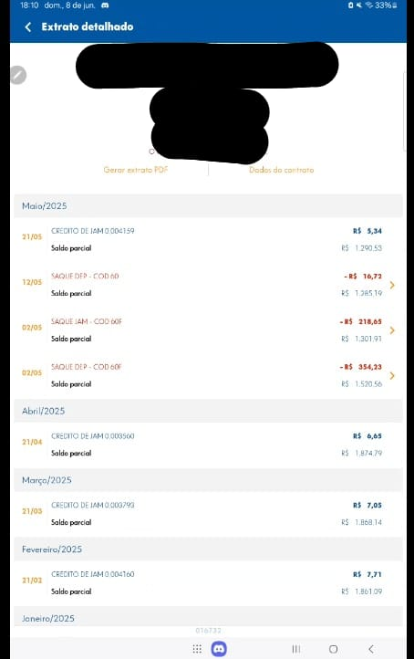
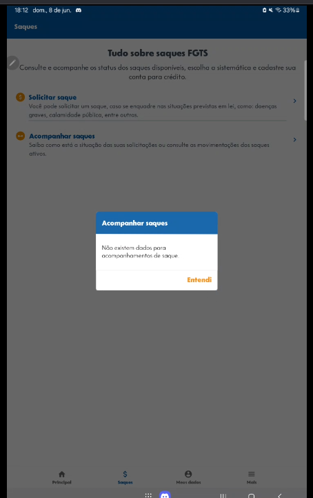
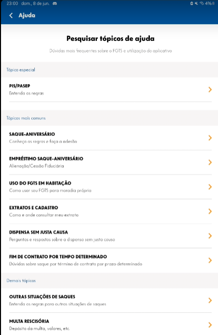
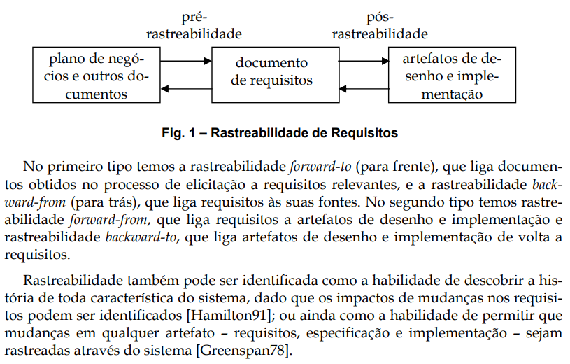
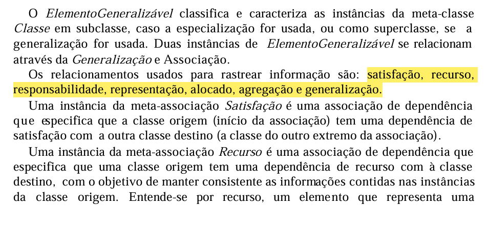

## Introdução

O processo de rastreabilidade de requisitos é uma atividade essencial na engenharia de requisitos, pois permite estabelecer e acompanhar as ligações entre diferentes artefatos produzidos ao longo do desenvolvimento de software. Por meio da rastreabilidade, é possível verificar a origem, a evolução e o impacto de cada requisito, garantindo maior controle, consistência e qualidade na construção do sistema <a href="REF1">1</a>.

Neste documento, serão apresentados os elos ***backward from*** dos requisitos funcionais e não funcionais do sistema FGTS. Essa abordagem demonstrará como os requisitos foram originados e se relacionam com seus artefatos de origem e elicitação. Para isso, a análise e o estabelecimento dessas relações partiram dos cartões de requisitos elaborados ao longo da disciplina, bem como dos registros de técnicas de elicitação e elementos de modelagem (como léxicos, cenários e casos de uso).

## Metodologia

A metodologia aplicada para o rastreamento de requisitos em sua vertente Backward From no sistema FGTS adota como base a proposta de Toranzo, Castro e Mello (2002) <a href="REF2">2</a>. Assim como especificado na página de [Forward From](https://requisitos-de-software.github.io/2025.1-FGTS/Pos-Rastreabilidade/Forward-From/), essa abordagem demonstra especificamente como cada requisito foi originado e quais artefatos contribuíram para sua concepção e evolução inicial.

**Tipos de Elos**

- **Satisfação:** Dependência de uma classe de origem com uma de destino para satisfação.

- **Recurso:** Dependência de uma classe de origem de um recurso de uma classe de destino.

- **Responsabilidade:** Participação, responsabilidade e ação de indivíduos sobre artefatos.

- **Representação:** Modelagem dos requisitos em outras linguagens ou formas.

- **Alocado:** Relação de uma classe de origem com um subsistema (classe de destino).

- **Agregação:** Composição de elementos, partes formando um todo.

**Classificação das Informações**

- **Ambiental:** Informações do contexto externo (leis, objetivos, padrões).

- **Organizacional:** Informações da organização (missão, regras, processos).

- **Gerencial:** Informações de gestão do projeto (objetivos, tarefas, restrições).

- **Desenvolvimento:** Artefatos do desenvolvimento do sistema (requisitos, diagramas, código).

1. **Coleta de artefatos**: foram reunidos os cartões de requisitos funcionais (RF) e requisitos  não funcionais (RNF), registros das técnicas de elicitação (entrevista, introspecção, observação e storytelling) e os elementos de modelagem associados (léxicos, casos de uso, cenários e histórias de usuário, NFR).

2. **Identificação dos elos Backward From**: para cada requisito funcional, foi analisada sua origem, mapeando-se a técnica de elicitação responsável e a ligação com os elementos iniciais de descoberta. O elo *Backward From* indica de onde o requisito foi derivado.

3. **Documentação e organização**: as informações foram organizadas em tabelas, com hiperlinks para os elementos relacionados hospedados na documentação do projeto. Também foi elaborado um cronograma com a participação dos entrevistados no processo de elicitação.

Tabela 1: Modelo da tabela de rastreabilidade

<table>
  <thead>
    <tr>
      <th>Item da Tabela de Rastreabilidade</th>
      <th>Descrição / Conteúdo</th>
    </tr>
  </thead>
  <tbody>
    <tr>
      <td><strong>Descrição do requisito</strong></td>
      <td>Apresenta a especificação textual do requisito em questão.</td>
    </tr>
    <tr>
      <td><strong>Categoria</strong></td>
      <td>Classifica o requisito de acordo com as quatro categorias (Ambiental, Organizacional, Gerencial, Desenvolvimento)</td>
    </tr>
    <tr>
      <td><strong>Elementos</strong></td>
      <td>Lista os artefatos de origem ou outros elementos que contribuíram para a elicitação ou refinamento do requisito.</td>
    </tr>
    <tr>
      <td><strong>Elos Backward-from</strong></td>
      <td>Origem do requisito.</td>
    </tr>
    <tr>
      <td><strong>Print</strong></td>
      <td>Coluna reservada para anexos visuais ou evidências, se aplicável.</td>
    </tr>
  </tbody>
</table>

Fonte: [Leticia Arisa](https://github.com/Leticia-Arisa-K-Higa)

##  Cronograma de Participantes

Tabela 2: Participantes

<table>
  <thead>
    <tr>
      <th>Nome</th>
      <th>Data</th>
      <th>Hora</th>
    </tr>
  </thead>
  <tbody>
    <tr>
      <td> Danielle Soares </td>
      <td> 08/06/2025 </td>
      <td> 01:33 </td>
    </tr>
    <tr>
      <td> Eduardo de Pina </td>
      <td> 08/06/2025 </td>
      <td> 17:30 </td>
    </tr>
    <tr>
      <td> Enzo Emir </td>
      <td> 08/06/2025 </td>
      <td> 13:51 </td>
    </tr>
    <tr>
      <td> Leticia Arisa </td>
      <td> 07/06/2025 </td>
      <td> 17:10 </td>
    </tr>
    <tr>
      <td> Marcelo Makoto </td>
      <td> 07/06/2025 </td>
      <td> 21:13 </td>
    </tr>
    <tr>
      <td> Maria Eduarda </td>
      <td> 08/06/2025 </td>
      <td> 18:26 </td>
    </tr>
    <tr>
      <td> Victor Pontual </td>
      <td> 08/06/2025 </td>
      <td> 13:30 </td>
    </tr>
  </tbody>
</table>

Fonte: [Enzo Emir](https://github.com/EnzoEmir) 

## Sumário

<ul>
  <li>RF01 - Rastreabilidade <a href="#E31">E31</a></li>
  <li>RF03 - Rastreabilidade <a href="#E22">E22</a></li>
  <li>RF04 - Rastreabilidade <a href="#E23">E23</a></li>
  <li>RF05 - Rastreabilidade <a href="#E24">E24</a></li>
  <li>RF06 - Rastreabilidade <a href="#EB56">E56</a></li>
  <li>RF07 - Rastreabilidade <a href="#EB57">E57</a></li>
  <li>RF09 - Rastreabilidade <a href="#E38">E38</a></li>
  <li>RF10 - Rastreabilidade <a href="#E39">E39</a></li>
  <li>RF11 - Rastreabilidade <a href="#E20">E20</a></li>
  <li>RF12 - Rastreabilidade <a href="#E01">E01</a></li>
  <li>RF13 - Rastreabilidade <a href="#E02">E02</a></li>
  <li>RF14 - Rastreabilidade <a href="#EB58">E58</a></li>
  <li>RF15 - Rastreabilidade <a href="#E11">E11</a></li>
  <li>RF16 - Rastreabilidade <a href="#E12">E12</a></li>
  <li>RF17 - Rastreabilidade <a href="#E32">E32</a></li>
  <li>RF18 - Rastreabilidade <a href="#EB59">E59</a></li>
  <li>RF19 - Rastreabilidade <a href="#E33">E33</a></li>
  <li>RF20 - Rastreabilidade <a href="#E34">E34</a></li>
  <li>RF21 - Rastreabilidade <a href="#E03">E03</a></li>
  <li>RF22 - Rastreabilidade <a href="#E04">E04</a></li>
  <li>RF23 - Rastreabilidade <a href="#E05">E05</a></li>
  <li>RF24 - Rastreabilidade <a href="#E13">E13</a></li>
  <li>RF25 - Rastreabilidade <a href="#E14">E14</a></li>
  <li>RF26 - Rastreabilidade <a href="#E15">E15</a></li>
  <li>RF29 - Rastreabilidade <a href="#EB60">E60</a></li>
  <li>RF32 - Rastreabilidade <a href="#E40">E40</a></li>
  <li>RF33 - Rastreabilidade <a href="#E41">E41</a></li>
  <li>RF34 - Rastreabilidade <a href="#E42">E42</a></li>
  <li>RF35 - Rastreabilidade <a href="#E21">E21</a></li>
  <li>RF36 - Rastreabilidade <a href="#E16">E16</a></li>
  <li>RF37 - Rastreabilidade <a href="#EB61">E61</a></li>
  <li>RF38 - Rastreabilidade <a href="#E30">E30</a></li>
  <li>RF39 - Rastreabilidade <a href="#E25">E25</a></li>
  <li>RF40 - Rastreabilidade <a href="#E43">E43</a></li>
  <li>RF41 - Rastreabilidade <a href="#E06">E06</a></li>
  <li>RNF01 - Rastreabilidade <a href="#E26">E26</a></li>
  <li>RNF02 - Rastreabilidade <a href="#E27">E27</a></li>
  <li>RNF03 - Rastreabilidade <a href="#EB62">E62</a></li>
  <li>RNF04 - Rastreabilidade <a href="#E35">E35</a></li>
  <li>RNF05 - Rastreabilidade <a href="#E07">E07</a></li>
  <li>RNF06 - Rastreabilidade <a href="#E17">E17</a></li>
  <li>RNF07 - Rastreabilidade <a href="#E28">E28</a></li>
  <li>RNF08 - Rastreabilidade <a href="#EB63">E63</a></li>
  <li>RNF09 - Rastreabilidade <a href="#E36">E36</a></li>
  <li>RNF10 - Rastreabilidade <a href="#E44">E44</a></li>
  <li>RNF11 - Rastreabilidade <a href="#E18">E18</a></li>
  <li>RNF13 - Rastreabilidade <a href="#E45">E45</a></li>
  <li>RNF14 - Rastreabilidade <a href="#EB64">E64</a></li>
  <li>RNF15 - Rastreabilidade <a href="#E37">E37</a></li>
  <li>RNF16 - Rastreabilidade <a href="#E08">E08</a></li>
  <li>RNF17 - Rastreabilidade <a href="#E09">E09</a></li>
  <li>RNF18 - Rastreabilidade <a href="#E19">E19</a></li>
  <li>RNF20 - Rastreabilidade <a href="#E46">E46</a></li>
  <li>RNF22 - Rastreabilidade <a href="#E10">E10</a></li>
</ul>

## Backward From

###  EB01 - Rastreabilidade Backward From do requisito RF12

Tabela 3: EB01 - Cartão do Requisito Funcional 12

<table>
  <thead>
    <tr>
      <th>Item</th>
      <th>Descrição</th>
    </tr>
  </thead>
  <tbody>
    <tr>
      <td> Descrição do requisito </td>
      <td> O aplicativo deve exibir informações detalhadas sobre o histórico de movimentações financeiras </td>
    </tr>
    <tr>
      <td> Categoria </td>
      <td> Desenvolvimento </td>
    </tr>
    <tr>
      <td> Elementos </td>
      <td> <a href = https://requisitos-de-software.github.io/2025.1-FGTS/Elicitacao/Requisitos-elicitados/#RF>RF12</a>, <a href = https://requisitos-de-software.github.io/2025.1-FGTS/Elicitacao/Tecnicas-de-Elicitacao/Introspeccao/#IS_RF>IS09</a>, <a href = https://requisitos-de-software.github.io/2025.1-FGTS/Modelagem-I/Cenarios/#C07>Cenário 7</a>, <a href = https://requisitos-de-software.github.io/2025.1-FGTS/Modelagem-I/Diagrama/#UC07>Caso de Uso 7</a>, <a href = https://requisitos-de-software.github.io/2025.1-FGTS/Modelagem-I/Lexicos/#L31>L31</a>, <a href = https://requisitos-de-software.github.io/2025.1-FGTS/Modelagem-I/Lexicos/#L32>L32</a>, <a href = https://requisitos-de-software.github.io/2025.1-FGTS/Modelagem-I/Lexicos/#L33>L33</a>, <a href = https://requisitos-de-software.github.io/2025.1-FGTS/Modelagem-II/Historias-De-Usuario/#H25>H25</a> </td>
    </tr>
    <tr>
      <td> Elos Backward-from </td>
      <td> 
      Agregação - O requisito originou-se da Técnica de Introspecção <a href = https://requisitos-de-software.github.io/2025.1-FGTS/Elicitacao/Tecnicas-de-Elicitacao/Introspeccao/#IS_RF>IS09</a>
      </td>
    </tr>
    <tr>
      <td> Print </td>
      <td> Não implementado </td>
    </tr>
  </tbody>
</table>

Fonte: [Leticia Arisa](https://github.com/Leticia-Arisa-K-Higa) 

###  EB02 - Rastreabilidade Backward From do requisito RF13

Tabela 4: EB02 - Cartão do Requisito Funcional 13

<table>
  <thead>
    <tr>
      <th>Item</th>
      <th>Descrição</th>
    </tr>
  </thead>
  <tbody>
    <tr>
      <td> Descrição do requisito </td>
      <td>O aplicativo deve permitir o filtro do extrato por data (mês e ano)</td>
    </tr>
    <tr>
      <td> Categoria </td>
      <td> Desenvolvimento </td>
    </tr>
    <tr>
      <td> Elementos </td>
      <td> <a href = https://requisitos-de-software.github.io/2025.1-FGTS/Elicitacao/Requisitos-elicitados/#RF>RF13</a>, <a href = https://requisitos-de-software.github.io/2025.1-FGTS/Elicitacao/Tecnicas-de-Elicitacao/Introspeccao/#IS_RF>IS10</a>, <a href = https://requisitos-de-software.github.io/2025.1-FGTS/Modelagem-I/Cenarios/#C08>Cenário 8</a>, <a href = https://requisitos-de-software.github.io/2025.1-FGTS/Modelagem-I/Diagrama/#UC08>Caso de Uso 8</a>, <a href = https://requisitos-de-software.github.io/2025.1-FGTS/Modelagem-I/Lexicos/#L34>L34</a>, <a href = https://requisitos-de-software.github.io/2025.1-FGTS/Modelagem-II/Historias-De-Usuario/#H26>H26</a></td>
    </tr>
    <tr>
      <td> Elos Backward-from </td>
      <td> 
      Agregação - O requisito originou-se da Técnica de Introspecção <a href = https://requisitos-de-software.github.io/2025.1-FGTS/Elicitacao/Tecnicas-de-Elicitacao/Introspeccao/#IS_RF>IS10</a>
      </td>
    </tr>
    <tr>
      <td> Print </td>
      <td> Não implementado </td>
    </tr>
  </tbody>
</table>

Fonte: [Leticia Arisa](https://github.com/Leticia-Arisa-K-Higa) 

###  EB03 - Rastreabilidade Backward From do requisito RF21

Tabela 5: EB03 - Cartão do Requisito Funcional 21

<table>
  <thead>
    <tr>
      <th>Item</th>
      <th>Descrição</th>
    </tr>
  </thead>
  <tbody>
    <tr>
      <td> Descrição do requisito </td>
      <td>O aplicativo deve apresentar resumo de empregadores anteriores com botão para consultar contas vinculadas ao FGTS</td>
    </tr>
    <tr>
      <td> Categoria </td>
      <td> Desenvolvimento </td>
    </tr>
    <tr>
      <td> Elementos </td>
      <td> <a href = https://requisitos-de-software.github.io/2025.1-FGTS/Elicitacao/Requisitos-elicitados/#RF>RF21</a>, <a href = https://requisitos-de-software.github.io/2025.1-FGTS/Elicitacao/Tecnicas-de-Elicitacao/Observacao/#OB_RF>OB02</a>, <a href = https://requisitos-de-software.github.io/2025.1-FGTS/Modelagem-II/Historias-De-Usuario/#H27>H27</a></td>
    </tr>
    <tr>
      <td> Elos Backward-from </td>
      <td> 
      Agregação - O requisito originou-se da Técnica de Observação <a href = https://requisitos-de-software.github.io/2025.1-FGTS/Elicitacao/Tecnicas-de-Elicitacao/Observacao/#OB_RF>OB02</a>
      </td>
    </tr>
    <tr>
      <td> Print </td>
      <td>    <a href="https://drive.google.com/drive/folders/1o_RqQ4odSH91H1hIYdRohfDFAy7YZPVf?usp=sharing">Imagem do Aplicativo</a></td>
    </tr>
  </tbody>
</table>

Fonte: [Leticia Arisa](https://github.com/Leticia-Arisa-K-Higa) 

###  EB04 - Rastreabilidade Backward From do requisito RF22

Tabela 6: EB04 - Cartão do Requisito Funcional 22

<table>
  <thead>
    <tr>
      <th>Item</th>
      <th>Descrição</th>
    </tr>
  </thead>
  <tbody>
    <tr>
      <td> Descrição do requisito </td>
      <td>O aplicativo deve mostrar o nome completo dos empregadores anteriores</td>
    </tr>
    <tr>
      <td> Categoria </td>
      <td> Desenvolvimento </td>
    </tr>
    <tr>
      <td> Elementos </td>
      <td> <a href = https://requisitos-de-software.github.io/2025.1-FGTS/Elicitacao/Requisitos-elicitados/#RF>RF22</a>, <a href = https://requisitos-de-software.github.io/2025.1-FGTS/Elicitacao/Tecnicas-de-Elicitacao/Observacao/#OB_RF>OB05</a>, <a href = https://requisitos-de-software.github.io/2025.1-FGTS/Modelagem-II/Historias-De-Usuario/#H28>H28</a></td>
    </tr>
    <tr>
      <td> Elos Backward-from </td>
      <td> 
      Agregação - O requisito originou-se da Técnica de Observação <a href = https://requisitos-de-software.github.io/2025.1-FGTS/Elicitacao/Tecnicas-de-Elicitacao/Observacao/#OB_RF>OB05</a>
      </td>
    </tr>
    <tr>
      <td> Print </td>
      <td> Não implementado </td>
    </tr>
  </tbody>
</table>

Fonte: [Leticia Arisa](https://github.com/Leticia-Arisa-K-Higa) 

###  EB05 - Rastreabilidade Backward From do requisito RF23

Tabela 7: EB05 - Cartão do Requisito Funcional 23

<table>
  <thead>
    <tr>
      <th>Item</th>
      <th>Descrição</th>
    </tr>
  </thead>
  <tbody>
    <tr>
      <td> Descrição do requisito </td>
      <td>O aplicativo deve disponibilizar histórico de saques realizados</td>
    </tr>
    <tr>
      <td> Categoria </td>
      <td> Desenvolvimento </td>
    </tr>
    <tr>
      <td> Elementos </td>
      <td> <a href = https://requisitos-de-software.github.io/2025.1-FGTS/Elicitacao/Requisitos-elicitados/#RF>RF23</a>, <a href = https://requisitos-de-software.github.io/2025.1-FGTS/Elicitacao/Tecnicas-de-Elicitacao/Observacao/#OB_RF>OB06</a>, <a href = https://requisitos-de-software.github.io/2025.1-FGTS/Modelagem-II/Historias-De-Usuario/#H29>H29</a></td>
    </tr>
    <tr>
      <td> Elos Backward-from </td>
      <td> 
      Agregação - O requisito originou-se da Técnica de Observação <a href = https://requisitos-de-software.github.io/2025.1-FGTS/Elicitacao/Tecnicas-de-Elicitacao/Observacao/#OB_RF>OB06</a>
      </td>
    </tr>
    <tr>
      <td> Print </td>
      <td>    <a href="https://drive.google.com/drive/folders/1n7_w4KNa4kdBqEJe-WdbAH4gfrY-Qljr?usp=sharing">Imagem do Aplicativo</a></td>
    </tr>
  </tbody>
</table>

Fonte: [Leticia Arisa](https://github.com/Leticia-Arisa-K-Higa) 

###  EB06 - Rastreabilidade Backward From do requisito RF41

Tabela 8: EB06 - Cartão do Requisito Funcional 41

<table>
  <thead>
    <tr>
      <th>Item</th>
      <th>Descrição</th>
    </tr>
  </thead>
  <tbody>
    <tr>
      <td> Descrição do requisito </td>
      <td>O aplicativo deve possibilitar o envio de documentos digitalizados (PDF, imagem) para comprovação de situações específicas de saque (ex: doença grave, aposentadoria).</td>
    </tr>
    <tr>
      <td> Categoria </td>
      <td> Desenvolvimento </td>
    </tr>
    <tr>
      <td> Elementos </td>
      <td> <a href = https://requisitos-de-software.github.io/2025.1-FGTS/Elicitacao/Requisitos-elicitados/#RF>RF41</a>, <a href = https://requisitos-de-software.github.io/2025.1-FGTS/Elicitacao/Tecnicas-de-Elicitacao/Brainstroming/#BS_RF>BS03</a>, <a href = https://requisitos-de-software.github.io/2025.1-FGTS/Modelagem-II/Historias-De-Usuario/#H30)>H30</a></td>
    </tr>
    <tr>
      <td> Elos Backward-from </td>
      <td> 
      Agregação - O requisito originou-se da Técnica de Brainstrorming <a href = https://requisitos-de-software.github.io/2025.1-FGTS/Elicitacao/Tecnicas-de-Elicitacao/Brainstroming/#BS_RF>BS03</a>
      </td>
    </tr>
    <tr>
      <td> Print </td>
      <td> Não implementado </td>
    </tr>
  </tbody>
</table>

Fonte: [Leticia Arisa](https://github.com/Leticia-Arisa-K-Higa) 

###  EB07 - Rastreabilidade Backward From do requisito RNF05

Tabela 9: EB07 - Cartão do Requisito Não Funcional 05

<table>
  <thead>
    <tr>
      <th>Item</th>
      <th>Descrição</th>
    </tr>
  </thead>
  <tbody>
    <tr>
      <td> Descrição do requisito </td>
      <td>O aplicativo deve ser confiável e evitar falhas ou inconsistências nos processos</td>
    </tr>
    <tr>
      <td> Categoria </td>
      <td> Desenvolvimento </td>
    </tr>
    <tr>
      <td> Elementos </td>
      <td> <a href = https://requisitos-de-software.github.io/2025.1-FGTS/Elicitacao/Requisitos-elicitados/#RNF>RNF05</a>, <a href = https://requisitos-de-software.github.io/2025.1-FGTS/Elicitacao/Tecnicas-de-Elicitacao/Entrevista/#EN_RNF>EN11</a>, <a href = https://requisitos-de-software.github.io/2025.1-FGTS/Modelagem-II/NFR-Framework/#CE05>Cartão de Especificação 5</a></td>
    </tr>
    <tr>
      <td> Elos Backward-from </td>
      <td> 
      Agregação - O requisito originou-se da Técnica de Entrevista <a href = https://requisitos-de-software.github.io/2025.1-FGTS/Elicitacao/Tecnicas-de-Elicitacao/Entrevista/#EN_RNF>EN11</a>
      </td>
    </tr>
  </tbody>
</table>

Fonte: [Leticia Arisa](https://github.com/Leticia-Arisa-K-Higa) 

###  EB08 - Rastreabilidade Backward From do requisito RNF16

Tabela 10: EB08 - Cartão do Requisito Não Funcional 16

<table>
  <thead>
    <tr>
      <th>Item</th>
      <th>Descrição</th>
    </tr>
  </thead>
  <tbody>
    <tr>
      <td> Descrição do requisito </td>
      <td>Garantir tempo de resposta de até 1 segundo para o cadastro da conta bancária</td>
    </tr>
    <tr>
      <td> Categoria </td>
      <td> Desenvolvimento </td>
    </tr>
    <tr>
      <td> Elementos </td>
      <td> <a href = https://requisitos-de-software.github.io/2025.1-FGTS/Elicitacao/Requisitos-elicitados/#RNF>RNF16</a>, <a href = https://requisitos-de-software.github.io/2025.1-FGTS/Elicitacao/Tecnicas-de-Elicitacao/Storytelling/#ST_RNF>ST017</a></td>
    </tr>
    <tr>
      <td> Elos Backward-from </td>
      <td> 
      Agregação - O requisito originou-se da Técnica de Storytelling <a href = https://requisitos-de-software.github.io/2025.1-FGTS/Elicitacao/Tecnicas-de-Elicitacao/Storytelling/#ST_RNF>ST017</a>
      </td>
    </tr>
  </tbody>
</table>

Fonte: [Leticia Arisa](https://github.com/Leticia-Arisa-K-Higa) 

###  EB09 - Rastreabilidade Backward From do requisito RNF17

Tabela 11: EB09 - Cartão do Requisito Não Funcional 17

<table>
  <thead>
    <tr>
      <th>Item</th>
      <th>Descrição</th>
    </tr>
  </thead>
  <tbody>
    <tr>
      <td> Descrição do requisito </td>
      <td>Garantir tempo de resposta de até 1 segundo para a solicitação de saque</td>
    </tr>
    <tr>
      <td> Categoria </td>
      <td> Desenvolvimento </td>
    </tr>
    <tr>
      <td> Elementos </td>
      <td> <a href = https://requisitos-de-software.github.io/2025.1-FGTS/Elicitacao/Requisitos-elicitados/#RNF>RNF17</a>, <a href = https://requisitos-de-software.github.io/2025.1-FGTS/Elicitacao/Tecnicas-de-Elicitacao/Storytelling/#ST_RNF>ST018</a></td>
    </tr>
    <tr>
      <td> Elos Backward-from </td>
      <td> 
      Agregação - O requisito originou-se da Técnica de Storytelling <a href = https://requisitos-de-software.github.io/2025.1-FGTS/Elicitacao/Tecnicas-de-Elicitacao/Storytelling/#ST_RNF>ST018</a>
      </td>
    </tr>
  </tbody>
</table>

Fonte: [Leticia Arisa](https://github.com/Leticia-Arisa-K-Higa) 

###  EB10 - Rastreabilidade Backward From do requisito RNF22

Tabela 12: EB10 - Cartão do Requisito Não Funcional 22

<table>
  <thead>
    <tr>
      <th>Item</th>
      <th>Descrição</th>
    </tr>
  </thead>
  <tbody>
    <tr>
      <td> Descrição do requisito </td>
      <td>A aplicação deve estar em conformidade com diretrizes de acessibilidade, garantindo acesso a pessoas com deficiência visual, auditiva ou motora</td>
    </tr>
    <tr>
      <td> Categoria </td>
      <td> Desenvolvimento </td>
    </tr>
    <tr>
      <td> Elementos </td>
      <td> <a href = https://requisitos-de-software.github.io/2025.1-FGTS/Elicitacao/Requisitos-elicitados/#RNF>RNF22</a>, <a href = https://requisitos-de-software.github.io/2025.1-FGTS/Elicitacao/Tecnicas-de-Elicitacao/Introspeccao/#IS_RNF>IS20</a>, <a href = https://requisitos-de-software.github.io/2025.1-FGTS/Modelagem-I/EspecificacaoSuplementar/#RNF>Especificação Suplementar</a>, <a href = https://requisitos-de-software.github.io/2025.1-FGTS/Modelagem-II/NFR-Framework/#>Cartão de Especificação 6</a><</td>
    </tr>
    <tr>
      <td> Elos Backward-from </td>
      <td> 
      Agregação - O requisito originou-se da Técnica de Introspecção <a href = https://requisitos-de-software.github.io/2025.1-FGTS/Elicitacao/Tecnicas-de-Elicitacao/Introspeccao/#IS_RNF>IS20</a>
      </td>
    </tr>
  </tbody>
</table>

Fonte: [Leticia Arisa](https://github.com/Leticia-Arisa-K-Higa) 

###  EB11 - Rastreabilidade Backward From do requisito RF15

Tabela 13: EB11 - Cartão do Requisito Funcional 15

<table>
  <thead>
    <tr>
      <th>Item</th>
      <th>Descrição</th>
    </tr>
  </thead>
  <tbody>
    <tr>
      <td> Descrição do requisito </td>
      <td>O aplicativo deve permitir que o usuário entre em contato com um assistente via chat</td>
    </tr>
    <tr>
      <td> Categoria </td>
      <td> Desenvolvimento </td>
    </tr>
    <tr>
      <td> Elementos </td>
      <td> <a href = https://requisitos-de-software.github.io/2025.1-FGTS/Elicitacao/Requisitos-elicitados/#requisitos-funcionais>RF15</a>, <a href =https://requisitos-de-software.github.io/2025.1-FGTS/Elicitacao/Tecnicas-de-Elicitacao/Introspeccao/#requisitos-funcionais>IS13</a>, <a href = https://requisitos-de-software.github.io/2025.1-FGTS/Modelagem-I/Cenarios/#cenario-10-contato-com-assistente-via-chat>Cenário 10</a>, <a href = https://requisitos-de-software.github.io/2025.1-FGTS/Modelagem-I/Diagrama/#caso-de-uso-10-is13>Caso de Uso 10</a>, <a href = https://requisitos-de-software.github.io/2025.1-FGTS/Modelagem-I/Lexicos/#l36-chat>L36</a>, <a href = https://requisitos-de-software.github.io/2025.1-FGTS/Modelagem-I/Lexicos/#l37-assistente-virtual>L37</a>, <a href = https://requisitos-de-software.github.io/2025.1-FGTS/Modelagem-I/Lexicos/#l38-mensagem>L38</a>, <a href = https://requisitos-de-software.github.io/2025.1-FGTS/Modelagem-II/Historias-De-Usuario/#historia-07-assistente-via-chat>H07</a></td>
    </tr>
    <tr>
      <td> Elos Backward-from </td>
      <td> 
      Agregação - O requisito originou-se da Técnica de Introspecção <a href =https://requisitos-de-software.github.io/2025.1-FGTS/Elicitacao/Tecnicas-de-Elicitacao/Introspeccao/#requisitos-funcionais>IS13</a>
      </td>
    </tr>
    <tr>
      <td> Print </td>
      <td> Não implementado </td>
    </tr>
  </tbody>
</table>

Fonte: [Marcelo Makoto](https://github.com/MM4k) 

###  EB12 - Rastreabilidade Backward From do requisito RF16

Tabela 14: E12 - Cartão do Requisito Funcional 16

<table>
  <thead>
    <tr>
      <th>Item</th>
      <th>Descrição</th>
    </tr>
  </thead>
  <tbody>
    <tr>
      <td> Descrição do requisito </td>
      <td>O aplicativo deve disponibilizar um campo de busca para facilitar a localização de funcionalidades</td>
    </tr>
    <tr>
      <td> Categoria </td>
      <td> Desenvolvimento </td>
    </tr>
    <tr>
      <td> Elementos </td>
      <td> <a href = https://requisitos-de-software.github.io/2025.1-FGTS/Elicitacao/Requisitos-elicitados/#requisitos-funcionais>RF16</a>, <a href =https://requisitos-de-software.github.io/2025.1-FGTS/Elicitacao/Tecnicas-de-Elicitacao/Introspeccao/#requisitos-funcionais>IS14</a>, <a href = https://requisitos-de-software.github.io/2025.1-FGTS/Modelagem-I/Cenarios/#cenario-11-busca-de-funcionalidades-e-informacoes>Cenário 11</a>, <a href = https://requisitos-de-software.github.io/2025.1-FGTS/Modelagem-I/Diagrama/#caso-de-uso-11-is14>Caso de Uso 11</a>, <a href = https://requisitos-de-software.github.io/2025.1-FGTS/Modelagem-I/Lexicos/#l39-buscar>L39</a>, <a href = https://requisitos-de-software.github.io/2025.1-FGTS/Modelagem-I/Lexicos/#l40-campo-de-busca>L40</a>, <a href = https://requisitos-de-software.github.io/2025.1-FGTS/Modelagem-I/Lexicos/#l41-termo-de-pesquisa>L41</a>, <a href = https://requisitos-de-software.github.io/2025.1-FGTS/Modelagem-II/Historias-De-Usuario/#historia-08-campo-de-busca>H08</a></td>
    </tr>
    <tr>
      <td> Elos Backward-from </td>
      <td> 
      Agregação - O requisito originou-se da Técnica de Introspecção <a href =https://requisitos-de-software.github.io/2025.1-FGTS/Elicitacao/Tecnicas-de-Elicitacao/Introspeccao/#requisitos-funcionais>IS14</a>
      </td>
    </tr>
    <tr>
      <td> Print </td>
      <td> Não implementado </td>
    </tr>
  </tbody>
</table>

Fonte: [Marcelo Makoto](https://github.com/MM4k) 

###  EB13 - Rastreabilidade Backward From do requisito RF24

Tabela 15: E13 - Cartão do Requisito Funcional 24

<table>
  <thead>
    <tr>
      <th>Item</th>
      <th>Descrição</th>
    </tr>
  </thead>
  <tbody>
    <tr>
      <td> Descrição do requisito </td>
      <td>O aplicativo deve ter uma aba dedicada à solicitação e acompanhamento de saques</td>
    </tr>
    <tr>
      <td> Categoria </td>
      <td> Desenvolvimento </td>
    </tr>
    <tr>
      <td> Elementos </td>
      <td> <a href = https://requisitos-de-software.github.io/2025.1-FGTS/Elicitacao/Requisitos-elicitados/#requisitos-funcionais>RF24</a>, <a href = https://requisitos-de-software.github.io/2025.1-FGTS/Elicitacao/Tecnicas-de-Elicitacao/Observacao/#requisitos-funcionais>OB07</a>, <a href = https://requisitos-de-software.github.io/2025.1-FGTS/Modelagem-II/Historias-De-Usuario/#historia-08-campo-de-busca>H08</a></td>
    </tr>
    <tr>
      <td> Elos Backward-from </td>
      <td> 
      Agregação - O requisito originou-se da Técnica de Observação <a href = https://requisitos-de-software.github.io/2025.1-FGTS/Elicitacao/Tecnicas-de-Elicitacao/Observacao/#requisitos-funcionais>OB07</a>
      </td>
    </tr>
    <tr>
      <td> Print </td>
      <td>  </td>
    </tr>
  </tbody>
</table>

Fonte: [Marcelo Makoto](https://github.com/MM4k) 

###  EB14 - Rastreabilidade Backward From do requisito RF25

Tabela 16: E14 - Cartão do Requisito Funcional 25

<table>
  <thead>
    <tr>
      <th>Item</th>
      <th>Descrição</th>
    </tr>
  </thead>
  <tbody>
    <tr>
      <td> Descrição do requisito </td>
      <td>O aplicativo deve incluir aba para itens diversos como PIS/PASEP, convocações, sistemática de saque, ajuda, etc.</td>
    </tr>
    <tr>
      <td> Categoria </td>
      <td> Desenvolvimento </td>
    </tr>
    <tr>
      <td> Elementos </td>
      <td> <a href = https://requisitos-de-software.github.io/2025.1-FGTS/Elicitacao/Requisitos-elicitados/#requisitos-funcionais>RF25</a>, <a href = https://requisitos-de-software.github.io/2025.1-FGTS/Elicitacao/Tecnicas-de-Elicitacao/Observacao/#requisitos-funcionais>OB09</a>, <a href = https://requisitos-de-software.github.io/2025.1-FGTS/Modelagem-II/Historias-De-Usuario/#h10>H10</a></td>
    </tr>
    <tr>
      <td> Elos Backward-from </td>
      <td> 
      Agregação - O requisito originou-se da Técnica de Observação <a href = https://requisitos-de-software.github.io/2025.1-FGTS/Elicitacao/Tecnicas-de-Elicitacao/Observacao/#requisitos-funcionais>OB09</a>
      </td>
    </tr>
    <tr>
      <td> Print </td>
      <td>  </td>
    </tr>
  </tbody>
</table>

Fonte: [Marcelo Makoto](https://github.com/MM4k) 

###  EB15 - Rastreabilidade Backward From do requisito RF26

Tabela 17: E15 - Cartão do Requisito Funcional 26

<table>
  <thead>
    <tr>
      <th>Item</th>
      <th>Descrição</th>
    </tr>
  </thead>
  <tbody>
    <tr>
      <td> Descrição do requisito </td>
      <td>O aplicativo deve exibir um resumo claro dos tipos de saque disponíveis.</td>
    </tr>
    <tr>
      <td> Categoria </td>
      <td> Desenvolvimento </td>
    </tr>
    <tr>
      <td> Elementos </td>
      <td> <a href = https://requisitos-de-software.github.io/2025.1-FGTS/Elicitacao/Requisitos-elicitados/#requisitos-funcionais>RF26</a>, <a href = https://requisitos-de-software.github.io/2025.1-FGTS/Elicitacao/Tecnicas-de-Elicitacao/Storytelling/#requisitos-funcionais>ST02</a>, <a href = https://requisitos-de-software.github.io/2025.1-FGTS/Modelagem-II/Historias-De-Usuario/#historia-11-resumo-dos-tipos-de-saque>H11</a></td>
    </tr>
    <tr>
      <td> Elos Backward-from </td>
      <td> 
      Agregação - O requisito originou-se da Técnica de Storytelling <a href = https://requisitos-de-software.github.io/2025.1-FGTS/Elicitacao/Tecnicas-de-Elicitacao/Storytelling/#requisitos-funcionais>ST02</a>
      </td>
    </tr>
    <tr>
      <td> Print </td>
      <td>  </td>
    </tr>
  </tbody>
</table>

Fonte: [Marcelo Makoto](https://github.com/MM4k) 

###  EB16 - Rastreabilidade Backward From do requisito RF36

Tabela 18: E16 - Cartão do Requisito Funcional 36

<table>
  <thead>
    <tr>
      <th>Item</th>
      <th>Descrição</th>
    </tr>
  </thead>
  <tbody>
    <tr>
      <td> Descrição do requisito </td>
      <td>O aplicativo deve permitir que o usuário solicite o saque da rescisão</td>
    </tr>
    <tr>
      <td> Categoria </td>
      <td> Desenvolvimento </td>
    </tr>
    <tr>
      <td> Elementos </td>
      <td> <a href = https://requisitos-de-software.github.io/2025.1-FGTS/Elicitacao/Requisitos-elicitados/#requisitos-funcionais>RF36</a>, <a href = https://requisitos-de-software.github.io/2025.1-FGTS/Elicitacao/Tecnicas-de-Elicitacao/Storytelling/#requisitos-funcionais>ST013</a>, <a href = https://requisitos-de-software.github.io/2025.1-FGTS/Elicitacao/Tecnicas-de-Elicitacao/Storytelling/#requisitos-funcionais>ST014</a>, <a href = https://requisitos-de-software.github.io/2025.1-FGTS/Modelagem-II/Historias-De-Usuario/#historia-12-disponibilidade-de-saque-rescisao>H12</a></td>
    </tr>
    <tr>
      <td> Elos Backward-from </td>
      <td> 
      Agregação - O requisito originou-se da Técnica de Storytelling <a href = https://requisitos-de-software.github.io/2025.1-FGTS/Elicitacao/Tecnicas-de-Elicitacao/Storytelling/#requisitos-funcionais>ST013</a>, <a href = https://requisitos-de-software.github.io/2025.1-FGTS/Elicitacao/Tecnicas-de-Elicitacao/Storytelling/#requisitos-funcionais>ST014</a>
      </td>
    </tr>
    <tr>
      <td> Print </td>
      <td>  </td>
    </tr>
  </tbody>
</table>

Fonte: [Marcelo Makoto](https://github.com/MM4k) 

###  EB17 - Rastreabilidade Backward From do requisito RNF06

Tabela 19: E17 - Cartão do Requisito Não Funcional 06

<table>
  <thead>
    <tr>
      <th>Item</th>
      <th>Descrição</th>
    </tr>
  </thead>
  <tbody>
    <tr>
      <td> Descrição do requisito </td>
      <td>O aplicativo deve funcionar corretamente mesmo com conexão instável</td>
    </tr>
    <tr>
      <td> Categoria </td>
      <td> Desenvolvimento </td>
    </tr>
    <tr>
      <td> Elementos </td>
      <td> <a href = https://requisitos-de-software.github.io/2025.1-FGTS/Elicitacao/Requisitos-elicitados/#requisitos-funcionais>RNF06</a>, <a href = https://requisitos-de-software.github.io/2025.1-FGTS/Elicitacao/Tecnicas-de-Elicitacao/Entrevista/#tabela-4-requisitos-nao-funcionais>EN12</a>, <a href = https://requisitos-de-software.github.io/2025.1-FGTS/Modelagem-II/NFR-Framework/#cartoes-de-especificacao>Cartão de Especificação 7</a></td>
    </tr>
    <tr>
      <td> Elos Backward-from </td>
      <td> 
      Agregação - O requisito originou-se da Técnica de Entrevista <a href = https://requisitos-de-software.github.io/2025.1-FGTS/Elicitacao/Tecnicas-de-Elicitacao/Entrevista/#tabela-4-requisitos-nao-funcionais>EN12</a>
      </td>
    </tr>
  </tbody>
</table>

Fonte: [Marcelo Makoto](https://github.com/MM4k) 

###  EB18 - Rastreabilidade Backward From do requisito RNF11

Tabela 20: E18 - Cartão do Requisito Não Funcional 11

<table>
  <thead>
    <tr>
      <th>Item</th>
      <th>Descrição</th>
    </tr>
  </thead>
  <tbody>
    <tr>
      <td> Descrição do requisito </td>
      <td>O aplicativo deve proporcionar segurança de dados pessoais</td>
    </tr>
    <tr>
      <td> Categoria </td>
      <td> Desenvolvimento </td>
    </tr>
    <tr>
      <td> Elementos </td>
      <td> <a href = https://requisitos-de-software.github.io/2025.1-FGTS/Elicitacao/Requisitos-elicitados/#requisitos-funcionais>RNF11</a>, <a href = https://requisitos-de-software.github.io/2025.1-FGTS/Elicitacao/Tecnicas-de-Elicitacao/Introspeccao/#requisitos-nao-funcionais>IS23</a>, <a href = https://requisitos-de-software.github.io/2025.1-FGTS/Modelagem-II/NFR-Framework/#cartoes-de-especificacao>Cartão de Especificação 8</a></td>
    </tr>
    <tr>
      <td> Elos Backward-from </td>
      <td> 
      Agregação - O requisito originou-se da Técnica de Introspecção <a href = https://requisitos-de-software.github.io/2025.1-FGTS/Elicitacao/Tecnicas-de-Elicitacao/Introspeccao/#requisitos-nao-funcionais>IS23</a>
      </td>
    </tr>
  </tbody>
</table>

Fonte: [Marcelo Makoto](https://github.com/MM4k) 

###  EB19 - Rastreabilidade Backward From do requisito RNF18

Tabela 21: E19 - Cartão do Requisito Não Funcional 18

<table>
  <thead>
    <tr>
      <th>Item</th>
      <th>Descrição</th>
    </tr>
  </thead>
  <tbody>
    <tr>
      <td> Descrição do requisito </td>
      <td>Garantir tempo de resposta de até 1 segundo para o processo de login</td>
    </tr>
    <tr>
      <td> Categoria </td>
      <td> Desenvolvimento </td>
    </tr>
    <tr>
      <td> Elementos </td>
      <td> <a href = https://requisitos-de-software.github.io/2025.1-FGTS/Elicitacao/Requisitos-elicitados/#requisitos-funcionais>RNF18</a>, <a href = https://requisitos-de-software.github.io/2025.1-FGTS/Elicitacao/Tecnicas-de-Elicitacao/Storytelling/#requisitos-funcionais>ST019</a></td>
    </tr>
    <tr>
      <td> Elos Backward-from </td>
      <td> 
      Agregação - O requisito originou-se da Técnica de Storytelling <a href = https://requisitos-de-software.github.io/2025.1-FGTS/Elicitacao/Tecnicas-de-Elicitacao/Storytelling/#requisitos-funcionais>ST019</a>
      </td>
    </tr>
  </tbody>
</table>

Fonte: [Marcelo Makoto](https://github.com/MM4k) 

###  EB20 - Rastreabilidade Backward From do requisito RF11

Tabela 22: E20 - Cartão do Requisito Funcional 11

<table>
  <thead>
    <tr>
      <th>Item</th>
      <th>Descrição</th>
    </tr>
  </thead>
  <tbody>
    <tr>
      <td> Descrição do requisito </td>
      <td>O aplicativo deve fornecer informações sobre saques bloqueados</td>
    </tr>
    <tr>
      <td> Categoria </td>
      <td> Desenvolvimento </td>
    </tr>
    <tr>
      <td> Elementos </td>
      <td> <a href = https://requisitos-de-software.github.io/2025.1-FGTS/Elicitacao/Requisitos-elicitados/#requisitos-funcionais>RF11</a>, <a href = https://requisitos-de-software.github.io/2025.1-FGTS/Elicitacao/Tecnicas-de-Elicitacao/Introspeccao/#requisitos-funcionais>IS08</a>, <a href = "https://requisitos-de-software.github.io/2025.1-FGTS/Modelagem-II/Historias-De-Usuario/#historia-13-ver-informacoes-sobre-saques-bloqueados">H13</a></td>
    </tr>
    <tr>
      <td> Elos Backward-from </td>
      <td> 
      Agregação - O requisito originou-se da Técnica de Introspecção <a href = https://requisitos-de-software.github.io/2025.1-FGTS/Elicitacao/Tecnicas-de-Elicitacao/Introspeccao/#requisitos-funcionais>IS08</a>
      </td>
    </tr>
    <tr>
      <td> Print </td>
      <td> Não implementado </td>
    </tr>
  </tbody>
</table>

Fonte: [Danielle Soares](https://github.com/danielle-soaress) 

###  EB21 - Rastreabilidade Backward From do requisito RF35

Tabela 23: E21 - Cartão do Requisito Funcional 35

<table>
  <thead>
    <tr>
      <th>Item</th>
      <th>Descrição</th>
    </tr>
  </thead>
  <tbody>
    <tr>
      <td> Descrição do requisito </td>
      <td>O aplicativo deve permitir o cadastro de mais de uma conta bancária de diferentes instituições financeiras</td>
    </tr>
    <tr>
      <td> Categoria </td>
      <td> Desenvolvimento </td>
    </tr>
    <tr>
      <td> Elementos </td>
      <td> <a href = "https://requisitos-de-software.github.io/2025.1-FGTS/Elicitacao/Requisitos-elicitados/#requisitos-funcionais">RF35</a>, <a href = "https://requisitos-de-software.github.io/2025.1-FGTS/Elicitacao/Tecnicas-de-Elicitacao/Introspeccao/#requisitos-funcionais">IS12</a>, <a href = "https://requisitos-de-software.github.io/2025.1-FGTS/Modelagem-II/Historias-De-Usuario/#historia-13-ver-informacoes-sobre-saques-bloqueados">H14</a></td>
    </tr>
    <tr>
      <td> Elos Backward-from </td>
      <td> 
      Agregação - O requisito originou-se da Técnica de Introspecção <a href = "https://requisitos-de-software.github.io/2025.1-FGTS/Elicitacao/Tecnicas-de-Elicitacao/Introspeccao/#requisitos-funcionais">IS12</a>
      </td>
    </tr>
    <tr>
      <td> Print </td>
      <td> Não implementado </td>
    </tr>
  </tbody>
</table>

Fonte: [Danielle Soares](https://github.com/danielle-soaress) 

###  EB22 - Rastreabilidade Backward From do requisito RF03

Tabela 24: E22 - Cartão do Requisito Funcional 3

<table>
  <thead>
    <tr>
      <th>Item</th>
      <th>Descrição</th>
    </tr>
  </thead>
  <tbody>
    <tr>
      <td> Descrição do requisito </td>
      <td>O aplicativo deve permitir consulta ao saldo da conta vinculada do FGTS</td>
    </tr>
    <tr>
      <td> Categoria </td>
      <td> Desenvolvimento </td>
    </tr>
    <tr>
      <td> Elementos </td>
      <td> <a href = https://requisitos-de-software.github.io/2025.1-FGTS/Elicitacao/Requisitos-elicitados/#requisitos-funcionais>RF03</a>, <a href = "https://requisitos-de-software.github.io/2025.1-FGTS/Elicitacao/Tecnicas-de-Elicitacao/Entrevista/#tabela-3-requisitos-funcionais">EN05</a>, <a href = "https://requisitos-de-software.github.io/2025.1-FGTS/Modelagem-II/Historias-De-Usuario/#h15">H15</a></td>
    </tr>
    <tr>
      <td> Elos Backward-from </td>
      <td> 
      Agregação - O requisito originou-se da Técnica de Entrevista <a href = "https://requisitos-de-software.github.io/2025.1-FGTS/Elicitacao/Tecnicas-de-Elicitacao/Entrevista/#tabela-3-requisitos-funcionais">EN05</a>
      </td>
    </tr>
    <tr>
      <td> Print </td>
      <a href="https://drive.google.com/file/d/1KmliL-cdTE3LAo8VknyWbIcKED0gJvlN/view?usp=sharing">Imagem do Aplicativo</a>
    </tr>
  </tbody>
</table>

Fonte: [Danielle Soares](https://github.com/danielle-soaress) 

###  EB23 - Rastreabilidade Backward From do requisito RF04

Tabela 25: E23 - Cartão do Requisito Funcional 04

<table>
  <thead>
    <tr>
      <th>Item</th>
      <th>Descrição</th>
    </tr>
  </thead>
  <tbody>
    <tr>
      <td> Descrição do requisito </td>
      <td>O aplicativo deve disponibilizar saque Saque-Aniversário</td>
    </tr>
    <tr>
      <td> Categoria </td>
      <td> Desenvolvimento </td>
    </tr>
    <tr>
      <td> Elementos </td>
      <td> <a href = https://requisitos-de-software.github.io/2025.1-FGTS/Elicitacao/Requisitos-elicitados/#requisitos-funcionais>RF04</a>, <a href="https://requisitos-de-software.github.io/2025.1-FGTS/Elicitacao/Tecnicas-de-Elicitacao/Entrevista/#EN_RF">EN06</a>, <a href="https://requisitos-de-software.github.io/2025.1-FGTS/Elicitacao/Tecnicas-de-Elicitacao/Storytelling/#ST_RF">ST013</a>, <a href="https://requisitos-de-software.github.io/2025.1-FGTS/Elicitacao/Tecnicas-de-Elicitacao/Storytelling/#ST_RF">ST014</a>, <a href = "https://requisitos-de-software.github.io/2025.1-FGTS/Modelagem-II/Historias-De-Usuario/#h17">H17</a></td>
    </tr>
    <tr>
      <td> Elos Backward-from </td>
      <td> 
      Agregação - O requisito originou-se da Técnica de Entrevista e Storytelling <a href="https://requisitos-de-software.github.io/2025.1-FGTS/Elicitacao/Tecnicas-de-Elicitacao/Entrevista/#EN_RF">EN06</a>, <a href="https://requisitos-de-software.github.io/2025.1-FGTS/Elicitacao/Tecnicas-de-Elicitacao/Storytelling/#ST_RF">ST013</a>, <a href="https://requisitos-de-software.github.io/2025.1-FGTS/Elicitacao/Tecnicas-de-Elicitacao/Storytelling/#ST_RF">ST014</a>
      </td>
    </tr>
    <tr>
      <td> Print </td>
      <td> <a href="https://drive.google.com/file/d/1SyIaadBo-mpkuuhhekpIBaFgsWhzTgX6/view?usp=sharing">Imagem do Aplicativo</a>  </td>
    </tr>
  </tbody>
</table>

Fonte: [Danielle Soares](https://github.com/danielle-soaress) 

###  EB24 - Rastreabilidade Backward From do requisito RF05

Tabela 26: E24 - Cartão do Requisito Funcional 05

<table>
  <thead>
    <tr>
      <th>Item</th>
      <th>Descrição</th>
    </tr>
  </thead>
  <tbody>
    <tr>
      <td> Descrição do requisito </td>
      <td>O aplicativo deve permitir a atualização dos dados pessoais do usuário</td>
    </tr>
    <tr>
      <td> Categoria </td>
      <td> Desenvolvimento </td>
    </tr>
    <tr>
      <td> Elementos </td>
      <td> <a href = https://requisitos-de-software.github.io/2025.1-FGTS/Elicitacao/Requisitos-elicitados/#requisitos-funcionais>RF05</a>, <a href = "https://requisitos-de-software.github.io/2025.1-FGTS/Elicitacao/Tecnicas-de-Elicitacao/Introspeccao/#requisitos-funcionais">IS01</a>, <a href = "https://requisitos-de-software.github.io/2025.1-FGTS/Modelagem-II/Historias-De-Usuario/#h16">H16</a></td>
    </tr>
    <tr>
      <td> Elos Backward-from </td>
      <td> 
      Agregação - O requisito originou-se da Técnica de Intorspecção <a href = "https://requisitos-de-software.github.io/2025.1-FGTS/Elicitacao/Tecnicas-de-Elicitacao/Introspeccao/#requisitos-funcionais">IS01</a>
      </td>
    </tr>
    <tr>
      <td> Print </td>
      <td> <a href="https://drive.google.com/file/d/1KawPm5nEOUUhGUfNHtqlrXZysenJF81Y/view?usp=sharing">Imagem do Aplicativo</a></td>
    </tr>
  </tbody>
</table>

Fonte: [Danielle Soares](https://github.com/danielle-soaress) 

###  EB25 - Rastreabilidade Backward From do requisito RF39

Tabela 27: E25 - Cartão do Requisito Funcional 39

<table>
  <thead>
    <tr>
      <th>Item</th>
      <th>Descrição</th>
    </tr>
  </thead>
  <tbody>
    <tr>
      <td> Descrição do requisito </td>
      <td>O aplicativo deve possuir comentários detalhados sobre cada status do saque</td>
    </tr>
    <tr>
      <td> Categoria </td>
      <td> Desenvolvimento </td>
    </tr>
    <tr>
      <td> Elementos </td>
      <td> <a href = https://requisitos-de-software.github.io/2025.1-FGTS/Elicitacao/Requisitos-elicitados/#requisitos-funcionais>RF39</a>, <a href="https://requisitos-de-software.github.io/2025.1-FGTS/Elicitacao/Tecnicas-de-Elicitacao/Entrevista/#EN_RF">EN02</a>, <a href = "https://requisitos-de-software.github.io/2025.1-FGTS/Modelagem-II/Historias-De-Usuario/#h18">H18</a></td>
    </tr>
    <tr>
      <td> Elos Backward-from </td>
      <td> 
      Agregação - O requisito originou-se da Técnica de Entrevista <a href="https://requisitos-de-software.github.io/2025.1-FGTS/Elicitacao/Tecnicas-de-Elicitacao/Entrevista/#EN_RF">EN02</a>
      </td>
    </tr>
    <tr>
      <td> Print </td>
      <td> Não implementado </td>
    </tr>
  </tbody>
</table>

Fonte: [Danielle Soares](https://github.com/danielle-soaress) 

###  EB26 - Rastreabilidade Backward From do requisito RNF01

Tabela 28: E26 - Cartão do Requisito Não Funcional 01

<table>
  <thead>
    <tr>
      <th>Item</th>
      <th>Descrição</th>
    </tr>
  </thead>
  <tbody>
    <tr>
      <td> Descrição do requisito </td>
      <td>A aplicação deve apresentar uma interface simples, com elementos visuais organizados e linguagem acessível, facilitando a navegação.</td>
    </tr>
    <tr>
      <td> Categoria </td>
      <td> Desenvolvimento </td>
    </tr>
    <tr>
      <td> Elementos </td>
      <td> <a href = https://requisitos-de-software.github.io/2025.1-FGTS/Elicitacao/Requisitos-elicitados/#RNF>RNF01</a>, <a href="https://requisitos-de-software.github.io/2025.1-FGTS/Elicitacao/Tecnicas-de-Elicitacao/Entrevista/#EN_RNF">EN07</a>,
       <a href="https://requisitos-de-software.github.io/2025.1-FGTS/Elicitacao/Tecnicas-de-Elicitacao/Introspeccao/#IS_RNF">IS20</a>,
       <a href="https://requisitos-de-software.github.io/2025.1-FGTS/Elicitacao/Tecnicas-de-Elicitacao/Observacao/#OB_RNF">OB11</a>,
       <a href="https://requisitos-de-software.github.io/2025.1-FGTS/Elicitacao/Tecnicas-de-Elicitacao/Storytelling/#ST_RNF">ST01</a>,
       <a href="https://requisitos-de-software.github.io/2025.1-FGTS/Elicitacao/Tecnicas-de-Elicitacao/Storytelling/#ST_RNF">ST04</a></td>
    </tr>
    <tr>
      <td> Elos Backward-from </td>
      <td> 
      Agregação - O requisito originou-se da Técnica de Entrevista, Introspecção, Observação e Storytelling <a href="https://requisitos-de-software.github.io/2025.1-FGTS/Elicitacao/Tecnicas-de-Elicitacao/Entrevista/#EN_RNF">EN07</a>,
       <a href="https://requisitos-de-software.github.io/2025.1-FGTS/Elicitacao/Tecnicas-de-Elicitacao/Introspeccao/#IS_RNF">IS20</a>,
       <a href="https://requisitos-de-software.github.io/2025.1-FGTS/Elicitacao/Tecnicas-de-Elicitacao/Observacao/#OB_RNF">OB11</a>,
       <a href="https://requisitos-de-software.github.io/2025.1-FGTS/Elicitacao/Tecnicas-de-Elicitacao/Storytelling/#ST_RNF">ST01</a>,
       <a href="https://requisitos-de-software.github.io/2025.1-FGTS/Elicitacao/Tecnicas-de-Elicitacao/Storytelling/#ST_RNF">ST04</a>
      </td>
    </tr>
  </tbody>
</table>

Fonte: [Danielle Soares](https://github.com/danielle-soaress) 

###  EB27 - Rastreabilidade Backward From do requisito RNF02

Tabela 29: E27 - Cartão do Requisito Não Funcional 02

<table>
  <thead>
    <tr>
      <th>Item</th>
      <th>Descrição</th>
    </tr>
  </thead>
  <tbody>
    <tr>
      <td> Descrição do requisito </td>
      <td>O processo de login deve ser simplificado</td>
    </tr>
    <tr>
      <td> Categoria </td>
      <td> Desenvolvimento </td>
    </tr>
    <tr>
      <td> Elementos </td>
      <td> <a href = https://requisitos-de-software.github.io/2025.1-FGTS/Elicitacao/Requisitos-elicitados/#RNF>RNF02</a>, <a href="https://requisitos-de-software.github.io/2025.1-FGTS/Elicitacao/Tecnicas-de-Elicitacao/Entrevista/#EN_RNF">EN08</a></td>
    </tr>
    <tr>
      <td> Elos Backward-from </td>
      <td> 
      Agregação - O requisito originou-se da Técnica de Entrevista <a href="https://requisitos-de-software.github.io/2025.1-FGTS/Elicitacao/Tecnicas-de-Elicitacao/Entrevista/#EN_RNF">EN08</a>
      </td>
    </tr>
  </tbody>
</table>

Fonte: [Danielle Soares](https://github.com/danielle-soaress) 

###  EB28 - Rastreabilidade Backward From do requisito RNF07

Tabela 30: E28 - Cartão do Requisito Não Funcional 07

<table>
  <thead>
    <tr>
      <th>Item</th>
      <th>Descrição</th>
    </tr>
  </thead>
  <tbody>
    <tr>
      <td> Descrição do requisito </td>
      <td>O aplicativo deve fornecer as mesmas funcionalidades para diferentes plataformas e versões</td>
    </tr>
    <tr>
      <td> Categoria </td>
      <td> Desenvolvimento </td>
    </tr>
    <tr>
      <td> Elementos </td>
      <td> <a href = https://requisitos-de-software.github.io/2025.1-FGTS/Elicitacao/Requisitos-elicitados/#RNF>RNF07</a>, <a href="https://requisitos-de-software.github.io/2025.1-FGTS/Elicitacao/Tecnicas-de-Elicitacao/Introspeccao/#IS_RNF">IS18</a></td>
    </tr>
    <tr>
      <td> Elos Backward-from </td>
      <td> 
      Agregação - O requisito originou-se da Técnica de Introspecção  <a href="https://requisitos-de-software.github.io/2025.1-FGTS/Elicitacao/Tecnicas-de-Elicitacao/Introspeccao/#IS_RNF">IS18</a>
      </td>
    </tr>
  </tbody>
</table>

Fonte: [Danielle Soares](https://github.com/danielle-soaress) 

###  EB29 - Rastreabilidade Backward From do requisito RF08

Tabela 31: E29 - Cartão do Requisito Funcional 08

<table>
  <thead>
    <tr>
      <th>Item</th>
      <th>Descrição</th>
    </tr>
  </thead>
  <tbody>
    <tr>
      <td> Descrição do requisito </td>
      <td>O aplicativo deve exibir os status atualizados do saque.</td>
    </tr>
    <tr>
      <td> Categoria </td>
      <td> Desenvolvimento </td>
    </tr>
    <tr>
      <td> Elementos </td>
      <td> 
        <a href="https://requisitos-de-software.github.io/2025.1-FGTS/Elicitacao/Requisitos-elicitados/#rf08">RF08</a>, 
        <a href="https://requisitos-de-software.github.io/2025.1-FGTS/Elicitacao/Tecnicas-de-Elicitacao/Introspeccao/#requisitos-funcionais">IS05</a>, 
        <a href="https://requisitos-de-software.github.io/2025.1-FGTS/Modelagem-II/Historias-De-Usuario/#h01">H01</a>
      </td>
    </tr>
    <tr>
      <td> Elos Backward-from </td>
      <td> 
        Agregação - O requisito originou-se da introspecção <a href="https://requisitos-de-software.github.io/2025.1-FGTS/Elicitacao/Tecnicas-de-Elicitacao/Introspecao/#is05">IS05</a>.
      </td>
    </tr>
    <tr>
      <td> Print </td>
      <td> Não Implementado </td>
    </tr>
  </tbody>
</table>

Fonte: [Enzo Emir](https://github.com/EnzoEmir)

###  EB30 - Rastreabilidade Backward From do requisito RF38

Tabela 32: E30 - Cartão do Requisito Funcional 38

<table>
  <thead>
    <tr>
      <th>Item</th>
      <th>Descrição</th>
    </tr>
  </thead>
  <tbody>
    <tr>
      <td> Descrição do requisito </td>
      <td>O aplicativo deve notificar o usuário sobre o status do saque solicitado.</td>
    </tr>
    <tr>
      <td> Categoria </td>
      <td> Desenvolvimento </td>
    </tr>
    <tr>
      <td> Elementos </td>
      <td> 
        <a href="https://requisitos-de-software.github.io/2025.1-FGTS/Elicitacao/Requisitos-elicitados/#rf38">RF38</a>, 
        <a href="https://requisitos-de-software.github.io/2025.1-FGTS/Elicitacao/Tecnicas-de-Elicitacao/Introspecao/#requisitos-funcionais">IS05</a>, 
        <a href="https://requisitos-de-software.github.io/2025.1-FGTS/Modelagem-II/Historias-De-Usuario/#h02">H02</a>
      </td>
    </tr>
    <tr>
      <td> Elos Backward-from </td>
      <td> 
        Agregação - O requisito originou-se da introspecção <a href="https://requisitos-de-software.github.io/2025.1-FGTS/Elicitacao/Tecnicas-de-Elicitacao/Introspecao/#is05">IS05</a>.
      </td>
    </tr>
    <tr>
      <td> Print </td>
      <td> Não Implementado </td>
    </tr>
  </tbody>
</table>

Fonte: [Enzo Emir](https://github.com/EnzoEmir)

###  EB31 - Rastreabilidade Backward From do requisito RF01

Tabela 33: E31 - Cartão do Requisito Funcional 01

<table>
  <thead>
    <tr>
      <th>Item</th>
      <th>Descrição</th>
    </tr>
  </thead>
  <tbody>
    <tr>
      <td> Descrição do requisito </td>
      <td>O aplicativo deve informar claramente as datas previstas para liberação de valores.</td>
    </tr>
    <tr>
      <td> Categoria </td>
      <td> Desenvolvimento </td>
    </tr>
    <tr>
      <td> Elementos </td>
      <td> 
        <a href="https://requisitos-de-software.github.io/2025.1-FGTS/Elicitacao/Requisitos-elicitados/#rf01">RF01</a>, 
        <a href="https://requisitos-de-software.github.io/2025.1-FGTS/Elicitacao/Tecnicas-de-Elicitacao/Entrevista/#requisitos-funcionais">EN03</a>, 
        <a href="https://requisitos-de-software.github.io/2025.1-FGTS/Modelagem-I/Diagrama/#caso-de-uso-2-en03">Caso de uso 02</a>,
        <a href="https://requisitos-de-software.github.io/2025.1-FGTS/Modelagem-I/Cenarios/#cenario-2-visualizar-data-prevista-para-liberacao-de-valores">Cenário 02</a>,
        <a href="https://requisitos-de-software.github.io/2025.1-FGTS/Modelagem-I/Lexicos/#l10">L10</a>,
        <a href="https://requisitos-de-software.github.io/2025.1-FGTS/Modelagem-I/Lexicos/#l11">L11</a>,
        <a href="https://requisitos-de-software.github.io/2025.1-FGTS/Modelagem-I/Lexicos/#l12">L12</a>,
        <a href="https://requisitos-de-software.github.io/2025.1-FGTS/Modelagem-I/Lexicos/#l13">L13</a>
      </td>
    </tr>
    <tr>
      <td> Elos Backward-from </td>
      <td> 
        Agregação - O requisito originou-se da entrevista <a href="https://requisitos-de-software.github.io/2025.1-FGTS/Elicitacao/Tecnicas-de-Elicitacao/Entrevista/#requisitos-funcionais">EN03</a>.
      </td>
    </tr>
    <tr>
      <td> Print </td>
      <td> Não Implementado </td>
    </tr>
  </tbody>
</table>

Fonte: [Enzo Emir](https://github.com/EnzoEmir)

###  EB32 - Rastreabilidade Backward From do requisito RF17

Tabela 34: E32 - Cartão do Requisito Funcional 17

<table>
  <thead>
    <tr>
      <th>Item</th>
      <th>Descrição</th>
    </tr>
  </thead>
  <tbody>
    <tr>
      <td> Descrição do requisito </td>
      <td>O aplicativo deve conter uma seção de ajuda com orientações sobre o FGTS e PIS/PAESP.</td>
    </tr>
    <tr>
      <td> Categoria </td>
      <td> Desenvolvimento </td>
    </tr>
    <tr>
      <td> Elementos </td>
      <td> 
        <a href="https://requisitos-de-software.github.io/2025.1-FGTS/Elicitacao/Requisitos-elicitados/#rf17">RF17</a>, 
        <a href="https://requisitos-de-software.github.io/2025.1-FGTS/Elicitacao/Tecnicas-de-Elicitacao/Introspeccao/#requisitos-funcionais">IS15</a>, 
        <a href="https://requisitos-de-software.github.io/2025.1-FGTS/Modelagem-II/Historias-De-Usuario/#h04">H04</a>
      </td>
    </tr>
    <tr>
      <td> Elos Backward-from </td>
      <td> 
        Agregação - O requisito originou-se da introspecção <a href="https://requisitos-de-software.github.io/2025.1-FGTS/Elicitacao/Tecnicas-de-Elicitacao/Introspecao/#is15">IS15</a>.
      </td>
    </tr>
    <tr>
      <td> Print </td>
      <td>  </td>
    </tr>
  </tbody>
</table>

Fonte: [Enzo Emir](https://github.com/EnzoEmir)

###  EB33 - Rastreabilidade Backward From do requisito RF19

Tabela 35: E33 - Cartão do Requisito Funcional 19

<table>
  <thead>
    <tr>
      <th>Item</th>
      <th>Descrição</th>
    </tr>
  </thead>
  <tbody>
    <tr>
      <td> Descrição do requisito </td>
      <td>O aplicativo deve permitir a solicitação de ressarcimento de valores do PIS/PASEP.</td>
    </tr>
    <tr>
      <td> Categoria </td>
      <td> Desenvolvimento </td>
    </tr>
    <tr>
      <td> Elementos </td>
      <td> 
        <a href="https://requisitos-de-software.github.io/2025.1-FGTS/Elicitacao/Requisitos-elicitados/#rf19">RF19</a>, 
        <a href="https://requisitos-de-software.github.io/2025.1-FGTS/Elicitacao/Tecnicas-de-Elicitacao/Introspeccao/#requisitos-funcionais">IS17</a>, 
        <a href="https://requisitos-de-software.github.io/2025.1-FGTS/Modelagem-II/Historias-De-Usuario/#h05">H05</a>
      </td>
    </tr>
    <tr>
      <td> Elos Backward-from </td>
      <td> 
        Agregação - O requisito originou-se da introspecção <a href="https://requisitos-de-software.github.io/2025.1-FGTS/Elicitacao/Tecnicas-de-Elicitacao/Introspeccao/#is17">IS17</a>.
      </td>
    </tr>
    <tr>
      <td> Print </td>
      <td>  </td>
    </tr>
  </tbody>
</table>

Fonte: [Enzo Emir](https://github.com/EnzoEmir)

###  EB34 - Rastreabilidade Backward From do requisito RF20

Tabela 36: E34 - Cartão do Requisito Funcional 20

<table>
  <thead>
    <tr>
      <th>Item</th>
      <th>Descrição</th>
    </tr>
  </thead>
  <tbody>
    <tr>
      <td> Descrição do requisito </td>
      <td>O aplicativo deve permitir login seguro pelo aplicativo.</td>
    </tr>
    <tr>
      <td> Categoria </td>
      <td> Desenvolvimento </td>
    </tr>
    <tr>
      <td> Elementos </td>
      <td> 
        <a href="https://requisitos-de-software.github.io/2025.1-FGTS/Elicitacao/Requisitos-elicitados/#rf20">RF20</a>, 
        <a href="https://requisitos-de-software.github.io/2025.1-FGTS/Elicitacao/Tecnicas-de-Elicitacao/Observacao/#requisitos-funcionais">OB01</a>, 
        <a href="https://requisitos-de-software.github.io/2025.1-FGTS/Modelagem-II/Historias-De-Usuario/#h06">H06</a>
      </td>
    </tr>
    <tr>
      <td> Elos Backward-from </td>
      <td> 
        Agregação - O requisito originou-se da observação <a href="https://requisitos-de-software.github.io/2025.1-FGTS/Elicitacao/Tecnicas-de-Elicitacao/Observacao/#ob01">OB01</a>.
      </td>
    </tr>
    <tr>
      <td> Print </td>
      <td>  </td>
    </tr>
  </tbody>
</table>

Fonte: [Enzo Emir](https://github.com/EnzoEmir)

###  EB35 - Rastreabilidade Backward From do requisito RNF04

Tabela 37: E35 - Cartão do Requisito Não Funcional 04

<table>
  <thead>
    <tr>
      <th>Item</th>
      <th>Descrição</th>
    </tr>
  </thead>
  <tbody>
    <tr>
      <td> Descrição do requisito </td>
      <td>Os prazos informados no app devem ser cumpridos fielmente.</td>
    </tr>
    <tr>
      <td> Categoria </td>
      <td> Desenvolvimento </td>
    </tr>
    <tr>
      <td> Elementos </td>
      <td> 
        <a href="https://requisitos-de-software.github.io/2025.1-FGTS/Elicitacao/Requisitos-elicitados/#rnf04">RNF04</a>, 
        <a href="https://requisitos-de-software.github.io/2025.1-FGTS/Elicitacao/Tecnicas-de-Elicitacao/Entrevista/#requisitos-nao-funcionais">EN10</a>, 
        <a href="https://requisitos-de-software.github.io/2025.1-FGTS/Modelagem-II/NFR-Framework/#cartoes-de-especificacao">Cartão de Especificação 9</a>
      </td>
    </tr>
    <tr>
      <td> Elos Backward-from </td>
      <td> 
        Agregação - O requisito originou-se da entrevista <a href="https://requisitos-de-software.github.io/2025.1-FGTS/Elicitacao/Tecnicas-de-Elicitacao/Entrevista/#en10">EN10</a>.
      </td>
    </tr>
    <tr>
      <td> Print </td>
      <td> Não Implementado </td>
    </tr>
  </tbody>
</table>

Fonte: [Enzo Emir](https://github.com/EnzoEmir)

###  EB36 - Rastreabilidade Backward From do requisito RNF09

Tabela 38: E36 - Cartão do Requisito Não Funcional 09

<table>
  <thead>
    <tr>
      <th>Item</th>
      <th>Descrição</th>
    </tr>
  </thead>
  <tbody>
    <tr>
      <td> Descrição do requisito </td>
      <td>O aplicativo deve aplicar princípios de acessibilidade.</td>
    </tr>
    <tr>
      <td> Categoria </td>
      <td> Desenvolvimento </td>
    </tr>
    <tr>
      <td> Elementos </td>
      <td> 
        <a href="https://requisitos-de-software.github.io/2025.1-FGTS/Elicitacao/Requisitos-elicitados/#rnf09">RNF09</a>, 
        <a href="https://requisitos-de-software.github.io/2025.1-FGTS/Elicitacao/Tecnicas-de-Elicitacao/Introspeccao/#requisitos-nao-funcionais">IS21</a>, 
        <a href="https://requisitos-de-software.github.io/2025.1-FGTS/Modelagem-II/NFR-Framework/#cartoes-de-especificacao">Cartão de Especificação 10</a>
      </td>
    </tr>
    <tr>
      <td> Elos Backward-from </td>
      <td> 
        Agregação - O requisito originou-se da introspecção <a href="https://requisitos-de-software.github.io/2025.1-FGTS/Elicitacao/Tecnicas-de-Elicitacao/Introspeccao/#is21">IS21</a>.
      </td>
    </tr>
    <tr>
      <td> Print </td>
      <td> Não Implementado </td>
    </tr>
  </tbody>
</table>

Fonte: [Enzo Emir](https://github.com/EnzoEmir)

###  EB37 - Rastreabilidade Backward From do requisito RNF15

Tabela 39: E37 - Cartão do Requisito Não Funcional 15

<table>
  <thead>
    <tr>
      <th>Item</th>
      <th>Descrição</th>
    </tr>
  </thead>
  <tbody>
    <tr>
      <td> Descrição do requisito </td>
      <td>As informações devem estar organizadas de forma clara e com terminologia compreensível para o usuário.</td>
    </tr>
    <tr>
      <td> Categoria </td>
      <td> Desenvolvimento </td>
    </tr>
    <tr>
      <td> Elementos </td>
      <td> 
        <a href="https://requisitos-de-software.github.io/2025.1-FGTS/Elicitacao/Requisitos-elicitados/#rnf15">RNF15</a>, 
        <a href="https://requisitos-de-software.github.io/2025.1-FGTS/Elicitacao/Tecnicas-de-Elicitacao/Observacao/#requisitos-nao-funcionais">OB13</a>
      </td>
    </tr>
    <tr>
      <td> Elos Backward-from </td>
      <td> 
        Agregação - O requisito originou-se da observação <a href="https://requisitos-de-software.github.io/2025.1-FGTS/Elicitacao/Tecnicas-de-Elicitacao/Observacao/#ob13">OB13</a>.
      </td>
    </tr>
    <tr>
      <td> Print </td>
      <td>  </td>
    </tr>
  </tbody>
</table>

Fonte: [Enzo Emir](https://github.com/EnzoEmir)

###  EB38 - Rastreabilidade Backward From do requisito RF09

Tabela 40: E38 - Cartão do Requisito Funcional 09

<table>
  <thead>
    <tr>
      <th>Item</th>
      <th>Descrição</th>
    </tr>
  </thead>
  <tbody>
    <tr>
      <td> Descrição do requisito </td>
      <td>O sistema deve permitir que o usuário cancele um saque solicitado</td>
    </tr>
    <tr>
      <td> Categoria </td>
      <td> Desenvolvimento </td>
    </tr>
    <tr>
      <td> Elementos </td>
      <td> <a href = https://requisitos-de-software.github.io/2025.1-FGTS/Elicitacao/Requisitos-elicitados/#RF>RF09</a>, <a href="https://requisitos-de-software.github.io/2025.1-FGTS/Elicitacao/Tecnicas-de-Elicitacao/Introspeccao/#IS_RF">IS06, <a href = https://requisitos-de-software.github.io/2025.1-FGTS/Modelagem-I/Cenarios/#C04>Cenário 4</a>, <a href = https://requisitos-de-software.github.io/2025.1-FGTS/Modelagem-I/Diagrama/#UC04>Caso de Uso 4</a>, <a href = https://requisitos-de-software.github.io/2025.1-FGTS/Modelagem-I/Lexicos/#L20>L20</a>,<a href = https://requisitos-de-software.github.io/2025.1-FGTS/Modelagem-I/Lexicos/#L21>L21</a>,<a href = https://requisitos-de-software.github.io/2025.1-FGTS/Modelagem-I/Lexicos/#L22>L22</a>,<a href = https://requisitos-de-software.github.io/2025.1-FGTS/Modelagem-I/Lexicos/#L23>L23</a>,<a href = https://requisitos-de-software.github.io/2025.1-FGTS/Modelagem-I/Lexicos/#L24>L24</a>,<a href = https://requisitos-de-software.github.io/2025.1-FGTS/Modelagem-I/Lexicos/#L25>L25</a>, <a href = https://requisitos-de-software.github.io/2025.1-FGTS/Modelagem-II/Historias-De-Usuario/#H31>H31</a></a></td>
    </tr>
    <tr>
      <td> Elos Backward-from </td>
      <td> 
      Agregação - O requisito originou-se da Técnica de Introspecção  <a href="https://requisitos-de-software.github.io/2025.1-FGTS/Elicitacao/Tecnicas-de-Elicitacao/Introspeccao/#IS_RF">IS06</a>
      </td>
    </tr>
  </tbody>
</table>

Fonte: [Victor Pontual](https://github.com/VictorPontual) 

###  EB39 - Rastreabilidade Backward From do requisito RF10

Tabela 41: E39 - Cartão do Requisito Funcional 10

<table>
  <thead>
    <tr>
      <th>Item</th>
      <th>Descrição</th>
    </tr>
  </thead>
  <tbody>
    <tr>
      <td> Descrição do requisito </td>
      <td>O aplicativo deve permitir o filtro dos saques por tipo (ex: aniversário, doença, falecimento)</td>
    </tr>
    <tr>
      <td> Categoria </td>
      <td> Desenvolvimento </td>
    </tr>
    <tr>
      <td> Elementos </td>
      <td> <a href = https://requisitos-de-software.github.io/2025.1-FGTS/Elicitacao/Requisitos-elicitados/#RF>RF10</a>, <a href="https://requisitos-de-software.github.io/2025.1-FGTS/Elicitacao/Tecnicas-de-Elicitacao/Introspeccao/#IS_RF">IS07, <a href = https://requisitos-de-software.github.io/2025.1-FGTS/Modelagem-I/Cenarios/#C05>Cenário 5</a>, <a href = https://requisitos-de-software.github.io/2025.1-FGTS/Modelagem-I/Diagrama/#UC05>Caso de Uso 5</a>, <a href = https://requisitos-de-software.github.io/2025.1-FGTS/Modelagem-I/Lexicos/#L26>L26</a>,<a href = https://requisitos-de-software.github.io/2025.1-FGTS/Modelagem-I/Lexicos/#L27>L27</a>,<a href = https://requisitos-de-software.github.io/2025.1-FGTS/Modelagem-I/Lexicos/#L28>L28</a>,<a href = https://requisitos-de-software.github.io/2025.1-FGTS/Modelagem-I/Lexicos/#L29>L29</a>, <a href = https://requisitos-de-software.github.io/2025.1-FGTS/Modelagem-II/Historias-De-Usuario/#H32>H32</a></a></td>
    </tr>
    <tr>
      <td> Elos Backward-from </td>
      <td> 
      Agregação - O requisito originou-se da Técnica de Introspecção  <a href="https://requisitos-de-software.github.io/2025.1-FGTS/Elicitacao/Tecnicas-de-Elicitacao/Introspeccao/#IS_RF">IS07</a>
      </td>
    </tr>
  </tbody>
</table>

Fonte: [Victor Pontual](https://github.com/VictorPontual) 

###  EB40 - Rastreabilidade Backward From do requisito RF32

Tabela 42: E40 - Cartão do Requisito Funcional 32

<table>
  <thead>
    <tr>
      <th>Item</th>
      <th>Descrição</th>
    </tr>
  </thead>
  <tbody>
    <tr>
      <td> Descrição do requisito </td>
      <td>O aplicativo deve oferecer uma interface de login simples.</td>
    </tr>
    <tr>
      <td> Categoria </td>
      <td> Desenvolvimento </td>
    </tr>
    <tr>
      <td> Elementos </td>
      <td> <a href = https://requisitos-de-software.github.io/2025.1-FGTS/Elicitacao/Requisitos-elicitados/#RF>RF32</a>, <a href="https://requisitos-de-software.github.io/2025.1-FGTS/Elicitacao/Tecnicas-de-Elicitacao/Storytelling/#ST_RF">ST011, <a href = https://requisitos-de-software.github.io/2025.1-FGTS/Modelagem-II/Historias-De-Usuario/#H33>H33</a></a></td>
    </tr>
    <tr>
      <td> Elos Backward-from </td>
      <td> 
      Agregação - O requisito originou-se da Técnica de Storytelling  <a href="https://requisitos-de-software.github.io/2025.1-FGTS/Elicitacao/Tecnicas-de-Elicitacao/Storytelling/#ST_RF">ST011</a>
      </td>
    </tr>
  </tbody>
</table>

Fonte: [Victor Pontual](https://github.com/VictorPontual) 

###  EB41 - Rastreabilidade Backward From do requisito RF33

Tabela 43: E41 - Cartão do Requisito Funcional 33

<table>
  <thead>
    <tr>
      <th>Item</th>
      <th>Descrição</th>
    </tr>
  </thead>
  <tbody>
    <tr>
      <td> Descrição do requisito </td>
      <td>O aplicativo deve disponibilizar uma página para escolha da sistemática de saque.</td>
    </tr>
    <tr>
      <td> Categoria </td>
      <td> Desenvolvimento </td>
    </tr>
    <tr>
      <td> Elementos </td>
      <td> <a href = https://requisitos-de-software.github.io/2025.1-FGTS/Elicitacao/Requisitos-elicitados/#RF>RF33</a>, <a href="https://requisitos-de-software.github.io/2025.1-FGTS/Elicitacao/Tecnicas-de-Elicitacao/Storytelling/#ST_RF">ST012</a>, <a href = https://requisitos-de-software.github.io/2025.1-FGTS/Modelagem-II/Historias-De-Usuario/#H34>H34</a></td>
    </tr>
    <tr>
      <td> Elos Backward-from </td>
      <td> 
      Agregação - O requisito originou-se da Técnica de Storytelling  <a href="https://requisitos-de-software.github.io/2025.1-FGTS/Elicitacao/Tecnicas-de-Elicitacao/Storytelling/#ST_RF">ST012</a>
      </td>
    </tr>
  </tbody>
</table>

Fonte: [Victor Pontual](https://github.com/VictorPontual) 

###  EB42 - Rastreabilidade Backward From do requisito RF34

Tabela 44: E42 - Cartão do Requisito Funcional 34

<table>
  <thead>
    <tr>
      <th>Item</th>
      <th>Descrição</th>
    </tr>
  </thead>
  <tbody>
    <tr>
      <td> Descrição do requisito </td>
      <td>O aplicativo deve exibir o termo de adesão ao usuário no primeiro acesso ao aplicativo</td>
    </tr>
    <tr>
      <td> Categoria </td>
      <td> Desenvolvimento </td>
    </tr>
    <tr>
      <td> Elementos </td>
      <td> <a href = https://requisitos-de-software.github.io/2025.1-FGTS/Elicitacao/Requisitos-elicitados/#RF>RF34</a>, <a href="https://requisitos-de-software.github.io/2025.1-FGTS/Elicitacao/Tecnicas-de-Elicitacao/Storytelling/#ST_RF">ST016</a>, <a href = https://requisitos-de-software.github.io/2025.1-FGTS/Modelagem-II/Historias-De-Usuario/#H35>H35</a></td>
    </tr>
    <tr>
      <td> Elos Backward-from </td>
      <td> 
      Agregação - O requisito originou-se da Técnica de Storytelling  <a href="https://requisitos-de-software.github.io/2025.1-FGTS/Elicitacao/Tecnicas-de-Elicitacao/Storytelling/#ST_RF">ST016</a>
      </td>
    </tr>
  </tbody>
</table>

Fonte: [Victor Pontual](https://github.com/VictorPontual) 

###  EB43 - Rastreabilidade Backward From do requisito RF40

Tabela 45: E43 - Cartão do Requisito Funcional 40

<table>
  <thead>
    <tr>
      <th>Item</th>
      <th>Descrição</th>
    </tr>
  </thead>
  <tbody>
    <tr>
      <td> Descrição do requisito </td>
      <td>O aplicativo deve enviar notificação ao usuário quando o saque for recebido.</td>
    </tr>
    <tr>
      <td> Categoria </td>
      <td> Desenvolvimento </td>
    </tr>
    <tr>
      <td> Elementos </td>
      <td> <a href = https://requisitos-de-software.github.io/2025.1-FGTS/Elicitacao/Requisitos-elicitados/#RF>RF40</a>, <a href="https://requisitos-de-software.github.io/2025.1-FGTS/Elicitacao/Tecnicas-de-Elicitacao/Storytelling/#ST_RF">ST015</a>, <a href = https://requisitos-de-software.github.io/2025.1-FGTS/Modelagem-II/Historias-De-Usuario/#H36>H36</a></td>
    </tr>
    <tr>
      <td> Elos Backward-from </td>
      <td> 
      Agregação - O requisito originou-se da Técnica de Storytelling  <a href="https://requisitos-de-software.github.io/2025.1-FGTS/Elicitacao/Tecnicas-de-Elicitacao/Storytelling/#ST_RF">ST015</a>
      </td>
    </tr>
  </tbody>
</table>

Fonte: [Victor Pontual](https://github.com/VictorPontual) 

###  EB44 - Rastreabilidade Backward From do requisito RNF10

Tabela 46: E44 - Cartão do Requisito Não Funcional 10

<table>
  <thead>
    <tr>
      <th>Item</th>
      <th>Descrição</th>
    </tr>
  </thead>
  <tbody>
    <tr>
      <td> Descrição do requisito </td>
      <td>O aplicativo deve estar disponível para outras plataformas, como web</td>
    </tr>
    <tr>
      <td> Categoria </td>
      <td> Desenvolvimento </td>
    </tr>
    <tr>
      <td> Elementos </td>
      <td> <a href = https://requisitos-de-software.github.io/2025.1-FGTS/Elicitacao/Requisitos-elicitados/#RNF>RNF10</a>, <a href="https://requisitos-de-software.github.io/2025.1-FGTS/Elicitacao/Tecnicas-de-Elicitacao/Introspeccao/#requisitos-nao-funcionais">IS22</a>, <a href = https://requisitos-de-software.github.io/2025.1-FGTS/Modelagem-II/NFR-Framework/#cartoes-de-especificacao>Cartão de Especificação 8</a></td>
    </tr>
    <tr>
      <td> Elos Backward-from </td>
      <td> 
      Agregação - O requisito originou-se da Técnica de Instrospecção  <a href="https://requisitos-de-software.github.io/2025.1-FGTS/Elicitacao/Tecnicas-de-Elicitacao/Introspeccao/#requisitos-nao-funcionais">IS22</a>
      </td>
    </tr>
  </tbody>
</table>

Fonte: [Victor Pontual](https://github.com/VictorPontual) 

###  EB45 - Rastreabilidade Backward From do requisito RNF13

Tabela 47: E45 - Cartão do Requisito Não Funcional 13

<table>
  <thead>
    <tr>
      <th>Item</th>
      <th>Descrição</th>
    </tr>
  </thead>
  <tbody>
    <tr>
      <td> Descrição do requisito </td>
      <td>O sistema deve garantir segurança firme com verificação de dados pelo usuário</td>
    </tr>
    <tr>
      <td> Categoria </td>
      <td> Desenvolvimento </td>
    </tr>
    <tr>
      <td> Elementos </td>
      <td> <a href = https://requisitos-de-software.github.io/2025.1-FGTS/Elicitacao/Requisitos-elicitados/#RNF>RNF13</a>, <a href = https://requisitos-de-software.github.io/2025.1-FGTS/Elicitacao/Tecnicas-de-Elicitacao/Observacao/#requisitos-nao-funcionais>OB10</a>, <a href = https://requisitos-de-software.github.io/2025.1-FGTS/Modelagem-II/NFR-Framework/#cartoes-de-especificacao>Cartão de Especificação 14</a></td>
    </tr>
    <tr>
      <td> Elos Backward-from </td>
      <td> 
      Agregação - O requisito originou-se da Técnica de Observação <a href = https://requisitos-de-software.github.io/2025.1-FGTS/Elicitacao/Tecnicas-de-Elicitacao/Observacao/#requisitos-nao-funcionais>OB10</a>
      </td>
    </tr>
  </tbody>
</table>

Fonte: [Victor Pontual](https://github.com/VictorPontual) 

###  EB46 - Rastreabilidade Backward From do requisito RNF20

Tabela 48: E46 - Cartão do Requisito Não Funcional 20

<table>
  <thead>
    <tr>
      <th>Item</th>
      <th>Descrição</th>
    </tr>
  </thead>
  <tbody>
    <tr>
      <td> Descrição do requisito </td>
      <td>Saque-rescisão deve atender princípios de acessibilidade</td>
    </tr>
    <tr>
      <td> Categoria </td>
      <td> Desenvolvimento </td>
    </tr>
    <tr>
      <td> Elementos </td>
      <td> <a href = https://requisitos-de-software.github.io/2025.1-FGTS/Elicitacao/Requisitos-elicitados/#RNF>RNF20</a>, <a href = https://requisitos-de-software.github.io/2025.1-FGTS/Elicitacao/Tecnicas-de-Elicitacao/Entrevista/#EN_RF>EN06</a></td>
    </tr>
    <tr>
      <td> Elos Backward-from </td>
      <td> 
      Agregação - O requisito originou-se da Técnica de Entrevista <a href = https://requisitos-de-software.github.io/2025.1-FGTS/Elicitacao/Tecnicas-de-Elicitacao/Entrevista/#EN_RF>EN06</a>
      </td>
    </tr>
  </tbody>
</table>

Fonte: [Victor Pontual](https://github.com/VictorPontual) 

###  EB47 - Rastreabilidade Backward From do requisito RF02

Tabela 49: EB47 - Cartão do Requisito Funcional 02

<table>
  <thead>
    <tr>
      <th>Item</th>
      <th>Descrição</th>
    </tr>
  </thead>
  <tbody>
    <tr>
      <td> Descrição do requisito </td>
      <td>O aplicativo deve oferecer canal de suporte ou chatbot para esclarecer dúvidas</td>
    </tr>
    <tr>
      <td> Categoria </td>
      <td> Desenvolvimento </td>
    </tr>
    <tr>
      <td> Elementos </td>
      <td> 
        <a href="https://requisitos-de-software.github.io/2025.1-FGTS/Elicitacao/Tecnicas-de-Elicitacao/Entrevista/#EN_RF">EN04</a>, 
        <a href="https://requisitos-de-software.github.io/2025.1-FGTS/Modelagem-I/Diagrama/#UC03">Caso de Uso 3</a>, 
        <a href="https://requisitos-de-software.github.io/2025.1-FGTS/Modelagem-I/Cenarios/#C03">Cenário 3</a>, 
        <a href="https://requisitos-de-software.github.io/2025.1-FGTS/Modelagem-I/Lexicos/#L14">L14</a>, 
        <a href="https://requisitos-de-software.github.io/2025.1-FGTS/Modelagem-I/Lexicos/#L15">L15</a>, 
        <a href="https://requisitos-de-software.github.io/2025.1-FGTS/Modelagem-II/Historias-De-Usuario/#H19">H19</a> 
      </td>
    </tr>
    <tr>
      <td> Elos Backward-from </td>
      <td> 
      Agregação - O requisito originou-se da Técnica de Entrevista <a href = https://requisitos-de-software.github.io/2025.1-FGTS/Elicitacao/Tecnicas-de-Elicitacao/Entrevista/#EN_RF>EN04</a>
      </td>
    </tr>
    <tr>
      <td> Print </td>
      <td> Não implementado </td>
    </tr>
  </tbody>
</table>

Fonte: [Maria Eduarda](https://github.com/dudaa28) 

###  EB48 - Rastreabilidade Backward From do requisito RF30

Tabela 50: EB48 - Cartão do Requisito Funcional 30

<table>
  <thead>
    <tr>
      <th>Item</th>
      <th>Descrição</th>
    </tr>
  </thead>
  <tbody>
    <tr>
      <td> Descrição do requisito </td>
      <td>O aplicativo deve permitir o ajuste do tamanho das fontes na interface.</td>
    </tr>
    <tr>
      <td> Categoria </td>
      <td> Desenvolvimento </td>
    </tr>
    <tr>
      <td> Elementos </td>
      <td> 
        <a href="https://requisitos-de-software.github.io/2025.1-FGTS/Elicitacao/Tecnicas-de-Elicitacao/Storytelling/#requisitos-funcionais">ST08</a>, 
        <a href="https://requisitos-de-software.github.io/2025.1-FGTS/Modelagem-I/Diagrama/#UC14">Caso de Uso 14</a>, 
        <a href="https://requisitos-de-software.github.io/2025.1-FGTS/Modelagem-I/Cenarios/#C14">Cenário 14</a>, 
        <a href="https://requisitos-de-software.github.io/2025.1-FGTS/Modelagem-I/Lexicos/#L16">L16</a>, 
        <a href="https://requisitos-de-software.github.io/2025.1-FGTS/Modelagem-I/Lexicos/#L17">L17</a>, 
        <a href="https://requisitos-de-software.github.io/2025.1-FGTS/Modelagem-I/Lexicos/#L18">L18</a>, 
        <a href="https://requisitos-de-software.github.io/2025.1-FGTS/Modelagem-I/Lexicos/#L19">L19</a>, 
        <a href="https://requisitos-de-software.github.io/2025.1-FGTS/Modelagem-II/Historias-De-Usuario/#H20">H20</a> 
      </td>
    </tr>
    <tr>
      <td> Elos Backward-from </td>
      <td> 
      Agregação - O requisito originou-se da Técnica de Storytelling <a href = https://requisitos-de-software.github.io/2025.1-FGTS/Elicitacao/Tecnicas-de-Elicitacao/Storytelling/#requisitos-funcionais>ST08</a>
      </td>
    </tr>
    <tr>
      <td> Print </td>
      <td> Não implementado </td>
    </tr>
  </tbody>
</table>

Fonte: [Maria Eduarda](https://github.com/dudaa28) 

###  EB49 - Rastreabilidade Backward From do requisito RF27

Tabela 51: EB49 - Cartão do Requisito Funcional 27

<table>
  <thead>
    <tr>
      <th>Item</th>
      <th>Descrição</th>
    </tr>
  </thead>
  <tbody>
    <tr>
      <td> Descrição do requisito </td>
      <td>O aplicativo deve enviar notificação sobre o andamento do saque.</td>
    </tr>
    <tr>
      <td> Categoria </td>
      <td> Desenvolvimento </td>
    </tr>
    <tr>
      <td> Elementos </td>
      <td> 
        <a href="https://requisitos-de-software.github.io/2025.1-FGTS/Elicitacao/Tecnicas-de-Elicitacao/Storytelling/#requisitos-funcionais">ST02</a>, 
        <a href="https://requisitos-de-software.github.io/2025.1-FGTS/Elicitacao/Tecnicas-de-Elicitacao/Storytelling/#requisitos-funcionais">ST09</a>, 
        <a href="https://requisitos-de-software.github.io/2025.1-FGTS/Elicitacao/Tecnicas-de-Elicitacao/Storytelling/#requisitos-funcionais">ST015</a>, 
        <a href="https://requisitos-de-software.github.io/2025.1-FGTS/Modelagem-II/Historias-De-Usuario/#H21">H21</a> 
      </td>
    </tr>
    <tr>
      <td> Elos Backward-from </td>
      <td> 
      Agregação - O requisito originou-se da Técnica de Storytelling <a href = https://requisitos-de-software.github.io/2025.1-FGTS/Elicitacao/Tecnicas-de-Elicitacao/Storytelling/#requisitos-funcionais>ST03, ST09, ST015</a>
      </td>
    </tr>
    <tr>
      <td> Print </td>
      <td>
        <a href="https://drive.google.com/file/d/1KmliL-cdTE3LAo8VknyWbIcKED0gJvlN/view?usp=sharing">Imagem do Aplicativo</a>
      </td>
    </tr>
  </tbody>
</table>

Fonte: [Maria Eduarda](https://github.com/dudaa28) 

###  EB50 - Rastreabilidade Backward From do requisito RF28

Tabela 52: EB50 - Cartão do Requisito Funcional 28

<table>
  <thead>
    <tr>
      <th>Item</th>
      <th>Descrição</th>
    </tr>
  </thead>
  <tbody>
    <tr>
      <td> Descrição do requisito </td>
      <td>O aplicativo deve permitir a solicitação de saques.</td>
    </tr>
    <tr>
      <td> Categoria </td>
      <td> Desenvolvimento </td>
    </tr>
    <tr>
      <td> Elementos </td>
      <td> 
        <a href="https://requisitos-de-software.github.io/2025.1-FGTS/Elicitacao/Tecnicas-de-Elicitacao/Entrevista/#tabela-3-requisitos-funcionais">EN01</a>, 
        <a href="https://requisitos-de-software.github.io/2025.1-FGTS/Elicitacao/Tecnicas-de-Elicitacao/Introspeccao/#IS_RF">IS03</a>, 
        <a href="https://requisitos-de-software.github.io/2025.1-FGTS/Elicitacao/Tecnicas-de-Elicitacao/Storytelling/#requisitos-funcionais">ST06</a>, 
        <a href="https://requisitos-de-software.github.io/2025.1-FGTS/Elicitacao/Tecnicas-de-Elicitacao/Observacao/#OB_RF">OB03</a>,
        <a href="https://requisitos-de-software.github.io/2025.1-FGTS/Modelagem-II/Historias-De-Usuario/">H22</a>
      </td>
    </tr>
    <tr>
      <td> Elos Backward-from </td>
      <td> 
      Agregação - O requisito originou-se das Técnicas de Entrevista, Introspecção, Storytelling e Observação <a href = https://requisitos-de-software.github.io/2025.1-FGTS/Elicitacao/Tecnicas-de-Elicitacao/Entrevista/#EN_RF>EN01</a>, <a href = https://requisitos-de-software.github.io/2025.1-FGTS/Elicitacao/Tecnicas-de-Elicitacao/Introspeccao/#IS_RF>IS03</a>, <a href = https://requisitos-de-software.github.io/2025.1-FGTS/Elicitacao/Tecnicas-de-Elicitacao/Storytelling/#ST_RF>ST06</a>, <a href = https://requisitos-de-software.github.io/2025.1-FGTS/Elicitacao/Tecnicas-de-Elicitacao/Observacao/#requisitos-funcionais>OB03</a>
      </td>
    </tr>
    <tr>
      <td> Print </td>
      <td>
        <a href="https://drive.google.com/file/d/1UDvWOgyAJzlct47trwfCvtkAaw5IWSE7/view?usp=sharing">Imagem do Aplicativo</a>
      </td>
    </tr>
  </tbody>
</table>

Fonte: [Maria Eduarda](https://github.com/dudaa28) 

###  EB51 - Rastreabilidade Backward From do requisito RF31

Tabela 53: EB51 - Cartão do Requisito Funcional 31

<table>
  <thead>
    <tr>
      <th>Item</th>
      <th>Descrição</th>
    </tr>
  </thead>
  <tbody>
    <tr>
      <td> Descrição do requisito </td>
      <td>O aplicativo deve permitir a visualização dos dados da conta bancária cadastrada.</td>
    </tr>
    <tr>
      <td> Categoria </td>
      <td> Desenvolvimento </td>
    </tr>
    <tr>
      <td> Elementos </td>
      <td> 
        <a href="https://requisitos-de-software.github.io/2025.1-FGTS/Elicitacao/Tecnicas-de-Elicitacao/Storytelling/#requisitos-funcionais">ST010</a>, 
        <a href="https://requisitos-de-software.github.io/2025.1-FGTS/Modelagem-II/Historias-De-Usuario/#H23">H23</a>
      </td>
    </tr>
    <tr>
      <td> Elos Backward-from </td>
      <td> 
      Agregação - O requisito originou-se das Técnicas de Entrevista, Introspecção, Storytelling e Observação <a href = https://requisitos-de-software.github.io/2025.1-FGTS/Elicitacao/Tecnicas-de-Elicitacao/Storytelling/#ST_RF>ST010</a>
      </td>
    </tr>
    <tr>
      <td> Print </td>
      <td>
        <a href="https://drive.google.com/file/d/1IF1D8wZGnvOzUFWO-Cg_U1kP9JGdUfzv/view?usp=sharing">Imagem do Aplicativo</a>
      </td>
    </tr>
  </tbody>
</table>

Fonte: [Maria Eduarda](https://github.com/dudaa28) 

###  EB52 - Rastreabilidade Backward From do requisito RF42

Tabela 54: EB52 - Cartão do Requisito Funcional 42

<table>
  <thead>
    <tr>
      <th>Item</th>
      <th>Descrição</th>
    </tr>
  </thead>
  <tbody>
    <tr>
      <td> Descrição do requisito </td>
      <td>O aplicativo deve permitir o agendamento de saque futuro FGTS</td>
    </tr>
    <tr>
      <td> Categoria </td>
      <td> Desenvolvimento </td>
    </tr>
    <tr>
      <td> Elementos </td>
      <td> 
        <a href="https://requisitos-de-software.github.io/2025.1-FGTS/Elicitacao/Tecnicas-de-Elicitacao/Brainstorming/#resultados">BS10</a>, 
        <a href="https://requisitos-de-software.github.io/2025.1-FGTS/Modelagem-II/Historias-De-Usuario/#H24">H24</a>
      </td>
    </tr>
    <tr>
      <td> Elos Backward-from </td>
      <td> 
      Agregação - O requisito originou-se das Técnicas de Brainstorming <a href = https://requisitos-de-software.github.io/2025.1-FGTS/Elicitacao/Tecnicas-de-Elicitacao/Brainstorming/#requisitos-elicitados>BS10</a>
      </td>
    </tr>
    <tr>
      <td> Print </td>
      <td> Não implementado </td>
    </tr>
  </tbody>
</table>

Fonte: [Maria Eduarda](https://github.com/dudaa28) 

###  EB53 - Rastreabilidade Backward From do requisito RNF21

Tabela 55: EB53 - Cartão do Requisito Não Funcional 21

<table>
  <thead>
    <tr>
      <th>Item</th>
      <th>Descrição</th>
    </tr>
  </thead>
  <tbody>
    <tr>
      <td> Descrição do requisito </td>
      <td>Os menus devem ser autoexplicativos, com estrutura hierárquica lógica e nomenclatura padronizada</td>
    </tr>
    <tr>
      <td> Categoria </td>
      <td> Desenvolvimento </td>
    </tr>
    <tr>
      <td> Elementos </td>
      <td> 
        <a href="https://requisitos-de-software.github.io/2025.1-FGTS/Elicitacao/Tecnicas-de-Elicitacao/Introspeccao/#IS19">IS19</a>, 
        <a href="https://requisitos-de-software.github.io/2025.1-FGTS/Elicitacao/Tecnicas-de-Elicitacao/Observacao/#OB11">OB11</a> 
      </td>
    </tr>
    <tr>
      <td> Elos Backward-from </td>
      <td> 
      Agregação - O requisito originou-se das Técnicas de Introspecção e Observação <a href = https://requisitos-de-software.github.io/2025.1-FGTS/Elicitacao/Tecnicas-de-Elicitacao/Introspeccao/#IS_RNF>IS19</a>, <a href = https://requisitos-de-software.github.io/2025.1-FGTS/Elicitacao/Tecnicas-de-Elicitacao/Observacao/#OB_RNF>OB11</a>
      </td>
    </tr>
    <tr>
      <td> Print </td>
      <td>
        <a href="https://drive.google.com/file/d/1y7qErF92EA3aFvmYPGr-Fi57_IFhURgj/view?usp=sharing">Imagem do Aplicativo</a>
      </td>
    </tr>
  </tbody>
</table>

Fonte: [Maria Eduarda](https://github.com/dudaa28) 

###  EB54 - Rastreabilidade Backward From do requisito RNF12

Tabela 56: EB54 - Cartão do Requisito Não Funcional 12

<table>
  <thead>
    <tr>
      <th>Item</th>
      <th>Descrição</th>
    </tr>
  </thead>
  <tbody>
    <tr>
      <td> Descrição do requisito </td>
      <td>O aplicativo deve proporcionar agilidade ao acessar as funcionalidades</td>
    </tr>
    <tr>
      <td> Categoria </td>
      <td> Desenvolvimento </td>
    </tr>
    <tr>
      <td> Elementos </td>
      <td> 
        <a href="https://requisitos-de-software.github.io/2025.1-FGTS/Elicitacao/Tecnicas-de-Elicitacao/Introspeccao/#IS24">IS24</a> 
      </td>
    </tr>
    <tr>
      <td> Elos Backward-from </td>
      <td> 
      Agregação - O requisito originou-se da Técnica de Introspecção <a href = hhttps://requisitos-de-software.github.io/2025.1-FGTS/Elicitacao/Tecnicas-de-Elicitacao/Introspeccao/#requisitos-nao-funcionais>IS24</a>
      </td>
    </tr>
    <tr>
      <td> Print </td>
      <td>
        <a href="https://drive.google.com/file/d/10C4aFqbFM7bJgU84zmOK3oZpXw4eiaek/view?usp=sharing">Imagem do Aplicativo</a>
      </td>
    </tr>
  </tbody>
</table>

Fonte: [Maria Eduarda](https://github.com/dudaa28) 

###  EB55 - Rastreabilidade Backward From do requisito RNF19

Tabela 57: EB55 - Cartão do Requisito Não Funcional 19

<table>
  <thead>
    <tr>
      <th>Item</th>
      <th>Descrição</th>
    </tr>
  </thead>
  <tbody>
    <tr>
      <td> Descrição do requisito </td>
      <td>Saque-aniversário deve atender princípios de acessibilidade</td>
    </tr>
    <tr>
      <td> Categoria </td>
      <td> Desenvolvimento </td>
    </tr>
    <tr>
      <td> Elementos </td>
      <td> 
        <a href="https://requisitos-de-software.github.io/2025.1-FGTS/Elicitacao/Tecnicas-de-Elicitacao/Introspeccao/#IS24">IS24</a> 
      </td>
    </tr>
    <tr>
      <td> Elos Backward-from </td>
      <td> 
      Agregação - O requisito originou-se da Técnica de Entrevista <a href = https://requisitos-de-software.github.io/2025.1-FGTS/Elicitacao/Tecnicas-de-Elicitacao/Entrevista/#EN_RF>EN06</a>
      </td>
    </tr>
    <tr>
      <td> Print </td>
      <td>
        <a href="https://drive.google.com/file/d/1HrYP0hJKpPkzUQTGG7LnecnZeeHA4LPD/view?usp=sharing">Imagem do Aplicativo</a>
      </td>
    </tr>
  </tbody>
</table>

Fonte: [Maria Eduarda](https://github.com/dudaa28) 

###  EB56 - Rastreabilidade Backward From do requisito RF06

Tabela 58: EB56 - Cartão do Requisito Funcional 06

<table>
  <thead><tr><th>Item</th><th>Descrição</th></tr></thead>
  <tbody>
    <tr>
      <td> Descrição do requisito </td>
      <td>O sistema deve permitir a consulta de dados pessoais do usuário.</td>
    </tr>
    <tr><td> Categoria </td><td> Desenvolvimento </td></tr>
    <tr>
      <td> Elementos </td>
      <td>
        <a href="https://requisitos-de-software.github.io/2025.1-FGTS/Elicitacao/Requisitos-elicitados/#requisitos-funcionais">RF06</a>, 
        <a href="https://requisitos-de-software.github.io/2025.1-FGTS/Elicitacao/Tecnicas-de-Elicitacao/Introspeccao/#IS_RF">IS02</a>, 
        <a href="https://requisitos-de-software.github.io/2025.1-FGTS/Elicitacao/Tecnicas-de-Elicitacao/Entrevista/#requisitos-funcionais">EN02</a>, 
        <a href="https://requisitos-de-software.github.io/2025.1-FGTS/Modelagem-II/Historias-De-Usuario/#h37">H37</a>
      </td>
    </tr>
    <tr>
      <td> Elos Backward-from </td>
      <td> 
      Agregação - O requisito originou-se das Técnicas de Elicitação Introspecção e Entrevista: <a href="https://requisitos-de-software.github.io/2025.1-FGTS/Elicitacao/Tecnicas-de-Elicitacao/Introspeccao/#IS_RF">IS02</a> e <a href="https://requisitos-de-software.github.io/2025.1-FGTS/Elicitacao/Tecnicas-de-Elicitacao/Entrevista/#requisitos-funcionais">EN02</a>.
      </td>
    </tr>
    <tr>
      <td> Print </td>
      <td> Não implementado </td>
    </tr>
  </tbody>
</table>

Fonte: [Eduardo de Pina](https://github.com/eduardodpms)

###  EB57 - Rastreabilidade Backward From do RF07

Tabela 59: EB57 - Cartão do Requisito Funcional 07

<table>
  <thead><tr><th>Item</th><th>Descrição</th></tr></thead>
  <tbody>
    <tr>
      <td> Descrição do requisito </td>
      <td>O aplicativo deve permitir que o usuário visualize o extrato detalhado de movimentações financeiras.</td>
    </tr>
    <tr><td> Categoria </td><td> Desenvolvimento </td></tr>
    <tr>
      <td> Elementos </td>
      <td> 
        <a href="https://requisitos-de-software.github.io/2025.1-FGTS/Elicitacao/Requisitos-elicitados/#requisitos-funcionais">RF07</a>, 
        <a href="https://requisitos-de-software.github.io/2025.1-FGTS/Elicitacao/Tecnicas-de-Elicitacao/Introspeccao/#IS_RF">IS04</a>, 
        <a href="https://requisitos-de-software.github.io/2025.1-FGTS/Elicitacao/Tecnicas-de-Elicitacao/Observacao/#OB_RF">OB04</a>, 
        <a href="https://requisitos-de-software.github.io/2025.1-FGTS/Modelagem-II/Historias-De-Usuario/#h39">H39</a>
      </td>
    </tr>
    <tr>
      <td> Elos Backward-from </td>
      <td> 
      Agregação - O requisito originou-se das Técnicas de Elicitação Introspecção e Observação: <a href="https://requisitos-de-software.github.io/2025.1-FGTS/Elicitacao/Tecnicas-de-Elicitacao/Introspeccao/#IS_RF">IS04</a> e <a href="https://requisitos-de-software.github.io/2025.1-FGTS/Elicitacao/Tecnicas-de-Elicitacao/Observacao/#OB_RF">OB04</a>.
      </td>
    </tr>
    <tr>
      <td> Print </td>
      <td> Não implementado </td>
    </tr>
  </tbody>
</table>

Fonte: [Eduardo de Pina](https://github.com/eduardodpms)

###  EB58 - Rastreabilidade Backward From do requisito RF14

Tabela 60: EB58 - Cartão do Requisito Funcional 14

<table>
  <thead><tr><th>Item</th><th>Descrição</th></tr></thead>
  <tbody>
    <tr>
      <td> Descrição do requisito </td>
      <td>O aplicativo deve permitir o cadastro de uma conta bancária.</td>
    </tr>
    <tr><td> Categoria </td><td> Desenvolvimento </td></tr>
    <tr>
      <td> Elementos </td>
      <td> 
        <a href="https://requisitos-de-software.github.io/2025.1-FGTS/Elicitacao/Requisitos-elicitados/#requisitos-funcionais">RF14</a>, 
        <a href="https://requisitos-de-software.github.io/2025.1-FGTS/Elicitacao/Tecnicas-de-Elicitacao/Introspeccao/#IS_RF">IS11</a>, 
        <a href="https://requisitos-de-software.github.io/2025.1-FGTS/Elicitacao/Tecnicas-de-Elicitacao/Storytelling/#ST_RF">ST05</a>, 
        <a href="https://requisitos-de-software.github.io/2025.1-FGTS/Elicitacao/Tecnicas-de-Elicitacao/Observacao/#OB_RF">OB08</a>, 
        <a href="https://requisitos-de-software.github.io/2025.1-FGTS/Modelagem-II/Historias-De-Usuario/#h40">H40</a>
      </td>
    </tr>
    <tr>
      <td> Elos Backward-from </td>
      <td> 
      Agregação - O requisito originou-se da Técnicas de Elicitação Introspecção, Storytelling e Observação: <a href="https://requisitos-de-software.github.io/2025.1-FGTS/Elicitacao/Tecnicas-de-Elicitacao/Introspeccao/#IS_RF">IS11</a>, <a href="https://requisitos-de-software.github.io/2025.1-FGTS/Elicitacao/Tecnicas-de-Elicitacao/Storytelling/#ST_RF">ST05</a> e <a href="https://requisitos-de-software.github.io/2025.1-FGTS/Elicitacao/Tecnicas-de-Elicitacao/Observacao/#OB_RF">OB08</a>.
      </td>
    </tr>
    <tr>
      <td> Print </td>
      <td> Não implementado </td>
    </tr>
  </tbody>
</table>

Fonte: [Eduardo de Pina](https://github.com/eduardodpms)

###  EB59 - Rastreabilidade Backward From do requisito RF18

Tabela 61: EB59 - Cartão do Requisito Funcional 18

<table>
  <thead><tr><th>Item</th><th>Descrição</th></tr></thead>
  <tbody>
    <tr>
      <td> Descrição do requisito </td>
      <td>O aplicativo deve conter uma seção de ajuda com orientações sobre o uso do aplicativo.</td>
    </tr>
    <tr><td> Categoria </td><td> Desenvolvimento </td></tr>
    <tr>
      <td> Elementos </td>
      <td> 
        <a href="https://requisitos-de-software.github.io/2025.1-FGTS/Elicitacao/Requisitos-elicitados/#requisitos-funcionais">RF18</a>, 
        <a href="https://requisitos-de-software.github.io/2025.1-FGTS/Elicitacao/Tecnicas-de-Elicitacao/Entrevista/#EN_RF">EN02</a>, 
        <a href="https://requisitos-de-software.github.io/2025.1-FGTS/Modelagem-I/Diagrama/#caso-de-uso-12-is16">Caso de Uso 12</a>, 
        <a href="https://requisitos-de-software.github.io/2025.1-FGTS/Modelagem-I/Cenarios/#cenario-12-secao-de-ajuda-com-explicacoes-relacionadas-ao-app">Cenário 12</a>, 
        <a href="https://requisitos-de-software.github.io/2025.1-FGTS/Modelagem-I/Lexicos/#l42-acessar-ajuda">L42</a>, 
        <a href="https://requisitos-de-software.github.io/2025.1-FGTS/Modelagem-I/Lexicos/#l43-procurar-duvida">L43</a>, 
        <a href="https://requisitos-de-software.github.io/2025.1-FGTS/Modelagem-II/Historias-De-Usuario/#h41">H41</a>
      </td>
    </tr>
    <tr>
      <td> Elos Backward-from </td>
      <td> 
      Agregação - O requisito originou-se da Técnica de Elicitação Entrevista: <a href="https://requisitos-de-software.github.io/2025.1-FGTS/Elicitacao/Tecnicas-de-Elicitacao/Entrevista/#EN_RF">EN02</a>
      </td>
    </tr>
    <tr>
      <td> Print </td>
      <td> Não implementado </td>
    </tr>
  </tbody>
</table>

Fonte: [Eduardo de Pina](https://github.com/eduardodpms)

###  EB60 - Rastreabilidade Backward From do requisito RF29

Tabela 62: EB60 - Cartão do Requisito Funcional 29

<table>
  <thead><tr><th>Item</th><th>Descrição</th></tr></thead>
  <tbody>
    <tr>
      <td> Descrição do requisito </td>
      <td>O aplicativo deve disponibilizar um guia interativo para orientar o usuário durante o processo.</td>
    </tr>
    <tr><td> Categoria </td><td> Desenvolvimento </td></tr>
    <tr>
      <td> Elementos </td>
      <td> 
        <a href="https://requisitos-de-software.github.io/2025.1-FGTS/Elicitacao/Requisitos-elicitados/#requisitos-funcionais">RF29</a>, 
        <a href="https://requisitos-de-software.github.io/2025.1-FGTS/Elicitacao/Tecnicas-de-Elicitacao/Storytelling/#ST_RF">ST07</a>, 
        <a href="https://requisitos-de-software.github.io/2025.1-FGTS/Modelagem-I/Diagrama/#caso-de-uso-13-st07">Caso de Uso 13</a>, 
        <a href="https://requisitos-de-software.github.io/2025.1-FGTS/Modelagem-I/Cenarios/#cenario-13-guia-interativo-para-orientacao-sobre-o-uso-do-aplicativo">Cenário 13</a>, 
        <a href="https://requisitos-de-software.github.io/2025.1-FGTS/Modelagem-I/Lexicos/#l44-requerer-guia">L44</a>, 
        <a href="https://requisitos-de-software.github.io/2025.1-FGTS/Modelagem-I/Lexicos/#l45-seguir-guia">L45</a>, 
        <a href="https://requisitos-de-software.github.io/2025.1-FGTS/Modelagem-II/Historias-De-Usuario/#h42">H42</a>
      </td>
    </tr>
    <tr>
      <td> Elos Backward-from </td>
      <td> 
      Agregação - O requisito originou-se da Técnica de Elicitação Storytelling: <a href="https://requisitos-de-software.github.io/2025.1-FGTS/Elicitacao/Tecnicas-de-Elicitacao/Storytelling/#ST_RF">ST07</a>
      </td>
    </tr>
    <tr>
      <td> Print </td>
      <td> Não implementado </td>
    </tr>
  </tbody>
</table>

Fonte: [Eduardo de Pina](https://github.com/eduardodpms)

###  EB61 - Rastreabilidade Backward From do requisito RF37

Tabela 63: EB61 - Cartão do Requisito Funcional 37

<table>
  <thead><tr><th>Item</th><th>Descrição</th></tr></thead>
  <tbody>
    <tr>
      <td> Descrição do requisito </td>
      <td>O aplicativo deve permitir que o usuário consulte seu saldo disponível para saque.</td>
    </tr>
    <tr><td> Categoria </td><td> Desenvolvimento </td></tr>
    <tr>
      <td> Elementos </td>
      <td> 
        <a href="https://requisitos-de-software.github.io/2025.1-FGTS/Elicitacao/Requisitos-elicitados/#requisitos-funcionais">RF37</a>, 
        <a href="https://requisitos-de-software.github.io/2025.1-FGTS/Elicitacao/Tecnicas-de-Elicitacao/Observacao/#OB_RF">OB04</a>, 
        <a href="https://requisitos-de-software.github.io/2025.1-FGTS/Modelagem-II/Historias-De-Usuario/#h38">H38</a> 
      </td>
    </tr>
    <tr>
      <td> Elos Backward-from </td>
      <td> 
      Agregação - O requisito originou-se da Técnica de Elicitação Observação: <a href="https://requisitos-de-software.github.io/2025.1-FGTS/Elicitacao/Tecnicas-de-Elicitacao/Observacao/#OB_RF">OB04</a>.
      </td>
    </tr>
    <tr>
      <td> Print </td>
      <td> Não implementado </td>
    </tr>
  </tbody>
</table>

Fonte: [Eduardo de Pina](https://github.com/eduardodpms)

###  EB53 - Rastreabilidade Backward From do requisito RNF03

Tabela 64: EB62 - Cartão do Requisito Não Funcional 03

<table>
  <thead><tr><th>Item</th><th>Descrição</th></tr></thead>
  <tbody>
    <tr>
      <td> Descrição do requisito </td>
      <td>O sistema deve apresentar informações de forma transparente e confiável.</td>
    </tr>
    <tr><td> Categoria </td><td> Desenvolvimento </td></tr>
    <tr>
      <td> Elementos </td>
      <td> 
        <a href="https://requisitos-de-software.github.io/2025.1-FGTS/Elicitacao/Requisitos-elicitados/#requisitos-nao-funcionais">RNF03</a>, 
        <a href="https://requisitos-de-software.github.io/2025.1-FGTS/Elicitacao/Tecnicas-de-Elicitacao/Entrevista/#EN_RF">EN09</a>, 
        <a href="https://requisitos-de-software.github.io/2025.1-FGTS/Modelagem-I/EspecificacaoSuplementar/#requisitos-nao-funcionais">Especificação Suplementar</a>, 
        <a href="https://requisitos-de-software.github.io/2025.1-FGTS/Modelagem-II/NFR-Framework/#CE10">Cartão de Especificação 10</a>
      </td>
    </tr>
    <tr>
      <td> Elos Backward-from </td>
      <td> 
      Agregação - O requisito originou-se da Técnica de Elicitação Entrevista: <a href="https://requisitos-de-software.github.io/2025.1-FGTS/Elicitacao/Tecnicas-de-Elicitacao/Entrevista/#EN_RF">EN09</a>.
      </td>
    </tr>
    <tr>
      <td> Print </td>
      <td> Não implementado </td>
    </tr>
  </tbody>
</table>

Fonte: [Eduardo de Pina](https://github.com/eduardodpms)

###  EB63 - Rastreabilidade Backward From do requisito RNF08

Tabela 65: EB63 - Cartão do Requisito Não Funcional 08

<table>
  <thead><tr><th>Item</th><th>Descrição</th></tr></thead>
  <tbody>
    <tr>
      <td> Descrição do requisito </td>
      <td>Os menus devem fornecer informações não repetidas.</td>
    </tr>
    <tr><td> Categoria </td><td> Desenvolvimento </td></tr>
    <tr>
      <td> Elementos </td>
      <td> 
        <a href="https://requisitos-de-software.github.io/2025.1-FGTS/Elicitacao/Requisitos-elicitados/#requisitos-nao-funcionais">RNF08</a>, 
        <a href="https://requisitos-de-software.github.io/2025.1-FGTS/Elicitacao/Tecnicas-de-Elicitacao/Introspeccao/#IS_RF">IS19</a>, 
        <a href="https://requisitos-de-software.github.io/2025.1-FGTS/Modelagem-I/EspecificacaoSuplementar/#requisitos-nao-funcionais">Especificação Suplementar</a>, 
        <a href="https://requisitos-de-software.github.io/2025.1-FGTS/Modelagem-II/NFR-Framework/#CE11">Cartão de Especificação 11</a>
      </td>
    </tr>
    <tr>
      <td> Elos Backward-from </td>
      <td> 
      Agregação - O requisito originou-se da Técnica de Elicitação Introspecção: <a href="https://requisitos-de-software.github.io/2025.1-FGTS/Elicitacao/Tecnicas-de-Elicitacao/Introspeccao/#IS_RF">IS19</a>.
      </td>
    </tr>
    <tr>
      <td> Print </td>
      <td> Não implementado </td>
    </tr>
  </tbody>
</table>

Fonte: [Eduardo de Pina](https://github.com/eduardodpms)

###  EB64 - Rastreabilidade Backward From do requisito RNF14

Tabela 66: EB64 - Cartão do Requisito Não Funcional 14

<table>
  <thead><tr><th>Item</th><th>Descrição</th></tr></thead>
  <tbody>
    <tr>
      <td> Descrição do requisito </td>
      <td>A aplicação deve exibir notificações ou notícias úteis de forma acessível.</td>
    </tr>
    <tr><td> Categoria </td><td> Desenvolvimento </td></tr>
    <tr>
      <td> Elementos </td>
      <td> 
        <a href="https://requisitos-de-software.github.io/2025.1-FGTS/Elicitacao/Requisitos-elicitados/#requisitos-nao-funcionais">RNF14</a>, 
        <a href="https://requisitos-de-software.github.io/2025.1-FGTS/Elicitacao/Tecnicas-de-Elicitacao/Observacao/#requisitos-nao-funcionais">OB12</a>.
      </td>
    </tr>
    <tr>
      <td> Elos Backward-from </td>
      <td> 
      Agregação - O requisito originou-se da Técnica de Elicitação Observação: <a href="https://requisitos-de-software.github.io/2025.1-FGTS/Elicitacao/Tecnicas-de-Elicitacao/Observacao/#requisitos-nao-funcionais">OB12</a>
      </td>
    </tr>
    <tr>
      <td> Print </td>
      <td> Não implementado </td>
    </tr>
  </tbody>
</table>

Fonte: [Eduardo de Pina](https://github.com/eduardodpms)

## Referências Bibliográficas

> <a name="REF1">1. </a>AYÃO, Miriam; LEITE, Julio. Rastreabilidade de Requisitos. PUC-Rio: Departamento de Informática, ISSN 0103-9741, Rio de Janeiro, 2005. Disponível em: https://www-di.inf.puc-rio.br/~julio/rastre.pdf. Acesso em: 08 de jun. de 2025

> <a name="REF2">2. </a>TORANZO, M.; CASTRO, J; MELLO, E. Uma proposta para melhorar o rastreamento de requisitos. PUC-Rio: Workshop em Engenharia de Requisitos, Rio de Janeiro, 2002. Disponível em: http://wer.inf.puc-rio.br/WERpapers/artigos/artigos_WER02/toranzo.pdf. Acesso em: 08 de jun. de 2025.

Figura 1: Foto da referência 1

  

Fonte: [AYÃO, LEITE, 2005](https://www-di.inf.puc-rio.br/~julio/rastre.pdf) 

Figura 2: Foto da referência 2

  

Fonte: [TORANZO, CASTO, MELLO, 2002](http://wer.inf.puc-rio.br/WERpapers/artigos/artigos_WER02/toranzo.pdf) 

##  Histórico de Versão

| Versão | Data       | Descrição                                 | Autor(es)                                     | Revisor(es) |
|--------|------------|--------------------------------------------|-----------------------------------------------|-------------|
| `1.0`  | 07/06/2025 | Criação da página | [Enzo Emir](https://github.com/EnzoEmir)     | [Leticia Arisa](https://github.com/Leticia-Arisa-K-Higa)  |
| `1.1`  | 07/06/2025 | Adição das tabelas EB01 - EB10 | [Leticia Arisa](https://github.com/Leticia-Arisa-K-Higa)    | [Marcelo Makoto](https://github.com/MM4k)  |
| `1.2`  | 07/06/2025 | Adição das tabelas EB11 - EB19 | [Marcelo Makoto](https://github.com/MM4k)    | [Enzo Emir](https://github.com/EnzoEmir) |
| `1.3`  | 08/06/2025 | Adição das tabelas EB20 - EB28 |  [Danielle Soares](https://github.com/danielle-soaress)   | [Enzo Emir](https://github.com/EnzoEmir) |
| `1.4`  | 08/06/2025 | Adição das tabelas EB29 - EB37 |  [Enzo Emir](https://github.com/EnzoEmir)   | [Victor Pontual](https://github.com/VictorPontual) |
| `1.5`  | 08/06/2025 | Adição das tabelas EB38 - EB46 |  [Victor Pontual](https://github.com/VictorPontual)   | [Danielle Soares](https://github.com/danielle-soaress)  |
| `1.6`  | 08/06/2025 | Adição dos textos de introdução e metodologia |  [Enzo Emir](https://github.com/EnzoEmir)   | [Danielle Soares](https://github.com/danielle-soaress) |
| `1.7`  | 08/06/2025 | Sumário |  [Danielle Soares](https://github.com/danielle-soaress)  | - |
| `1.8`  | 08/06/2025 | Adição das tabelas EB47 - EB55 |  [Maria Eduarda](https://github.com/dudaa28)  | [Danielle Soares](https://github.com/danielle-soaress)  |
| `1.9`  | 08/06/2025 | Prints dos requisitos RF03, RF04, RF05 |  [Danielle Soares](https://github.com/danielle-soaress)  | [Leticia Arisa](https://github.com/Leticia-Arisa-K-Higa) |
| `2.0`  | 08/06/2025 | Prints dos requisitos |  [Leticia Arisa](https://github.com/Leticia-Arisa-K-Higa)  | [Maria Eduarda](https://github.com/dudaa28) |
| `2.1`  | 08/06/2025 | Adicionando prints |  [Maria Eduarda](https://github.com/dudaa28)  | [Eduardo de Pina](https://github.com/eduardodpms) |
| `2.2`  | 08/06/2025 | Adição das tabelas EB56 - EB64 |  [Eduardo de Pina](https://github.com/eduardodpms) | - |