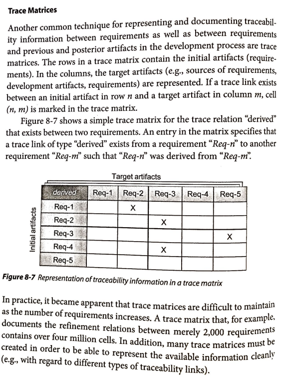

# Matriz de Rastreabilidade

## Introdução

A **matriz de rastreabilidade** é uma técnica utilizada para representar e documentar informações de rastreabilidade entre requisitos, bem como entre requisitos e artefatos anteriores e posteriores gerados no processo de desenvolvimento.

As linhas de uma matriz contêm os artefatos iniciais (requisitos) e, nas colunas, os artefatos-alvo (como fontes dos requisitos ou artefatos de desenvolvimento).

## Metodologia

Para o desenvolvimento desta matriz, foram utilizados os 42 <a href="https://requisitos-de-software.github.io/2025.1-FGTS/Elicitacao/Requisitos-elicitados/#RF">requisitos funcionais</a> e os 22 <a href="https://requisitos-de-software.github.io/2025.1-FGTS/Elicitacao/Requisitos-elicitados/#RNF">requisitos não funcionais</a> elicitados do projeto.

A matriz desenvolvida contém 8 colunas, sendo elas:

- **Requisito:** identificação do requisito;

- **Descrição**: descrição do requisito;

- **Implementado**: indica se o requisito está ou não implementado no aplicativo (Sim ou Não);

- **Versão**: versão atribuída ao requisito para controle de alterações durante o projeto;

- **Elicitação**: origem da elicitação do requisito;

- **Modelagem**: artefatos desenvolvidos com base no requisito;

- **Elos**: vínculos entre os requisitos e os artefatos;

- **Autor**: integrante responsável pelo desenvolvimento do requisito.

Tabela 1: Participantes

<table>
  <thead>
    <tr>
      <th align="center">Nome</th>
      <th align="center">Requisitos</th>
      <th align="center">Data</th>
      <th align="center">Hora</th>
    </tr>
  </thead>
  <tbody>
    <tr><td align="center"><a href = https://github.com/danielle-soaress>Danielle Soares</a></td><td align="center"> RF03, RF04, RF05, RF11, RF35, RF39, RNF01, RNF02, RNF07 </td><td align="center"> 08/06/2025 </td><td align="center"> 00:02 </td></tr>
    <tr><td align="center"><a href = https://github.com/eduardodpms>Eduardo de Pina</a></td><td align="center"> RF06, RF07, RF14, RF18, RF29, RF37, RNF03, RNF08, RNF14 </td><td align="center"> 08/06/2025 </td><td align="center"> 15:06 </td></tr>
    <tr><td align="center"><a href = https://github.com/EnzoEmir>Enzo Emir</a></td><td align="center"> RF08, RF38, RF01, RF17, RF19, RF20, RNF04, RNF09, RNF15 </td><td align="center"> 08/07/2025 </td><td align="center"> 14:26 </td></tr>
    <tr><td align="center"><a href = https://github.com/Leticia-Arisa-K-Higa>Leticia Arisa</a></td><td align="center"> RF12, RF13, RF21, RF22, RF23, RF41, RNF05, RNF16, RNF17, RNF22 </td><td align="center">07/06/2025</td><td align="center">13:15</td></tr>
    <tr><td align="center"><a href = https://github.com/MM4k>Marcelo Makoto</a></td><td align="center"> RF15, RF16, RF24, RF25, RF26, RF36, RNF06, RNF11, RNF18 </td><td align="center"> 07/06/2025 </td><td align="center"> 19:22 </td></tr>
    <tr><td align="center"><a href = https://github.com/dudaa28>Maria Eduarda</a></td><td align="center"> RF02, RF30, RF27, RF28, RF21, RF42, RNF21, RNF12, RNF19 </td><td align="center"> 07/06/2025 </td><td align="center"> 21:31 </td></tr>
    <tr><td align="center"><a href = https://github.com/VictorPontual>Victor Pontual</a></td><td align="center">RF09, RF10, RF32, RF33, RF34, RF40, RNF10, RNF13, RNF20 </td><td align="center"> 07/06/2025 </td><td align="center"> 15:23 </td></tr>
  </tbody>
</table>

Fonte: <i> <a href = https://github.com/Leticia-Arisa-K-Higa>Leticia Arisa</a> </i>

## Matriz de Rastreabilidade

A Tabela 2 a seguir mostra a matriz de rastreabilidade desenvolvida.

Tabela 2: Requisitos Funcionais

<table>
  <thead>
    <tr>
      <th align="center">Requisito</th>
      <th align="center">Descrição</th>
      <th align="center">Implementado</th>
      <th align="center">Versão</th>
      <th align="center">Elicitação</th>
      <th align="center">Modelagem</th>
      <th align="center">Elos</th>
      <th align="center">Autor</th>
    </tr>
  </thead>
  <tbody>
    <tr>
        <td align="center">RF01</td>
        <td>O aplicativo deve informar claramente as datas previstas para liberação de valores.</td>
        <td align="center">Não</td>
        <td align="center">1.0</td>
        <td align="center">
            <a href="https://requisitos-de-software.github.io/2025.1-FGTS/Elicitacao/Tecnicas-de-Elicitacao/Entrevista/#requisitos-funcionais">EN03</a>
        </td>
        <td align="center">
            <a href="https://requisitos-de-software.github.io/2025.1-FGTS/Modelagem-I/Diagrama/#caso-de-uso-2-en03">Caso de uso 02</a>,
            <a href="https://requisitos-de-software.github.io/2025.1-FGTS/Modelagem-I/Cenarios/#cenario-2-visualizar-data-prevista-para-liberacao-de-valores">Cenário 02</a>,
            <a href="https://requisitos-de-software.github.io/2025.1-FGTS/Modelagem-I/Lexicos/#l10">L10</a>,
            <a href="https://requisitos-de-software.github.io/2025.1-FGTS/Modelagem-I/Lexicos/#l11">L11</a>,
            <a href="https://requisitos-de-software.github.io/2025.1-FGTS/Modelagem-I/Lexicos/#l12">L12</a>,
            <a href="https://requisitos-de-software.github.io/2025.1-FGTS/Modelagem-I/Lexicos/#l13">L13</a>
        </td>
        <td align="center">-</td>
        <td align="center"><a href="https://github.com/EnzoEmir">Enzo Emir</a></td>
    </tr>
    <tr>
        <td align="center">RF02</td>
        <td>O aplicativo deve oferecer canal de suporte ou chatbot para esclarecer dúvidas</td>
        <td align="center">Não</td>
        <td align="center">1.0</td>
        <td align="center"><a href = https://requisitos-de-software.github.io/2025.1-FGTS/Elicitacao/Tecnicas-de-Elicitacao/Entrevista/#EN_RF>EN04</td>
        <td align="center"><a href = https://requisitos-de-software.github.io/2025.1-FGTS/Modelagem-I/Diagrama/>Caso de Uso 3, <a href = https://requisitos-de-software.github.io/2025.1-FGTS/Modelagem-I/Cenarios/>Cenário 3, <a href = https://requisitos-de-software.github.io/2025.1-FGTS/Modelagem-I/Lexicos/>L14, L15, <a href = https://requisitos-de-software.github.io/2025.1-FGTS/Modelagem-II/Historias-De-Usuario/>H19</td>
        <td align="center"><a href = https://requisitos-de-software.github.io/2025.1-FGTS/Pos-Rastreabilidade/Forward-From/#E29>Elos Forward-From</a> <a href = https://requisitos-de-software.github.io/2025.1-FGTS/Pos-Rastreabilidade/Backward-From/#EB47-rastreabilidade-backward-from-do-requisito-rnf20>Elos Backward-From</a></td>
        <td align="center"><a href = https://github.com/dudaa28>Maria Eduarda</a></td> 
    </tr>
    <tr>
        <td align="center">RF03</td>
        <td>O aplicativo deve permitir consulta ao saldo da conta vinculada do FGTS</td>
        <td align="center">Sim</td>
        <td align="center">1.0</td>
        <td align="center"><a href="https://requisitos-de-software.github.io/2025.1-FGTS/Elicitacao/Tecnicas-de-Elicitacao/Entrevista/#EN_RF">EN05</a></td>
        <td align="center"><a href = "https://requisitos-de-software.github.io/2025.1-FGTS/Modelagem-II/Historias-De-Usuario/#historia-15-consulta-ao-saldo-do-fgts">H15</a></td>
        <td align="center"><a href = "https://requisitos-de-software.github.io/2025.1-FGTS/Pos-Rastreabilidade/Forward-From/#e22-rastrebilidade-forward-from-do-requisito-rf03">Elos Forward-From</a> <a href = "https://requisitos-de-software.github.io/2025.1-FGTS/Pos-Rastreabilidade/Backward-From/#e22-rastreabilidade-backward-from-do-requisito-rf03">Elos Backward-From</a></td>
        <td align="center"><a href = https://github.com/danielle-soaress>Danielle Soares</a></td>
    </tr>
    <tr>
        <td align="center">RF04</td>
        <td>O aplicativo deve disponibilizar saque Saque-Aniversário</td>
        <td align="center">Sim</td>
        <td align="center">1.0</td>
        <td align="center"><a href="https://requisitos-de-software.github.io/2025.1-FGTS/Elicitacao/Tecnicas-de-Elicitacao/Storytelling/#ST_RF">ST014</a></td>
        <td align="center"> <a href = "https://requisitos-de-software.github.io/2025.1-FGTS/Modelagem-II/Historias-De-Usuario/#historia-17-disponibilizar-saque-aniversario">H17</a></td>
        <td align="center"><a href = "https://requisitos-de-software.github.io/2025.1-FGTS/Pos-Rastreabilidade/Forward-From/#e23-rastrebilidade-forward-from-do-requisito-rf04">Elos Forward-From</a> <a href = "https://requisitos-de-software.github.io/2025.1-FGTS/Pos-Rastreabilidade/Backward-From/#e23-rastreabilidade-backward-from-do-requisito-rf04">Elos Backward-From</a></td>
        <td align="center"><a href = https://github.com/danielle-soaress>Danielle Soares</a></td>
    </tr>
    <tr>
        <td align="center">RF05</td>
        <td>O aplicativo deve permitir a atualização dos dados pessoais do usuário</td>
        <td align="center">Sim</td>
        <td align="center">1.0</td>
        <td align="center"><a href="https://requisitos-de-software.github.io/2025.1-FGTS/Elicitacao/Tecnicas-de-Elicitacao/Introspeccao/#IS_RF">IS01</a></td>
        <td align="center"> <a href = "https://requisitos-de-software.github.io/2025.1-FGTS/Modelagem-II/Historias-De-Usuario/#historia-16-atualizacao-de-dados-pessoais">H16</a></td>
        <td align="center"><a href = "https://requisitos-de-software.github.io/2025.1-FGTS/Pos-Rastreabilidade/Forward-From/#e24-rastrebilidade-forward-from-do-requisito-rf05">Elos Forward-From</a> <a href = "https://requisitos-de-software.github.io/2025.1-FGTS/Pos-Rastreabilidade/Backward-From/#e24-rastreabilidade-backward-from-do-requisito-rf05">Elos Backward-From</a></td>
        <td align="center"><a href = https://github.com/danielle-soaress>Danielle Soares</a></td>
    </tr>
    <tr>
        <td align="center">RF06</td>
        <td>O sistema deve permitir a consulta de dados pessoais do usuário</td>
        <td align="center">Sim</td>
        <td align="center">1.0</td>
        <td align="center"><a href="https://requisitos-de-software.github.io/2025.1-FGTS/Elicitacao/Tecnicas-de-Elicitacao/Introspeccao/#IS_RF">IS02</a></td>
        <td align="center">
            <a href="https://requisitos-de-software.github.io/2025.1-FGTS/Modelagem-II/Historias-De-Usuario/#h37">H37</a>
        </td>
        <td align="center">-</td>
        <td align="center"><a href="https://github.com/eduardodpms">Eduardo de Pina</a></td>
    </tr>
    <tr>
        <td align="center">RF07</td>
        <td>O aplicativo deve permitir que o usuário visualize o extrato detalhado de movimentações financeiras</td>
        <td align="center">Sim</td>
        <td align="center">1.0</td>
        <td align="center">
            <a href="https://requisitos-de-software.github.io/2025.1-FGTS/Elicitacao/Tecnicas-de-Elicitacao/Introspeccao/#IS_RF">IS04</a>, 
            <a href="https://requisitos-de-software.github.io/2025.1-FGTS/Elicitacao/Tecnicas-de-Elicitacao/Observacao/#OB_RF">OB04</a>
        </td>
        <td align="center">
            <a href="https://requisitos-de-software.github.io/2025.1-FGTS/Modelagem-II/Historias-De-Usuario/#h39">H39</a>
        </td>
        <td align="center">-</td>
        <td align="center"><a href="https://github.com/eduardodpms">Eduardo de Pina</a></td>
    </tr>
    <tr>
        <td align="center">RF08</td>
        <td>O aplicativo deve exibir os status atualizados do saque.</td>
        <td align="center">Não</td>
        <td align="center">1.0</td>
        <td align="center">
            <a href="https://requisitos-de-software.github.io/2025.1-FGTS/Elicitacao/Tecnicas-de-Elicitacao/Introspeccao/#requisitos-funcionais">IS05</a>
        </td>
        <td align="center">
            <a href="https://requisitos-de-software.github.io/2025.1-FGTS/Modelagem-II/Historias-De-Usuario/#h01">H01</a>
        </td>
        <td align="center">-</td>
        <td align="center"><a href="https://github.com/EnzoEmir">Enzo Emir</a></td>
    </tr>
    <tr>
        <td align="center">RF09</td>
        <td>O sistema deve permitir que o usuário cancele um saque solicitado</td>
        <td align="center">Não</td>
        <td align="center">1.0</td>
        <td align="center"><a href = https://requisitos-de-software.github.io/2025.1-FGTS/Elicitacao/Tecnicas-de-Elicitacao/Introspeccao/#IS_RF>IS06</td>
        <td align="center"><a href = https://requisitos-de-software.github.io/2025.1-FGTS/Modelagem-I/Cenarios/#C04>Cenário 4</a>, <a href = https://requisitos-de-software.github.io/2025.1-FGTS/Modelagem-I/Diagrama/#UC04>Caso de Uso 4</a>, <a href = https://requisitos-de-software.github.io/2025.1-FGTS/Modelagem-I/Lexicos/#L20>L20</a>,<a href = https://requisitos-de-software.github.io/2025.1-FGTS/Modelagem-I/Lexicos/#L21>L21</a>,<a href = https://requisitos-de-software.github.io/2025.1-FGTS/Modelagem-I/Lexicos/#L22>L22</a>,<a href = https://requisitos-de-software.github.io/2025.1-FGTS/Modelagem-I/Lexicos/#L23>L23</a>,<a href = https://requisitos-de-software.github.io/2025.1-FGTS/Modelagem-I/Lexicos/#L24>L24</a>,<a href = https://requisitos-de-software.github.io/2025.1-FGTS/Modelagem-I/Lexicos/#L25>L25</a>, <a href = https://requisitos-de-software.github.io/2025.1-FGTS/Modelagem-II/Historias-De-Usuario/#H31>H31</a></td>
        <td align="center">-</td>
        <td align="center"><a href = https://github.com/VictorPontual>Victor Pontual</a></td>
    </tr>
    <tr>
        <td align="center">RF10</td>
        <td>O aplicativo deve permitir o filtro dos saques por tipo (ex: aniversário, doença, falecimento)</td>
        <td align="center">Não</td>
        <td align="center">1.0</td>
        <td align="center"><a href = https://requisitos-de-software.github.io/2025.1-FGTS/Elicitacao/Tecnicas-de-Elicitacao/Introspeccao/#IS_RF>IS06</td>
        <td align="center"><a href = https://requisitos-de-software.github.io/2025.1-FGTS/Modelagem-I/Cenarios/#C05>Cenário 5</a>, <a href = https://requisitos-de-software.github.io/2025.1-FGTS/Modelagem-I/Diagrama/#UC05>Caso de Uso 5</a>, <a href = https://requisitos-de-software.github.io/2025.1-FGTS/Modelagem-I/Lexicos/#L26>L26</a>,<a href = https://requisitos-de-software.github.io/2025.1-FGTS/Modelagem-I/Lexicos/#L27>L27</a>,<a href = https://requisitos-de-software.github.io/2025.1-FGTS/Modelagem-I/Lexicos/#L28>L28</a>,<a href = https://requisitos-de-software.github.io/2025.1-FGTS/Modelagem-I/Lexicos/#L29>L29</a>, <a href = https://requisitos-de-software.github.io/2025.1-FGTS/Modelagem-II/Historias-De-Usuario/#H32>H32</a></td>
        <td align="center">-</td>
        <td align="center"><a href = https://github.com/VictorPontual>Victor Pontual</a></td>
    </tr>
    <tr>
        <td align="center">RF11</td>
        <td>O aplicativo deve fornecer informações sobre saques bloqueados.</td>
        <td align="center">Não</td>
        <td align="center">1.0</td>
        <td align="center"><a href = "https://requisitos-de-software.github.io/2025.1-FGTS/Elicitacao/Tecnicas-de-Elicitacao/Introspeccao/#requisitos-funcionais">IS08</a></td>
        <td align="center"><a href = "https://requisitos-de-software.github.io/2025.1-FGTS/Modelagem-I/Cenarios/#C06">Cenário 6</a>, <a href = "https://requisitos-de-software.github.io/2025.1-FGTS/Modelagem-I/Diagrama/#UC06">Caso de Uso 6</a>, <a href = "https://requisitos-de-software.github.io/2025.1-FGTS/Modelagem-I/Lexicos/#l35-bloqueado">L35</a>, <a href = "https://requisitos-de-software.github.io/2025.1-FGTS/Modelagem-II/Historias-De-Usuario/#historia-13-ver-informacoes-sobre-saques-bloqueados">H13</a></td>
        <td align="center"><a href = "https://requisitos-de-software.github.io/2025.1-FGTS/Pos-Rastreabilidade/Forward-From/#e20-rastrebilidade-forward-from-do-requisito-rf11">Elos Forward-From</a> <a href = "https://requisitos-de-software.github.io/2025.1-FGTS/Pos-Rastreabilidade/Backward-From/#e20-rastreabilidade-backward-from-do-requisito-rf11">Elos Backward-From</a></td>
        <td align="center"><a href = "https://github.com/danielle-soaress">Danielle Soares</a></td>
    </tr>
    <tr>
        <td align="center">RF12</td>
        <td>O aplicativo deve exibir informações detalhadas sobre o histórico de movimentações financeiras</td>
        <td align="center">Não</td>
        <td align="center">1.0</td>
        <td align="center"><a href = https://requisitos-de-software.github.io/2025.1-FGTS/Elicitacao/Tecnicas-de-Elicitacao/Introspeccao/#IS_RF>IS09</a></td>
        <td align="center"><a href = https://requisitos-de-software.github.io/2025.1-FGTS/Modelagem-I/Cenarios/#C07>Cenário 7</a>, <a href = https://requisitos-de-software.github.io/2025.1-FGTS/Modelagem-I/Diagrama/#UC07>Caso de Uso 7</a>, <a href = https://requisitos-de-software.github.io/2025.1-FGTS/Modelagem-I/Lexicos/#L31>L31</a>, <a href = https://requisitos-de-software.github.io/2025.1-FGTS/Modelagem-I/Lexicos/#L32>L32</a>, <a href = https://requisitos-de-software.github.io/2025.1-FGTS/Modelagem-I/Lexicos/#L33>L33</a>, <a href = https://requisitos-de-software.github.io/2025.1-FGTS/Modelagem-II/Historias-De-Usuario/#H25>H25</a></td>
        <td align="center"><a href = https://requisitos-de-software.github.io/2025.1-FGTS/Pos-Rastreabilidade/Forward-From/#E01>Elos Forward-From</a> <a href = https://requisitos-de-software.github.io/2025.1-FGTS/Pos-Rastreabilidade/Backward-From/#E01>Elos Backward-From</a></td>
        <td align="center"><a href = https://github.com/Leticia-Arisa-K-Higa>Leticia Arisa</a></td>
    </tr>
    <tr>
        <td align="center">RF13</td>
        <td>O aplicativo deve permitir o filtro do extrato por data (mês e ano)</td>
        <td align="center">Não</td>
        <td align="center">1.0</td>
        <td align="center"><a href = https://requisitos-de-software.github.io/2025.1-FGTS/Elicitacao/Tecnicas-de-Elicitacao/Introspeccao/#IS_RF>IS10</a></td>
        <td align="center"><a href = https://requisitos-de-software.github.io/2025.1-FGTS/Modelagem-I/Cenarios/#C08>Cenário 8</a>, <a href = https://requisitos-de-software.github.io/2025.1-FGTS/Modelagem-I/Diagrama/#UC08>Caso de Uso 8</a>, <a href = https://requisitos-de-software.github.io/2025.1-FGTS/Modelagem-I/Lexicos/#L34>L34</a>, <a href = https://requisitos-de-software.github.io/2025.1-FGTS/Modelagem-II/Historias-De-Usuario/#H26>H26</a></td>
        <td align="center"><a href = https://requisitos-de-software.github.io/2025.1-FGTS/Pos-Rastreabilidade/Forward-From/#E02>Elos Forward-From</a> <a href = https://requisitos-de-software.github.io/2025.1-FGTS/Pos-Rastreabilidade/Backward-From/#E02>Elos Backward-From</a></td>
        <td align="center"><a href =https://github.com/Leticia-Arisa-K-Higa>Leticia Arisa</a></td>
    </tr>
    <tr>
        <td align="center">RF14</td>
        <td>O aplicativo deve permitir o cadastro de uma conta bancária</td>
        <td align="center">Sim</td>
        <td align="center">1.0</td>
        <td align="center">
            <a href="https://requisitos-de-software.github.io/2025.1-FGTS/Elicitacao/Tecnicas-de-Elicitacao/Introspeccao/#IS_RF">IS11</a>, 
            <a href="https://requisitos-de-software.github.io/2025.1-FGTS/Elicitacao/Tecnicas-de-Elicitacao/Storytelling/#ST_RF">ST05</a>, 
            <a href="https://requisitos-de-software.github.io/2025.1-FGTS/Elicitacao/Tecnicas-de-Elicitacao/Observacao/#OB_RF">OB08</a>
        </td>
        <td align="center">
            <a href="https://requisitos-de-software.github.io/2025.1-FGTS/Modelagem-II/Historias-De-Usuario/#h40">H40</a>
        </td>
        <td align="center">-</td>
        <td align="center"><a href="https://github.com/eduardodpms">Eduardo de Pina</a></td>
    </tr>
    <tr>
        <td align="center">RF15</td>
        <td>O aplicativo deve permitir que o usuário entre em contato com um assistente via chat</td>
        <td align="center">Não</td>
        <td align="center">1.0</td>
        <td align="center"><a href =https://requisitos-de-software.github.io/2025.1-FGTS/Elicitacao/Tecnicas-de-Elicitacao/Introspeccao/#requisitos-funcionais>IS13</a></td></td>
        <td align="center"><a href = https://requisitos-de-software.github.io/2025.1-FGTS/Modelagem-I/Cenarios/#cenario-10-contato-com-assistente-via-chat>Cenário 10</a>, <a href = https://requisitos-de-software.github.io/2025.1-FGTS/Modelagem-I/Diagrama/#caso-de-uso-10-is13>Caso de Uso 10</a>, <a href = https://requisitos-de-software.github.io/2025.1-FGTS/Modelagem-I/Lexicos/#l36-chat>L36</a>, <a href = https://requisitos-de-software.github.io/2025.1-FGTS/Modelagem-I/Lexicos/#l37-assistente-virtual>L37</a>, <a href = https://requisitos-de-software.github.io/2025.1-FGTS/Modelagem-I/Lexicos/#l38-mensagem>L38</a>, <a href = https://requisitos-de-software.github.io/2025.1-FGTS/Modelagem-II/Historias-De-Usuario/#historia-07-assistente-via-chat>H07</a></td>
        <td align="center"><a href = https://requisitos-de-software.github.io/2025.1-FGTS/Pos-Rastreabilidade/Forward-From/#e11-rastrebilidade-forward-from-do-requisito-rf15>Elos Forward-From</a> <a href = https://requisitos-de-software.github.io/2025.1-FGTS/Pos-Rastreabilidade/Backward-From/#e11-rastreabilidade-backward-from-do-requisito-rf15>Elos Backward-From</a></td>
        <td align="center"><a href =https://github.com/MMk4>Marcelo Makoto</a></td>
    </tr>
    <tr>
        <td align="center">RF16</td>
        <td>O aplicativo deve disponibilizar um campo de busca para facilitar a localização de funcionalidades</td>
        <td align="center">Não</td>
        <td align="center">1.0</td>
        <td align="center"><a href =https://requisitos-de-software.github.io/2025.1-FGTS/Elicitacao/Tecnicas-de-Elicitacao/Introspeccao/#requisitos-funcionais>IS14</a></td>
        <td align="center"><a href = https://requisitos-de-software.github.io/2025.1-FGTS/Modelagem-I/Cenarios/#cenario-11-busca-de-funcionalidades-e-informacoes>Cenário 11</a>, <a href = https://requisitos-de-software.github.io/2025.1-FGTS/Modelagem-I/Diagrama/#caso-de-uso-11-is14>Caso de Uso 11</a>, <a href = https://requisitos-de-software.github.io/2025.1-FGTS/Modelagem-I/Lexicos/#l39-buscar>L39</a>, <a href = https://requisitos-de-software.github.io/2025.1-FGTS/Modelagem-I/Lexicos/#l40-campo-de-busca>L40</a>, <a href = https://requisitos-de-software.github.io/2025.1-FGTS/Modelagem-I/Lexicos/#l41-termo-de-pesquisa>L41</a>, <a href = https://requisitos-de-software.github.io/2025.1-FGTS/Modelagem-II/Historias-De-Usuario/#historia-08-campo-de-busca>H08</a></td>
        <td align="center"><a href = https://requisitos-de-software.github.io/2025.1-FGTS/Pos-Rastreabilidade/Forward-From/#e12-rastrebilidade-forward-from-do-requisito-rf16>Elos Forward-From</a> <a href = https://requisitos-de-software.github.io/2025.1-FGTS/Pos-Rastreabilidade/Backward-From/#e12-rastreabilidade-backward-from-do-requisito-rf16>Elos Backward-From</a></td>
        <td align="center"><a href =https://github.com/MMk4>Marcelo Makoto</a></td>
    </tr>
    <tr>
        <td align="center">RF17</td>
        <td>O aplicativo deve conter uma seção de ajuda com orientações sobre o FGTS e PIS/PAESP.</td>
        <td align="center">Não</td>
        <td align="center">1.0</td>
        <td align="center">
            <a href="https://requisitos-de-software.github.io/2025.1-FGTS/Elicitacao/Tecnicas-de-Elicitacao/Introspeccao/#requisitos-funcionais">IS15</a>
        </td>
        <td align="center">
            <a href="https://requisitos-de-software.github.io/2025.1-FGTS/Modelagem-II/Historias-De-Usuario/#h04">H04</a>
        </td>
        <td align="center">-</td>
        <td align="center"><a href="https://github.com/EnzoEmir">Enzo Emir</a></td>
    </tr>
    <tr>
        <td align="center">RF18</td>
        <td>O aplicativo deve conter uma seção de ajuda com orientações sobre o uso do aplicativo</td>
        <td align="center">Não</td>
        <td align="center">1.0</td>
        <td align="center"><a href="https://requisitos-de-software.github.io/2025.1-FGTS/Elicitacao/Tecnicas-de-Elicitacao/Entrevista/#EN_RF">EN02</a></td>
        <td align="center">
            <a href="https://requisitos-de-software.github.io/2025.1-FGTS/Modelagem-I/Diagrama/#caso-de-uso-12-is16">Caso de Uso 12</a>, 
            <a href="https://requisitos-de-software.github.io/2025.1-FGTS/Modelagem-I/Cenarios/#cenario-12-secao-de-ajuda-com-explicacoes-relacionadas-ao-app">Cenário 12</a>, 
            <a href="https://requisitos-de-software.github.io/2025.1-FGTS/Modelagem-I/Lexicos/#l42-acessar-ajuda">L42</a>, 
            <a href="https://requisitos-de-software.github.io/2025.1-FGTS/Modelagem-I/Lexicos/#l43-procurar-duvida">L43</a>, 
            <a href="https://requisitos-de-software.github.io/2025.1-FGTS/Modelagem-II/Historias-De-Usuario/#h41">H41</a>
        </td>
        <td align="center">-</td>
        <td align="center"><a href="https://github.com/eduardodpms">Eduardo de Pina</a></td>
    </tr>
    <tr>
        <td align="center">RF19</td>
        <td>O aplicativo deve permitir a solicitação de ressarcimento de valores do PIS/PASEP.</td>
        <td align="center">Não</td>
        <td align="center">1.0</td>
        <td align="center">
            <a href="https://requisitos-de-software.github.io/2025.1-FGTS/Elicitacao/Tecnicas-de-Elicitacao/Introspeccao/#requisitos-funcionais">IS17</a>
        </td>
        <td align="center">
            <a href="https://requisitos-de-software.github.io/2025.1-FGTS/Modelagem-II/Historias-De-Usuario/#h05">H05</a>
        </td>
        <td align="center">-</td>
        <td align="center"><a href="https://github.com/EnzoEmir">Enzo Emir</a></td>
    </tr>
    <tr>
        <td align="center">RF20</td>
        <td>O aplicativo deve permitir login seguro pelo aplicativo.</td>
        <td align="center">Não</td>
        <td align="center">1.0</td>
        <td align="center">
            <a href="https://requisitos-de-software.github.io/2025.1-FGTS/Elicitacao/Tecnicas-de-Elicitacao/Observacao/#requisitos-funcionais">OB01</a>
        </td>
        <td align="center">
            <a href="https://requisitos-de-software.github.io/2025.1-FGTS/Modelagem-II/Historias-De-Usuario/#h06">H06</a>
        </td>
        <td align="center">-</td>
        <td align="center"><a href="https://github.com/EnzoEmir">Enzo Emir</a></td>
    </tr>
    <tr>
        <td align="center">RF21</td>
        <td>O aplicativo deve apresentar resumo de empregadores anteriores com botão para consultar contas vinculadas ao FGTS</td>
        <td align="center">Sim</td>
        <td align="center">1.0</td>
        <td align="center"><a href = https://requisitos-de-software.github.io/2025.1-FGTS/Elicitacao/Tecnicas-de-Elicitacao/Observacao/#OB_RF>OB02</a></td>
        <td align="center"><a href = https://requisitos-de-software.github.io/2025.1-FGTS/Modelagem-II/Historias-De-Usuario/#H27>H27</a></td>
        <td align="center"><a href = https://requisitos-de-software.github.io/2025.1-FGTS/Pos-Rastreabilidade/Forward-From/#E03>Elos Forward-From</a> <a href = https://requisitos-de-software.github.io/2025.1-FGTS/Pos-Rastreabilidade/Backward-From/#E03>Elos Backward-From</a></td>
        <td align="center"><a href = https://github.com/Leticia-Arisa-K-Higa>Leticia Arisa</a></td>
    </tr>
    <tr>
        <td align="center">RF22</td>
        <td>O aplicativo deve mostrar o nome completo dos empregadores anteriores</td>
        <td align="center">Sim</td>
        <td align="center">1.0</td>
        <td align="center"><a href = https://requisitos-de-software.github.io/2025.1-FGTS/Elicitacao/Tecnicas-de-Elicitacao/Observacao/#OB_RF>OB05</a></td>
        <td align="center"><a href = https://requisitos-de-software.github.io/2025.1-FGTS/Modelagem-II/Historias-De-Usuario/#H28>H28</a></td>
        <td align="center"><a href = https://requisitos-de-software.github.io/2025.1-FGTS/Pos-Rastreabilidade/Forward-From/#E04>Elos Forward-From</a> <a href = https://requisitos-de-software.github.io/2025.1-FGTS/Pos-Rastreabilidade/Backward-From/#E04>Elos Backward-From</a></td>
        <td align="center"><a href = https://github.com/Leticia-Arisa-K-Higa>Leticia Arisa</a></td>
    </tr>
    <tr>
        <td align="center">RF23</td>
        <td>	O aplicativo deve disponibilizar histórico de saques realizados</td>
        <td align="center">Sim</td>
        <td align="center">1.0</td>
        <td align="center"><a href = https://requisitos-de-software.github.io/2025.1-FGTS/Elicitacao/Tecnicas-de-Elicitacao/Observacao/#OB_RF>OB06</a></td>
        <td align="center"><a href = https://requisitos-de-software.github.io/2025.1-FGTS/Modelagem-II/Historias-De-Usuario/#H29>H29</a></td>
        <td align="center"><a href = https://requisitos-de-software.github.io/2025.1-FGTS/Pos-Rastreabilidade/Forward-From/#E05>Elos Forward-From</a> <a href = https://requisitos-de-software.github.io/2025.1-FGTS/Pos-Rastreabilidade/Backward-From/#E05>Elos Backward-From</a></td>
        <td align="center"><a href = https://github.com/Leticia-Arisa-K-Higa> Leticia Arisa</a></td>
    </tr>
    <tr>
        <td align="center">RF24</td>
        <td>O aplicativo deve ter uma aba dedicada à solicitação e acompanhamento de saques</td>
        <td align="center">Sim</td>
        <td align="center">1.0</td>
        <td align="center"><a href = https://requisitos-de-software.github.io/2025.1-FGTS/Elicitacao/Tecnicas-de-Elicitacao/Observacao/#requisitos-funcionais>OB07</a></td>
        <td align="center"><a href = https://requisitos-de-software.github.io/2025.1-FGTS/Modelagem-II/Historias-De-Usuario/#historia-08-campo-de-busca>H08</a></td>
        <td align="center"><a href = https://requisitos-de-software.github.io/2025.1-FGTS/Pos-Rastreabilidade/Forward-From/#e13-rastrebilidade-forward-from-do-requisito-rf24>Elos Forward-From</a> <a href = https://requisitos-de-software.github.io/2025.1-FGTS/Pos-Rastreabilidade/Backward-From/#e13-rastreabilidade-backward-from-do-requisito-rf24>Elos Backward-From</a></td>
        <td align="center"><a href =https://github.com/MMk4>Marcelo Makoto</a></td>
    </tr>
    <tr>
        <td align="center">RF25</td>
        <td>O aplicativo deve incluir aba para itens diversos como PIS/PASEP, convocações, sistemática de saque, ajuda, etc.</td>
        <td align="center">Sim</td>
        <td align="center">1.0</td>
        <td align="center"><a href = https://requisitos-de-software.github.io/2025.1-FGTS/Elicitacao/Tecnicas-de-Elicitacao/Observacao/#requisitos-funcionais>OB09</a></td>
        <td align="center"><a href = https://requisitos-de-software.github.io/2025.1-FGTS/Modelagem-II/Historias-De-Usuario/#h10>H10</a></td>
        <td align="center"><a href = https://requisitos-de-software.github.io/2025.1-FGTS/Pos-Rastreabilidade/Forward-From/#e14-rastrebilidade-forward-from-do-requisito-rf25>Elos Forward-From</a> <a href = https://requisitos-de-software.github.io/2025.1-FGTS/Pos-Rastreabilidade/Backward-From/#e14-rastreabilidade-backward-from-do-requisito-rf25>Elos Backward-From</a></td>
        <td align="center"><a href =https://github.com/MMk4>Marcelo Makoto</a></td>
    </tr>
    <tr>
        <td align="center">RF26</td>
        <td>O aplicativo deve exibir um resumo claro dos tipos de saque disponíveis.</td>
        <td align="center">Sim</td>
        <td align="center">1.0</td>
        <td align="center"><a href = https://requisitos-de-software.github.io/2025.1-FGTS/Elicitacao/Tecnicas-de-Elicitacao/Storytelling/#requisitos-funcionais>ST02</a></td>
        <td align="center"><a href = https://requisitos-de-software.github.io/2025.1-FGTS/Modelagem-II/Historias-De-Usuario/#historia-11-resumo-dos-tipos-de-saque>H11</a></td>
        <td align="center"><a href = https://requisitos-de-software.github.io/2025.1-FGTS/Pos-Rastreabilidade/Forward-From/#e15-rastrebilidade-forward-from-do-requisito-rf26>Elos Forward-From</a> <a href = https://requisitos-de-software.github.io/2025.1-FGTS/Pos-Rastreabilidade/Backward-From/#e15-rastreabilidade-backward-from-do-requisito-rf26>Elos Backward-From</a></td>
        <td align="center"><a href =https://github.com/MMk4>Marcelo Makoto</a></td>
    </tr>
    <tr>
        <td align="center">RF27</td>
        <td>O aplicativo deve enviar notificação sobre o andamento do saque.</td>
        <td align="center">Sim</td>
        <td align="center">1.0</td>
        <td align="center"><a href = https://requisitos-de-software.github.io/2025.1-FGTS/Elicitacao/Tecnicas-de-Elicitacao/Storytelling/#requisitos-funcionais>ST02, ST09, ST015</a></td>
        <td align="center"><a href = https://requisitos-de-software.github.io/2025.1-FGTS/Modelagem-II/Historias-De-Usuario/>H21</a></td>
        <td align="center"><a href = https://requisitos-de-software.github.io/2025.1-FGTS/Pos-Rastreabilidade/Forward-From/#E31>Elos Forward-From</a> <a href = https://requisitos-de-software.github.io/2025.1-FGTS/Pos-Rastreabilidade/Backward-From/#E49-rastreabilidade-backward-from-do-requisito-rnf20>Elos Backward-From</a></td></td>
        <td align="center"><a href = https://github.com/dudaa28>Maria Eduarda</a></td>
    </tr>
    <tr>
        <td align="center">RF28</td>
        <td>O aplicativo deve permitir a solicitação de saques</td>
        <td align="center">Sim</td>
        <td align="center">1.0</td>
        <td align="center"><a href = https://requisitos-de-software.github.io/2025.1-FGTS/Elicitacao/Tecnicas-de-Elicitacao/Entrevista/#tabela-3-requisitos-funcionais>EN01,<a href = https://requisitos-de-software.github.io/2025.1-FGTS/Elicitacao/Tecnicas-de-Elicitacao/Introspeccao/#IS_RF>IS03, <a href = https://requisitos-de-software.github.io/2025.1-FGTS/Elicitacao/Tecnicas-de-Elicitacao/Storytelling/#requisitos-funcionais>ST06, <a href = https://requisitos-de-software.github.io/2025.1-FGTS/Elicitacao/Tecnicas-de-Elicitacao/Observacao/#OB_RF>OB03</a></td>
        <td align="center"><a href = https://requisitos-de-software.github.io/2025.1-FGTS/Modelagem-II/Historias-De-Usuario/>H22</a></td>
        <td align="center"><a href = https://requisitos-de-software.github.io/2025.1-FGTS/Pos-Rastreabilidade/Forward-From/#E31>Elos Forward-From</a> <a href = https://requisitos-de-software.github.io/2025.1-FGTS/Pos-Rastreabilidade/Backward-From/#E50-rastreabilidade-backward-from-do-requisito-rnf20>Elos Backward-From</a></td></td></td>
        <td align="center"><a href = https://github.com/dudaa28>Maria Eduarda</a></td>
    </tr>
    <tr>
        <td align="center">RF29</td>
        <td>O aplicativo deve disponibilizar um guia interativo para orientar o usuário durante o processo.</td>
        <td align="center">Não</td>
        <td align="center">1.0</td>
        <td align="center"><a href="https://requisitos-de-software.github.io/2025.1-FGTS/Elicitacao/Tecnicas-de-Elicitacao/Storytelling/#ST_RF">ST07</a></td>
        <td align="center">
            <a href="https://requisitos-de-software.github.io/2025.1-FGTS/Modelagem-I/Diagrama/#caso-de-uso-13-st07">Caso de Uso 13</a>, 
            <a href="https://requisitos-de-software.github.io/2025.1-FGTS/Modelagem-I/Cenarios/#cenario-13-guia-interativo-para-orientacao-sobre-o-uso-do-aplicativo">Cenário 13</a>, 
            <a href="https://requisitos-de-software.github.io/2025.1-FGTS/Modelagem-I/Lexicos/#l44-requerer-guia">L44</a>, 
            <a href="https://requisitos-de-software.github.io/2025.1-FGTS/Modelagem-I/Lexicos/#l45-seguir-guia">L45</a>, 
            <a href="https://requisitos-de-software.github.io/2025.1-FGTS/Modelagem-II/Historias-De-Usuario/#h42">H42</a>
        </td>
        <td align="center">-</td>
        <td align="center"><a href="https://github.com/eduardodpms">Eduardo de Pina</a></td>
    </tr>
    <tr>
        <td align="center">RF30</td>
        <td>O aplicativo deve permitir o ajuste do tamanho das fontes na interface.</td>
        <td align="center">Não</td>
        <td align="center">1.0</td>
        <td align="center"><a href = https://requisitos-de-software.github.io/2025.1-FGTS/Elicitacao/Tecnicas-de-Elicitacao/Storytelling/#requisitos-funcionais>ST08</td>
        <td align="center"><a href = https://requisitos-de-software.github.io/2025.1-FGTS/Modelagem-I/Diagrama/>Caso de Uso 14, <a href = https://requisitos-de-software.github.io/2025.1-FGTS/Modelagem-I/Cenarios/>Cenário 14, <a href = https://requisitos-de-software.github.io/2025.1-FGTS/Modelagem-I/Lexicos/>L16, L17, L18, L19, <a href = https://requisitos-de-software.github.io/2025.1-FGTS/Modelagem-II/Historias-De-Usuario/>H20</td>
        <td align="center"><a href = https://requisitos-de-software.github.io/2025.1-FGTS/Pos-Rastreabilidade/Forward-From/#E30>Elos Forward-From</a> <a href = https://requisitos-de-software.github.io/2025.1-FGTS/Pos-Rastreabilidade/Backward-From/#E48-rastreabilidade-backward-from-do-requisito-rnf20>Elos Backward-From</a></td></td>
        <td align="center"><a href = https://github.com/dudaa28>Maria Eduarda</a></td>
    </tr>
    <tr>
        <td align="center">RF31</td>
        <td>O aplicativo deve permitir a visualização dos dados da conta bancária cadastrada.</td>
        <td align="center">Sim</td>
        <td align="center">1.0</td>
        <td align="center"><a href = https://requisitos-de-software.github.io/2025.1-FGTS/Elicitacao/Tecnicas-de-Elicitacao/Storytelling/#requisitos-funcionais>ST010</a></td>
        <td align="center"><a href = https://requisitos-de-software.github.io/2025.1-FGTS/Modelagem-II/Historias-De-Usuario/>H23</a></td>
        <td align="center"><a href = https://requisitos-de-software.github.io/2025.1-FGTS/Pos-Rastreabilidade/Forward-From/#E33>Elos Forward-From</a> <a href = https://requisitos-de-software.github.io/2025.1-FGTS/Pos-Rastreabilidade/Backward-From/#EB51-rastreabilidade-backward-from-do-requisito-rnf20>Elos Backward-From</a></td></td></td>
        <td align="center"><a href = https://github.com/dudaa28>Maria Eduarda</a></td>
    </tr>
    <tr>
        <td align="center">RF32</td>
        <td>O aplicativo deve oferecer uma interface de login simples.</td>
        <td align="center">Sim</td>
        <td align="center">1.0</td>
        <td align="center"><a href = https://requisitos-de-software.github.io/2025.1-FGTS/Elicitacao/Tecnicas-de-Elicitacao/Storytelling/#ST_RNF>ST011</td>
        <td align="center"><a href = https://requisitos-de-software.github.io/2025.1-FGTS/Modelagem-II/Historias-De-Usuario/#H33>H33</a></td>
        <td align="center">-</td>
        <td align="center"><a href = https://github.com/VictorPontual>Victor Pontual</a></td>
    </tr>
    <tr>
        <td align="center">RF33</td>
        <td>O aplicativo deve disponibilizar uma página para escolha da sistemática de saque.</td>
        <td align="center">Sim</td>
        <td align="center">1.0</td>
        <td align="center"><a href = https://requisitos-de-software.github.io/2025.1-FGTS/Elicitacao/Tecnicas-de-Elicitacao/Storytelling/#ST_RNF>ST012</td>
        <td align="center"><a href = https://requisitos-de-software.github.io/2025.1-FGTS/Modelagem-II/Historias-De-Usuario/#H34>H34</a></td>
        <td align="center">-</td>
        <td align="center"><a href = https://github.com/VictorPontual>Victor Pontual</a></td>
    </tr>
    <tr><td align="center">RF34</td>
        <td>O aplicativo deve exibir o termo de adesão ao usuário no primeiro acesso ao aplicativo</td>
        <td align="center">Sim</td>
        <td align="center">1.0</td>
        <td align="center"><a href = https://requisitos-de-software.github.io/2025.1-FGTS/Elicitacao/Tecnicas-de-Elicitacao/Storytelling/#ST_RNF>ST016</td>
        <td align="center"><a href = https://requisitos-de-software.github.io/2025.1-FGTS/Modelagem-II/Historias-De-Usuario/#H35>H35</a></td>
        <td align="center">-</td>
        <td align="center"><a href = https://github.com/VictorPontual>Victor Pontual</a></td>
    </tr>
    <tr>
        <td align="center">RF35</td>
        <td>O aplicativo deve permitir o cadastro de mais de uma conta bancária de diferentes instituições financeiras</td>
        <td align="center">Não</td>
        <td align="center">1.0</td>
        <td align="center"><a href="https://requisitos-de-software.github.io/2025.1-FGTS/Elicitacao/Tecnicas-de-Elicitacao/Introspeccao/#IS_RF">IS12</a></td>
        <td align="center"><a href = https://requisitos-de-software.github.io/2025.1-FGTS/Modelagem-I/Cenarios/#C09>Cenário 9</a>, <a href = https://requisitos-de-software.github.io/2025.1-FGTS/Modelagem-I/Diagrama/#UC09>Caso de Uso 9</a>, <a href = "https://requisitos-de-software.github.io/2025.1-FGTS/Modelagem-I/Lexicos/#l30-cadastrar">L30</a>, <a href = "https://requisitos-de-software.github.io/2025.1-FGTS/Modelagem-II/Historias-De-Usuario/#historia-14-cadastro-de-multiplas-contas-bancarias">H14</a></td>
        <td align="center"><a href = "https://requisitos-de-software.github.io/2025.1-FGTS/Pos-Rastreabilidade/Forward-From/#e21-rastrebilidade-forward-from-do-requisito-rf35">Elos Forward-From</a> <a href = "https://requisitos-de-software.github.io/2025.1-FGTS/Pos-Rastreabilidade/Backward-From/#e21-rastreabilidade-backward-from-do-requisito-rf35">Elos Backward-From</a></td>
        <td align="center"><a href = https://github.com/danielle-soaress>Danielle Soares</a></td>
    </tr>
    <tr>
        <td align="center">RF36</td>
        <td>O aplicativo deve permitir que o usuário solicite o saque da rescisão</td>
        <td align="center">Sim</td>
        <td align="center">1.0</td>
        <td align="center"><a href = https://requisitos-de-software.github.io/2025.1-FGTS/Elicitacao/Tecnicas-de-Elicitacao/Storytelling/#requisitos-funcionais>ST013</a>, <a href = https://requisitos-de-software.github.io/2025.1-FGTS/Elicitacao/Tecnicas-de-Elicitacao/Storytelling/#requisitos-funcionais>ST014</a></td>
        <td align="center"><a href = https://requisitos-de-software.github.io/2025.1-FGTS/Modelagem-II/Historias-De-Usuario/#historia-12-disponibilidade-de-saque-rescisao>H12</a></td>
        <td align="center"><a href = https://requisitos-de-software.github.io/2025.1-FGTS/Pos-Rastreabilidade/Forward-From/#e16-rastrebilidade-forward-from-do-requisito-rf36>Elos Forward-From</a> <a href = https://requisitos-de-software.github.io/2025.1-FGTS/Pos-Rastreabilidade/Backward-From/#e16-rastreabilidade-backward-from-do-requisito-rf36>Elos Backward-From</a></td>
        <td align="center"><a href =https://github.com/MMk4>Marcelo Makoto</a></td>
    </tr>
    <tr>
        <td align="center">RF37</td>
        <td>O aplicativo deve permitir que o usuário consulte seu saldo disponível para saque.</td>
        <td align="center">Sim</td>
        <td align="center">1.0</td>
        <td align="center"><a href="https://requisitos-de-software.github.io/2025.1-FGTS/Elicitacao/Tecnicas-de-Elicitacao/Observacao/#OB_RF">OB04</a></td>
        <td align="center">
            <a href="https://requisitos-de-software.github.io/2025.1-FGTS/Modelagem-II/Historias-De-Usuario/#h38">H38</a>
        </td>
        <td align="center">-</td>
        <td align="center"><a href="https://github.com/eduardodpms">Eduardo de Pina</a></td>
    </tr>
    <tr>
        <td align="center">RF38</td>
        <td>O aplicativo deve notificar o usuário sobre o status do saque solicitado.</td>
        <td align="center">Não</td>
        <td align="center">1.0</td>
        <td align="center">
            <a href="https://requisitos-de-software.github.io/2025.1-FGTS/Elicitacao/Tecnicas-de-Elicitacao/Introspeccao/#requisitos-funcionais">IS05</a>
        </td>
        <td align="center">
            <a href="https://requisitos-de-software.github.io/2025.1-FGTS/Modelagem-II/Historias-De-Usuario/#h02">H02</a>
        </td>
        <td align="center">-</td>
        <td align="center"><a href="https://github.com/EnzoEmir">Enzo Emir</a></td>
    </tr>
    <tr>
        <td align="center">RF39</td>
        <td>O aplicativo deve possuir comentários detalhados sobre cada status do saque.</td>
        <td align="center">Não</td>
        <td align="center">1.0</td>
        <td align="center"><a href="https://requisitos-de-software.github.io/2025.1-FGTS/Elicitacao/Tecnicas-de-Elicitacao/Entrevista/#EN_RF">EN02</a></td>
        <td align="center"><a href = https://requisitos-de-software.github.io/2025.1-FGTS/Modelagem-I/Cenarios/#C01>Cenário 1</a>, <a href = https://requisitos-de-software.github.io/2025.1-FGTS/Modelagem-I/Diagrama/#UC01>Caso de Uso 1</a>, <a href = "https://requisitos-de-software.github.io/2025.1-FGTS/Modelagem-I/Lexicos/#l01-consultar-status">L01</a>, <a href = "https://requisitos-de-software.github.io/2025.1-FGTS/Modelagem-I/Lexicos/#l01-consultar-status">L01</a>,
        <a href = "https://requisitos-de-software.github.io/2025.1-FGTS/Modelagem-I/Lexicos/#l02-status-do-saque">L02</a>,
        <a href = "https://requisitos-de-software.github.io/2025.1-FGTS/Modelagem-I/Lexicos/#l03-comentario-explicativo">L03</a>,
        <a href = "https://requisitos-de-software.github.io/2025.1-FGTS/Modelagem-I/Lexicos/#l04-saque-em-analise">L04</a>,
        <a href = "https://requisitos-de-software.github.io/2025.1-FGTS/Modelagem-I/Lexicos/#l05-saque-aprovado">L05</a>,
        <a href = "https://requisitos-de-software.github.io/2025.1-FGTS/Modelagem-I/Lexicos/#l06-saque-efetuado">L06</a>,
        <a href = "https://requisitos-de-software.github.io/2025.1-FGTS/Modelagem-I/Lexicos/#l07-saque-pendente">L07</a>,
        <a href = "https://requisitos-de-software.github.io/2025.1-FGTS/Modelagem-I/Lexicos/#l08-saque-cancelado">L08</a>,
        <a href = "https://requisitos-de-software.github.io/2025.1-FGTS/Modelagem-I/Lexicos/#l09-status-visualizado">L09</a>,<a href = "https://requisitos-de-software.github.io/2025.1-FGTS/Modelagem-II/Historias-De-Usuario/#historia-18-comentarios-sobre-status-do-saque">H18</a></td>
        <td align="center"><a href = "https://requisitos-de-software.github.io/2025.1-FGTS/Pos-Rastreabilidade/Forward-From/#e25-rastrebilidade-forward-from-do-requisito-rf39">Elos Forward-From</a> <a href = "https://requisitos-de-software.github.io/2025.1-FGTS/Pos-Rastreabilidade/Backward-From/#e25-rastreabilidade-backward-from-do-requisito-rf39">Elos Backward-From</a></td>
        <td align="center"><a href = https://github.com/danielle-soaress>Danielle Soares</a></td>
    </tr>
    <tr>
        <td align="center">RF40</td>
        <td>O aplicativo deve enviar notificação ao usuário quando o saque for recebido.</td>
        <td align="center">Sim</td>
        <td align="center">1.0</td>
        <td align="center"><a href = https://requisitos-de-software.github.io/2025.1-FGTS/Elicitacao/Tecnicas-de-Elicitacao/Storytelling/#ST_RNF>ST015</td>
        <td align="center"><a href = https://requisitos-de-software.github.io/2025.1-FGTS/Modelagem-II/Historias-De-Usuario/#H36>H36</a></td>
        <td align="center">-</td>
        <td align="center"><a href = https://github.com/VictorPontual>Victor Pontual</a></td>
    </tr>
    <tr>
        <td align="center">RF41</td>
        <td>O aplicativo deve possibilitar o envio de documentos digitalizados (PDF, imagem) para comprovação de situações específicas de saque (ex: doença grave, aposentadoria).</td>
        <td align="center">Não</td>
        <td align="center">1.0</td>
        <td align="center"><a href = https://requisitos-de-software.github.io/2025.1-FGTS/Elicitacao/Tecnicas-de-Elicitacao/Brainstroming/#BS_RF>BS03</a></td>
        <td align="center"><a href = https://requisitos-de-software.github.io/2025.1-FGTS/Modelagem-II/Historias-De-Usuario/#H30)>H30</a></td>
        <td align="center"><a href = https://requisitos-de-software.github.io/2025.1-FGTS/Pos-Rastreabilidade/Forward-From/#E06>Elos Forward-From</a> <a href = https://requisitos-de-software.github.io/2025.1-FGTS/Pos-Rastreabilidade/Backward-From/#E06>Elos Backward-From</a></td>
        <td align="center"><a href = https://github.com/Leticia-Arisa-K-Higa>Leticia Arisa</a></td>
    </tr>
    <tr>
        <td align="center">RF42</td>
        <td>O aplicativo deve permitir o agendamento de saque futuro.FGTS</td>
        <td align="center">Não</td>
        <td align="center">1.0</td>
        <td align="center"><a href = https://requisitos-de-software.github.io/2025.1-FGTS/Elicitacao/Tecnicas-de-Elicitacao/Brainstorming/#resultados>BS10</a></td>
        <td align="center"><a href = https://requisitos-de-software.github.io/2025.1-FGTS/Modelagem-II/Historias-De-Usuario/>H24</a></td>
        <td align="center"><a href = https://requisitos-de-software.github.io/2025.1-FGTS/Pos-Rastreabilidade/Forward-From/#E34>Elos Forward-From</a> <a href = https://requisitos-de-software.github.io/2025.1-FGTS/Pos-Rastreabilidade/Backward-From/#EB52-rastreabilidade-backward-from-do-requisito-rnf20>Elos Backward-From</a></td></td></td>
        <td align="center"><a href = https://github.com/dudaa28>Maria Eduarda</a></td>
    </tr>
    <tr>
    <td align="center">RNF01</td>
    <td>A aplicação deve apresentar uma interface simples, com elementos visuais organizados e linguagem acessível, facilitando a navegação.</td>
    <td align="center">Não</td>
    <td align="center">1.0</td>
    <td align="center">
    <a href="https://requisitos-de-software.github.io/2025.1-FGTS/Elicitacao/Tecnicas-de-Elicitacao/Entrevista/#EN_RNF">EN07</a>
    <a href="https://requisitos-de-software.github.io/2025.1-FGTS/Elicitacao/Tecnicas-de-Elicitacao/Introspeccao/#IS_RNF">IS20</a>
    <a href="https://requisitos-de-software.github.io/2025.1-FGTS/Elicitacao/Tecnicas-de-Elicitacao/Observacao/#OB_RNF">OB11</a>
    <a href="https://requisitos-de-software.github.io/2025.1-FGTS/Elicitacao/Tecnicas-de-Elicitacao/Storytelling/#ST_RNF">ST01</a>
    <a href="https://requisitos-de-software.github.io/2025.1-FGTS/Elicitacao/Tecnicas-de-Elicitacao/Storytelling/#ST_RNF">ST04</a>
    </td>
    <td align="center"><a href = https://requisitos-de-software.github.io/2025.1-FGTS/Modelagem-I/EspecificacaoSuplementar/#RNF>Especificação Suplementar</a></td>
    <td align="center"><a href = "https://requisitos-de-software.github.io/2025.1-FGTS/Pos-Rastreabilidade/Forward-From/#e26-rastrebilidade-forward-from-do-requisito-rnf01">Elos Forward-From</a> <a href = "https://requisitos-de-software.github.io/2025.1-FGTS/Pos-Rastreabilidade/Backward-From/#e26-rastreabilidade-backward-from-do-requisito-rnf01">Elos Backward-From</a></td>
    <td align="center"><a href = https://github.com/danielle-soaress>Danielle Soares</a></td>
</tr>
<tr>
    <td align="center">RNF02</td>
    <td>O processo de login deve ser simplificado</td>
    <td align="center">Não</td>
    <td align="center">1.0</td>
    <td align="center"><a href="https://requisitos-de-software.github.io/2025.1-FGTS/Elicitacao/Tecnicas-de-Elicitacao/Entrevista/#EN_RNF">EN08</a></td>
    <td align="center"><a href = "https://requisitos-de-software.github.io/2025.1-FGTS/Modelagem-I/EspecificacaoSuplementar/#requisitos-nao-funcionais">Especificação Suplementar</a>, <a href = https://requisitos-de-software.github.io/2025.1-FGTS/Modelagem-II/NFR-Framework/#CE01>Cartão de Especificação 1</a></td>
    <td align="center"><a href = "https://requisitos-de-software.github.io/2025.1-FGTS/Pos-Rastreabilidade/Forward-From/#e27-rastrebilidade-forward-from-do-requisito-rnf02">Elos Forward-From</a> <a href = "https://requisitos-de-software.github.io/2025.1-FGTS/Pos-Rastreabilidade/Backward-From/#e27-rastreabilidade-backward-from-do-requisito-rnf02">Elos Backward-From</a></td>
    <td align="center"><a href = https://github.com/danielle-soaress>Danielle Soares</a></td>
</tr>
<tr>
    <td align="center">RNF03</td>
    <td>O sistema deve apresentar informações de forma transparente e confiável</td>
    <td align="center">Não</td>
    <td align="center">1.0</td>
    <td align="center"><a href="https://requisitos-de-software.github.io/2025.1-FGTS/Elicitacao/Tecnicas-de-Elicitacao/Entrevista/#EN_RF">EN09</a></td>
    <td align="center">
        <a href="https://requisitos-de-software.github.io/2025.1-FGTS/Modelagem-I/EspecificacaoSuplementar/#requisitos-nao-funcionais">Especificação Suplementar</a>, 
        <a href="https://requisitos-de-software.github.io/2025.1-FGTS/Modelagem-II/NFR-Framework/#CE10">Cartão de Especificação 10</a>
    </td>
    <td align="center">-</td>
    <td align="center"><a href="https://github.com/eduardodpms">Eduardo de Pina</a></td>
</tr>
<tr>
    <td align="center">RNF04</td>
    <td>Os prazos informados no app devem ser cumpridos fielmente.</td>
    <td align="center">Não</td>
    <td align="center">1.0</td>
    <td align="center">
        <a href="https://requisitos-de-software.github.io/2025.1-FGTS/Elicitacao/Tecnicas-de-Elicitacao/Entrevista/#requisitos-nao-funcionais">EN10</a>
    </td>
    <td align="center">
        <a href="https://requisitos-de-software.github.io/2025.1-FGTS/Modelagem-II/NFR-Framework/#CE09">Cartão de Especificação 9</a>
    </td>
    <td align="center">-</td>
    <td align="center"><a href="https://github.com/EnzoEmir">Enzo Emir</a></td>
</tr>
<tr>
    <td align="center">RNF05</td>
    <td>O aplicativo deve ser confiável e evitar falhas ou inconsistências nos processos</td>
    <td align="center">Não</td>
    <td align="center">1.0</td>
    <td align="center"><a href = https://requisitos-de-software.github.io/2025.1-FGTS/Elicitacao/Tecnicas-de-Elicitacao/Entrevista/#EN_RNF>EN11</a></td>
    <td align="center"><a href = https://requisitos-de-software.github.io/2025.1-FGTS/Modelagem-II/NFR-Framework/#CE05>Cartão de Especificação 5</a></td>
    <td align="center"><a href = https://requisitos-de-software.github.io/2025.1-FGTS/Pos-Rastreabilidade/Forward-From/#E07>Elos Forward-From</a> <a href = https://requisitos-de-software.github.io/2025.1-FGTS/Pos-Rastreabilidade/Backward-From/#E07>Elos Backward-From</a></td>
    <td align="center"><a href = https://github.com/Leticia-Arisa-K-Higa>Leticia Arisa</a></td>
</tr>
<tr>
    <td align="center">RNF06</td>
    <td>O aplicativo deve funcionar corretamente mesmo com conexão instável</td>
    <td align="center">Não</td>
    <td align="center">1.0</td>
    <td align="center"><a href = https://requisitos-de-software.github.io/2025.1-FGTS/Elicitacao/Tecnicas-de-Elicitacao/Entrevista/#tabela-4-requisitos-nao-funcionais>EN12</a></td>
    <td align="center"><a href = https://requisitos-de-software.github.io/2025.1-FGTS/Modelagem-II/NFR-Framework/#CE07>Cartão de Especificação 7</a></td>
    <td align="center"><a href = https://requisitos-de-software.github.io/2025.1-FGTS/Pos-Rastreabilidade/Forward-From/#e17-rastrebilidade-forward-from-do-requisito-rnf06>Elos Forward-From</a> <a href = https://requisitos-de-software.github.io/2025.1-FGTS/Pos-Rastreabilidade/Backward-From/#e17-rastreabilidade-backward-from-do-requisito-rnf06>Elos Backward-From</a></td>
    <td align="center"><a href =https://github.com/MMk4>Marcelo Makoto</a></td>
</tr>
<tr>
    <td align="center">RNF07</td>
    <td>O aplicativo deve fornecer as mesmas funcionalidades para diferentes plataformas e versões</td>
    <td align="center">Não</td>
    <td align="center">1.0</td>
    <td align="center"><a href="https://requisitos-de-software.github.io/2025.1-FGTS/Elicitacao/Tecnicas-de-Elicitacao/Introspeccao/#IS_RNF">IS18</a></td>
    <td align="center"><a href = "https://requisitos-de-software.github.io/2025.1-FGTS/Modelagem-I/EspecificacaoSuplementar/#requisitos-nao-funcionais">Especificação Suplementar</a>, <a href = https://requisitos-de-software.github.io/2025.1-FGTS/Modelagem-II/NFR-Framework/#CE02>Cartão de Especificação 2</a></td>
    <td align="center"><a href = "https://requisitos-de-software.github.io/2025.1-FGTS/Pos-Rastreabilidade/Forward-From/#e28-rastrebilidade-forward-from-do-requisito-rnf07">Elos Forward-From</a> <a href = "https://requisitos-de-software.github.io/2025.1-FGTS/Pos-Rastreabilidade/Backward-From/#e28-rastreabilidade-backward-from-do-requisito-rnf07">Elos Backward-From</a></td>
    <td align="center"><a href = https://github.com/danielle-soaress>Danielle Soares</a></td>
</tr>
<tr>
    <td align="center">RNF08</td>
    <td>Os menus devem fornecer informações não repetidas</td>
    <td align="center">Não</td>
    <td align="center">1.0</td>
    <td align="center"><a href="https://requisitos-de-software.github.io/2025.1-FGTS/Elicitacao/Tecnicas-de-Elicitacao/Introspeccao/#IS_RF">IS19</a></td>
    <td align="center">
        <a href="https://requisitos-de-software.github.io/2025.1-FGTS/Modelagem-I/EspecificacaoSuplementar/#requisitos-nao-funcionais">Especificação Suplementar</a>, 
        <a href="https://requisitos-de-software.github.io/2025.1-FGTS/Modelagem-II/NFR-Framework/#CE11">Cartão de Especificação 11</a>
    </td>
    <td align="center">-</td>
    <td align="center"><a href="https://github.com/eduardodpms">Eduardo de Pina</a></td>
</tr>
<tr>
    <td align="center">RNF09</td>
    <td>O aplicativo deve aplicar princípios de acessibilidade.</td>
    <td align="center">Não</td>
    <td align="center">1.0</td>
    <td align="center">
        <a href="https://requisitos-de-software.github.io/2025.1-FGTS/Elicitacao/Tecnicas-de-Elicitacao/Introspeccao/#requisitos-nao-funcionais">IS21</a>
    </td>
    <td align="center">
        <a href="https://requisitos-de-software.github.io/2025.1-FGTS/Modelagem-II/NFR-Framework/#CE10">Cartão de Especificação 10</a>
    </td>
    <td align="center">-</td>
    <td align="center"><a href="https://github.com/EnzoEmir">Enzo Emir</a></td>
</tr>
<tr>
    <td align="center">RNF10</td>
    <td>O aplicativo deve estar disponível para outras plataformas, como web</td>
    <td align="center">Não</td>
    <td align="center">1.0</td>
    <td align="center"><a href = https://requisitos-de-software.github.io/2025.1-FGTS/Elicitacao/Tecnicas-de-Elicitacao/Introspeccao/#requisitos-nao-funcionais>IS22</a></td>
    <td align="center"><a href = https://requisitos-de-software.github.io/2025.1-FGTS/Modelagem-II/NFR-Framework/#CE13>Cartão de Especificação 13</a></td>
    <td align="center">-</td>
    <td align="center"><a href =https://github.com/VictorPontual>Victor Pontual</a></td>
</tr>
<tr>
    <td align="center">RNF11</td>
    <td>O aplicativo deve proporcionar segurança de dados pessoais</td>
    <td align="center">Sim</td>
    <td align="center">1.0</td>
    <td align="center"><a href = https://requisitos-de-software.github.io/2025.1-FGTS/Elicitacao/Tecnicas-de-Elicitacao/Introspeccao/#requisitos-nao-funcionais>IS23</a></td>
    <td align="center"><a href = https://requisitos-de-software.github.io/2025.1-FGTS/Modelagem-II/NFR-Framework/#CE08>Cartão de Especificação 8</a></td>
    <td align="center"><a href = https://requisitos-de-software.github.io/2025.1-FGTS/Pos-Rastreabilidade/Forward-From/#e18-rastrebilidade-forward-from-do-requisito-rnf11>Elos Forward-From</a> <a href = https://requisitos-de-software.github.io/2025.1-FGTS/Pos-Rastreabilidade/Backward-From/#e18-rastreabilidade-backward-from-do-requisito-rnf11>Elos Backward-From</a></td>
    <td align="center"><a href =https://github.com/MMk4>Marcelo Makoto</a></td>
</tr>
<tr>
    <td align="center">RNF12</td>
    <td>O aplicativo deve proporcionar agilidade ao acessar as funcionalidades</td>
    <td align="center">Sim</td>
    <td align="center">1.0</td>
    <td align="center"><a href = https://requisitos-de-software.github.io/2025.1-FGTS/Elicitacao/Tecnicas-de-Elicitacao/Introspeccao/#requisitos-nao-funcionais>IS24</a></td>
    <td align="center">-</td>
    <td align="center"><a href = https://requisitos-de-software.github.io/2025.1-FGTS/Pos-Rastreabilidade/Forward-From/#E36>Elos Forward-From</a> <a href = https://requisitos-de-software.github.io/2025.1-FGTS/Pos-Rastreabilidade/Backward-From/#E54-rastreabilidade-backward-from-do-requisito-rnf20>Elos Backward-From</a></td></td></td>
    <td align="center"><a href = https://github.com/dudaa28>Maria Eduarda</a></td>
</tr>
<tr>
    <td align="center">RNF13</td>
    <td>O sistema deve garantir segurança firme com verificação de dados pelo usuário</td>
    <td align="center">Sim</td>
    <td align="center">1.0</td>
    <td align="center"><a href = https://requisitos-de-software.github.io/2025.1-FGTS/Elicitacao/Tecnicas-de-Elicitacao/Observacao/#requisitos-nao-funcionais>OB10</a></td>
    <td align="center"><a href = https://requisitos-de-software.github.io/2025.1-FGTS/Modelagem-II/NFR-Framework/#CE14>Cartão de Especificação 14</a></td>
    <td align="center">-</td>
    <td align="center"><a href =https://github.com/VictorPontual>Victor Pontual</a></td>
</tr>
<tr>
    <td align="center">RNF14</td>
    <td>A aplicação deve exibir notificações ou notícias úteis de forma acessível</td>
    <td align="center">Sim</td>
    <td align="center">1.0</td>
    <td align="center"><a href="https://requisitos-de-software.github.io/2025.1-FGTS/Elicitacao/Tecnicas-de-Elicitacao/Observacao/#requisitos-nao-funcionais">OB12</a></td>
    <td align="center">-</td>
    <td align="center">-</td>
    <td align="center"><a href="https://github.com/eduardodpms">Eduardo de Pina</a></td>
</tr>
<tr>
    <td align="center">RNF15</td>
    <td>As informações devem estar organizadas de forma clara e com terminologia compreensível para o usuário.</td>
    <td align="center">Não</td>
    <td align="center">1.0</td>
    <td align="center">
        <a href="https://requisitos-de-software.github.io/2025.1-FGTS/Elicitacao/Tecnicas-de-Elicitacao/Observacao/#requisitos-nao-funcionais">OB13</a>
    </td>
    <td align="center">
        <a href="https://requisitos-de-software.github.io/2025.1-FGTS/Modelagem-II/NFR-Framework/#CE11">Cartão de Especificação 11</a>
    </td>
    <td align="center">-</td>
    <td align="center"><a href="https://github.com/EnzoEmir">Enzo Emir</a></td>
</tr>
<tr>
    <td align="center">RNF16</td>
    <td>Garantir tempo de resposta de até 1 segundo para o cadastro da conta bancária</td>
    <td align="center">Sim</td>
    <td align="center">1.0</td>
    <td align="center"><a href = https://requisitos-de-software.github.io/2025.1-FGTS/Elicitacao/Tecnicas-de-Elicitacao/Storytelling/#ST_RNF>ST017</a></td>
    <td align="center">-</td>
    <td align="center"><a href = https://requisitos-de-software.github.io/2025.1-FGTS/Pos-Rastreabilidade/Forward-From/#E08>Elos Forward-From</a> <a href = https://requisitos-de-software.github.io/2025.1-FGTS/Pos-Rastreabilidade/Backward-From/#E08>Elos Backward-From</a></td>
    <td align="center"><a href = https://github.com/Leticia-Arisa-K-Higa>Leticia Arisa</a></td>
</tr>
<tr>
    <td align="center">RNF17</td>
    <td>Garantir tempo de resposta de até 1 segundo para a solicitação de saque</td>
    <td align="center">Sim</td>
    <td align="center">1.0</td>
    <td align="center"><a href = https://requisitos-de-software.github.io/2025.1-FGTS/Elicitacao/Tecnicas-de-Elicitacao/Storytelling/#ST_RNF>ST018</a></td>
    <td align="center">-</td>
    <td align="center"><a href = https://requisitos-de-software.github.io/2025.1-FGTS/Pos-Rastreabilidade/Forward-From/#E09>Elos Forward-From</a> <a href = https://requisitos-de-software.github.io/2025.1-FGTS/Pos-Rastreabilidade/Backward-From/#E09>Elos Backward-From</a></td>
    <td align="center"><a href = https://github.com/Leticia-Arisa-K-Higa>Leticia Arisa</a></td>
</tr>
<tr>
    <td align="center">RNF18</td>
    <td>Garantir tempo de resposta de até 1 segundo para o processo de login</td>
    <td align="center">Sim</td>
    <td align="center">1.0</td>
    <td align="center"><a href = https://requisitos-de-software.github.io/2025.1-FGTS/Elicitacao/Tecnicas-de-Elicitacao/Storytelling/#requisitos-funcionais>ST019</a></td>
    <td align="center">-</td>
    <td align="center"><a href = https://requisitos-de-software.github.io/2025.1-FGTS/Pos-Rastreabilidade/Forward-From/#e19-rastrebilidade-forward-from-do-requisito-rnf18>Elos Forward-From</a> <a href = https://requisitos-de-software.github.io/2025.1-FGTS/Pos-Rastreabilidade/Backward-From/#e19-rastreabilidade-backward-from-do-requisito-rnf18>Elos Backward-From</a></td>
    <td align="center"><a href =https://github.com/MMk4>Marcelo Makoto</a></td>
</tr>
<tr>
    <td align="center">RNF19</td>
    <td>Saque-aniversário deve atender princípios de acessibilidade</td>
    <td align="center">Sim</td>
    <td align="center">1.0</td>
    <td align="center"><a href = https://requisitos-de-software.github.io/2025.1-FGTS/Elicitacao/Tecnicas-de-Elicitacao/Entrevista>EN06</a></td>
    <td align="center">-</td>
    <td align="center"><a href = https://requisitos-de-software.github.io/2025.1-FGTS/Pos-Rastreabilidade/Forward-From/#E37>Elos Forward-From</a> <a href = https://requisitos-de-software.github.io/2025.1-FGTS/Pos-Rastreabilidade/Backward-From/#E55-rastreabilidade-backward-from-do-requisito-rnf20>Elos Backward-From</a></td>
    <td align="center"><a href = https://github.com/dudaa28>Maria Eduarda</a></td>
</tr>
<tr>
    <td align="center">RNF20</td>
    <td>Saque-rescisão deve atender princípios de acessibilidade</td>
    <td align="center">Sim</td>
    <td align="center">1.0</td>
    <td align="center"><a href = https://requisitos-de-software.github.io/2025.1-FGTS/Elicitacao/Tecnicas-de-Elicitacao/Entrevista/#EN_RF>EN06</a></td>
    <td align="center">-</td>
    <td align="center">-</td>
    <td align="center"><a href =https://github.com/VictorPontual>Victor Pontual</a></td>
</tr>
<tr>
    <td align="center">RNF21</td>
    <td>Os menus devem ser autoexplicativos, com estrutura hierárquica lógica e nomenclatura padronizada</td>
    <td align="center">Não,Sim</td>
    <td align="center">1.0</td>
    <td align="center"><a href = https://requisitos-de-software.github.io/2025.1-FGTS/Elicitacao/Tecnicas-de-Elicitacao/Introspeccao/>IS19, <a href = https://requisitos-de-software.github.io/2025.1-FGTS/Elicitacao/Tecnicas-de-Elicitacao/Observacao/>OB11</a></td>
    <td align="center">-</td>
    <td align="center"><a href = https://requisitos-de-software.github.io/2025.1-FGTS/Pos-Rastreabilidade/Forward-From/#E25>Elos Forward-From</a> <a href = https://requisitos-de-software.github.io/2025.1-FGTS/Pos-Rastreabilidade/Backward-From/#EB53-rastreabilidade-backward-from-do-requisito-rnf20>Elos Backward-From</a></td></td></td>
    <td align="center"><a href = https://github.com/dudaa28>Maria Eduarda</a></td>
</tr>
<tr>
    <td align="center">RNF22</td>
    <td>A aplicação deve estar em conformidade com diretrizes de acessibilidade, garantindo acesso a pessoas com deficiência visual, auditiva ou motora</td>
    <td align="center">Sim</td>
    <td align="center">1.0</td>
    <td align="center"><a href = https://requisitos-de-software.github.io/2025.1-FGTS/Elicitacao/Tecnicas-de-Elicitacao/Introspeccao/#IS_RNF>IS20</a></td>
    <td align="center"><a href = https://requisitos-de-software.github.io/2025.1-FGTS/Modelagem-I/EspecificacaoSuplementar/#RNF>Especificação Suplementar</a>, <a href = https://requisitos-de-software.github.io/2025.1-FGTS/Modelagem-II/NFR-Framework/#>Cartão de Especificação 6</a></td>
    <td align="center"><a href = https://requisitos-de-software.github.io/2025.1-FGTS/Pos-Rastreabilidade/Forward-From/#E10>Elos Forward-From</a> <a href = https://requisitos-de-software.github.io/2025.1-FGTS/Pos-Rastreabilidade/Backward-From/#E10>Elos Backward-From</a></td>
    <td align="center"><a href = https://github.com/Leticia-Arisa-K-Higa>Leticia Arisa</a></td>
</tr>
  </tbody>
</table>

## Referências Bibliográficas

> <a name="REF1">1. </a>KLAUS, Pohl; CHRIS, Rupp. Requirements Engineering Fundamentals. Disponível em: https://aprender3.unb.br/pluginfile.php/3096180/mod_resource/content/2/Rastreabilidade.pdf. Acesso em: 07 de jun. de 2025

Figura 1: Foto referência

  

Fonte: [KLAUS, Pohl; CHRIS, Rupp, 2025](https://aprender3.unb.br/pluginfile.php/3096180/mod_resource/content/2/Rastreabilidade.pdf) 

## Histórico de Versões 📅

| Versão | Data       | Descrição                                      | Autor(es)   | Revisor(es) |
|:------:|:----------:|:-----------------------------------------------|:------------|:-----------:|
|  `1.0`   | 07/06/2025 | Criação do documento  | [Leticia Arisa](https://github.com/Leticia-Arisa-K-Higa)   | [Victor Pontual](https://github.com/VictorPontual) |
|  `1.1`   | 07/06/2025 | adição de informações dos requisitos: RF09,RF10,RF32,RF33,RF34,RF40 | [Victor Pontual](https://github.com/VictorPontual)   | [Marcelo Makoto](https://github.com/MM4k) |
|  `1.2`   | 07/06/2025 | Adição dos requisitos: RF15, RF16, RF24, RF25, RF26, RF36, RNF06, RNF11, RNF18 | [Marcelo Makoto](https://github.com/MM4k)   | [Maria Eduarda](https://github.com/dudaa28) |
|  `1.3`   | 07/06/2025 | Adição dos requisitos: RF02, RF30  | [Maria Eduarda](https://github.com/dudaa28)   | [Danielle Soares](https://github.com/danielle-soaress) |
|  `1.4`   | 08/06/2025 | Adição dos requisitos: RF27, RF28, RF31, RF42, RNF21, RNF12, RNF19 | [Maria Eduarda](https://github.com/dudaa28)   | [Danielle Soares](https://github.com/danielle-soaress) |
|  `1.5`   | 08/06/2025 | Adição dos requisitos: RF11, RF35, RF39, RF03, RF04, RF05, RNF01, RNF02, RNF07 |[Danielle Soares](https://github.com/danielle-soaress)   | [Enzo Emir](https://github.com/EnzoEmir)  |
|  `1.6`   | 08/06/2025 | Adição de informações dos requisitos: RNF10, RNF13, RNF20 | [Victor Pontual](https://github.com/VictorPontual)   | [Enzo Emir](https://github.com/EnzoEmir) |
|  `1.7`   | 08/06/2025 | Adição dos requisitos: RF08, RF38, RF01, RF17, RF19, RF20, RNF04, RNF09, RNF15 | [Enzo Emir](https://github.com/EnzoEmir)   | [Marcelo Makoto](https://github.com/MM4k) |
|  `1.8`   | 08/06/2025 | Adição dos requisitos: RF06, RF07, RF14, RF18, RF29, RF37, RNF03, RNF08, RNF14 | [Eduardo de Pina](https://github.com/eduardodpms)   | [Marcelo Makoto](https://github.com/MM4k) |
|  `1.9`   | 08/06/2025 | Ajustes de link | [Eduardo de Pina](https://github.com/eduardodpms)   | [Marcelo Makoto](https://github.com/MM4k) |
|  `2.0`   | 08/06/2025 | Adição dos elos nos requisitos: RF15, RF16, RF24, RF25, RF26, RF36, RNF06, RNF11, RNF18 | [Marcelo Makoto](https://github.com/MM4k)   | [Maria Eduarda](https://github.com/dudaa28) |
|  `2.1`   | 08/06/2025 | Adição dos elos nos requisitos: RF02, RF30, RF27, RF28, RF31, RF42, RNF21, RNF12, RNF19 | [Maria Eduarda](https://github.com/dudaa28)   | [Danielle Soares](https://github.com/danielle-soaress)  |
|  `2.2`   | 08/06/2025 | Adição dos elos nos requisitos: RF11, RF35, RF39, RF03, RF04, RF05, RNF01, RNF02, RNF07 | [Danielle Soares](https://github.com/danielle-soaress)  | - |