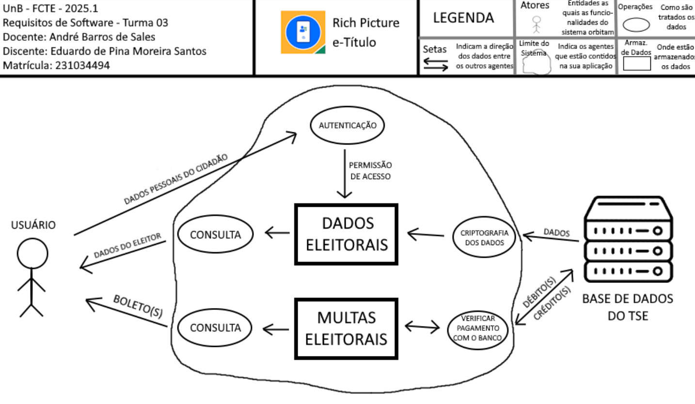

# Rich Picture

## O que é?

Rich Picture <a id="TEC1" href="#RP1">^1^</a> é uma técnica visual utilizada na análise de sistemas para representar, de forma livre e informal, a visão geral de um problema, seus atores (quem participa do sistema), operações (o que é feito ou quais ações ocorrem no sistema), armazenamento de dados (onde e como as informações são guardadas), setas (fluxo de informação, comunicação ou influência entre os elementos) e fronteira do sistema (limites do que está sob controle dos desenvolvedores ou do escopo do sistema). Ele é frequentemente usado na fase inicial da modelagem de sistemas. 

## Metodologias e Ferramentas

Para a elaboração deste artefato, foi realizado um estudo do ambiente do aplicativo E-Título, com testes e análises de suas funcionalidades. A síntese foi representada por meio de um rich picture, elaborado com a ferramenta Figma, juntamente com sua respectiva legenda.

## Resultados

A seguir. as Figuras 1 e 2 mostram as versões do Rich Picture desenvolvidas para o aplicativo E-Titulo. A Figura 3 corresponde à legenda do Rich Picture.

<figure style="text-align: center;">
  
  <figcaption>
    Figura 1: Primeira versão do Rich Picture (Fonte: Autor, 2025)
  </figcaption>
</figure>

Autor: Eduardo de Pina
Data: 07 de Abril de 2025

<figure style="text-align: center;">
  
  <figcaption>
    Figura 2: Segunda e atual versão do Rich Picture (Fonte: Autor, 2025)
  </figcaption>
</figure>

Autor: Danielle Soares
Data: 11 de Abril de 2025

<figure style="text-align: center;">
  
  <figcaption>
    Figura 3: Legenda do Rich Picture (Fonte: Autor, 2025)
  </figcaption>
</figure>

## Referências

> <a id="RP1" href="#TEC1">1.</a> MONK, Andrew; HOWARD, Steve. The Rich Picture: A Tool for Reasoning About Work Context. 1998.  Disponível em: <<https://ics.uci.edu/~wscacchi/Software-Process/Readings/RichPicture.pdf>>. Acesso em: 12/04/2025.

## Histórico de Versões 📅

| Versão | Data | Descrição | Autor(es) | Revisor(es) |
| :-: | :-: | :-: | :-------------: | :-: |
| `1.0` | 12/04/2025 | Seções "Metodologias e Ferramentas" e "Resultados". | Danielle Soares da Silva | - |